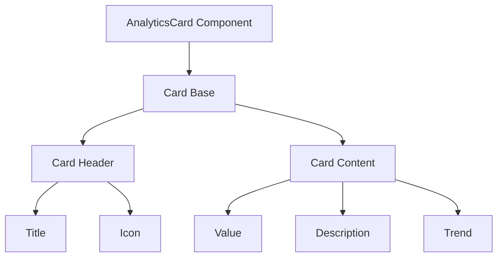
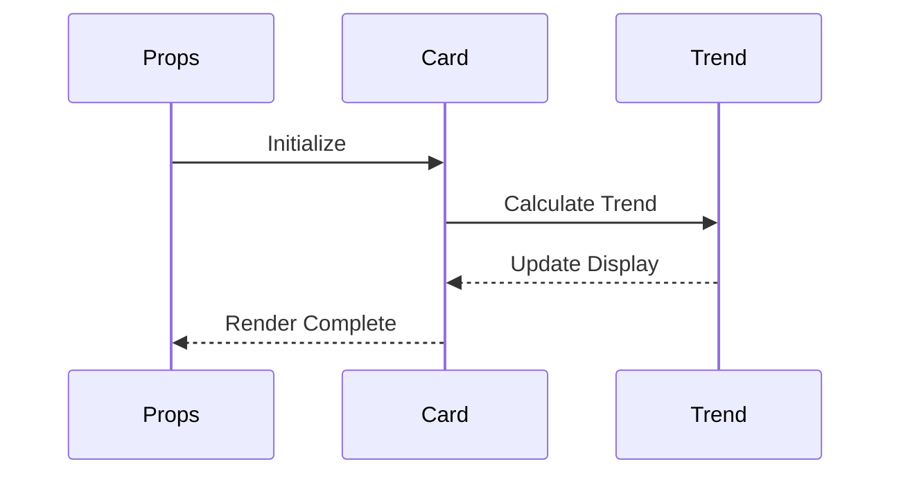
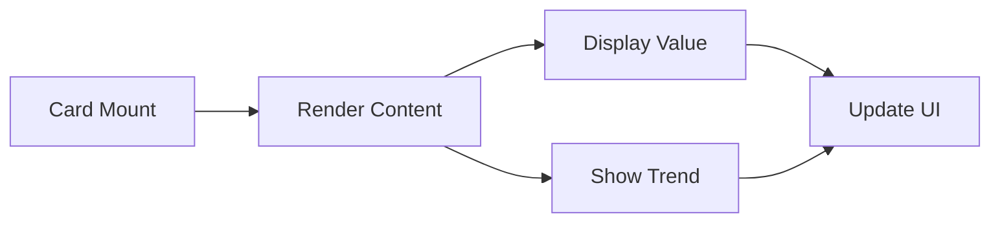

# AnalyticsCard Component

## Overview
The AnalyticsCard component is a versatile card component designed for displaying analytics metrics with support for trends, icons, and descriptions. It follows ThriveSend's design system and provides a consistent way to present key performance indicators (KPIs) and metrics across the application.

## Screenshots

*Different AnalyticsCard states and configurations*

## Component Architecture


## Data Flow


## Features
- Metric value display
- Trend indicators with arrows
- Custom icons
- Descriptive text
- Responsive design
- TypeScript type safety
- Accessibility support
- Performance optimized
- Test coverage

## Props
| Prop | Type | Default | Description |
|------|------|---------|-------------|
| title | string | required | Card title |
| value | string \| number | required | Metric value |
| description | string | undefined | Additional description |
| icon | React.ReactNode | undefined | Optional icon |
| trend | { value: number, isPositive: boolean } | undefined | Trend data |
| trendText | string | undefined | Additional trend context |
| className | string | undefined | Additional CSS classes |

## Usage
```typescript
import { AnalyticsCard } from '@/components/analytics/analytics-card';
import { Users } from 'lucide-react';

// Basic usage
<AnalyticsCard
  title="Total Users"
  value="1,234"
/>

// With trend
<AnalyticsCard
  title="Revenue"
  value="$12,345"
  description="Monthly revenue"
  trend={{
    value: 12.5,
    isPositive: true
  }}
  trendText="vs last month"
/>

// With icon
<AnalyticsCard
  title="Active Users"
  value="789"
  icon={<Users className="h-5 w-5" />}
  trend={{
    value: 5.2,
    isPositive: false
  }}
/>
```

## User Interaction Workflow


## Components
1. **Card Base**
   - Manages card layout
   - Handles responsive behavior
   - Implements accessibility features

2. **Card Header**
   - Displays title
   - Manages icon placement
   - Handles spacing

3. **Card Content**
   - Displays metric value
   - Shows description
   - Renders trend indicators

## Data Models
```typescript
interface AnalyticsCardProps {
  title: string;
  value: string | number;
  description?: string;
  icon?: React.ReactNode;
  trend?: {
    value: number;
    isPositive: boolean;
  };
  trendText?: string;
  className?: string;
}
```

## Styling
- Uses Tailwind CSS for styling
- Follows design system color tokens
- Implements consistent spacing
- Supports dark mode
- Maintains accessibility contrast ratios
- Responsive design patterns
- Smooth transitions

## Accessibility
- ARIA roles and attributes
- Semantic HTML structure
- Color contrast compliance
- Screen reader support
- Keyboard navigation
- Focus management

## Error Handling
- Type validation
- Null checks
- Fallback content
- Error boundaries
- Loading states

## Performance Optimizations
- Memoized callbacks
- CSS-in-JS optimization
- Event handler optimization
- State management optimization
- Render optimization

## Dependencies
- React
- TypeScript
- Tailwind CSS
- Lucide React (icons)
- Custom UI components

## Related Components
- [Card](../ui/Card.md)
- [LineChartWidget](./LineChartWidget.md)
- [BarChartWidget](./BarChartWidget.md)
- [PieChartWidget](./PieChartWidget.md)

## Examples
### Basic Metric Card
```typescript
import { AnalyticsCard } from '@/components/analytics/analytics-card';

function MetricCard() {
  return (
    <AnalyticsCard
      title="Total Users"
      value="1,234"
    />
  );
}
```

### Revenue Card with Trend
```typescript
import { AnalyticsCard } from '@/components/analytics/analytics-card';

function RevenueCard() {
  return (
    <AnalyticsCard
      title="Monthly Revenue"
      value="$12,345"
      description="Current month"
      trend={{
        value: 12.5,
        isPositive: true
      }}
      trendText="vs last month"
    />
  );
}
```

### User Activity Card
```typescript
import { AnalyticsCard } from '@/components/analytics/analytics-card';
import { Users } from 'lucide-react';

function UserActivityCard() {
  return (
    <AnalyticsCard
      title="Active Users"
      value="789"
      icon={<Users className="h-5 w-5" />}
      trend={{
        value: 5.2,
        isPositive: false
      }}
      description="Last 24 hours"
    />
  );
}
```

## Best Practices
1. Use clear, descriptive titles
2. Format numbers appropriately
3. Provide meaningful descriptions
4. Use consistent iconography
5. Follow accessibility guidelines
6. Use TypeScript for type safety
7. Optimize performance
8. Maintain consistent styling

## Troubleshooting
### Common Issues
1. **Trend not displaying**
   - Check trend object structure
   - Verify value calculations
   - Check styling classes

2. **Icon not showing**
   - Verify icon import
   - Check icon component
   - Validate styling

3. **Styling issues**
   - Check className usage
   - Verify Tailwind classes
   - Check for style conflicts

### Solutions
1. **Trend Issues**
   ```typescript
   // Proper trend implementation
   <AnalyticsCard
     trend={{
       value: 12.5,
       isPositive: true
     }}
   />
   ```

2. **Icon Issues**
   ```typescript
   // Proper icon implementation
   import { Users } from 'lucide-react';
   
   <AnalyticsCard
     icon={<Users className="h-5 w-5" />}
   />
   ```

3. **Styling Issues**
   ```typescript
   // Proper styling implementation
   <AnalyticsCard
     className="custom-card bg-primary"
   />
   ```

## Contributing
When contributing to the AnalyticsCard component:
1. Follow TypeScript best practices
2. Maintain accessibility standards
3. Add appropriate tests
4. Update documentation
5. Follow component guidelines

*Last Updated: 2025-06-04*
*Version: 1.0.0* 