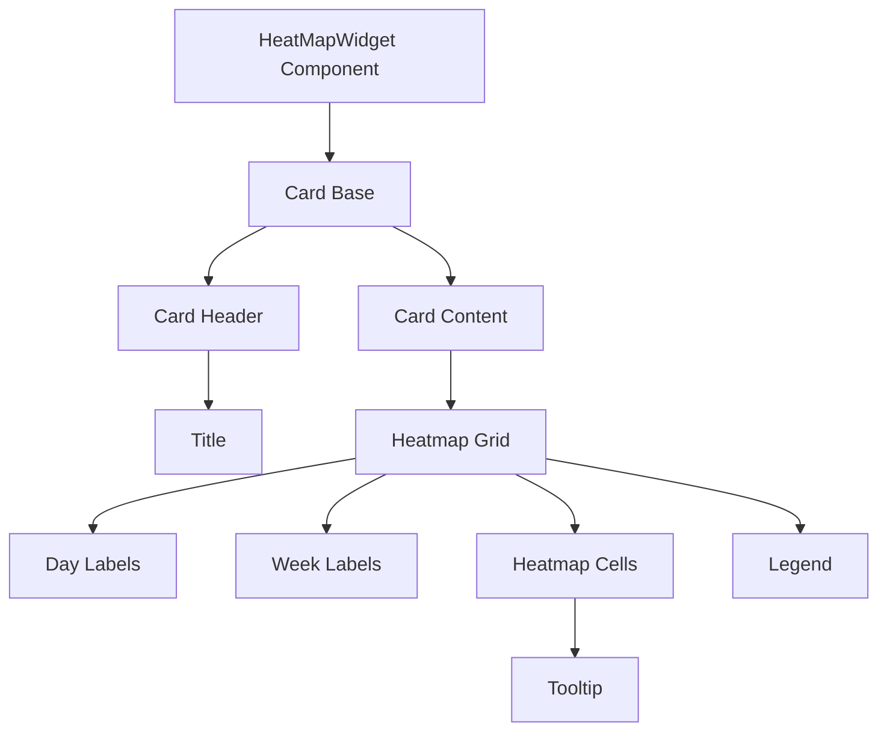
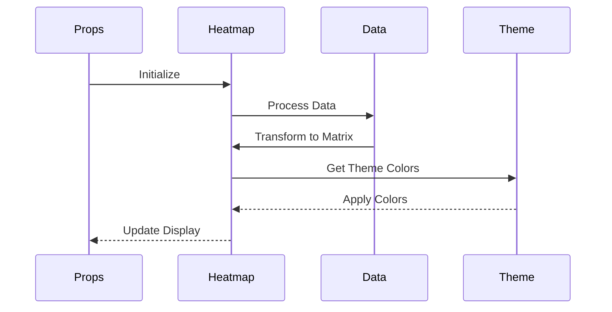
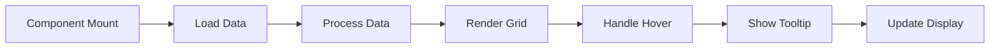

# HeatMapWidget Component

## Overview
The HeatMapWidget component in ThriveSend provides a powerful visualization of activity patterns over time using a calendar-style heatmap. Built with React and Tailwind CSS, it offers an intuitive way to display temporal data with customizable styling, loading states, and interactive tooltips.

## Screenshots

*Different HeatMapWidget states and configurations*

## Component Architecture


## Data Flow


## Features
- Calendar-style heatmap visualization
- Interactive tooltips
- Dark/light theme support
- Loading states
- Responsive design
- TypeScript type safety
- Accessibility support
- Performance optimized
- Customizable styling

## Props
```typescript
interface HeatMapWidgetProps {
  data?: {
    labels: string[];
    datasets: {
      label: string;
      data: number[];
    }[];
  };
  isLoading?: boolean;
  title?: string;
  className?: string;
}
```

## Usage

### Basic Usage
```typescript
import { HeatMapWidget } from '@/components/analytics/HeatMapWidget';

// Basic usage
<HeatMapWidget
  title="Activity Heatmap"
  data={{
    labels: ['Mon', 'Tue', 'Wed', 'Thu', 'Fri', 'Sat', 'Sun'],
    datasets: [{
      label: 'Engagement',
      data: [100, 120, 115, 134, 168, 132, 200]
    }]
  }}
/>
```

### With Loading State
```typescript
<HeatMapWidget
  title="Activity Heatmap"
  isLoading={true}
/>
```

### With Custom Styling
```typescript
<HeatMapWidget
  title="Activity Heatmap"
  data={activityData}
  className="custom-heatmap"
/>
```

## User Interaction Workflow


## Components

### 1. Card Base
- Manages heatmap container
- Handles responsive behavior
- Implements accessibility features

### 2. Card Header
- Displays heatmap title
- Manages spacing
- Handles loading state

### 3. Heatmap Grid
- Manages grid layout
- Handles data rendering
- Implements loading skeleton

### 4. Tooltip
- Shows detailed information
- Handles hover interactions
- Manages positioning

## Data Models
```typescript
interface HeatMapData {
  date: string;
  value: number;
}

interface HeatMapWidgetProps {
  data?: {
    labels: string[];
    datasets: {
      label: string;
      data: number[];
    }[];
  };
  isLoading?: boolean;
  title?: string;
  className?: string;
}
```

## Styling
- Uses Tailwind CSS for styling
- Follows design system color tokens
- Implements consistent spacing
- Supports dark mode
- Maintains accessibility contrast ratios
- Responsive design patterns
- Smooth transitions
- Custom color gradients

## Accessibility
- ARIA roles and attributes
- Semantic HTML structure
- Color contrast compliance
- Screen reader support
- Keyboard navigation
- Focus management
- Tooltip accessibility

## Error Handling
- Data validation
- Loading states
- Error boundaries
- Fallback content
- Type checking
- Null checks
- Default data handling

## Performance Optimizations
- Memoized callbacks
- Data processing optimization
- Render optimization
- State management
- Event handler optimization
- Grid rendering optimization

## Dependencies
- React
- TypeScript
- Tailwind CSS
- next-themes
- Custom UI components

## Related Components
- [Card](../ui/Card.md)
- [AnalyticsCard](./AnalyticsCard.md)
- [BarChartWidget](./BarChartWidget.md)
- [LineChartWidget](./LineChartWidget.md)
- [PieChartWidget](./PieChartWidget.md)

## Examples

### Basic Heatmap
```typescript
import { HeatMapWidget } from '@/components/analytics/HeatMapWidget';

function ActivityHeatmap() {
  const data = {
    labels: ['Mon', 'Tue', 'Wed', 'Thu', 'Fri', 'Sat', 'Sun'],
    datasets: [{
      label: 'Engagement',
      data: [100, 120, 115, 134, 168, 132, 200]
    }]
  };

  return (
    <HeatMapWidget
      title="Activity Heatmap"
      data={data}
    />
  );
}
```

### With Loading State
```typescript
import { HeatMapWidget } from '@/components/analytics/HeatMapWidget';

function ActivityHeatmap() {
  const [isLoading, setIsLoading] = useState(true);
  const [data, setData] = useState(null);

  useEffect(() => {
    // Fetch data
    fetchData().then(result => {
      setData(result);
      setIsLoading(false);
    });
  }, []);

  return (
    <HeatMapWidget
      title="Activity Heatmap"
      data={data}
      isLoading={isLoading}
    />
  );
}
```

### With Custom Styling
```typescript
import { HeatMapWidget } from '@/components/analytics/HeatMapWidget';

function ActivityHeatmap() {
  const data = {
    labels: ['Mon', 'Tue', 'Wed', 'Thu', 'Fri', 'Sat', 'Sun'],
    datasets: [{
      label: 'Engagement',
      data: [100, 120, 115, 134, 168, 132, 200]
    }]
  };

  return (
    <HeatMapWidget
      title="Activity Heatmap"
      data={data}
      className="custom-heatmap"
    />
  );
}
```

## Best Practices
1. Use clear, descriptive titles
2. Format data appropriately
3. Provide meaningful labels
4. Use consistent styling
5. Follow accessibility guidelines
6. Use TypeScript for type safety
7. Optimize performance
8. Handle loading states
9. Implement proper tooltips
10. Consider color contrast

## Troubleshooting

### Common Issues
1. **Heatmap not rendering**
   - Check data structure
   - Verify theme configuration
   - Check styling classes

2. **Data not displaying**
   - Verify data format
   - Check dataset structure
   - Validate labels

3. **Styling issues**
   - Check className usage
   - Verify theme colors
   - Check for style conflicts

### Solutions
1. **Rendering Issues**
   ```typescript
   // Proper data structure
   const data = {
     labels: ['Mon', 'Tue', 'Wed', 'Thu', 'Fri', 'Sat', 'Sun'],
     datasets: [{
       label: 'Engagement',
       data: [100, 120, 115, 134, 168, 132, 200]
     }]
   };
   ```

2. **Theme Issues**
   ```typescript
   // Proper theme implementation
   import { useTheme } from 'next-themes';

   function HeatmapWithTheme() {
     const { theme } = useTheme();
     // Theme-aware component
   }
   ```

3. **Styling Issues**
   ```typescript
   // Proper styling implementation
   <HeatMapWidget
     className="custom-heatmap"
     data={data}
   />
   ```

## Contributing
When contributing to the HeatMapWidget component:
1. Follow TypeScript best practices
2. Maintain accessibility standards
3. Add appropriate tests
4. Update documentation
5. Follow component guidelines
6. Consider performance implications
7. Test theme compatibility
8. Verify tooltip behavior

*Last Updated: 2025-06-04*
*Version: 1.0.0* 