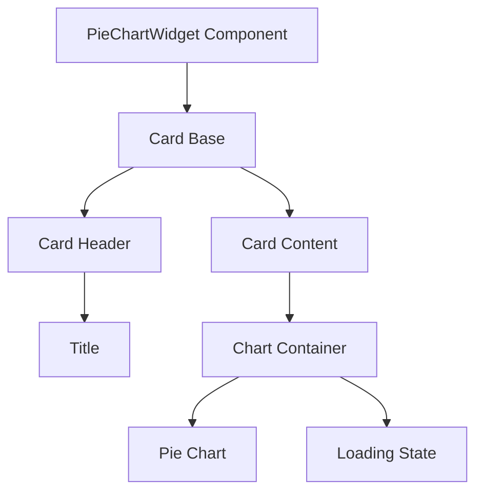
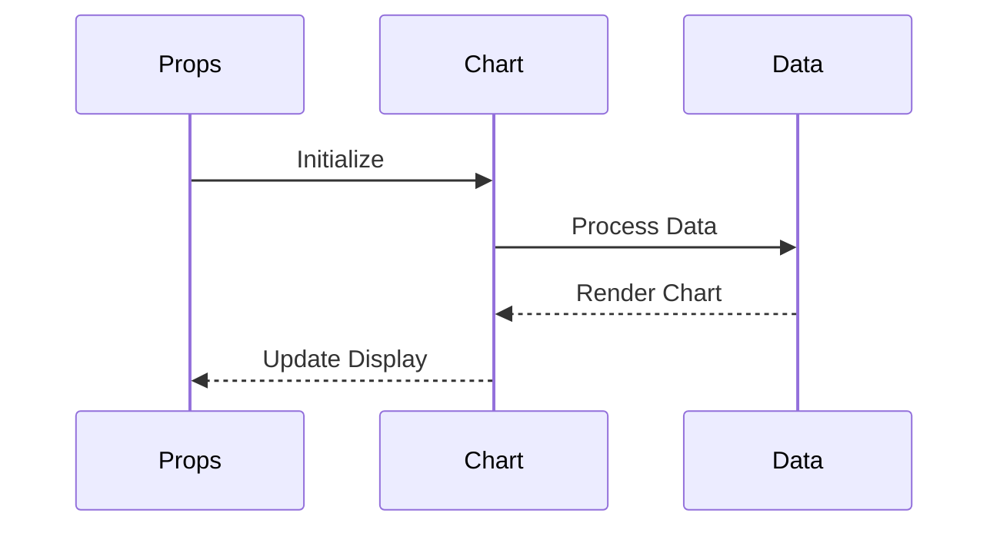
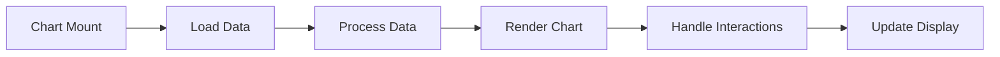

# PieChartWidget Component

## Overview
The PieChartWidget component in ThriveSend provides a powerful and flexible way to display pie chart visualizations. Built on top of Chart.js and react-chartjs-2, it offers a consistent way to display proportional data with customizable styling, loading states, and responsive design.

## Screenshots

*Different PieChartWidget states and configurations*

## Component Architecture


## Data Flow


## Features
- Pie chart visualization
- Multiple dataset support
- Custom styling options
- Loading states
- Responsive design
- TypeScript type safety
- Accessibility support
- Performance optimized
- Chart.js integration

## Props
```typescript
type PieChartWidgetProps = {
  title: string;
  data: {
    labels: string[];
    datasets: { 
      label: string; 
      data: number[]; 
      backgroundColor?: string[] 
    }[];
  };
  options?: object;
  isLoading?: boolean;
  className?: string;
};
```

## Usage

### Basic Usage
```typescript
import { PieChartWidget } from '@/components/analytics/PieChartWidget';

// Basic usage
<PieChartWidget
  title="Revenue Distribution"
  data={{
    labels: ['Product A', 'Product B', 'Product C'],
    datasets: [{
      label: 'Revenue',
      data: [300, 200, 100],
      backgroundColor: [
        'rgba(75, 192, 192, 0.2)',
        'rgba(255, 99, 132, 0.2)',
        'rgba(54, 162, 235, 0.2)'
      ]
    }]
  }}
/>
```

### Multiple Datasets
```typescript
<PieChartWidget
  title="User Distribution"
  data={{
    labels: ['North', 'South', 'East', 'West'],
    datasets: [
      {
        label: 'Active Users',
        data: [400, 300, 200, 100],
        backgroundColor: [
          'rgba(75, 192, 192, 0.2)',
          'rgba(255, 99, 132, 0.2)',
          'rgba(54, 162, 235, 0.2)',
          'rgba(255, 206, 86, 0.2)'
        ]
      },
      {
        label: 'New Users',
        data: [100, 80, 60, 40],
        backgroundColor: [
          'rgba(75, 192, 192, 0.4)',
          'rgba(255, 99, 132, 0.4)',
          'rgba(54, 162, 235, 0.4)',
          'rgba(255, 206, 86, 0.4)'
        ]
      }
    ]
  }}
/>
```

### With Custom Options
```typescript
<PieChartWidget
  title="Market Share"
  data={marketShareData}
  options={{
    responsive: true,
    plugins: {
      legend: {
        position: 'right',
      },
      title: {
        display: true,
        text: 'Market Share Distribution'
      }
    }
  }}
/>
```

## User Interaction Workflow


## Components

### 1. Card Base
- Manages chart container
- Handles responsive behavior
- Implements accessibility features

### 2. Card Header
- Displays chart title
- Manages spacing
- Handles loading state

### 3. Chart Container
- Manages chart dimensions
- Handles data rendering
- Implements loading skeleton

## Data Models
```typescript
interface PieChartWidgetProps {
  title: string;
  data: {
    labels: string[];
    datasets: {
      label: string;
      data: number[];
      backgroundColor?: string[];
    }[];
  };
  options?: object;
  isLoading?: boolean;
  className?: string;
}
```

## Styling
- Uses Tailwind CSS for styling
- Follows design system color tokens
- Implements consistent spacing
- Supports dark mode
- Maintains accessibility contrast ratios
- Responsive design patterns
- Smooth transitions

## Accessibility
- ARIA roles and attributes
- Semantic HTML structure
- Color contrast compliance
- Screen reader support
- Keyboard navigation
- Focus management
- Chart accessibility features

## Error Handling
- Data validation
- Loading states
- Error boundaries
- Fallback content
- Type checking
- Null checks

## Performance Optimizations
- Memoized callbacks
- Data processing optimization
- Render optimization
- Chart.js optimization
- State management
- Event handler optimization

## Dependencies
- React
- TypeScript
- Chart.js
- react-chartjs-2
- Tailwind CSS
- Custom UI components

## Related Components
- [Card](../ui/Card.md)
- [AnalyticsCard](./AnalyticsCard.md)
- [BarChartWidget](./BarChartWidget.md)
- [LineChartWidget](./LineChartWidget.md)

## Examples

### Basic Pie Chart
```typescript
import { PieChartWidget } from '@/components/analytics/PieChartWidget';

function RevenueDistribution() {
  const data = {
    labels: ['Product A', 'Product B', 'Product C'],
    datasets: [{
      label: 'Revenue',
      data: [300, 200, 100],
      backgroundColor: [
        'rgba(75, 192, 192, 0.2)',
        'rgba(255, 99, 132, 0.2)',
        'rgba(54, 162, 235, 0.2)'
      ]
    }]
  };

  return (
    <PieChartWidget
      title="Revenue Distribution"
      data={data}
    />
  );
}
```

### Multiple Datasets
```typescript
import { PieChartWidget } from '@/components/analytics/PieChartWidget';

function UserDistribution() {
  const data = {
    labels: ['North', 'South', 'East', 'West'],
    datasets: [
      {
        label: 'Active Users',
        data: [400, 300, 200, 100],
        backgroundColor: [
          'rgba(75, 192, 192, 0.2)',
          'rgba(255, 99, 132, 0.2)',
          'rgba(54, 162, 235, 0.2)',
          'rgba(255, 206, 86, 0.2)'
        ]
      },
      {
        label: 'New Users',
        data: [100, 80, 60, 40],
        backgroundColor: [
          'rgba(75, 192, 192, 0.4)',
          'rgba(255, 99, 132, 0.4)',
          'rgba(54, 162, 235, 0.4)',
          'rgba(255, 206, 86, 0.4)'
        ]
      }
    ]
  };

  return (
    <PieChartWidget
      title="User Distribution"
      data={data}
    />
  );
}
```

### With Loading State
```typescript
import { PieChartWidget } from '@/components/analytics/PieChartWidget';

function MarketShareChart() {
  const [isLoading, setIsLoading] = useState(true);
  const [data, setData] = useState(null);

  useEffect(() => {
    // Fetch data
    fetchData().then(result => {
      setData(result);
      setIsLoading(false);
    });
  }, []);

  return (
    <PieChartWidget
      title="Market Share"
      data={data}
      isLoading={isLoading}
    />
  );
}
```

## Best Practices
1. Use clear, descriptive titles
2. Format data appropriately
3. Provide meaningful labels
4. Use consistent styling
5. Follow accessibility guidelines
6. Use TypeScript for type safety
7. Optimize performance
8. Handle loading states

## Troubleshooting

### Common Issues
1. **Chart not rendering**
   - Check data structure
   - Verify Chart.js registration
   - Check styling classes

2. **Data not displaying**
   - Verify data format
   - Check dataset structure
   - Validate labels

3. **Styling issues**
   - Check className usage
   - Verify Chart.js options
   - Check for style conflicts

### Solutions
1. **Chart Rendering Issues**
   ```typescript
   // Proper Chart.js registration
   import {
     Chart as ChartJS,
     ArcElement,
     Tooltip,
     Legend
   } from "chart.js";
   
   ChartJS.register(
     ArcElement,
     Tooltip,
     Legend
   );
   ```

2. **Data Format Issues**
   ```typescript
   // Proper data structure
   const data = {
     labels: ['A', 'B', 'C'],
     datasets: [{
       label: 'Dataset',
       data: [1, 2, 3],
       backgroundColor: [
         'rgba(75, 192, 192, 0.2)',
         'rgba(255, 99, 132, 0.2)',
         'rgba(54, 162, 235, 0.2)'
       ]
     }]
   };
   ```

3. **Styling Issues**
   ```typescript
   // Proper styling implementation
   <PieChartWidget
     className="custom-chart"
     options={{
       responsive: true,
       maintainAspectRatio: false
     }}
   />
   ```

## Contributing
When contributing to the PieChartWidget component:
1. Follow TypeScript best practices
2. Maintain accessibility standards
3. Add appropriate tests
4. Update documentation
5. Follow component guidelines

*Last Updated: 2025-06-04*
*Version: 1.0.0* 