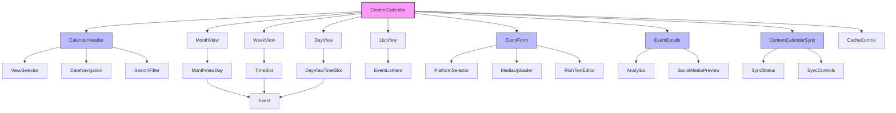
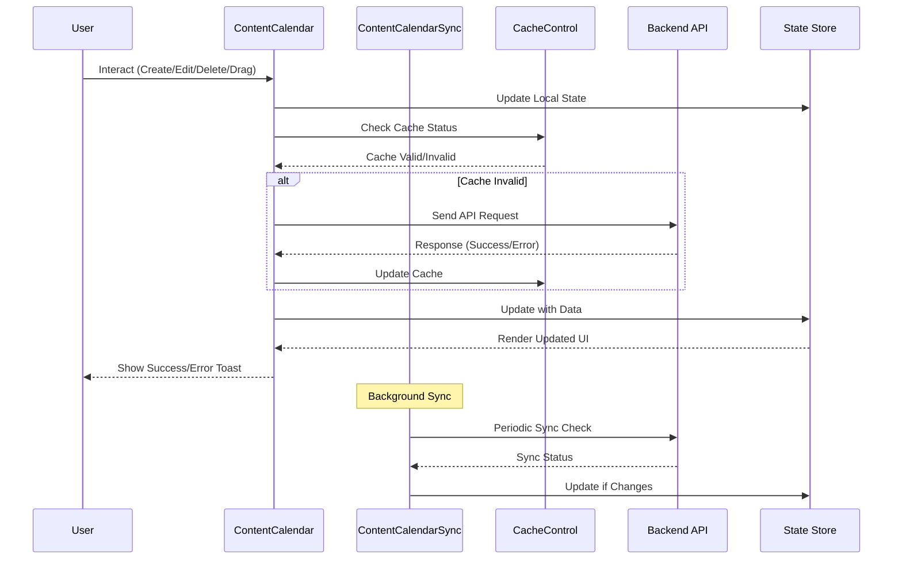
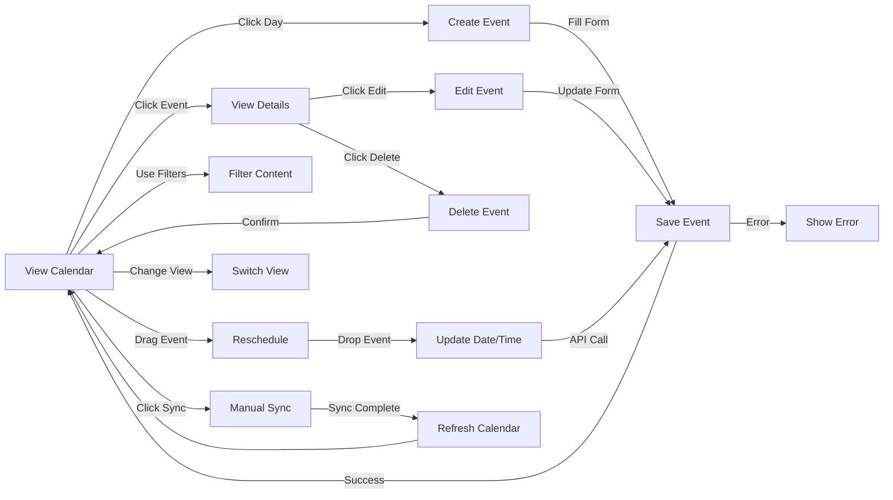

# ContentCalendar Component

## Overview

The Content Calendar is a complex, feature-rich component that allows users to schedule, manage, and track various types of content including social media posts, emails, blog posts, and articles. It provides an interactive calendar interface with multiple views (month, week, day, list) and supports drag-and-drop rescheduling of content with advanced sync capabilities and cache control.

## Screenshots

### Month View

*The default month view showing various content types color-coded by type*

### Week View

*Week view with time slots and event positioning*

### Day View

*Day view with hourly time slots and detailed event display*

### List View

*List view showing events in chronological order with filtering options*

### Event Details

*Detailed view of a calendar event showing analytics and platform previews*

### Create/Edit Form

*Form for creating and editing calendar events with platform-specific content*

## Component Architecture



*Component hierarchy and relationships*

## Data Flow



*Data flow during user interactions*

## Features

- **Multiple calendar views** (month, week, day, list)
- **Content creation, editing, and deletion**
- **Advanced filtering** by content type, status, or search terms
- **Drag-and-drop content rescheduling** with DndKit
- **Social media content previews**
- **Analytics display** for published content
- **Real-time sync capabilities** with external calendars
- **Intelligent cache control** for performance
- **Timezone-aware scheduling**
- **Responsive design** for desktop and mobile
- **Accessibility-first design**
- **Bulk operations support**
- **Advanced search and filtering**

## Props

| Prop | Type | Required | Description |
|------|------|----------|-------------|
| events | `CalendarEvent[]` | No | Array of calendar events to display |
| onEventCreate | `(event: Omit<CalendarEvent, "id">) => Promise<void>` | No | Handler for creating new events |
| onEventUpdate | `(event: CalendarEvent) => Promise<void>` | No | Handler for updating existing events |
| onEventDelete | `(eventId: string) => Promise<void>` | No | Handler for deleting events |
| onDateSelect | `(day: string) => void` | No | Handler for date selection |
| fetchEvents | `() => Promise<CalendarEvent[]>` | No | Function to fetch events from API |
| defaultView | `CalendarView` | No | Initial view mode (month, week, day, list) |
| onViewChange | `(view: CalendarView) => void` | No | Handler for view mode changes |
| onSyncClick | `() => void` | No | Handler for sync button click |
| onSettingsClick | `() => void` | No | Handler for settings button click |
| userTimezone | `string` | No | User's timezone for date/time display |
| enableSync | `boolean` | No | Enable/disable sync functionality |
| cacheTimeout | `number` | No | Cache timeout in milliseconds |
| enableDragDrop | `boolean` | No | Enable/disable drag and drop |
| maxEventsPerDay | `number` | No | Maximum events to show per day in month view |

## Usage

```tsx
import { ContentCalendar } from "@/components/content/content-calendar";
import { CalendarView, ContentType } from "@/components/content/types";

// Example event data
const events = [
  {
    id: "1",
    title: "Welcome Email",
    description: "Send welcome email to new subscribers",
    type: "email" as ContentType,
    status: "scheduled",
    date: "2023-09-15",
    time: "09:00",
    socialMediaContent: {
      platforms: [],
      mediaUrls: [],
      crossPost: false,
      platformSpecificContent: {}
    },
    organizationId: "org-123",
    createdBy: "user-456"
  }
];

// Basic implementation
function CalendarPage() {
  return (
    <ContentCalendar
      events={events}
      defaultView="month"
      enableSync={true}
      enableDragDrop={true}
    />
  );
}

// Advanced implementation with API integration
function CalendarPageWithAPI() {
  const [view, setView] = useState<CalendarView>("month");
  
  const handleEventCreate = async (event) => {
    const response = await fetch('/api/calendar/events', {
      method: 'POST',
      headers: { 'Content-Type': 'application/json' },
      body: JSON.stringify(event)
    });
    return await response.json();
  };

  const handleEventUpdate = async (event) => {
    const response = await fetch(`/api/calendar/events/${event.id}`, {
      method: 'PUT',
      headers: { 'Content-Type': 'application/json' },
      body: JSON.stringify(event)
    });
    return await response.json();
  };

  const handleEventDelete = async (eventId) => {
    await fetch(`/api/calendar/events/${eventId}`, {
      method: 'DELETE'
    });
    return true;
  };

  const fetchEvents = async () => {
    const response = await fetch('/api/calendar/events');
    const data = await response.json();
    return data.events;
  };

  const handleSync = async () => {
    // Trigger manual sync
    await fetch('/api/calendar/sync', { method: 'POST' });
  };

  return (
    <ContentCalendar
      onEventCreate={handleEventCreate}
      onEventUpdate={handleEventUpdate}
      onEventDelete={handleEventDelete}
      fetchEvents={fetchEvents}
      defaultView={view}
      onViewChange={setView}
      onSyncClick={handleSync}
      userTimezone="America/New_York"
      enableSync={true}
      cacheTimeout={300000} // 5 minutes
      enableDragDrop={true}
      maxEventsPerDay={5}
    />
  );
}
```

## User Interaction Workflow



*User interaction flows within the calendar component*

## Components

### ContentCalendar

The main container component that handles state management, data fetching, event handling, and coordinates all child components.

**Features:**
- State management for events and view modes
- API integration and error handling
- Drag and drop coordination
- Cache management
- Sync orchestration

### CalendarHeader

Header component providing navigation, view switching, and action controls.

**Features:**
- Date navigation (previous/next)
- View mode selector (month/week/day/list)
- Search and filter controls
- Sync status indicator
- Settings access

### EventForm

Form component for creating and editing calendar events.

**Features:**
- Dynamic form fields based on content type
- Social media platform selection
- Media uploads
- Rich text editing
- Form validation
- Timezone handling

### EventDetails

Component for displaying detailed information about a calendar event.

**Features:**
- Platform-specific previews
- Analytics display
- Edit and delete actions
- Status indicators
- Performance metrics

### MonthView

Displays events in a traditional calendar grid.

**Features:**
- Day cells with events
- Drag and drop support
- Event color coding by type
- "More events" indicator
- Responsive grid layout

### WeekView

Displays events in a weekly timeline format.

**Features:**
- Hourly time slots
- Multi-day event support
- Drag and drop rescheduling
- Time-based positioning

### DayView

Displays events for a single day with detailed time slots.

**Features:**
- Detailed hourly breakdown
- Event duration visualization
- Conflict detection
- Time slot availability

### ListView

Displays events in a chronological list format.

**Features:**
- Sortable columns
- Advanced filtering
- Bulk operations
- Export capabilities

### ContentCalendarSync

Handles synchronization with external calendar systems.

**Features:**
- Real-time sync status
- Conflict resolution
- Sync scheduling
- Error recovery

### CacheControl

Manages caching strategies for performance optimization.

**Features:**
- Intelligent cache invalidation
- Background refresh
- Cache statistics
- Memory management

## Data Models

### CalendarView Type

```ts
export type CalendarView = 'month' | 'week' | 'day' | 'list';
```

### CalendarEvent Interface

```typescript
export interface CalendarEvent {
  id: string;
  title: string;
  description: string;
  type: ContentType;
  status: 'draft' | 'scheduled' | 'sent' | 'failed';
  date: string;
  time?: string;
  duration?: number;
  startTime?: string;
  endTime?: string;
  scheduledDate?: string;
  scheduledTime?: string;
  socialMediaContent: SocialMediaContent;
  analytics?: {
    views?: number;
    engagement?: {
      likes?: number;
      shares?: number;
      comments?: number;
    };
    clicks?: number;
    lastUpdated?: string;
  };
  preview?: {
    thumbnail?: string;
    platformPreviews?: {
      [key in SocialPlatform]?: {
        previewUrl?: string;
        status?: 'pending' | 'approved' | 'rejected';
        rejectionReason?: string;
      };
    };
  };
  organizationId: string;
  createdBy: string;
  tags?: string[];
  timezone?: string;
  recurrence?: {
    type: 'daily' | 'weekly' | 'monthly';
    interval: number;
    endDate?: string;
  };
}

export type ContentType = 'social' | 'blog' | 'email' | 'custom' | 'article';

export interface SocialMediaContent {
  platforms: SocialPlatform[];
  mediaUrls: string[];
  crossPost: boolean;
  platformSpecificContent: {
    [key in SocialPlatform]?: {
      text: string;
      mediaUrls: string[];
      scheduledTime?: string;
    };
  };
}

export type SocialPlatform = 'FACEBOOK' | 'TWITTER' | 'INSTAGRAM' | 'LINKEDIN';

export interface SyncStatus {
  isEnabled: boolean;
  lastSync: string;
  status: 'idle' | 'syncing' | 'error';
  errorMessage?: string;
}

export interface CacheConfig {
  timeout: number;
  maxSize: number;
  strategy: 'lru' | 'fifo' | 'ttl';
}
```

## Styling

The component uses a combination of Tailwind CSS and custom styles:

- **Responsive grid layouts** for different views
- **Color coding** for different content types and statuses using semantic color tokens
- **Hover and active states** for interactive elements
- **Accessibility-focused styling** with high contrast
- **Dark mode support** with theme-aware colors
- **Custom CSS variables** for consistent theming

## Accessibility

- **ARIA attributes** for interactive elements
- **Keyboard navigation support** (Tab, Arrow keys, Enter, Escape)
- **Focus management** with proper focus trapping
- **Screen reader friendly** text alternatives
- **High contrast** visual indicators
- **Reduced motion support** for animations
- **Semantic HTML structure**

## Error Handling

- **API failures** are caught and displayed with toast notifications
- **Network errors** trigger a fallback direct fetch mechanism
- **Validation errors** in forms provide detailed feedback
- **Failed operations** can be retried with exponential backoff
- **Graceful degradation** when sync is unavailable
- **Error boundaries** to prevent component crashes
- **Comprehensive error logging** for debugging

## Performance Optimizations

- **Memoization** with useMemo and useCallback
- **Lazy loading** with React.lazy and Suspense
- **Virtualization** for large datasets (1000+ events)
- **Debouncing** for search inputs (300ms delay)
- **Component memoization** with React.memo
- **Intelligent cache management**
- **Background data prefetching**
- **Image lazy loading** for event thumbnails
- **Bundle splitting** for view components

## Dependencies

- **date-fns and date-fns-tz** for date handling
- **@dnd-kit/core** for drag and drop functionality
- **@dnd-kit/modifiers** for drag constraints
- **lucide-react** for icons
- **@/components/ui/\*** for UI components
- **React 18+** for concurrent features
- **TypeScript** for type safety

## Related Components

- `EventForm.md`
- `EventDetails.md`
- `RichTextEditor.md`
- `MediaUploader.md`
- Calendar (from UI components)
- Dialog (from UI components)

## Additional Examples

### Custom Event Types

```typescript
// Adding custom content types
const customEvents = [
  {
    id: "custom-1",
    title: "Podcast Episode",
    type: "custom" as ContentType,
    // ... other properties
  }
];

<ContentCalendar
  events={customEvents}
  // Custom color mapping for new types
  eventTypeColors={{
    podcast: { bg: "bg-purple-100", text: "text-purple-700" }
  }}
/>
```

### Timezone Handling

```typescript
// Multi-timezone support
<ContentCalendar
  userTimezone="America/New_York"
  displayTimezone="UTC"
  events={events}
/>
```

### Advanced Filtering

```typescript
// Custom filter implementation
const [filters, setFilters] = useState({
  contentType: 'all',
  status: 'all',
  dateRange: { start: null, end: null }
});

<ContentCalendar
  events={filteredEvents}
  onFilterChange={setFilters}
  enableAdvancedFilters={true}
/>
```

## Best Practices

1. Always provide a fetchEvents function or events array
2. Implement proper error handling for API calls
3. Consider timezone handling for date/time display
4. Test drag and drop functionality thoroughly
5. Ensure proper validation in forms
6. Use semantic color tokens instead of raw colors
7. Implement proper loading states
8. Handle offline scenarios gracefully
9. Optimize for large datasets with virtualization
10. Follow accessibility guidelines

## Troubleshooting

### Common Issues

**Event not showing on calendar**
- Ensure the event has a valid date property in the format "YYYY-MM-DD"

**Drag and drop not working**
- Check if the onEventUpdate prop is provided and correctly implemented

**Time display issues**
- The calendar uses the user's timezone, make sure userTimezone is correctly set

**Events not loading**
- Verify the fetchEvents function is returning properly formatted CalendarEvent objects

**Sync not working**
- Check network connectivity and API endpoint availability

**Performance issues**
- Enable virtualization for large datasets and check cache configuration

### Solutions

1. Check browser console for API errors
2. Verify event object structure matches the CalendarEvent interface
3. Test with mock data to isolate API vs rendering issues
4. Ensure timezone handling is consistent
5. Validate ContentType values match the defined union type
6. Check that all required dependencies are installed
7. Verify proper TypeScript configuration

### Debug Mode

```tsx
// Enable debug mode for troubleshooting
<ContentCalendar
  debug={true}
  onDebugLog={(message, data) => console.log(message, data)}
  events={events}
/>
```

## Contributing

When contributing to the Content Calendar component:

1. Follow the established code patterns and organization
2. Update documentation for any new features or changes
3. Add appropriate accessibility attributes
4. Ensure all components are properly memoized
5. Write tests for new functionality
6. Consider performance implications of any changes
7. Use semantic color tokens for styling
8. Follow TypeScript best practices
9. Update type definitions when adding new features
10. Test across different timezones and locales

---

*Last updated: 2025-01-06*
*Component version: 2.1.0*  
*Documentation version: 1.0.0*