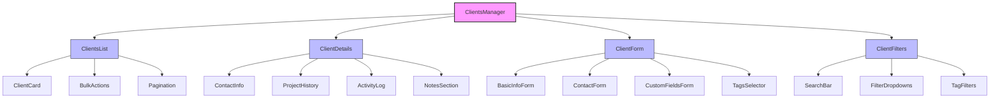
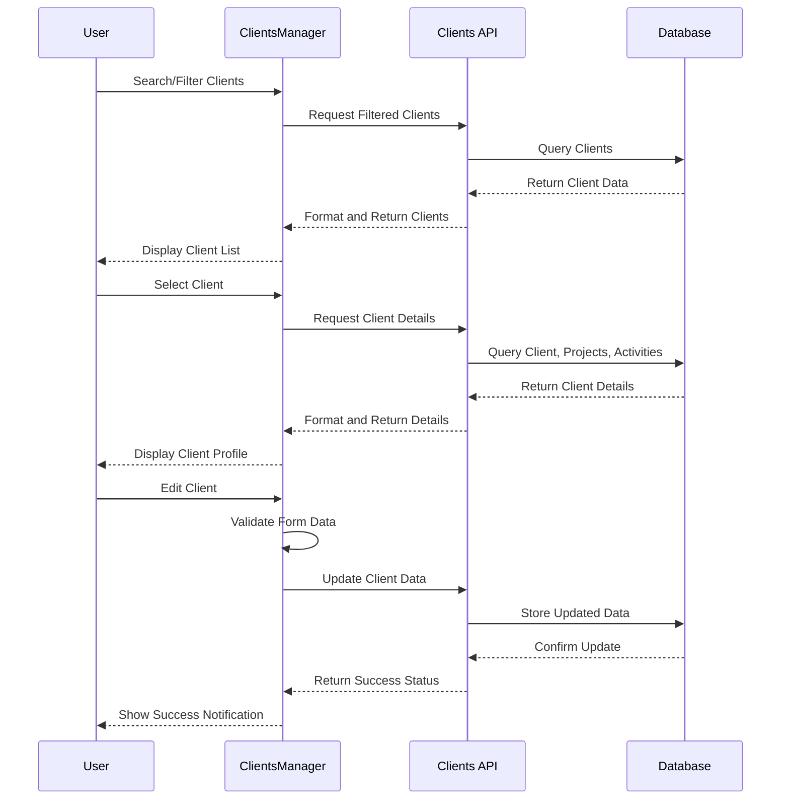
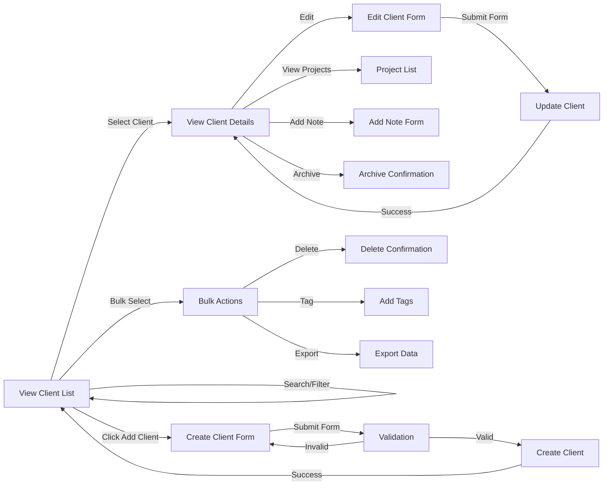

# ClientsManager Component

## Overview
The ClientsManager component provides a comprehensive interface for managing client information, contacts, projects, and communication history. It allows users to create, view, edit, and organize client data with advanced filtering, sorting, and segmentation capabilities.

## Screenshots

### Clients Dashboard

*The main clients dashboard showing client list and key information*

### Client Details

*Detailed client profile with contact information and project history*

### Add/Edit Client

*Form interface for adding or editing client information*

### Client Segmentation

*Client segmentation and tagging interface for organization*

## Component Architecture



*Component hierarchy and relationships*

## Data Flow



*Data flow for client management operations*

## Features
- Comprehensive client database management
- Detailed client profiles and history
- Contact management with multiple contacts per client
- Project tracking and history
- Communication log and activity history
- Custom fields for client data
- Client tagging and categorization
- Advanced search and filtering
- Bulk operations for multiple clients
- Import/export client data
- Client segmentation and organization
- Data validation and verification

## Props

| Prop | Type | Required | Description |
|------|------|----------|-------------|
| initialView | 'list' \| 'details' \| 'form' | No | Initial view to display |
| selectedClientId | string | No | ID of initially selected client |
| filters | ClientFilters | No | Initial filter configuration |
| onClientSelect | (clientId: string) => void | No | Callback when client is selected |
| onClientCreate | (client: ClientData) => void | No | Callback when client is created |
| onClientUpdate | (client: ClientData) => void | No | Callback when client is updated |
| onClientDelete | (clientId: string) => void | No | Callback when client is deleted |
| showArchived | boolean | No | Whether to show archived clients |
| customFields | CustomField[] | No | Additional custom fields to display |

## Usage

```tsx
import { ClientsManager } from '@/components/clients/ClientsManager';

// Basic usage
<ClientsManager />

// With initial selected client
<ClientsManager
  initialView="details"
  selectedClientId="client-123"
/>

// With custom handling
<ClientsManager
  onClientSelect={(clientId) => console.log(`Selected client: ${clientId}`)}
  onClientCreate={(client) => saveClientToDatabase(client)}
  onClientUpdate={(client) => updateClientInDatabase(client)}
  onClientDelete={(clientId) => handleClientDeletion(clientId)}
/>

// With custom fields
<ClientsManager
  customFields={[
    { id: 'industry', label: 'Industry', type: 'select', options: [...] },
    { id: 'revenue', label: 'Annual Revenue', type: 'currency' }
  ]}
/>
```

## User Interaction Workflow



*User interaction flows within the clients management component*

## Components

### ClientsList
Displays a paginated list of clients with sorting and filtering options.

#### Props
- clients: Client[]
- onSelect: (clientId: string) => void
- onBulkAction: (action: string, clientIds: string[]) => void
- filters: ClientFilters
- sortOrder: SortOrder

### ClientDetails
Shows detailed information for a selected client.

#### Features
- Contact information display
- Project history timeline
- Communication log
- Notes and attachments
- Action buttons for common operations

### ClientForm
Form interface for adding or editing client information.

#### Features
- Multi-step form process
- Client information fields
- Multiple contact management
- Custom fields support
- Tags and categorization
- Validation rules

### ClientFilters
Provides search and filtering capabilities for the client list.

#### Features
- Text search
- Filter by tags, status, and date
- Saved filter presets
- Clear all filters option

## Data Models

### Client
```typescript
interface Client {
  id: string;
  name: string;
  company: string;
  email: string;
  phone?: string;
  address?: {
    street?: string;
    city?: string;
    state?: string;
    zip?: string;
    country?: string;
  };
  contacts: Contact[];
  tags: string[];
  status: 'active' | 'inactive' | 'lead' | 'archived';
  source?: string;
  assignedTo?: string;
  createdAt: Date;
  updatedAt: Date;
  customFields?: Record<string, any>;
  notes?: Note[];
  projects?: Project[];
}
```

### Contact
```typescript
interface Contact {
  id: string;
  firstName: string;
  lastName: string;
  email: string;
  phone?: string;
  title?: string;
  isPrimary: boolean;
  createdAt: Date;
  updatedAt: Date;
}
```

### CustomField
```typescript
interface CustomField {
  id: string;
  label: string;
  type: 'text' | 'number' | 'select' | 'date' | 'checkbox' | 'currency';
  options?: string[];
  required?: boolean;
  placeholder?: string;
  defaultValue?: any;
}
```

## Styling
The component uses a combination of Tailwind CSS and custom styling:
- Clean, business-oriented UI design
- Responsive layout for all device sizes
- Card-based design for client information
- Color-coded status indicators
- Consistent typography and spacing
- Hover and active states for interactive elements
- Print-optimized styles for client reports

## Accessibility
- Semantic HTML structure
- ARIA labels for interactive elements
- Focus management for forms and modals
- Keyboard navigation for all functions
- Screen reader announcements for dynamic content
- Color contrast compliance
- Table accessibility for client lists
- Form field error announcements

## Error Handling
- Form validation with clear error messages
- API error handling and retry mechanisms
- Graceful fallbacks for missing data
- Optimistic updates with rollback capability
- Connection status monitoring
- Error boundaries for component isolation
- Data validation before submission

## Performance Optimizations
- Pagination for large client lists
- Virtualized scrolling for long lists
- Optimistic UI updates
- Debounced search input
- Memoized client filtering and sorting
- Lazy loading of client details
- Incremental loading of client history
- Efficient re-renders with React.memo

## Dependencies
- @tanstack/react-table
- react-hook-form
- zod (for validation)
- @tanstack/react-query
- react-virtualized
- date-fns
- react-csv and xlsx (for export)
- papaparse (for import)

## Related Components
- ProjectsManager
- ContactsDirectory
- ActivityLogger
- TagsManager
- ImportExportTool
- ClientAnalytics
- UserAssignment

## Examples

### Basic Implementation
```tsx
import { ClientsManager } from '@/components/clients/ClientsManager';

export default function ClientsPage() {
  return (
    <div className="p-6">
      <h1 className="text-2xl font-bold mb-6">Client Management</h1>
      <ClientsManager />
    </div>
  );
}
```

### With Client Selection and Custom Handling
```tsx
import { ClientsManager } from '@/components/clients/ClientsManager';
import { useState } from 'react';
import { useToast } from '@/components/ui/toast';

export default function ClientsWithActionsPage() {
  const [selectedClientId, setSelectedClientId] = useState<string | null>(null);
  const { toast } = useToast();
  
  const handleClientSelect = (clientId: string) => {
    setSelectedClientId(clientId);
    // Additional logic like fetching related data
  };
  
  const handleClientCreate = async (clientData) => {
    try {
      await apiClient.clients.create(clientData);
      toast({
        title: "Client Created",
        description: `${clientData.name} has been successfully created.`,
        variant: "success"
      });
    } catch (error) {
      toast({
        title: "Error",
        description: "Failed to create client. Please try again.",
        variant: "error"
      });
    }
  };
  
  return (
    <div className="p-6">
      <ClientsManager
        selectedClientId={selectedClientId}
        onClientSelect={handleClientSelect}
        onClientCreate={handleClientCreate}
      />
    </div>
  );
}
```

### With Custom Fields
```tsx
import { ClientsManager } from '@/components/clients/ClientsManager';

export default function CustomFieldsClientPage() {
  const industryOptions = [
    'Technology', 'Healthcare', 'Finance', 'Education', 
    'Manufacturing', 'Retail', 'Real Estate', 'Other'
  ];
  
  const customFields = [
    {
      id: 'industry',
      label: 'Industry',
      type: 'select',
      options: industryOptions,
      required: true
    },
    {
      id: 'employeeCount',
      label: 'Number of Employees',
      type: 'number',
      placeholder: 'Enter company size'
    },
    {
      id: 'annualRevenue',
      label: 'Annual Revenue',
      type: 'currency'
    },
    {
      id: 'isPublicCompany',
      label: 'Publicly Traded',
      type: 'checkbox'
    }
  ];
  
  return (
    <div className="p-6">
      <h1 className="text-2xl font-bold mb-6">Clients with Custom Fields</h1>
      <ClientsManager customFields={customFields} />
    </div>
  );
}
```

## Best Practices
1. Maintain consistent client data structure
2. Implement proper validation for all client fields
3. Use tags and segmentation for efficient organization
4. Keep client interaction history up to date
5. Set appropriate permissions for client data access
6. Regularly clean and verify client data
7. Use bulk operations for efficient management
8. Implement data export/backup functionality

## Troubleshooting

### Common Issues
1. Duplicate client entries
2. Missing required fields in imported data
3. Performance issues with large client databases
4. Search returning unexpected results
5. Client history not updating correctly
6. Permission issues for certain actions
7. Form validation errors

### Solutions
1. Implement duplicate detection during client creation
2. Validate and clean data before import
3. Use pagination and virtualization for large datasets
4. Verify search indexing and filter combinations
5. Check activity logging middleware
6. Review user role permissions
7. Add detailed validation error messages

## Contributing
When contributing to this component:
1. Follow data privacy best practices
2. Maintain backward compatibility for client data structure
3. Document custom fields implementation
4. Add unit tests for validation logic
5. Consider internationalization requirements
6. Optimize for both desktop and mobile use
7. Follow established UI patterns for consistency 