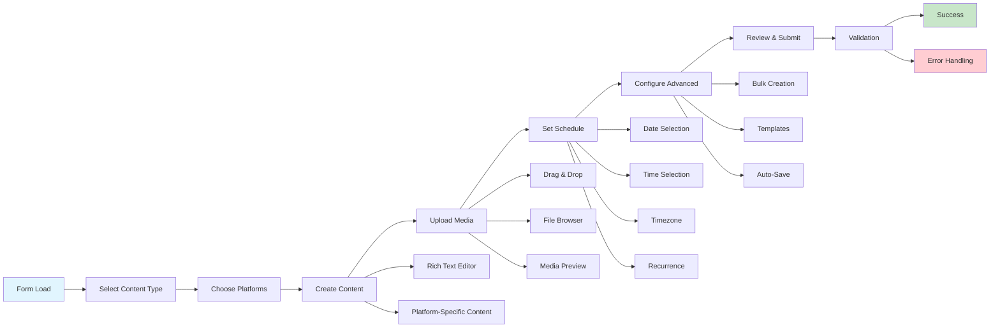

# EventForm Component

## Overview
The EventForm component is a sophisticated, multi-modal form interface for creating, editing, and duplicating calendar events in the ThriveSend content management system. It provides comprehensive content creation capabilities with support for multiple social media platforms, advanced scheduling options, media management, and workflow automation features.

## Screenshots
*Screenshots to be added showing:*
1. **Main Form Interface** - `event-form-main-view.png` - Complete form in create mode
2. **Content Type Selection** - `event-form-content-types.png` - Different content type options
3. **Social Platform Configuration** - `event-form-social-platforms.png` - Platform-specific settings
4. **Advanced Features** - `event-form-advanced-features.png` - Recurrence, bulk creation, templates

## Component Architecture
```mermaid
graph TD
    A[EventForm] --> B[FormTabs]
    A --> C[MediaUploader]
    A --> D[RichTextEditor]
    A --> E[PlatformSelector]
    A --> F[SchedulingControls]
    
    B --> B1[ContentTab]
    B --> B2[SchedulingTab]
    B --> B3[AdvancedTab]
    
    C --> C1[MediaPreview]
    C --> C2[DragDropZone]
    C --> C3[FileInput]
    
    E --> E1[PlatformCard]
    E --> E2[ContentLimits]
    E --> E3[CrossPostSettings]
    
    F --> F1[DatePicker]
    F --> F2[TimePicker]
    F --> F3[TimezoneSelector]
    F --> F4[RecurrencePattern]
    
    style A fill:#f9f,stroke:#333,stroke-width:2px
    style B fill:#bbf,stroke:#333,stroke-width:1px
    style C fill:#bbf,stroke:#333,stroke-width:1px
    style D fill:#bbf,stroke:#333,stroke-width:1px
    style E fill:#bbf,stroke:#333,stroke-width:1px
    style F fill:#bbf,stroke:#333,stroke-width:1px

# Data Flow
```mermaid
sequenceDiagram
    participant U as User
    participant EF as EventForm
    participant CS as ContentService
    participant CalS as CalendarService
    participant MS as MediaService
    participant TS as TemplateService
    
    U->>EF: Initialize form (mode, initialData)
    EF->>EF: Setup form state and validation
    
    U->>EF: Select content type
    EF->>EF: Update form fields and platform options
    EF->>EF: Reset social media content
    
    U->>EF: Upload media files
    EF->>MS: Validate and process media
    MS-->>EF: Return media URLs and metadata
    EF->>EF: Update media preview
    
    U->>EF: Configure social platforms
    EF->>EF: Apply platform-specific limits
    EF->>EF: Validate content length
    
    U->>EF: Set scheduling options
    EF->>EF: Update recurrence preview
    EF->>EF: Validate timezone and dates
    
    U->>EF: Submit form
    EF->>EF: Validate all fields
    EF->>CS: Create/update content
    EF->>CalS: Create calendar event(s)
    CalS-->>EF: Return event ID(s)
    EF->>U: Show success notification
    EF->>EF: Reset form or redirect
```
```
## Features
- Multi-Modal Operation : Create, edit, and duplicate modes with context-aware behavior
- Content Type Support : Post, Story, Reel, Carousel, and Video content types
- Social Platform Integration : Instagram, Facebook, Twitter, LinkedIn, TikTok, YouTube
- Advanced Media Management : Drag-and-drop upload, preview, validation, and platform-specific limits
- Rich Text Editing : Platform-aware content creation with character counting
- Smart Scheduling : Date/time selection with timezone support and conflict detection
- Recurrence Patterns : Daily, weekly, monthly recurring events with custom intervals
- Bulk Creation : Generate multiple events with variations
- Template System : Save and reuse content templates
- Auto-Save : Automatic form state preservation
- Cross-Platform Posting : Simultaneous posting to multiple social platforms
- Real-Time Validation : Immediate feedback on form inputs and constraints
- Responsive Design : Optimized for desktop and mobile interfaces
## Props
```typescript
interface EventFormProps {
  /** Initial data for editing existing events */
  initialData?: CalendarEvent;
  
  /** Form operation mode */
  mode: 'create' | 'edit' | 'duplicate';
  
  /** Callback fired when form is successfully submitted */
  onSubmit?: (event: CalendarEvent) => void;
  
  /** Callback fired when form is cancelled */
  onCancel?: () => void;
  
  /** Callback fired when event is deleted (edit mode only) */
  onDelete?: (eventId: string) => void;
  
  /** Whether the form should auto-save changes */
  autoSave?: boolean;
  
  /** Default content type to select */
  defaultContentType?: ContentType;
  
  /** Pre-selected social platforms */
  defaultPlatforms?: SocialPlatform[];
  
  /** Whether to show advanced features */
  showAdvancedFeatures?: boolean;
}
```

## Usage
### Basic Implementation
```ts
import { EventForm } from '@/components/content-calendar/EventForm';
import { CalendarEvent } from '@/types/content';

function CreateEventPage() {
  const handleSubmit = (event: CalendarEvent) => {
    console.log('Event created:', event);
    // Handle successful creation
  };

  const handleCancel = () => {
    // Handle form cancellation
    router.back();
  };

  return (
    <div className="container mx-auto p-6">
      <h1 className="text-2xl font-bold mb-6">Create New Event</h1>
      <EventForm
        mode="create"
        onSubmit={handleSubmit}
        onCancel={handleCancel}
        autoSave={true}
        showAdvancedFeatures={true}
      />
    </div>
  );
}
```
## Edit Mode with Initial Data
```ts
function EditEventPage({ eventId }: { eventId: string }) {
  const [event, setEvent] = useState<CalendarEvent | null>(null);
  const [loading, setLoading] = useState(true);

  useEffect(() => {
    const fetchEvent = async () => {
      try {
        const eventData = await calendarService.getEvent(eventId);
        setEvent(eventData);
      } catch (error) {
        console.error('Failed to fetch event:', error);
      } finally {
        setLoading(false);
      }
    };

    fetchEvent();
  }, [eventId]);

  const handleSubmit = async (updatedEvent: CalendarEvent) => {
    try {
      await calendarService.updateEvent(eventId, updatedEvent);
      toast.success('Event updated successfully');
      router.push('/calendar');
    } catch (error) {
      toast.error('Failed to update event');
    }
  };

  const handleDelete = async (eventId: string) => {
    if (confirm('Are you sure you want to delete this event?')) {
      try {
        await calendarService.deleteEvent(eventId);
        toast.success('Event deleted successfully');
        router.push('/calendar');
      } catch (error) {
        toast.error('Failed to delete event');
      }
    }
  };

  if (loading) return <div>Loading...</div>;
  if (!event) return <div>Event not found</div>;

  return (
    <div className="container mx-auto p-6">
      <h1 className="text-2xl font-bold mb-6">Edit Event</h1>
      <EventForm
        mode="edit"
        initialData={event}
        onSubmit={handleSubmit}
        onCancel={() => router.back()}
        onDelete={handleDelete}
        autoSave={true}
      />
    </div>
  );
}
```
## Duplicate Mode
```ts
function DuplicateEventPage({ sourceEventId }: { sourceEventId: string }) {
  const [sourceEvent, setSourceEvent] = useState<CalendarEvent | null>(null);

  useEffect(() => {
    const fetchSourceEvent = async () => {
      const event = await calendarService.getEvent(sourceEventId);
      // Clear ID and adjust date for duplication
      const duplicateData = {
        ...event,
        id: undefined,
        date: new Date(Date.now() + 24 * 60 * 60 * 1000), // Next day
        title: `Copy of ${event.title}`
      };
      setSourceEvent(duplicateData);
    };

    fetchSourceEvent();
  }, [sourceEventId]);

  return (
    <div className="container mx-auto p-6">
      <h1 className="text-2xl font-bold mb-6">Duplicate Event</h1>
      {sourceEvent && (
        <EventForm
          mode="duplicate"
          initialData={sourceEvent}
          onSubmit={(event) => {
            console.log('Event duplicated:', event);
            router.push('/calendar');
          }}
          onCancel={() => router.back()}
        />
      )}
    </div>
  );
}
```
## User Interaction Workflow


## Components
### MediaPreview
Displays uploaded media files with removal capability.
```ts
interface MediaPreviewProps {
  files: File[];
  onRemove: (index: number) => void;
}
```
### MediaUploader
Handles file upload with drag-and-drop support and platform-specific validation.
```ts
interface MediaUploaderProps {
  selectedPlatforms: SocialPlatform[];
  onFilesSelected: (files: File[]) => void;
  maxFiles?: number;
  acceptedTypes?: string[];
}
```
### RichTextEditor
Provides rich text editing capabilities with platform-aware character counting.

### PlatformSelector
Allows selection and configuration of social media platforms with content limits.

### RecurrenceControls
Manages recurring event patterns and preview generation.

## Data Models
### FormData Interface
```ts
interface FormData {
  title: string;
  description: string;
  contentType: ContentType;
  date: Date;
  time: string;
  timezone: string;
  socialMediaContent: FormSocialMediaContent[];
  tags: string[];
  location?: string;
  duration: number;
  isAllDay: boolean;
  reminders: number[];
  visibility: 'public' | 'private' | 'team';
  collaborators: string[];
  approvalRequired: boolean;
  priority: 'low' | 'medium' | 'high';
  budget?: number;
  campaignId?: string;
  clientId?: string;
  projectId?: string;
}
```
### RecurrencePattern Interface
```ts
interface RecurrencePattern {
  enabled: boolean;
  type: 'daily' | 'weekly' | 'monthly' | 'yearly';
  interval: number;
  endType: 'never' | 'after' | 'on';
  endAfter?: number;
  endOn?: Date;
  weekdays?: number[];
  monthDay?: number;
  exceptions?: Date[];
}
```
### BulkCreationState Interface
```ts
interface BulkCreationState {
  enabled: boolean;
  count: number;
  interval: 'days' | 'weeks' | 'months';
  intervalValue: number;
  variations: BulkVariation[];
}
```
### Platform Content Limits
```ts
const platformContentLimits = {
  instagram: { characters: 2200, media: 10 },
  facebook: { characters: 63206, media: 10 },
  twitter: { characters: 280, media: 4 },
  linkedin: { characters: 3000, media: 9 },
  tiktok: { characters: 150, media: 1 },
  youtube: { characters: 5000, media: 1 }
};
```
## Styling
The EventForm component uses Tailwind CSS with custom design system tokens:

- Layout : Responsive grid system with mobile-first approach
- Colors : Semantic color tokens from the ThriveSend design system
- Typography : Consistent font hierarchy with proper contrast ratios
- Spacing : Standardized spacing scale for consistent visual rhythm
- Interactive Elements : Hover and focus states with smooth transitions
- Form Controls : Custom-styled inputs with validation states
## Accessibility
- Keyboard Navigation : Full keyboard support with logical tab order
- Screen Reader Support : Proper ARIA labels and descriptions
- Color Contrast : WCAG 2.1 AA compliant color combinations
- Focus Management : Visible focus indicators and focus trapping in modals
- Error Announcements : Screen reader announcements for validation errors
- Semantic HTML : Proper form structure with fieldsets and legends
- Alternative Text : Descriptive alt text for uploaded media
## Error Handling
- Real-time Validation : Immediate feedback on form inputs
- Server Error Handling : Graceful handling of API failures
- Network Error Recovery : Retry mechanisms for failed requests
- Form State Preservation : Auto-save prevents data loss
- User-Friendly Messages : Clear, actionable error descriptions
- Validation States : Visual indicators for field validation status
## Performance Optimizations
- Lazy Loading : Components loaded on demand
- Debounced Validation : Reduced API calls during typing
- Memoized Calculations : Optimized re-renders with React.memo
- Virtual Scrolling : Efficient handling of large media lists
- Image Optimization : Automatic image compression and resizing
- Bundle Splitting : Code splitting for reduced initial load time
- Caching : Intelligent caching of form templates and user preferences

## Dependencies
- React : ^18.0.0 - Core framework
- React Hook Form : Form state management and validation
- Zod : Schema validation
- Date-fns : Date manipulation and formatting
- React DnD : Drag and drop functionality
- Lucide React : Icon components
- Sonner : Toast notifications
- @radix-ui/react- *: Accessible UI primitives
- TipTap : Rich text editor
- React Dropzone : File upload handling
## Related Components
- `ContentCalendar.md` - Parent calendar component
- `EventDetails.md` - Event display component
- MediaLibrary - Media asset management
- TemplateManager - Content template system
- ApprovalWorkflow - Content approval process
## Examples
### Advanced Recurrence Configuration
```ts
const handleRecurrenceSubmit = (formData: FormData) => {
  const recurrencePattern: RecurrencePattern = {
    enabled: true,
    type: 'weekly',
    interval: 2, // Every 2 weeks
    endType: 'after',
    endAfter: 10, // 10 occurrences
    weekdays: [1, 3, 5], // Monday, Wednesday, Friday
    exceptions: [new Date('2024-12-25')] // Skip Christmas
  };

  const eventData = {
    ...formData,
    recurrence: recurrencePattern
  };

  calendarService.createRecurringEvent(eventData);
};
```
### Bulk Event Creation
```ts
const bulkCreationConfig: BulkCreationState = {
  enabled: true,
  count: 5,
  interval: 'days',
  intervalValue: 3,
  variations: [
    {
      field: 'title',
      values: ['Monday Motivation', 'Wednesday Wisdom', 'Friday Fun']
    },
    {
      field: 'hashtags',
      values: ['#MondayMotivation', '#WednesdayWisdom', '#FridayFun']
    }
  ]
};
```
### Template Integration
```ts
const saveAsTemplate = async (formData: FormData) => {
  const template: ContentTemplate = {
    name: 'Weekly Social Post',
    description: 'Standard weekly social media post template',
    contentType: formData.contentType,
    defaultContent: formData.socialMediaContent,
    tags: ['social', 'weekly', 'standard'],
    isPublic: false
  };

  await templateService.saveTemplate(template);
  toast.success('Template saved successfully');
};

const loadFromTemplate = async (templateId: string) => {
  const template = await templateService.getTemplate(templateId);
  setFormData(prev => ({
    ...prev,
    ...template.defaultContent,
    contentType: template.contentType
  }));
};
```
## Best Practices
### Form Validation
- Implement real-time validation for immediate user feedback
- Use schema-based validation with Zod for type safety
- Provide clear, actionable error messages
- Validate platform-specific content limits
### Media Management
- Compress images before upload to optimize performance
- Validate file types and sizes based on platform requirements
- Provide visual feedback during upload process
- Implement proper error handling for failed uploads
### User Experience
- Auto-save form data to prevent data loss
- Provide visual indicators for required fields
- Use progressive disclosure for advanced features
- Implement keyboard shortcuts for power users
### Performance
- Debounce validation calls to reduce API load
- Use React.memo for expensive components
- Implement virtual scrolling for large lists
- Optimize bundle size with code splitting
## Troubleshooting
### Common Issues
Form not submitting

- Check for validation errors in form state
- Verify all required fields are completed
- Ensure network connectivity for API calls
- Check browser console for JavaScript errors
Media upload failures

- Verify file size is within platform limits
- Check file format is supported
- Ensure stable internet connection
- Clear browser cache if persistent issues
Timezone issues

- Verify user's timezone is correctly detected
- Check for daylight saving time transitions
- Ensure server and client timezone handling is consistent
- Test with different timezone configurations
Performance issues

- Monitor bundle size and loading times
- Check for memory leaks in development tools
- Optimize image sizes and formats
- Review component re-render patterns
### Debug Mode
Enable debug mode by setting DEBUG_FORM=true in environment variables to access:

- Detailed form state logging
- Validation step tracking
- API request/response monitoring
- Performance metrics
## Contributing
### Development Setup
1. Clone the repository and install dependencies
2. Set up environment variables for API endpoints
3. Run the development server with npm run dev
4. Access the component at /calendar/create
### Code Standards
- Follow TypeScript strict mode requirements
- Use semantic commit messages
- Write comprehensive unit tests
- Update documentation for new features
- Follow the established component architecture patterns
### Testing
- Unit tests for form validation logic
- Integration tests for API interactions
- E2E tests for complete user workflows
- Accessibility testing with screen readers
- Performance testing for large datasets
### Pull Request Guidelines
- Include screenshots for UI changes
- Update relevant documentation
- Ensure all tests pass
- Follow code review checklist
- Test across different browsers and devices
---
Last Updated: 2025-01-06 
Component Version: 2.1.0 
Documentation Version: 1.0.0


