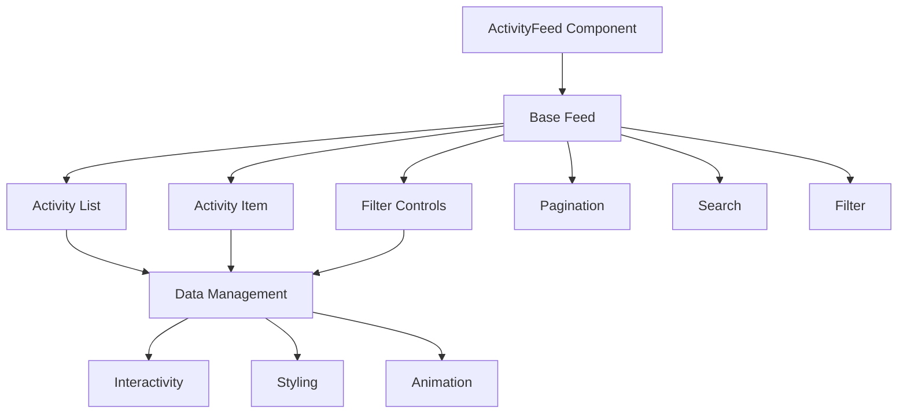
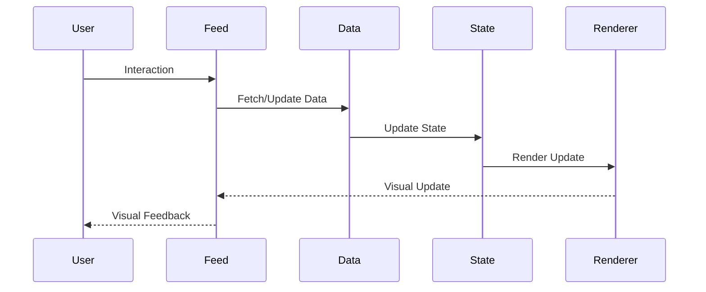
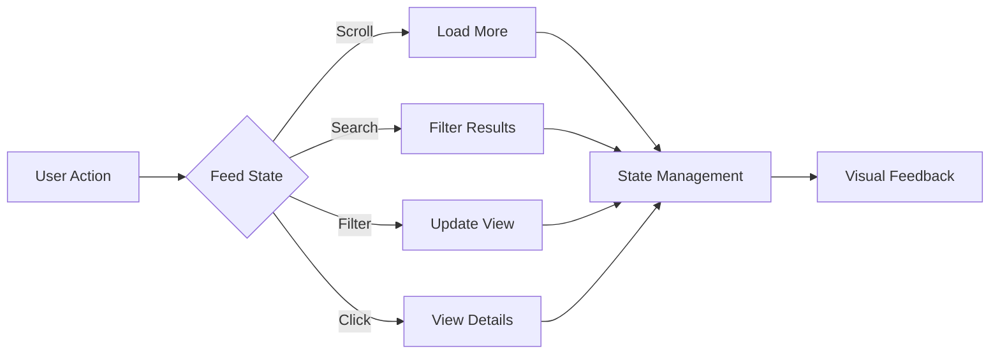

# ActivityFeed Component

## Overview
The ActivityFeed component is a dynamic feed that displays recent activities and updates in the application. It supports real-time updates, infinite scrolling, and comprehensive filtering options while maintaining consistent styling and behavior across the application.

## Screenshots

*Main view showing activity feed with different activity types*


*Different states: loading, error, empty, and data view*


*Filtering options and activity categories*


*Interactive features: infinite scroll, activity details, and actions*

## Component Architecture


## Data Flow


## Features
- Real-time updates
- Infinite scrolling
- Activity filtering
- Search functionality
- Activity categories
- Rich media support
- Interactive actions
- Custom themes
- Responsive design
- Animation support
- Activity grouping
- Time-based sorting
- Export functionality
- Accessibility support
- Dark mode support
- RTL support
- Performance optimized
- TypeScript support

## Props
| Name | Type | Required | Default | Description |
|------|------|----------|---------|-------------|
| activities | Activity[] | Yes | undefined | Activity data array |
| loading | boolean | No | false | Loading state |
| error | string | No | undefined | Error message |
| onLoadMore | () => void | No | undefined | Load more handler |
| filters | Filter[] | No | [] | Available filters |
| searchQuery | string | No | '' | Search query |
| groupBy | 'date' \| 'type' | No | 'date' | Grouping strategy |
| pageSize | number | No | 20 | Items per page |
| showFilters | boolean | No | true | Show filter controls |
| showSearch | boolean | No | true | Show search input |
| className | string | No | undefined | Additional CSS classes |
| ariaLabel | string | No | undefined | ARIA label |
| testId | string | No | undefined | Test ID |

## Usage
```tsx
import { ActivityFeed } from '@/components/dashboard/ActivityFeed';

// Basic usage
<ActivityFeed
  activities={[
    {
      id: '1',
      type: 'content_created',
      title: 'New Blog Post',
      description: 'Created new blog post',
      timestamp: '2025-03-15T10:00:00Z',
      user: {
        name: 'John Doe',
        avatar: '/avatars/john.jpg'
      }
    }
  ]}
  ariaLabel="Recent activities feed"
/>

// Advanced usage
<ActivityFeed
  activities={complexActivities}
  filters={[
    { id: 'content', label: 'Content' },
    { id: 'comments', label: 'Comments' },
    { id: 'system', label: 'System' }
  ]}
  groupBy="type"
  pageSize={30}
  showFilters={true}
  showSearch={true}
  onLoadMore={handleLoadMore}
  ariaLabel="Advanced activity feed"
/>
```

## User Interaction Workflow


## Components

### Base Feed
- Handles core feed functionality
- Manages data rendering
- Implements interactivity
- Handles animations
- Manages state

### Activity List
- Renders activity items
- Manages infinite scroll
- Handles grouping
- Implements sorting
- Manages pagination

### Activity Item
- Renders activity content
- Manages interactions
- Handles media
- Implements actions
- Manages state

### Filter Controls
- Renders filter options
- Manages search
- Handles filtering
- Implements sorting
- Manages state

## Data Models
```typescript
interface Activity {
  id: string;
  type: ActivityType;
  title: string;
  description: string;
  timestamp: string;
  user: {
    name: string;
    avatar: string;
  };
  metadata?: Record<string, any>;
}

interface Filter {
  id: string;
  label: string;
  type: 'checkbox' | 'radio';
  options?: FilterOption[];
}

interface FilterOption {
  value: string;
  label: string;
  count?: number;
}

interface ActivityState {
  isLoading: boolean;
  hasMore: boolean;
  error?: string;
  filters: string[];
  searchQuery: string;
  selectedActivity?: Activity;
}

interface ActivityEvent {
  type: 'load' | 'filter' | 'search' | 'click';
  timestamp: number;
  data?: Activity;
  filters?: string[];
  query?: string;
}
```

## Styling
- Uses Tailwind CSS for styling
- Follows design system color tokens
- Implements consistent spacing
- Supports dark mode
- Maintains accessibility contrast ratios
- Uses CSS variables for theming
- Implements responsive design
- Supports custom animations
- Uses CSS Grid for layout
- Implements proper transitions

## Accessibility
- ARIA labels for screen readers
- Keyboard navigation support
- Focus management
- Color contrast compliance
- State announcements
- RTL support
- Screen reader announcements
- Focus visible states
- Proper role attributes
- Keyboard event handling
- Error message association
- Activity announcements

## Error Handling
- Data validation
- Error state management
- Error message display
- Recovery strategies
- User feedback
- Data fallbacks
- Validation rules
- Error boundaries
- Error logging
- Recovery options

## Performance Optimizations
- Data memoization
- Render optimization
- Virtual scrolling
- Event debouncing
- State batching
- Code splitting
- Bundle optimization
- Memory management
- Animation optimization
- Activity optimization

## Dependencies
- React
- TypeScript
- Tailwind CSS
- React Virtualized
- @testing-library/react
- @testing-library/jest-dom
- @testing-library/user-event

## Related Components
- [DashboardOverview](./DashboardOverview.md)
- [AnalyticsChart](./AnalyticsChart.md)
- [Filter](../ui/Filter.md)
- [Search](../ui/Search.md)
- [Pagination](../navigation/Pagination.md)

## Examples

### Basic Example
```tsx
import { ActivityFeed } from '@/components/dashboard/ActivityFeed';

export function BasicExample() {
  const activities = [
    {
      id: '1',
      type: 'content_created',
      title: 'New Blog Post',
      description: 'Created new blog post',
      timestamp: '2025-03-15T10:00:00Z',
      user: {
        name: 'John Doe',
        avatar: '/avatars/john.jpg'
      }
    }
  ];

  return (
    <ActivityFeed
      activities={activities}
      ariaLabel="Recent activities feed"
    />
  );
}
```

### Advanced Example
```tsx
import { ActivityFeed } from '@/components/dashboard/ActivityFeed';
import { useCallback, useState } from 'react';

export function AdvancedExample() {
  const [activities, setActivities] = useState<Activity[]>([]);
  const [loading, setLoading] = useState(false);
  const [error, setError] = useState<string>('');

  const handleLoadMore = useCallback(async () => {
    setLoading(true);
    try {
      const newActivities = await fetchMoreActivities();
      setActivities(prev => [...prev, ...newActivities]);
    } catch (err) {
      setError('Failed to load more activities');
    } finally {
      setLoading(false);
    }
  }, []);

  return (
    <ActivityFeed
      activities={activities}
      loading={loading}
      error={error}
      filters={[
        { id: 'content', label: 'Content' },
        { id: 'comments', label: 'Comments' },
        { id: 'system', label: 'System' }
      ]}
      groupBy="type"
      pageSize={30}
      showFilters={true}
      showSearch={true}
      onLoadMore={handleLoadMore}
      ariaLabel="Advanced activity feed"
    />
  );
}
```

## Best Practices

### Usage Guidelines
1. Implement proper loading states
2. Handle errors gracefully
3. Use appropriate filters
4. Implement infinite scroll
5. Follow accessibility guidelines
6. Optimize for performance
7. Use TypeScript for type safety
8. Add proper test IDs
9. Handle edge cases
10. Implement proper search

### Performance Tips
1. Implement virtual scrolling
2. Use proper state management
3. Optimize re-renders
4. Implement proper loading
5. Use proper error boundaries
6. Optimize bundle size
7. Use proper code splitting
8. Implement proper caching
9. Use proper lazy loading
10. Monitor performance metrics

### Security Considerations
1. Validate input data
2. Prevent XSS attacks
3. Handle sensitive data
4. Implement proper authentication
5. Use proper authorization
6. Handle errors securely
7. Implement proper logging
8. Use proper encryption
9. Follow security best practices
10. Regular security audits

## Troubleshooting

### Common Issues
| Issue | Solution |
|-------|----------|
| Infinite scroll not working | Check onLoadMore handler and data loading |
| Filter not applying | Verify filter configuration and state |
| Performance issues | Implement virtual scrolling and optimize renders |
| Accessibility issues | Verify ARIA labels and keyboard navigation |
| Styling issues | Check Tailwind classes and theme |

### Error Messages
| Error Code | Description | Resolution |
|------------|-------------|------------|
| ERR001 | Invalid data | Check activity format |
| ERR002 | Load failed | Check data fetching |
| ERR003 | Filter error | Verify filter configuration |
| ERR004 | Search error | Check search implementation |
| ERR005 | Event error | Check event handlers |

## Contributing

### Development Setup
1. Clone the repository
2. Install dependencies
3. Run development server
4. Make changes
5. Run tests
6. Submit PR

### Testing
```typescript
import { render, screen, fireEvent } from '@testing-library/react';
import { ActivityFeed } from './ActivityFeed';

describe('ActivityFeed', () => {
  it('renders correctly', () => {
    const activities = [
      {
        id: '1',
        type: 'content_created',
        title: 'Test Activity',
        description: 'Test Description',
        timestamp: '2025-03-15T10:00:00Z',
        user: {
          name: 'Test User',
          avatar: '/test.jpg'
        }
      }
    ];
    render(<ActivityFeed activities={activities} />);
    expect(screen.getByText('Test Activity')).toBeInTheDocument();
  });

  it('handles load more', () => {
    const handleLoadMore = jest.fn();
    render(
      <ActivityFeed
        activities={[]}
        onLoadMore={handleLoadMore}
      />
    );
    fireEvent.scroll(window);
    expect(handleLoadMore).toHaveBeenCalled();
  });
});
```

### Code Style
- Follow TypeScript best practices
- Use ESLint rules
- Follow Prettier configuration
- Write meaningful comments
- Use proper naming conventions
- Follow component patterns
- Use proper documentation
- Follow testing practices
- Use proper error handling
- Follow security guidelines

## Changelog

### Version 1.0.0
- Initial release
- Basic feed functionality
- Activity filtering
- Infinite scroll
- Accessibility support

### Version 1.1.0
- Added real-time updates
- Improved performance
- Enhanced accessibility
- Added dark mode
- Added RTL support

## Appendix

### Glossary
- **Activity**: Individual feed item
- **Filter**: Data filtering control
- **Infinite Scroll**: Continuous loading
- **Virtual Scroll**: Performance optimization
- **Grouping**: Activity organization

### FAQ
#### How do I implement infinite scroll?
Use the onLoadMore prop with proper state management.

#### How do I add custom filters?
Use the filters prop to provide custom filter configurations.

#### How do I make the feed accessible?
Include proper ARIA labels and ensure keyboard navigation works. 