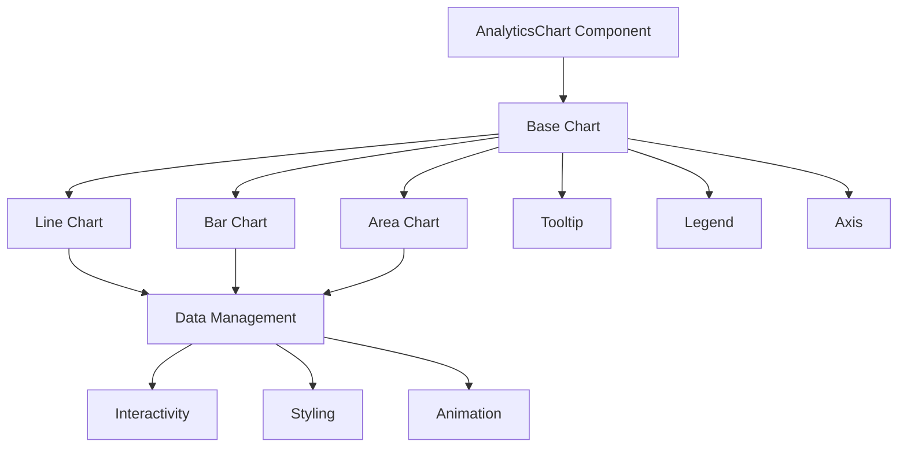
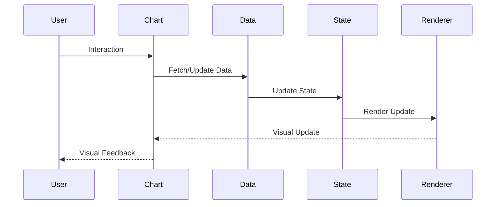
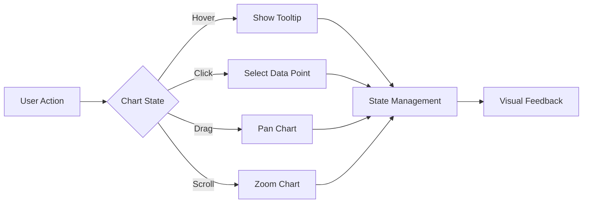

# AnalyticsChart Component

## Overview
The AnalyticsChart component is a powerful data visualization tool that provides interactive charts for displaying analytics data. It supports multiple chart types, real-time updates, and comprehensive customization options while maintaining consistent styling and behavior across the application.

## Screenshots

*Main view showing different chart types and configurations*


*Different states: loading, error, empty, and data view*


*Interactive features: tooltips, zoom, and data point selection*


*Customization options: themes, colors, and layouts*

## Component Architecture


## Data Flow


## Features
- Multiple chart types (Line, Bar, Area)
- Real-time data updates
- Interactive tooltips
- Zoom and pan support
- Custom themes
- Responsive design
- Animation support
- Data point selection
- Legend customization
- Axis configuration
- Grid customization
- Export functionality
- Accessibility support
- Dark mode support
- RTL support
- Performance optimized
- TypeScript support

## Props
| Name | Type | Required | Default | Description |
|------|------|----------|---------|-------------|
| data | ChartData[] | Yes | undefined | Chart data array |
| type | 'line' \| 'bar' \| 'area' | No | 'line' | Chart type |
| height | number | No | 400 | Chart height |
| width | number | No | '100%' | Chart width |
| theme | ChartTheme | No | 'light' | Chart theme |
| colors | string[] | No | undefined | Custom colors |
| showLegend | boolean | No | true | Show legend |
| showTooltip | boolean | No | true | Show tooltip |
| showGrid | boolean | No | true | Show grid |
| animation | boolean | No | true | Enable animation |
| loading | boolean | No | false | Loading state |
| error | string | No | undefined | Error message |
| className | string | No | undefined | Additional CSS classes |
| ariaLabel | string | No | undefined | ARIA label |
| testId | string | No | undefined | Test ID |

## Usage
```tsx
import { AnalyticsChart } from '@/components/dashboard/AnalyticsChart';

// Basic usage
<AnalyticsChart
  data={[
    { date: '2025-01', value: 100 },
    { date: '2025-02', value: 200 },
    { date: '2025-03', value: 150 }
  ]}
  type="line"
  ariaLabel="Monthly analytics chart"
/>

// Advanced usage
<AnalyticsChart
  data={complexData}
  type="bar"
  theme="dark"
  colors={['#3B82F6', '#10B981', '#8B5CF6']}
  showLegend={true}
  showTooltip={true}
  showGrid={true}
  animation={true}
  height={500}
  ariaLabel="Advanced analytics visualization"
/>
```

## User Interaction Workflow


## Components

### Base Chart
- Handles core chart functionality
- Manages data rendering
- Implements interactivity
- Handles animations
- Manages state

### Chart Types
- Line Chart
  - Continuous data visualization
  - Trend analysis
  - Time series data
- Bar Chart
  - Categorical data
  - Comparison analysis
  - Distribution data
- Area Chart
  - Cumulative data
  - Volume analysis
  - Range visualization

### Interactive Elements
- Tooltip
  - Data point details
  - Custom formatting
  - Position management
- Legend
  - Series toggle
  - Custom styling
  - Position options
- Axis
  - Scale configuration
  - Label formatting
  - Grid customization

## Data Models
```typescript
interface ChartData {
  date: string;
  value: number;
  category?: string;
  metadata?: Record<string, any>;
}

interface ChartTheme {
  mode: 'light' | 'dark';
  colors: string[];
  font: string;
  grid: {
    color: string;
    opacity: number;
  };
  tooltip: {
    background: string;
    text: string;
  };
}

interface ChartState {
  isHovered: boolean;
  isDragging: boolean;
  isZoomed: boolean;
  selectedPoint?: ChartData;
  error?: string;
  loading: boolean;
}

interface ChartEvent {
  type: 'hover' | 'click' | 'drag' | 'zoom';
  timestamp: number;
  data?: ChartData;
  coordinates?: {
    x: number;
    y: number;
  };
}
```

## Styling
- Uses Tailwind CSS for styling
- Follows design system color tokens
- Implements consistent spacing
- Supports dark mode
- Maintains accessibility contrast ratios
- Uses CSS variables for theming
- Implements responsive design
- Supports custom animations
- Uses CSS Grid for layout
- Implements proper transitions

## Accessibility
- ARIA labels for screen readers
- Keyboard navigation support
- Focus management
- Color contrast compliance
- State announcements
- RTL support
- Screen reader announcements
- Focus visible states
- Proper role attributes
- Keyboard event handling
- Error message association
- Data point announcements

## Error Handling
- Data validation
- Error state management
- Error message display
- Recovery strategies
- User feedback
- Data fallbacks
- Validation rules
- Error boundaries
- Error logging
- Recovery options

## Performance Optimizations
- Data memoization
- Render optimization
- Canvas optimization
- Event debouncing
- State batching
- Code splitting
- Bundle optimization
- Memory management
- Animation optimization
- Data point optimization

## Dependencies
- React
- TypeScript
- Tailwind CSS
- Chart.js
- React-Chartjs-2
- @testing-library/react
- @testing-library/jest-dom
- @testing-library/user-event

## Related Components
- [DashboardOverview](./DashboardOverview.md)
- [MetricsCard](../analytics/MetricsCard.md)
- [DataTable](../analytics/DataTable.md)
- [Tooltip](../ui/Tooltip.md)
- [Legend](../ui/Legend.md)

## Examples

### Basic Example
```tsx
import { AnalyticsChart } from '@/components/dashboard/AnalyticsChart';

export function BasicExample() {
  const data = [
    { date: '2025-01', value: 100 },
    { date: '2025-02', value: 200 },
    { date: '2025-03', value: 150 }
  ];

  return (
    <AnalyticsChart
      data={data}
      type="line"
      ariaLabel="Basic analytics chart"
    />
  );
}
```

### Advanced Example
```tsx
import { AnalyticsChart } from '@/components/dashboard/AnalyticsChart';
import { useCallback, useState } from 'react';

export function AdvancedExample() {
  const [selectedPoint, setSelectedPoint] = useState<ChartData | undefined>();
  const [error, setError] = useState<string>('');

  const handleDataPointClick = useCallback((data: ChartData) => {
    setSelectedPoint(data);
    // Additional logic for data point selection
  }, []);

  const handleError = useCallback((error: string) => {
    setError(error);
    // Additional error handling logic
  }, []);

  return (
    <AnalyticsChart
      data={complexData}
      type="bar"
      theme="dark"
      colors={['#3B82F6', '#10B981', '#8B5CF6']}
      showLegend={true}
      showTooltip={true}
      showGrid={true}
      animation={true}
      height={500}
      onDataPointClick={handleDataPointClick}
      onError={handleError}
      error={error}
      ariaLabel="Advanced analytics visualization"
    />
  );
}
```

## Best Practices

### Usage Guidelines
1. Choose appropriate chart type
2. Provide meaningful data
3. Include proper labels
4. Handle errors gracefully
5. Implement proper loading states
6. Follow accessibility guidelines
7. Optimize for performance
8. Use TypeScript for type safety
9. Add proper test IDs
10. Handle edge cases

### Performance Tips
1. Memoize data transformations
2. Use proper state management
3. Optimize re-renders
4. Implement proper loading
5. Use proper error boundaries
6. Optimize bundle size
7. Use proper code splitting
8. Implement proper caching
9. Use proper lazy loading
10. Monitor performance metrics

### Security Considerations
1. Validate input data
2. Prevent XSS attacks
3. Handle sensitive data
4. Implement proper authentication
5. Use proper authorization
6. Handle errors securely
7. Implement proper logging
8. Use proper encryption
9. Follow security best practices
10. Regular security audits

## Troubleshooting

### Common Issues
| Issue | Solution |
|-------|----------|
| Chart not rendering | Check data format and chart type |
| Performance issues | Optimize data and reduce updates |
| Accessibility issues | Verify ARIA labels and keyboard navigation |
| Styling issues | Check Tailwind classes and theme |
| Data issues | Validate data format and structure |

### Error Messages
| Error Code | Description | Resolution |
|------------|-------------|------------|
| ERR001 | Invalid data | Check data format |
| ERR002 | Render failed | Check chart configuration |
| ERR003 | Theme error | Verify theme settings |
| ERR004 | Data error | Validate data structure |
| ERR005 | Event error | Check event handlers |

## Contributing

### Development Setup
1. Clone the repository
2. Install dependencies
3. Run development server
4. Make changes
5. Run tests
6. Submit PR

### Testing
```typescript
import { render, screen, fireEvent } from '@testing-library/react';
import { AnalyticsChart } from './AnalyticsChart';

describe('AnalyticsChart', () => {
  it('renders correctly', () => {
    const data = [
      { date: '2025-01', value: 100 }
    ];
    render(<AnalyticsChart data={data} />);
    expect(screen.getByRole('img')).toBeInTheDocument();
  });

  it('handles data point click', () => {
    const handleClick = jest.fn();
    const data = [
      { date: '2025-01', value: 100 }
    ];
    render(
      <AnalyticsChart
        data={data}
        onDataPointClick={handleClick}
      />
    );
    fireEvent.click(screen.getByRole('img'));
    expect(handleClick).toHaveBeenCalled();
  });
});
```

### Code Style
- Follow TypeScript best practices
- Use ESLint rules
- Follow Prettier configuration
- Write meaningful comments
- Use proper naming conventions
- Follow component patterns
- Use proper documentation
- Follow testing practices
- Use proper error handling
- Follow security guidelines

## Changelog

### Version 1.0.0
- Initial release
- Basic chart functionality
- Multiple chart types
- Interactive features
- Accessibility support

### Version 1.1.0
- Added real-time updates
- Improved performance
- Enhanced accessibility
- Added dark mode
- Added RTL support

## Appendix

### Glossary
- **Chart**: Data visualization component
- **Data Point**: Individual value in the chart
- **Tooltip**: Information popup on hover
- **Legend**: Chart element guide
- **Axis**: Chart measurement lines

### FAQ
#### How do I update chart data in real-time?
Use the data prop with state management to update the chart.

#### How do I customize chart colors?
Use the colors prop to provide custom color arrays.

#### How do I make the chart accessible?
Include proper ARIA labels and ensure keyboard navigation works. 