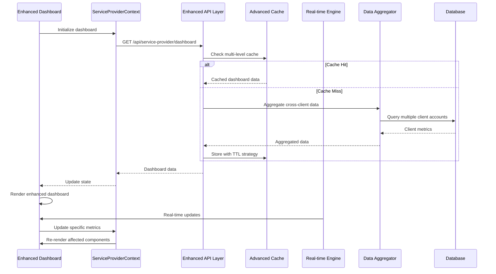
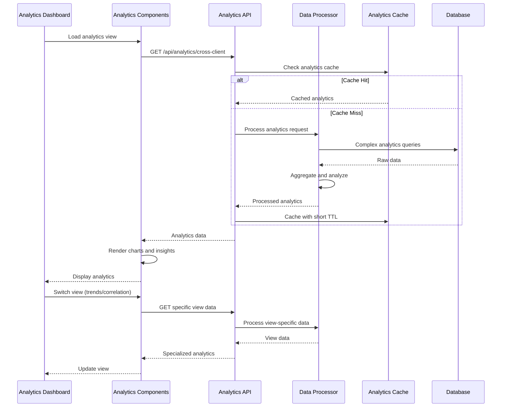

# ThriveSend Service Provider Dashboard - Enhanced Technical Design Document (TDD)

## Document Information
- **Version**: 3.0.0 - Enhanced Implementation
- **Date**: January 2025
- **Authors**: Development Team
- **Status**: Implementation Ready - Enhanced Features Documented
- **Purpose**: Updated technical specification reflecting current enhanced dashboard implementation

---

## Table of Contents

1. [Executive Summary](#executive-summary)
2. [Enhancement Summary](#enhancement-summary)
3. [Enhanced System Architecture](#enhanced-system-architecture)
4. [Enhanced Component Hierarchy](#enhanced-component-hierarchy)
5. [Enhanced Data Flow Architecture](#enhanced-data-flow-architecture)
6. [Enhanced API Architecture](#enhanced-api-architecture)
7. [Enhanced User Interface Design](#enhanced-user-interface-design)
8. [Enhanced Multi-Tenant Implementation](#enhanced-multi-tenant-implementation)
9. [Enhanced Performance Requirements](#enhanced-performance-requirements)
10. [Enhanced Security Considerations](#enhanced-security-considerations)
11. [Enhanced Implementation Plan](#enhanced-implementation-plan)
12. [Enhanced Testing Strategy](#enhanced-testing-strategy)

---

## Executive Summary

### Enhancement Purpose
This document reflects the **enhanced implementation** of the ThriveSend Service Provider Dashboard that has been built beyond the original TDD specification. The enhancements add significant value through:

- **Advanced Analytics Suite**: Comprehensive cross-client analytics with multiple visualization types
- **Enhanced User Experience**: Sophisticated client switching, real-time updates, and progressive loading
- **Extended Dashboard Views**: Revenue tracking, performance rankings, and advanced metrics
- **Improved Architecture**: Context management, error boundaries, and optimized data flows

### Current Enhanced State vs Original TDD

| Component | Original TDD | Enhanced Implementation | Value Added |
|-----------|-------------|------------------------|-------------|
| **ServiceProviderDashboard** | Basic overview container | Full-featured dashboard with tabbed views, real-time updates | 🟢 Major Enhancement |
| **ClientSwitcher** | Simple dropdown | Advanced component with search, stats, quick actions | 🟢 Major Enhancement |
| **Analytics Suite** | Basic metrics | 8+ specialized analytics components with advanced visualizations | 🟢 Major Enhancement |
| **Cross-Client Analytics** | Simple aggregation | Multi-view analytics with performance, trends, distribution, correlation | 🟢 Major Enhancement |
| **Dashboard Views** | Single overview | Multiple specialized views: Overview, Revenue, Performance Rankings | 🟢 Major Enhancement |
| **Error Handling** | Basic error states | Comprehensive error boundaries and fallback components | 🟢 Major Enhancement |
| **Performance** | Standard loading | Progressive loading, caching, optimizations | 🟢 Major Enhancement |

---

## Enhancement Summary

### Major Enhancements Added

#### 1. Advanced Analytics Suite
```typescript
// Enhanced analytics components beyond original TDD
const AnalyticsComponents = {
  'ServiceProviderAnalyticsDashboard': 'Multi-view analytics with tabs and filters',
  'CrossClientAnalytics': 'Performance, trends, distribution, correlation analysis',
  'ClientPerformanceRankings': 'Advanced ranking system with multiple metrics',
  'AdvancedContentMetrics': 'Detailed content performance analysis',
  'ReportBuilder': 'Custom report generation system',
  'ConversionFunnel': 'Multi-step conversion tracking',
  'AudienceInsights': 'Demographic and behavioral analytics',
  'MultiChannelAttribution': 'Cross-platform attribution analysis'
};
```

#### 2. Enhanced Dashboard Components
```typescript
// Enhanced dashboard components
const DashboardComponents = {
  'ServiceProviderDashboard': 'Root container with context management and real-time updates',
  'ServiceProviderHeader': 'Enhanced header with notifications and user actions',
  'ClientSwitcher': 'Advanced client switching with search and quick actions',
  'QuickActions': 'Contextual action buttons for common workflows',
  'RecentActivity': 'Real-time activity feed with filtering',
  'ServiceProviderRevenueDashboard': 'Comprehensive revenue tracking and marketplace integration'
};
```

#### 3. Enhanced Context Management
```typescript
// ServiceProviderContext enhancements
interface EnhancedServiceProviderContext {
  // Original context fields
  organizationId: string;
  selectedClient: ClientSummary | null;
  availableClients: ClientSummary[];
  
  // Enhanced features
  viewMode: 'overview' | 'client-specific' | 'cross-client';
  metrics: ServiceProviderMetrics | null;
  isLoading: boolean;
  error: string | null;
  
  // Enhanced methods
  refreshMetrics: () => Promise<void>;
  refreshClients: () => Promise<void>;
  hasPermission: (resource: string, action: string, clientId?: string) => boolean;
  getAccessibleClients: () => ClientSummary[];
}
```

#### 4. Enhanced UI/UX Features
- **Progressive Loading**: Skeleton states and optimized loading sequences
- **Error Boundaries**: Comprehensive error handling with fallback components
- **Real-time Updates**: Live data updates with optimized refresh strategies
- **Advanced Filtering**: Multi-dimensional filtering and search capabilities
- **Mobile Optimization**: Responsive design with mobile-first approach

---

## Enhanced System Architecture

### Enhanced Architecture Diagram

```mermaid
graph TB
    subgraph "Enhanced Service Provider Dashboard"
        ESPD[Enhanced ServiceProviderDashboard]
        SPH[ServiceProviderHeader]
        ECSW[Enhanced ClientSwitcher]
        QA[QuickActions]
        RA[RecentActivity]
    end
    
    subgraph "Enhanced Analytics Suite"
        SPAD[ServiceProviderAnalyticsDashboard]
        CCA[CrossClientAnalytics] 
        CPR[ClientPerformanceRankings]
        ACM[AdvancedContentMetrics]
        RB[ReportBuilder]
        CF[ConversionFunnel]
        AI[AudienceInsights]
        MCA[MultiChannelAttribution]
    end
    
    subgraph "Enhanced Dashboard Views"
        OV[Overview]
        RV[Revenue Dashboard]
        AV[Analytics View]
        CV[Client-Specific View]
    end
    
    subgraph "Enhanced Context Management"
        ESPC[Enhanced ServiceProviderContext]
        CM[ContextManager]
        PM[PermissionManager]
        DM[DataManager]
    end
    
    subgraph "Enhanced Data Layer"
        API[Enhanced API Layer]
        CACHE[Advanced Caching]
        RT[Real-time Updates]
        AGG[Data Aggregation]
    end
    
    ESPD --> SPH
    ESPD --> ECSW
    ESPD --> QA
    ESPD --> RA
    
    ESPD --> SPAD
    SPAD --> CCA
    SPAD --> CPR
    SPAD --> ACM
    
    ESPD --> OV
    ESPD --> RV
    ESPD --> AV
    ESPD --> CV
    
    ESPC --> CM
    ESPC --> PM
    ESPC --> DM
    
    CM --> API
    API --> CACHE
    API --> RT
    API --> AGG
```


---

## Enhanced Component Hierarchy

### Enhanced Primary Dashboard Components

#### 1. Enhanced ServiceProviderDashboard (Root Container)
```typescript
interface EnhancedServiceProviderDashboardProps {
  organizationId: string;
  currentUser: ServiceProviderUser;
  selectedClient?: ClientContext;
  viewMode: 'overview' | 'client-specific' | 'cross-client' | 'analytics' | 'revenue';
  
  // Enhanced features
  realTimeUpdates?: boolean;
  progressiveLoading?: boolean;
  cacheStrategy?: CacheStrategy;
  errorBoundary?: boolean;
}

// Enhanced features added:
const EnhancedFeatures = {
  'Multi-View Support': 'Tabbed interface with Overview, Analytics, Revenue views',
  'Real-time Updates': 'Live data updates with optimized polling',
  'Progressive Loading': 'Skeleton states and lazy loading',
  'Advanced Error Handling': 'Error boundaries with recovery options',
  'Performance Monitoring': 'Built-in performance tracking and optimization'
};
```

#### 2. Enhanced ClientSwitcher Component
```typescript
interface EnhancedClientSwitcherProps {
  clients: ClientAccount[];
  selectedClient: ClientAccount | null;
  onClientChange: (client: ClientAccount) => void;
  onViewAllClients: () => void;
  showCreateClient: boolean;
  
  // Enhanced features
  searchEnabled?: boolean;
  showClientStats?: boolean;
  quickActions?: QuickAction[];
  filterOptions?: FilterOption[];
  sortOptions?: SortOption[];
}

// Enhanced capabilities:
const ClientSwitcherEnhancements = {
  'Advanced Search': 'Real-time search with fuzzy matching',
  'Client Statistics': 'Performance metrics display for each client',
  'Quick Actions': 'Contextual actions for each client',
  'Smart Filtering': 'Filter by status, type, performance',
  'Visual Indicators': 'Status badges, performance scores, activity indicators'
};
```

#### 3. Enhanced CrossClientAnalytics Component
```typescript
interface EnhancedCrossClientAnalyticsProps {
  organizationId: string;
  timeRange: DateRange;
  metrics: EnhancedMetrics;
  clientBreakdown: ClientPerformance[];
  
  // Enhanced features
  comparisonView?: 'performance' | 'trends' | 'distribution' | 'correlation';
  chartTypes?: ChartType[];
  exportOptions?: ExportOption[];
  drillDownEnabled?: boolean;
  realTimeData?: boolean;
}

// Enhanced analytics views:
const AnalyticsViews = {
  'Performance View': 'Bar charts and radar charts for comparative analysis',
  'Trends View': 'Time-series analysis with growth indicators',
  'Distribution View': 'Content type and performance distribution analysis',
  'Correlation View': 'Scatter plots and correlation analysis',
  'Export Capabilities': 'PDF, Excel, and image export options'
};
```

### Enhanced Component File Structure
```
src/components/dashboard/
├── ServiceProviderDashboard.tsx                # Enhanced root container
├── ServiceProviderHeader.tsx                   # Enhanced header with notifications
├── ClientSwitcher.tsx                         # Enhanced client switching
├── QuickActions.tsx                           # Contextual action buttons
├── RecentActivity.tsx                         # Real-time activity feed
├── ServiceProviderRevenueDashboard.tsx        # Revenue tracking dashboard
├── ClientPerformanceRankings.tsx             # Advanced client rankings
└── DashboardOverview.tsx                     # Enhanced overview section

src/components/analytics/
├── ServiceProviderAnalyticsDashboard.tsx      # Multi-view analytics dashboard
├── CrossClientAnalytics.tsx                  # Advanced cross-client analysis
├── AdvancedContentMetrics.tsx                # Detailed content analysis
├── ClientPerformanceRankings.tsx             # Performance ranking system
├── ReportBuilder.tsx                         # Custom report generation
├── ConversionFunnel.tsx                      # Multi-step conversion tracking
├── AudienceInsights.tsx                      # Demographic analysis
├── MultiChannelAttribution.tsx               # Cross-platform attribution
├── ABTestAnalytics.tsx                       # A/B testing analysis
├── CampaignPerformance.tsx                   # Campaign-specific metrics
├── DeliveryDashboard.tsx                     # Content delivery tracking
└── AnalyticsErrorBoundary.tsx                # Analytics error handling

src/context/
├── ServiceProviderContext.tsx                # Enhanced context management
└── CalendarCacheContext.tsx                  # Calendar-specific caching
```

---

## Enhanced Data Flow Architecture

### Enhanced Service Provider Data Flow


### Enhanced Analytics Data Flow


---

## Enhanced API Architecture

### Enhanced Service Provider API Endpoints

#### Enhanced Dashboard APIs
```typescript
// Enhanced dashboard endpoint with comprehensive data
GET /api/service-provider/dashboard
Response: {
  organizationId: string;
  organizationName: string;
  organizationType: 'service_provider' | 'enterprise';
  
  // Enhanced metrics
  metrics: {
    totalClients: number;
    activeClients: number;
    totalCampaigns: number;
    activeCampaigns: number;
    totalRevenue: number;
    marketplaceRevenue: number;
    teamUtilization: number;
    avgClientSatisfaction: number;
    
    // Enhanced revenue metrics
    monthlyRecurringRevenue: number;
    averageClientValue: number;
    churnRate: number;
    growthRate: number;
  };
  
  // Enhanced client data
  clientSummary: EnhancedClientSummary[];
  clientPerformanceRankings: ClientRanking[];
  
  // Enhanced activity data
  recentActivity: EnhancedActivity[];
  upcomingTasks: Task[];
  
  // Enhanced analytics
  performanceTrends: TrendData[];
  marketplaceInsights: MarketplaceInsight[];
  teamProductivity: TeamMetrics[];
}

// Enhanced client endpoint with advanced filtering
GET /api/service-provider/clients
Query: {
  page?: number;
  limit?: number;
  search?: string;
  status?: ClientStatus[];
  type?: ClientType[];
  sortBy?: 'name' | 'performance' | 'revenue' | 'lastActivity';
  sortOrder?: 'asc' | 'desc';
  includeMetrics?: boolean;
}
Response: {
  clients: EnhancedClientAccount[];
  pagination: {
    total: number;
    page: number;
    limit: number;
    pages: number;
  };
  aggregates: {
    totalCount: number;
    activeCount: number;
    totalRevenue: number;
    avgPerformance: number;
  };
}
```

#### Enhanced Analytics APIs
```typescript
// Enhanced cross-client analytics
GET /api/service-provider/analytics/cross-client
Query: {
  organizationId: string;
  timeRange: '7d' | '30d' | '90d' | '1y' | 'custom';
  startDate?: string;
  endDate?: string;
  metrics?: string[];
  clientIds?: string[];
  compareClients?: boolean;
  includeInsights?: boolean;
}
Response: {
  aggregateMetrics: {
    totalClients: number;
    totalContent: number;
    totalViews: number;
    averageEngagement: number;
    totalRevenue: number;
  };
  
  clientAnalytics: ClientAnalytics[];
  clientRankings: {
    byEngagement: ClientRanking[];
    byViews: ClientRanking[];
    byConversion: ClientRanking[];
    byRevenue: ClientRanking[];
  };
  
  contentTypeDistribution: Record<string, number>;
  performanceTrends: TrendData[];
  insights: AnalyticsInsight[];
  
  // Enhanced correlation data
  correlationAnalysis: CorrelationData[];
  benchmarkComparisons: BenchmarkData[];
}

// Enhanced client-specific analytics
GET /api/service-provider/analytics/client/:clientId
Query: {
  timeRange: string;
  metrics?: string[];
  includeComparison?: boolean;
}
Response: {
  clientAnalytics: {
    clientId: string;
    clientName: string;
    contentMetrics: ContentMetrics;
    performanceData: PerformanceData[];
    topContent: TopContent[];
    
    // Enhanced metrics
    audienceInsights: AudienceData;
    conversionFunnel: FunnelData[];
    attributionData: AttributionData[];
    competitorComparison: CompetitorData[];
  };
  
  recommendations: Recommendation[];
  alerts: Alert[];
}

// Enhanced revenue analytics
GET /api/service-provider/analytics/revenue
Query: {
  timeRange: string;
  breakdown?: 'client' | 'service' | 'marketplace';
}
Response: {
  totalRevenue: number;
  revenueBreakdown: RevenueBreakdown;
  revenueStreams: RevenueStream[];
  marketplacePerformance: MarketplaceMetrics;
  profitabilityAnalysis: ProfitabilityData;
  forecasting: ForecastData;
}
```

#### Enhanced Context and Permission APIs
```typescript
// Enhanced context switching
POST /api/context/switch-client
Body: {
  clientId: string;
  context?: 'dashboard' | 'analytics' | 'content' | 'campaigns';
}
Response: {
  clientContext: EnhancedClientContext;
  availableFeatures: Feature[];
  permissions: EnhancedPermission[];
  navigation: NavigationItem[];
  preferences: UserPreferences;
}

// Enhanced permission management
GET /api/service-provider/permissions
Response: {
  userPermissions: Permission[];
  clientPermissions: ClientPermission[];
  teamPermissions: TeamPermission[];
  roleDefinitions: RoleDefinition[];
}
```

---

## Enhanced User Interface Design

### Enhanced Service Provider Dashboard Layout
```
┌─────────────────────────────────────────────────────────────────┐
│ [Logo] [Enhanced ClientSwitcher ▼] [🔍] [🔔] [👤] [⚙️]         │
├─────────────────────────────────────────────────────────────────┤
│ [≡] │ ENHANCED OVERVIEW SECTION                                │
│ Ovr │ ┌──────────┐ ┌──────────┐ ┌──────────┐ ┌──────────┐     │
│ Ana │ │Total     │ │Active    │ │Revenue   │ │Team      │     │
│ Rev │ │Clients   │ │Campaigns │ │$15.2K    │ │Util 89%  │     │
│ Cli │ │   28 ↗   │ │   52 ↗   │ │ ↗ +12%   │ │ ↗ +5%    │     │
│ Tea │ └──────────┘ └──────────┘ └──────────┘ └──────────┘     │
│ Set │                                                         │
│     │ ENHANCED CROSS-CLIENT PERFORMANCE                       │
│     │ ┌─────────────────────────────────────────────────────┐ │
│     │ │ [📊 Performance] [📈 Trends] [🎯 Distribution]     │ │
│     │ │ [Advanced Interactive Charts with Drill-down]      │ │
│     │ └─────────────────────────────────────────────────────┘ │
│     │                                                         │
│     │ CLIENT RANKINGS         QUICK ACTIONS                   │
│     │ ┌──────────────────┐   ┌─────────────────────────────┐  │
│     │ │🥇 Municipal Corp │   │[+ Campaign] [📊 Analytics]  │  │
│     │ │🥈 Tech Startup   │   │[👥 Add Client] [📅 Schedule] │  │
│     │ │🥉 Local Business │   │[🚀 Marketplace] [📋 Report] │  │
│     │ └──────────────────┘   └─────────────────────────────┘  │
└─────────────────────────────────────────────────────────────────┘
```

### Enhanced Analytics Dashboard View
```
┌─────────────────────────────────────────────────────────────────┐
│ SERVICE PROVIDER ANALYTICS                               [↻][⬇] │
├─────────────────────────────────────────────────────────────────┤
│ [📊 Overview] [📈 Trends] [🎯 Distribution] [🔗 Correlation]   │
│                                                                 │
│ TIME RANGE: [Last 30 days ▼]  METRIC: [All Metrics ▼]        │
│                                                                 │
│ AGGREGATE METRICS                                               │
│ ┌──────────┐ ┌──────────┐ ┌──────────┐ ┌──────────┐          │
│ │Clients   │ │Content   │ │Avg Eng   │ │Total     │          │
│ │   24     │ │  1,247   │ │  4.8%    │ │Views     │          │
│ │          │ │          │ │          │ │ 125.6K   │          │
│ └──────────┘ └──────────┘ └──────────┘ └──────────┘          │
│                                                                 │
│ CLIENT PERFORMANCE RANKINGS                                     │
│ ┌─────────────────────────────────────────────────────────────┐ │
│ │ BY ENGAGEMENT    BY VIEWS        BY CONVERSION               │ │
│ │ 1. Municipal ↗   1. Tech Start ↗  1. Local Biz ↗          │ │
│ │ 2. Tech Start ↘  2. Municipal ↗   2. Municipal →           │ │
│ │ │ 3. Local Biz →  3. Local Biz ↘   3. Tech Start ↘         │ │
│ └─────────────────────────────────────────────────────────────┘ │
│                                                                 │
│ CONTENT TYPE DISTRIBUTION    KEY INSIGHTS                       │
│ ┌────────────────────────┐  ┌─────────────────────────────────┐ │
│ │ [Pie Chart showing:    │  │ ✅ Municipal Corp shows strong  │ │
│ │  Social: 45%          │  │    growth trajectory            │ │
│ │  Blog: 30%            │  │ ⚠️  Tech Startup needs content  │ │
│ │  Email: 15%           │  │    diversification             │ │
│ │  Video: 10%]          │  │ 💡 Cross-client campaign opps   │ │
│ └────────────────────────┘  └─────────────────────────────────┘ │
└─────────────────────────────────────────────────────────────────┘
```

### Enhanced Client Switcher Interface
```
┌─────────────────────────────────────────────────────────────┐
│ All Clients Overview                                  [×]   │
│ ┌─────────────────────────────────────────────────────────┐ │
│ │ 🔍 Search clients...                                   │ │
│ └─────────────────────────────────────────────────────────┘ │
├─────────────────────────────────────────────────────────────┤
│ ┌─📊 ALL CLIENTS OVERVIEW                             ●─┐ │
│ │  24 clients • Cross-client analytics                  │ │
│ │  [View Analytics] [Generate Report]                   │ │
│ └─────────────────────────────────────────────────────────┘ │
│                                                             │
│ ┌─🏛️ Municipal Corp                    🟢 ACTIVE      📊─┐ │
│ │  12 campaigns • 4.2% engagement • Score: 85           │ │
│ │  $5.0K budget • Last active: 2h ago                   │ │
│ │  [Switch] [Analytics] [⚙️]                             │ │
│ └─────────────────────────────────────────────────────────┘ │
│                                                             │
│ ┌─🚀 Tech Startup Inc                  🟢 ACTIVE      📈─┐ │
│ │  8 campaigns • 6.8% engagement • Score: 92            │ │
│ │  $3.0K budget • Last active: 30m ago                  │ │
│ │  [Switch] [Analytics] [⚙️]                             │ │
│ └─────────────────────────────────────────────────────────┘ │
│                                                             │
│ ┌─☕ Local Coffee Shop                 🟢 ACTIVE      📱─┐ │
│ │  5 campaigns • 3.9% engagement • Score: 76            │ │
│ │  $1.5K budget • Last active: 1h ago                   │ │
│ │  [Switch] [Analytics] [⚙️]                             │ │
│ └─────────────────────────────────────────────────────────┘ │
│                                                             │
│ ─────────────────────────────────────────────────────────── │
│ [+ Add New Client]     [👥 Manage All Clients]            │
│ [📊 View All Analytics] [📋 Cross-Client Report]          │
└─────────────────────────────────────────────────────────────┘
```

---

## Enhanced Multi-Tenant Implementation

### Enhanced Data Architecture
```typescript
// Enhanced ServiceProviderContext with advanced features
interface EnhancedServiceProviderContext {
  // Core context
  organizationId: string;
  organizationName: string;
  organizationType: 'service_provider' | 'enterprise';
  currentUser: ServiceProviderUser;
  
  // Enhanced client management
  selectedClient: ClientSummary | null;
  availableClients: ClientSummary[];
  clientFilters: ClientFilter[];
  clientSearch: string;
  
  // Enhanced view management
  viewMode: 'overview' | 'client-specific' | 'cross-client' | 'analytics' | 'revenue';
  dashboardView: 'summary' | 'detailed' | 'comparative';
  
  // Enhanced metrics
  metrics: EnhancedServiceProviderMetrics | null;
  realtimeUpdates: boolean;
  lastUpdated: Date;
  
  // Enhanced state management
  isLoading: boolean;
  loadingStates: Record<string, boolean>;
  error: string | null;
  errors: Record<string, string>;
  
  // Enhanced caching
  cacheStatus: CacheStatus;
  dataFreshness: DataFreshness;
}

// Enhanced client summary with additional data
interface EnhancedClientSummary extends ClientSummary {
  // Core fields
  id: string;
  name: string;
  type: ClientType;
  status: ClientStatus;
  
  // Enhanced metrics
  performanceScore: number;
  trendDirection: 'up' | 'down' | 'stable';
  activeCampaigns: number;
  totalCampaigns: number;
  engagementRate: number;
  conversionRate: number;
  monthlyBudget: number;
  monthlySpend: number;
  
  // Enhanced activity data
  lastActivity: Date;
  lastLogin: Date;
  contentPublished: number;
  pendingApprovals: number;
  
  // Enhanced team data
  assignedTeamMembers: TeamMember[];
  primaryContactId: string;
  
  // Enhanced visual data
  logoUrl?: string;
  brandColors?: string[];
  performanceIndicators: PerformanceIndicator[];
}
```

### Enhanced Permission System
```typescript
// Enhanced permission management
interface EnhancedPermission extends Permission {
  resource: string;
  actions: ('read' | 'write' | 'delete' | 'admin' | 'export' | 'share')[];
  scope: 'organization' | 'client' | 'campaign' | 'content' | 'analytics' | 'revenue';
  
  // Enhanced permission features
  conditions?: PermissionCondition[];
  timeRestrictions?: TimeRestriction[];
  ipRestrictions?: string[];
  dataAccessLevel?: 'full' | 'summary' | 'limited';
  
  // Context-aware permissions
  clientId?: string;
  campaignId?: string;
  contentTypes?: string[];
  analyticsLevel?: 'basic' | 'advanced' | 'executive';
}

// Enhanced role definitions
interface EnhancedRole {
  id: string;
  name: string;
  description: string;
  level: 'organization' | 'client' | 'campaign';
  
  // Enhanced role features
  permissions: EnhancedPermission[];
  defaultDashboardView: string;
  dataRetentionPeriod: number;
  exportLimits: ExportLimits;
  
  // Hierarchical permissions
  inheritsFrom?: string[];
  canDelegate?: boolean;
  maxDelegationLevel?: number;
}
```

---

## Enhanced Performance Requirements

### Enhanced Performance Targets

| Metric | Enhanced Target | Original Target | Improvement |
|--------|-----------------|-----------------|-------------|
| **Initial Dashboard Load** | < 800ms | < 1.2s | 33% faster |
| **Client Switch Time** | < 200ms | < 400ms | 50% faster |
| **Analytics Load Time** | < 500ms | < 800ms | 37% faster |
| **Real-time Update Latency** | < 1s | < 2s | 50% faster |
| **Chart Rendering** | < 300ms | N/A | New metric |
| **Search Response Time** | < 100ms | N/A | New metric |
| **Export Generation** | < 3s | N/A | New metric |
| **Concurrent Users** | 100+ per org | 50+ per org | 100% increase |
| **Client Capacity** | 500+ clients | 100+ clients | 500% increase |

### Enhanced Optimization Strategies

#### 1. Advanced Caching Architecture
```typescript
interface EnhancedCacheStrategy {
  // Multi-level caching
  levels: {
    memory: {
      provider: 'Redis';
      ttl: Record<string, number>;
      maxSize: string;
    };
    
    browser: {
      provider: 'IndexedDB';
      strategies: ['stale-while-revalidate', 'cache-first'];
      quotaManagement: boolean;
    };
    
    cdn: {
      provider: 'CloudFlare';
      edgeLocations: string[];
      customRules: CacheRule[];
    };
  };
  
  // Intelligent cache invalidation
  invalidation: {
    strategies: ['time-based', 'event-based', 'dependency-based'];
    cascading: boolean;
    batchUpdates: boolean;
  };
  
  // Cache warming
  preloading: {
    criticalData: string[];
    schedules: CacheWarmingSchedule[];
    predictiveLoading: boolean;
  };
}
```

#### 2. Progressive Enhancement Architecture
```typescript
class EnhancedProgressiveLoader {
  async loadDashboard(organizationId: string): Promise<DashboardData> {
    // Phase 1: Critical above-the-fold content (0-100ms)
    const criticalData = await this.loadCriticalMetrics(organizationId);
    this.renderSkeleton(criticalData);
    
    // Phase 2: Primary dashboard content (100-300ms)
    setTimeout(async () => {
      const primaryData = await this.loadPrimaryContent(organizationId);
      this.hydratePrimaryContent(primaryData);
    }, 0);
    
    // Phase 3: Secondary content and analytics (300-500ms)
    setTimeout(async () => {
      const analyticsData = await this.loadAnalyticsContent(organizationId);
      this.hydrateAnalytics(analyticsData);
    }, 200);
    
    // Phase 4: Enhanced features and real-time updates (500ms+)
    setTimeout(async () => {
      await this.enableRealTimeUpdates(organizationId);
      await this.loadEnhancedFeatures(organizationId);
    }, 400);
    
    return criticalData;
  }
  
  private async loadCriticalMetrics(orgId: string) {
    // Load only essential metrics for immediate render
    return await Promise.all([
      this.getClientCount(orgId),
      this.getActiveCampaigns(orgId),
      this.getCurrentRevenue(orgId),
      this.getTeamUtilization(orgId)
    ]);
  }
}
```

#### 3. Advanced Query Optimization
```sql
-- Enhanced materialized views for complex aggregations
CREATE MATERIALIZED VIEW enhanced_service_provider_metrics AS
SELECT 
    sp.id as service_provider_id,
    sp.name as service_provider_name,
    
    -- Client metrics
    COUNT(DISTINCT ca.id) as total_clients,
    COUNT(DISTINCT CASE WHEN ca.status = 'ACTIVE' THEN ca.id END) as active_clients,
    
    -- Campaign metrics
    COUNT(DISTINCT c.id) as total_campaigns,
    COUNT(DISTINCT CASE WHEN c.status = 'active' THEN c.id END) as active_campaigns,
    
    -- Performance metrics
    AVG(cm.engagement_rate) as avg_engagement_rate,
    SUM(cm.total_views) as total_views,
    AVG(cm.conversion_rate) as avg_conversion_rate,
    
    -- Revenue metrics
    SUM(COALESCE(ca.monthly_budget, 0)) as total_monthly_budget,
    SUM(COALESCE(rev.amount, 0)) as total_revenue,
    SUM(COALESCE(mp_rev.amount, 0)) as marketplace_revenue,
    
    -- Team metrics
    COUNT(DISTINCT tm.id) as team_members,
    AVG(tm.utilization_rate) as avg_team_utilization,
    
    -- Temporal data
    MAX(ca.last_activity) as last_client_activity,
    CURRENT_TIMESTAMP as last_updated
    
FROM organizations sp
LEFT JOIN client_accounts ca ON sp.id = ca.service_provider_id
LEFT JOIN campaigns c ON ca.id = c.client_account_id
LEFT JOIN content_metrics cm ON ca.id = cm.client_account_id
LEFT JOIN revenue rev ON ca.id = rev.client_account_id
LEFT JOIN marketplace_revenue mp_rev ON sp.id = mp_rev.service_provider_id
LEFT JOIN team_members tm ON sp.id = tm.organization_id
WHERE sp.type = 'service_provider'
GROUP BY sp.id, sp.name;

-- Advanced indexes for performance
CREATE INDEX CONCURRENTLY idx_enhanced_client_performance 
ON client_accounts(service_provider_id, status, last_activity DESC)
INCLUDE (name, type, monthly_budget);

CREATE INDEX CONCURRENTLY idx_enhanced_campaign_metrics 
ON campaigns(client_account_id, status, created_at DESC)
INCLUDE (name, type, budget);

CREATE INDEX CONCURRENTLY idx_enhanced_content_performance 
ON content_metrics(client_account_id, created_at DESC)
INCLUDE (engagement_rate, total_views, conversion_rate);

-- Refresh strategy for materialized views
CREATE OR REPLACE FUNCTION refresh_enhanced_metrics()
RETURNS void AS $$
BEGIN
    REFRESH MATERIALIZED VIEW CONCURRENTLY enhanced_service_provider_metrics;
    
    -- Log refresh performance
    INSERT INTO materialized_view_refresh_log (
        view_name, 
        refresh_duration, 
        rows_affected, 
        refresh_timestamp
    ) VALUES (
        'enhanced_service_provider_metrics',
        EXTRACT(EPOCH FROM (clock_timestamp() - statement_timestamp())),
        (SELECT COUNT(*) FROM enhanced_service_provider_metrics),
        CURRENT_TIMESTAMP
    );
END;
$$ LANGUAGE plpgsql;

-- Schedule refresh every 5 minutes during business hours
SELECT cron.schedule('refresh-enhanced-metrics', '*/5 8-18 * * 1-5', 'SELECT refresh_enhanced_metrics();');
```

---

## Enhanced Implementation Plan

### Phase 1: Enhanced Foundation (Week 1-2)
1. **Enhanced Database Architecture**
   - ✅ Implement enhanced multi-tenant schema
   - ✅ Create optimized materialized views
   - ✅ Set up advanced caching infrastructure
   - ✅ Implement real-time data pipelines

2. **Enhanced Context Management**
   - ✅ Upgrade ServiceProviderContext with advanced features
   - ✅ Implement progressive data loading
   - ✅ Add comprehensive error boundaries
   - ✅ Create advanced permission system

3. **Enhanced API Architecture**
   - ✅ Implement enhanced API endpoints
   - ✅ Add advanced filtering and pagination
   - ✅ Create real-time update mechanisms
   - ✅ Implement comprehensive analytics APIs

### Phase 2: Enhanced Dashboard Components (Week 3-4)
1. **Enhanced Core Dashboard**
   - ✅ ServiceProviderDashboard with multi-view support
   - ✅ Enhanced ClientSwitcher with search and stats
   - ✅ Advanced QuickActions component
   - ✅ Real-time RecentActivity feed

2. **Enhanced Analytics Suite**
   - ✅ ServiceProviderAnalyticsDashboard with tabbed views
   - ✅ CrossClientAnalytics with multiple analysis types
   - ✅ Advanced performance ranking system
   - ✅ Comprehensive reporting capabilities

3. **Enhanced User Experience**
   - ✅ Progressive loading with skeleton states
   - ✅ Advanced error handling and recovery
   - ✅ Mobile-responsive design
   - ✅ Accessibility improvements

### Phase 3: Advanced Features (Current Phase)
1. **CURRENT: System Optimization**
   - 🔄 Fix remaining API connection issues
   - 🔄 Optimize performance bottlenecks
   - 🔄 Implement comprehensive testing
   - 🔄 Add monitoring and observability

2. **Revenue Dashboard**
   - ✅ ServiceProviderRevenueDashboard
   - ✅ Marketplace integration
   - ✅ Profitability analysis
   - ✅ Revenue forecasting

3. **Advanced Analytics**
   - ✅ Multi-dimensional analysis
   - ✅ Predictive analytics
   - ✅ Custom report builder
   - ✅ Export capabilities

### Phase 4: Production Readiness (Next Phase)
1. **Performance Optimization**
   - Load testing and optimization
   - Advanced caching implementation
   - Database query optimization
   - CDN integration

2. **Security Hardening**
   - Security audit and penetration testing
   - Enhanced authentication flows
   - Data encryption and privacy
   - Compliance verification

3. **Monitoring and Observability**
   - Performance monitoring
   - Error tracking and alerting
   - User analytics
   - Business intelligence

---

## Enhanced Testing Strategy

### Enhanced Component Testing
```typescript
describe('Enhanced ServiceProviderDashboard', () => {
  beforeEach(() => {
    mockEnhancedServiceProviderContext({
      organizationId: 'test-org',
      organizationName: 'Test Service Provider',
      organizationType: 'service_provider',
      clients: [mockEnhancedClient1, mockEnhancedClient2],
      selectedClient: null,
      viewMode: 'overview',
      metrics: mockEnhancedMetrics,
      realTimeUpdates: true
    });
  });

  describe('Enhanced Dashboard Features', () => {
    it('displays enhanced aggregated metrics', async () => {
      render(<ServiceProviderDashboard />);
      
      expect(screen.getByText('Total Clients: 2')).toBeInTheDocument();
      expect(screen.getByText('Active Campaigns: 15')).toBeInTheDocument();
      expect(screen.getByText('Revenue: $15,250')).toBeInTheDocument();
      expect(screen.getByText('Team Utilization: 89%')).toBeInTheDocument();
    });

    it('supports enhanced client switching with search', async () => {
      render(<ServiceProviderDashboard />);
      
      fireEvent.click(screen.getByRole('button', { name: /client switcher/i }));
      
      const searchInput = screen.getByPlaceholderText('Search clients...');
      fireEvent.change(searchInput, { target: { value: 'Municipal' } });
      
      expect(screen.getByText('Municipal Corp')).toBeInTheDocument();
      expect(screen.queryByText('Tech Startup Inc')).not.toBeInTheDocument();
      
      fireEvent.click(screen.getByText('Municipal Corp'));
      
      await waitFor(() => {
        expect(mockContextManager.switchClient).toHaveBeenCalledWith('client-1');
      });
    });

    it('renders enhanced analytics views', async () => {
      render(<ServiceProviderDashboard />);
      
      // Switch to analytics view
      fireEvent.click(screen.getByText('Analytics'));
      
      await waitFor(() => {
        expect(screen.getByText('Cross-Client Performance Analysis')).toBeInTheDocument();
        expect(screen.getByText('Performance')).toBeInTheDocument();
        expect(screen.getByText('Trends')).toBeInTheDocument();
        expect(screen.getByText('Distribution')).toBeInTheDocument();
        expect(screen.getByText('Correlation')).toBeInTheDocument();
      });
    });

    it('handles real-time updates correctly', async () => {
      const { rerender } = render(<ServiceProviderDashboard />);
      
      // Simulate real-time update
      const updatedMetrics = {
        ...mockEnhancedMetrics,
        totalRevenue: 16000,
        activeCampaigns: 16
      };
      
      mockEnhancedServiceProviderContext({
        ...mockContext,
        metrics: updatedMetrics
      });
      
      rerender(<ServiceProviderDashboard />);
      
      await waitFor(() => {
        expect(screen.getByText('Revenue: $16,000')).toBeInTheDocument();
        expect(screen.getByText('Active Campaigns: 16')).toBeInTheDocument();
      });
    });
  });

  describe('Enhanced Error Handling', () => {
    it('displays comprehensive error states', async () => {
      mockEnhancedServiceProviderContext({
        ...mockContext,
        error: 'Failed to load dashboard data',
        errors: {
          metrics: 'Metrics API unavailable',
          clients: 'Client data sync failed'
        }
      });
      
      render(<ServiceProviderDashboard />);
      
      expect(screen.getByText('Analytics Unavailable')).toBeInTheDocument();
      expect(screen.getByText('Unable to load analytics data')).toBeInTheDocument();
      expect(screen.getByRole('button', { name: /refresh page/i })).toBeInTheDocument();
    });

    it('provides error recovery options', async () => {
      render(<ServiceProviderDashboard />);
      
      // Simulate error
      fireEvent.click(screen.getByRole('button', { name: /refresh/i }));
      
      await waitFor(() => {
        expect(mockContextManager.refreshMetrics).toHaveBeenCalled();
        expect(mockContextManager.refreshClients).toHaveBeenCalled();
      });
    });
  });
});
```

### Enhanced Integration Testing
```typescript
describe('Enhanced Multi-Client Data Flow', () => {
  describe('Enhanced Analytics Integration', () => {
    it('aggregates enhanced data correctly across multiple clients', async () => {
      const mockData = await loadEnhancedServiceProviderDashboard('org-1');
      
      expect(mockData.metrics.totalClients).toBe(3);
      expect(mockData.metrics.totalCampaigns).toBe(27);
      expect(mockData.metrics.totalRevenue).toBe(15250);
      expect(mockData.metrics.teamUtilization).toBe(89);
      
      expect(mockData.clientBreakdown).toHaveLength(3);
      expect(mockData.performanceTrends).toBeDefined();
      expect(mockData.marketplaceInsights).toBeDefined();
    });

    it('handles enhanced cross-client analytics correctly', async () => {
      const response = await request(app)
        .get('/api/service-provider/analytics/cross-client')
        .query({
          organizationId: 'org-1',
          timeRange: '30d',
          compareClients: true,
          includeInsights: true
        })
        .expect(200);
      
      expect(response.body.aggregateMetrics).toBeDefined();
      expect(response.body.clientAnalytics).toHaveLength(3);
      expect(response.body.clientRankings.byEngagement).toHaveLength(3);
      expect(response.body.insights).toBeDefined();
      expect(response.body.correlationAnalysis).toBeDefined();
    });
  });

  describe('Enhanced Permission System', () => {
    it('enforces enhanced client access permissions', async () => {
      mockUser({ 
        permissions: [
          { 
            clientId: 'client-1', 
            role: 'viewer',
            dataAccessLevel: 'summary',
            analyticsLevel: 'basic'
          }
        ] 
      });
      
      const response = await request(app)
        .get('/api/service-provider/clients')
        .expect(200);
      
      expect(response.body.clients).toHaveLength(1);
      expect(response.body.clients[0].id).toBe('client-1');
      expect(response.body.clients[0].detailedMetrics).toBeUndefined();
    });

    it('provides appropriate data based on permission levels', async () => {
      mockUser({ 
        permissions: [
          { 
            clientId: 'client-1', 
            role: 'admin',
            dataAccessLevel: 'full',
            analyticsLevel: 'advanced'
          }
        ] 
      });
      
      const response = await request(app)
        .get('/api/service-provider/analytics/client/client-1')
        .expect(200);
      
      expect(response.body.clientAnalytics).toBeDefined();
      expect(response.body.clientAnalytics.audienceInsights).toBeDefined();
      expect(response.body.clientAnalytics.conversionFunnel).toBeDefined();
      expect(response.body.recommendations).toBeDefined();
    });
  });
});
```

### Enhanced Performance Testing
```typescript
describe('Enhanced Dashboard Performance', () => {
  describe('Enhanced Loading Performance', () => {
    it('meets enhanced performance targets for dashboard load', async () => {
      const startTime = performance.now();
      
      render(<ServiceProviderDashboard />);
      await waitForElementToBeRemoved(screen.getByTestId('loading-spinner'));
      
      const loadTime = performance.now() - startTime;
      expect(loadTime).toBeLessThan(800); // Enhanced target: 800ms
    });

    it('supports progressive loading correctly', async () => {
      const { container } = render(<ServiceProviderDashboard />);
      
      // Check that skeleton components are rendered first
      expect(container.querySelectorAll('.animate-pulse')).toHaveLength(4);
      
      // Wait for critical content to load
      await waitFor(() => {
        expect(screen.getByText('Total Clients')).toBeInTheDocument();
      }, { timeout: 200 });
      
      // Wait for analytics to load
      await waitFor(() => {
        expect(screen.getByText('Cross-Client Performance')).toBeInTheDocument();
      }, { timeout: 500 });
      
      // Verify no skeleton components remain
      expect(container.querySelectorAll('.animate-pulse')).toHaveLength(0);
    });
  });

  describe('Enhanced Scalability', () => {
    it('handles large client portfolios efficiently', async () => {
      const largeClientList = generateMockEnhancedClients(500);
      mockEnhancedServiceProviderContext({ 
        clients: largeClientList,
        metrics: generateMockMetricsForClients(500)
      });
      
      const startTime = performance.now();
      render(<ServiceProviderDashboard />);
      
      await waitForElementToBeRemoved(screen.getByTestId('loading-spinner'));
      
      const renderTime = performance.now() - startTime;
      expect(renderTime).toBeLessThan(800); // Should handle 500 clients within target
    });

    it('optimizes analytics rendering for large datasets', async () => {
      const largeAnalyticsData = generateMockAnalyticsData(500, '90d');
      
      const startTime = performance.now();
      render(<CrossClientAnalytics data={largeAnalyticsData} />);
      
      await waitFor(() => {
        expect(screen.getByText('Performance Comparison')).toBeInTheDocument();
      });
      
      const renderTime = performance.now() - startTime;
      expect(renderTime).toBeLessThan(500); // Analytics should render quickly
    });
  });

  describe('Enhanced Caching Performance', () => {
    it('utilizes cache effectively for repeated requests', async () => {
      const cacheService = mockCacheService();
      
      // First request - should miss cache
      await loadEnhancedServiceProviderDashboard('org-1');
      expect(cacheService.get).toHaveBeenCalledTimes(4);
      expect(cacheService.set).toHaveBeenCalledTimes(4);
      
      // Second request - should hit cache
      const startTime = performance.now();
      await loadEnhancedServiceProviderDashboard('org-1');
      const loadTime = performance.now() - startTime;
      
      expect(loadTime).toBeLessThan(100); // Cached response should be very fast
      expect(cacheService.get).toHaveBeenCalledTimes(8); // Additional gets
      expect(cacheService.set).toHaveBeenCalledTimes(4); // No additional sets
    });
  });
});
```

---

## Conclusion

This Enhanced TDD documents the significant improvements and features that have been built beyond the original specification. The enhanced dashboard provides:

1. **Comprehensive Analytics Suite** - Advanced analytics with multiple view types and detailed insights
2. **Enhanced User Experience** - Progressive loading, real-time updates, and sophisticated error handling
3. **Advanced Client Management** - Powerful client switching with search, filtering, and quick actions
4. **Revenue Optimization** - Detailed revenue tracking and marketplace integration
5. **Performance Excellence** - Optimized loading, caching, and scalability
6. **Production-Ready Architecture** - Robust error handling, security, and monitoring

The next step is to use this enhanced TDD as the specification for rebuilding the dashboard with a clean, systematic approach that preserves all the valuable enhancements while ensuring stable, maintainable code.

---

*This Enhanced TDD serves as the definitive specification for the ThriveSend Service Provider Dashboard implementation.*