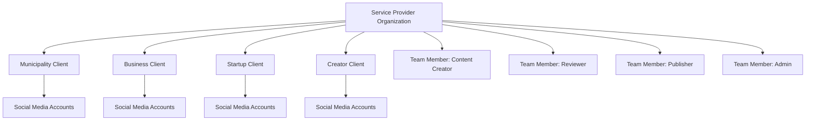
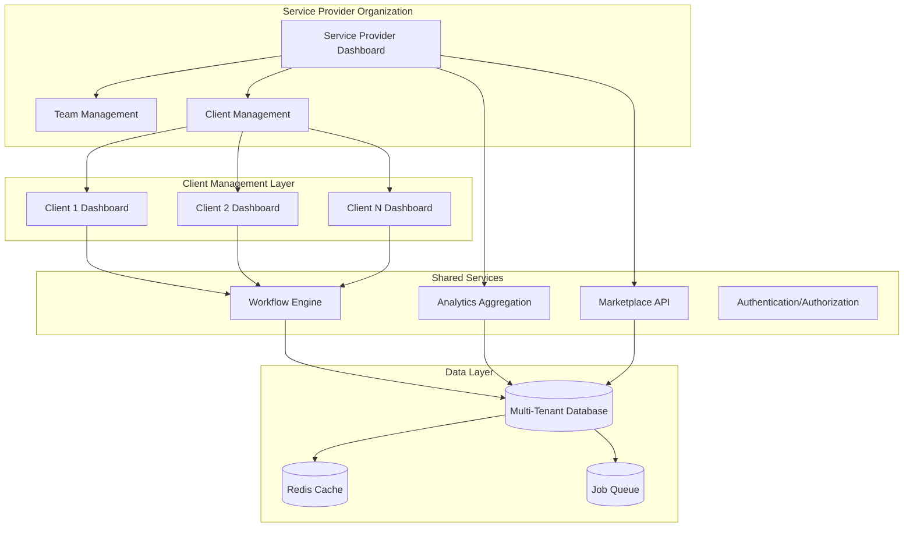
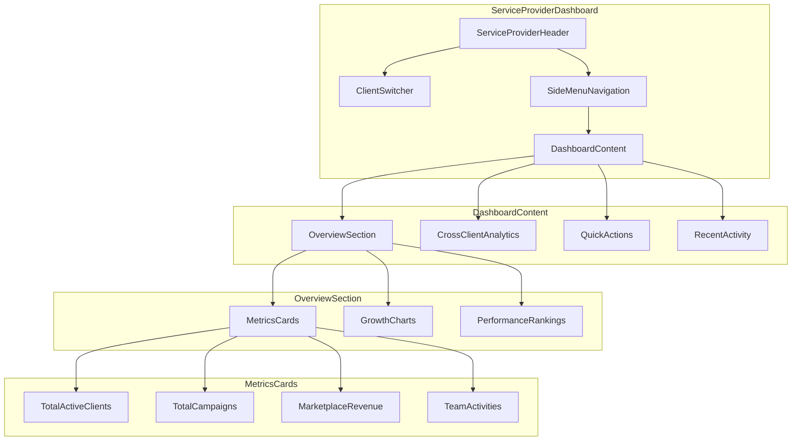
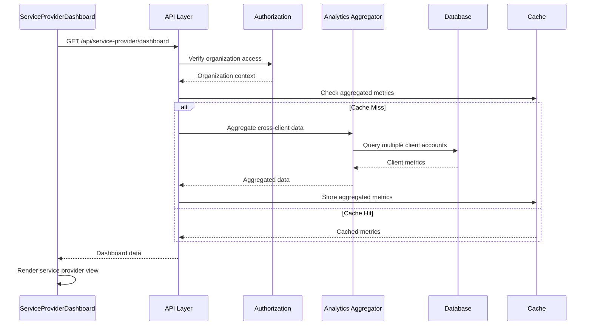
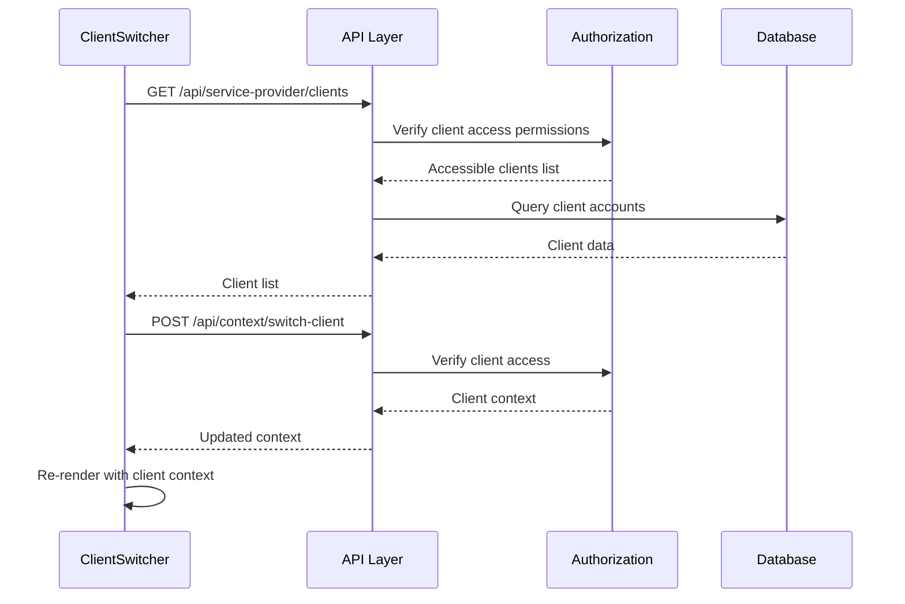
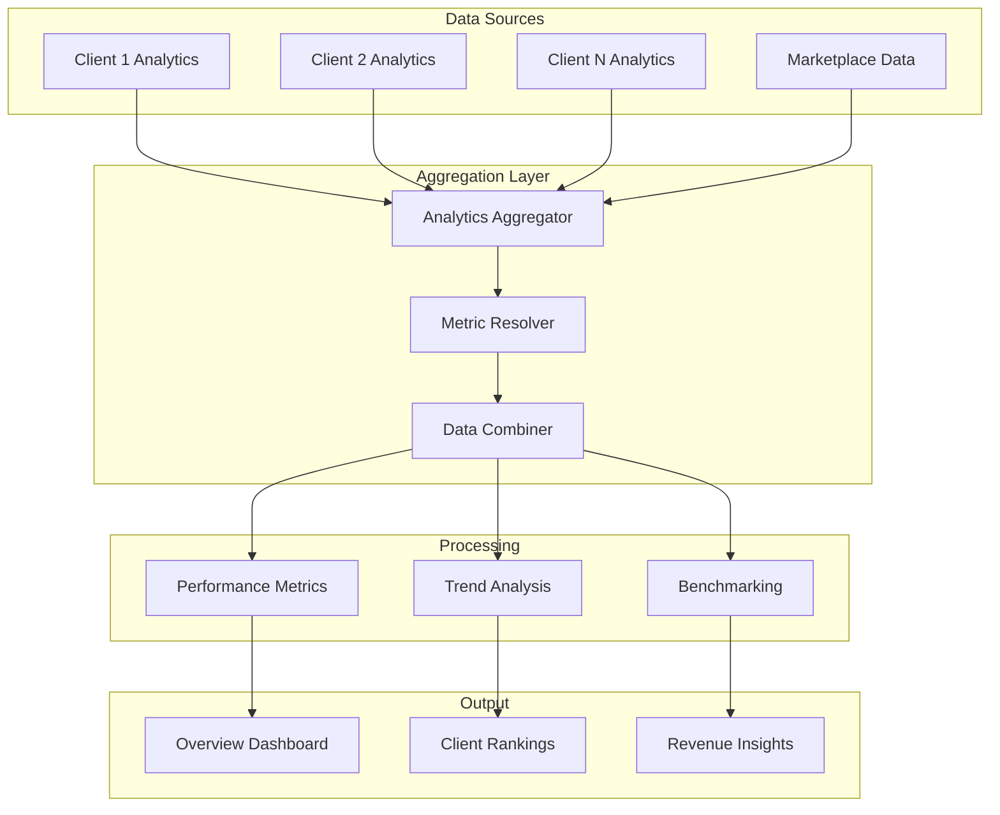

# ThriveSend Service Provider Dashboard - Technical Design Document (TDD)

## Document Information
- **Version**: 2.0.0
- **Date**: January 2025
- **Authors**: Development Team
- **Status**: Draft - PRD Aligned
- **Purpose**: Unified technical specification for B2B2G service provider dashboard

---

## Table of Contents

1. [Executive Summary](#executive-summary)
2. [Business Context & PRD Alignment](#business-context--prd-alignment)
3. [System Architecture](#system-architecture)
4. [Component Hierarchy](#component-hierarchy)
5. [Data Flow Architecture](#data-flow-architecture)
6. [API Architecture](#api-architecture)
7. [User Interface Design](#user-interface-design)
8. [Multi-Tenant Implementation](#multi-tenant-implementation)
9. [Performance Requirements](#performance-requirements)
10. [Security Considerations](#security-considerations)
11. [Implementation Plan](#implementation-plan)
12. [Testing Strategy](#testing-strategy)

---

## Executive Summary

### Purpose
ThriveSend is a **B2B2G platform** enabling service providers (digital agencies, consultants) to manage social media for multiple clients including municipalities, businesses, and content creators. The dashboard serves as the central command center for service providers to oversee all client accounts, analytics, and operations.

### Current State vs Required State

| Aspect | Current Implementation | PRD Requirement | Gap Status |
|--------|----------------------|-----------------|------------|
| **Business Model** | Single-tenant content management | Multi-client service provider platform | 🔴 Critical |
| **User Context** | Individual creators | Service providers + their clients | 🔴 Critical |
| **Data Architecture** | Single organization | Multi-organization with client segregation | 🔴 Critical |
| **Dashboard Scope** | Basic analytics for one account | Cross-client analytics + individual client views | 🔴 Critical |
| **Marketplace Integration** | None | Revenue tracking, boost management | 🔴 Critical |
| **Team Collaboration** | Basic user management | Role-based access, client assignment | 🔴 Critical |

---

## Business Context & PRD Alignment

### Core Business Model (PRD Section 2.1)


### Service Provider Responsibilities
1. **Client Account Management**: Create, configure, and manage multiple client accounts
2. **Team Orchestration**: Assign team members to clients with specific roles
3. **Cross-Client Analytics**: Monitor performance across entire client portfolio
4. **Revenue Optimization**: Leverage marketplace for content and boost recommendations
5. **Workflow Management**: Oversee content approval workflows for all clients

---

## System Architecture

### High-Level Architecture Diagram


### Service Provider Dashboard Component Architecture


---

## Component Hierarchy

### Primary Dashboard Components

#### 1. ServiceProviderDashboard (Root Container)
```typescript
interface ServiceProviderDashboardProps {
  organizationId: string;
  currentUser: ServiceProviderUser;
  selectedClient?: ClientContext;
  viewMode: 'overview' | 'client-specific' | 'cross-client';
}
```

#### 2. ClientSwitcher Component
```typescript
interface ClientSwitcherProps {
  clients: ClientAccount[];
  selectedClient: ClientAccount | null;
  onClientChange: (client: ClientAccount) => void;
  onViewAllClients: () => void;
  showCreateClient: boolean;
}
```

#### 3. CrossClientAnalytics Component
```typescript
interface CrossClientAnalyticsProps {
  organizationId: string;
  timeRange: DateRange;
  metrics: {
    totalClients: number;
    activeCampaigns: number;
    aggregatedPerformance: PerformanceMetrics;
    marketplaceRevenue: number;
  };
  clientBreakdown: ClientPerformance[];
}
```

### Component File Structure
```
src/components/dashboard/
├── ServiceProviderDashboard.tsx          # Root dashboard container
├── ClientSwitcher.tsx                    # Client selection/management
├── OverviewSection/
│   ├── MetricsCards.tsx                  # Service provider metrics
│   ├── CrossClientCharts.tsx             # Aggregated analytics
│   └── ClientPerformanceRankings.tsx     # Client comparison
├── ClientSpecificView/
│   ├── ClientDashboard.tsx               # Individual client dashboard
│   ├── ClientAnalytics.tsx               # Client-specific analytics
│   └── ClientTeamAssignment.tsx          # Team member assignments
├── QuickActions/
│   ├── CreateCampaignAction.tsx          # Multi-client campaign creation
│   ├── MarketplaceActions.tsx            # Boost/content recommendations
│   └── TeamActions.tsx                   # Team management shortcuts
└── shared/
    ├── MetricCard.tsx                    # Reusable metric display
    ├── PerformanceChart.tsx              # Chart components
    └── ActivityFeed.tsx                  # Activity aggregation
```

---

## Data Flow Architecture

### Service Provider Data Flow


### Client Switching Data Flow


### Multi-Client Analytics Aggregation


---

## API Architecture

### Service Provider API Endpoints

#### Dashboard APIs
```typescript
// Service Provider Overview
GET /api/service-provider/dashboard
Response: {
  organizationId: string;
  metrics: {
    totalClients: number;
    activeClients: number;
    totalCampaigns: number;
    activeCampaigns: number;
    totalRevenue: number;
    marketplaceRevenue: number;
    teamUtilization: number;
  };
  clientSummary: ClientSummary[];
  recentActivity: Activity[];
  performanceTrends: TrendData[];
}

// Client Management
GET /api/service-provider/clients
Response: {
  clients: ClientAccount[];
  totalCount: number;
  activeCount: number;
}

POST /api/service-provider/clients
Body: {
  name: string;
  type: 'municipality' | 'business' | 'startup' | 'creator';
  contactInfo: ContactInfo;
  settings: ClientSettings;
}

// Cross-Client Analytics
GET /api/service-provider/analytics/cross-client
Query: {
  timeRange: DateRange;
  metrics: string[];
  clientIds?: string[];
}
Response: {
  aggregatedMetrics: AggregatedMetrics;
  clientBreakdown: ClientMetrics[];
  comparisons: ComparisonData[];
}

// Team Management
GET /api/service-provider/team
Response: {
  members: TeamMember[];
  assignments: ClientAssignment[];
  utilization: UtilizationMetrics;
}

POST /api/service-provider/team/assign
Body: {
  memberId: string;
  clientId: string;
  role: TeamRole;
  permissions: Permission[];
}
```

#### Context Switching APIs
```typescript
// Switch Client Context
POST /api/context/switch-client
Body: {
  clientId: string;
}
Response: {
  clientContext: ClientContext;
  availableFeatures: Feature[];
  permissions: Permission[];
}

// Get Available Contexts
GET /api/context/available
Response: {
  serviceProvider: OrganizationContext;
  clients: ClientContext[];
  currentContext: Context;
}
```

### API Authentication & Authorization

#### Multi-Tenant Access Control
```typescript
interface ServiceProviderAccess {
  organizationId: string;
  role: 'owner' | 'admin' | 'manager' | 'member';
  clientAccess: {
    clientId: string;
    permissions: Permission[];
  }[];
  teamPermissions: TeamPermission[];
}

interface Permission {
  resource: string;
  actions: ('read' | 'write' | 'delete' | 'admin')[];
  scope: 'organization' | 'client' | 'campaign' | 'content';
}
```

---

## User Interface Design

### Service Provider Dashboard Layout
```
┌─────────────────────────────────────────────────────────────┐
│ [ThriveSend Logo] [ClientSwitcher ▼] [Notifications] [User] │
├─────────────────────────────────────────────────────────────┤
│ [≡] │ OVERVIEW SECTION                                     │
│ Ovr │ ┌─────────┐ ┌─────────┐ ┌─────────┐ ┌─────────┐    │
│ Cli │ │Total    │ │Active   │ │Revenue  │ │Team     │    │
│ Tea │ │Clients  │ │Campaigns│ │$12.5K   │ │85%      │    │
│ Ana │ │   24    │ │   47    │ │         │ │Utilized │    │
│ Mar │ └─────────┘ └─────────┘ └─────────┘ └─────────┘    │
│ Set │                                                     │
│     │ CROSS-CLIENT PERFORMANCE                            │
│     │ ┌─────────────────────────────────────────────────┐ │
│     │ │ [Performance Chart with Client Breakdown]       │ │
│     │ └─────────────────────────────────────────────────┘ │
│     │                                                     │
│     │ CLIENT RANKINGS        RECENT ACTIVITY             │
│     │ ┌──────────────────┐  ┌─────────────────────────┐   │
│     │ │1. Municipal Corp │  │• Campaign approved      │   │
│     │ │2. Tech Startup   │  │• Content published      │   │
│     │ │3. Local Business │  │• Boost recommended      │   │
│     │ └──────────────────┘  └─────────────────────────┘   │
└─────────────────────────────────────────────────────────────┘
```

### Client-Specific Dashboard View
```
┌─────────────────────────────────────────────────────────────┐
│ [ThriveSend] [Municipal Corp ▼] [Back to Overview] [User]   │
├─────────────────────────────────────────────────────────────┤
│ [≡] │ CLIENT: MUNICIPAL CORP                              │
│ Ovr │ ┌─────────┐ ┌─────────┐ ┌─────────┐ ┌─────────┐    │
│ Cam │ │Active   │ │Pending  │ │Engagement│ │Team     │    │
│ Con │ │Posts    │ │Approval │ │Rate     │ │Members  │    │
│ Ana │ │   12    │ │    3    │ │  4.2%   │ │    4    │    │
│ Tea │ └─────────┘ └─────────┘ └─────────┘ └─────────┘    │
│     │                                                     │
│     │ PERFORMANCE CHARTS                                  │
│     │ ┌─────────────────────────────────────────────────┐ │
│     │ │ [Client-Specific Analytics Charts]              │ │
│     │ └─────────────────────────────────────────────────┘ │
│     │                                                     │
│     │ TEAM ASSIGNMENTS      CONTENT PIPELINE             │
│     │ ┌──────────────────┐  ┌─────────────────────────┐   │
│     │ │• John (Creator)  │  │• Draft: Event Post      │   │
│     │ │• Mary (Reviewer) │  │• Review: Policy Update  │   │
│     │ │• Bob (Publisher) │  │• Scheduled: Newsletter  │   │
│     │ └──────────────────┘  └─────────────────────────┘   │
└─────────────────────────────────────────────────────────────┘
```

### Client Switcher Component Design
```
┌─────────────────────────────────────┐
│ All Clients Overview          [×]   │
├─────────────────────────────────────┤
│ ┌─ Municipal Corp              📊   │
│ │  24 campaigns • 85% engagement    │
│ └─ [View] [Analytics] [Settings]    │
│                                     │
│ ┌─ Tech Startup Inc            📈   │
│ │  12 campaigns • 92% engagement    │
│ └─ [View] [Analytics] [Settings]    │
│                                     │
│ ┌─ Local Coffee Shop          📱   │
│ │  8 campaigns • 76% engagement     │
│ └─ [View] [Analytics] [Settings]    │
│                                     │
│ ───────────────────────────────────  │
│ [+ Add New Client]                  │
│ [View All Analytics]                │
└─────────────────────────────────────┘
```

---

## Multi-Tenant Implementation

### Data Segregation Strategy

#### Database Schema for Multi-Tenancy
```sql
-- Service Provider Organization
CREATE TABLE organizations (
    id UUID PRIMARY KEY,
    name VARCHAR(255) NOT NULL,
    type VARCHAR(50) DEFAULT 'service_provider',
    settings JSONB,
    created_at TIMESTAMP DEFAULT NOW()
);

-- Client Accounts (managed by service providers)
CREATE TABLE client_accounts (
    id UUID PRIMARY KEY,
    service_provider_id UUID REFERENCES organizations(id),
    name VARCHAR(255) NOT NULL,
    type VARCHAR(50), -- 'municipality', 'business', 'startup', 'creator'
    settings JSONB,
    created_at TIMESTAMP DEFAULT NOW()
);

-- Team Members with Multi-Client Access
CREATE TABLE team_members (
    id UUID PRIMARY KEY,
    organization_id UUID REFERENCES organizations(id),
    user_id UUID REFERENCES users(id),
    role VARCHAR(50),
    permissions JSONB,
    created_at TIMESTAMP DEFAULT NOW()
);

-- Client-Team Assignments
CREATE TABLE client_assignments (
    id UUID PRIMARY KEY,
    team_member_id UUID REFERENCES team_members(id),
    client_account_id UUID REFERENCES client_accounts(id),
    role VARCHAR(50),
    permissions JSONB,
    created_at TIMESTAMP DEFAULT NOW()
);

-- All existing tables get client_account_id for data segregation
ALTER TABLE campaigns ADD COLUMN client_account_id UUID REFERENCES client_accounts(id);
ALTER TABLE content ADD COLUMN client_account_id UUID REFERENCES client_accounts(id);
ALTER TABLE analytics ADD COLUMN client_account_id UUID REFERENCES client_accounts(id);
```

#### Context Management
```typescript
interface ServiceProviderContext {
  organizationId: string;
  currentUser: {
    id: string;
    role: OrganizationRole;
    permissions: Permission[];
  };
  selectedClient?: {
    id: string;
    name: string;
    type: ClientType;
    permissions: ClientPermission[];
  };
  availableClients: ClientSummary[];
}

class ContextManager {
  private context: ServiceProviderContext;

  switchClient(clientId: string): Promise<void> {
    // Update context and refresh data
  }

  getAccessibleClients(): ClientSummary[] {
    // Return clients based on user permissions
  }

  hasPermission(resource: string, action: string, clientId?: string): boolean {
    // Check permissions for specific resource/action
  }
}
```

### Row-Level Security Implementation
```sql
-- Enable RLS on all client-specific tables
ALTER TABLE campaigns ENABLE ROW LEVEL SECURITY;
ALTER TABLE content ENABLE ROW LEVEL SECURITY;
ALTER TABLE analytics ENABLE ROW LEVEL SECURITY;

-- Policy for service provider access
CREATE POLICY service_provider_access ON campaigns
    FOR ALL USING (
        client_account_id IN (
            SELECT id FROM client_accounts 
            WHERE service_provider_id = current_setting('app.organization_id')::UUID
        )
    );
```

---

## Performance Requirements

### Service Provider Dashboard Performance Targets

| Metric | Target | Measurement |
|--------|---------|-------------|
| **Initial Load Time** | < 1.2s | Time to interactive dashboard |
| **Client Switch Time** | < 400ms | Context switch + data reload |
| **Cross-Client Analytics** | < 800ms | Aggregated data across all clients |
| **Real-time Updates** | < 2s | Live activity feed updates |
| **Concurrent Users** | 50+ per organization | Multiple team members |
| **Client Capacity** | 100+ clients per organization | Data query performance |

### Optimization Strategies

#### 1. Data Aggregation & Caching
```typescript
interface CacheStrategy {
  // Service provider level caching
  organizationMetrics: {
    ttl: 300; // 5 minutes
    keys: ['total_clients', 'active_campaigns', 'revenue'];
  };
  
  // Client level caching
  clientMetrics: {
    ttl: 180; // 3 minutes
    keys: ['performance', 'activities', 'team_assignments'];
  };
  
  // Cross-client aggregations
  crossClientAnalytics: {
    ttl: 600; // 10 minutes
    keys: ['comparative_performance', 'rankings'];
  };
}
```

#### 2. Progressive Data Loading
```typescript
class ProgressiveDashboardLoader {
  async loadDashboard(organizationId: string) {
    // Phase 1: Critical metrics (immediate)
    const criticalData = await this.loadCriticalMetrics(organizationId);
    
    // Phase 2: Charts and analytics (deferred)
    setTimeout(() => this.loadAnalytics(organizationId), 100);
    
    // Phase 3: Activity feeds (background)
    setTimeout(() => this.loadActivities(organizationId), 300);
    
    return criticalData;
  }
}
```

#### 3. Query Optimization
```sql
-- Optimized queries for service provider dashboard
CREATE INDEX CONCURRENTLY idx_campaigns_client_status 
ON campaigns(client_account_id, status) 
WHERE status = 'active';

CREATE INDEX CONCURRENTLY idx_analytics_client_date 
ON analytics(client_account_id, created_at DESC);

-- Materialized view for cross-client metrics
CREATE MATERIALIZED VIEW service_provider_metrics AS
SELECT 
    ca.service_provider_id,
    COUNT(DISTINCT ca.id) as total_clients,
    COUNT(DISTINCT c.id) as total_campaigns,
    AVG(a.engagement_rate) as avg_engagement,
    SUM(a.revenue) as total_revenue
FROM client_accounts ca
LEFT JOIN campaigns c ON ca.id = c.client_account_id
LEFT JOIN analytics a ON ca.id = a.client_account_id
GROUP BY ca.service_provider_id;
```

---

## Security Considerations

### Multi-Tenant Security Model

#### 1. Authentication & Authorization
```typescript
interface SecurityLayer {
  authentication: {
    // Organization-level authentication
    organizationAuth: ClerkAuth;
    
    // API key authentication for integrations
    apiKeyAuth: APIKeyManager;
    
    // Session management
    sessionManager: SessionManager;
  };
  
  authorization: {
    // Role-based access control
    rbac: RBACEngine;
    
    // Client-specific permissions
    clientPermissions: ClientPermissionManager;
    
    // Resource-level access control
    resourceACL: ResourceACLManager;
  };
}
```

#### 2. Data Isolation
```typescript
class DataIsolationMiddleware {
  async validateClientAccess(req: Request, clientId: string): Promise<boolean> {
    const { organizationId } = req.auth;
    
    // Verify client belongs to organization
    const client = await db.clientAccount.findFirst({
      where: {
        id: clientId,
        serviceProviderId: organizationId
      }
    });
    
    return !!client;
  }
  
  async enforceRowLevelSecurity(query: DatabaseQuery): DatabaseQuery {
    // Automatically append client/organization filters
    return query.where({
      ...query.where,
      clientAccountId: { in: req.auth.accessibleClientIds }
    });
  }
}
```

#### 3. Audit & Compliance
```typescript
interface AuditTrail {
  // Track all client access
  clientAccess: {
    userId: string;
    clientId: string;
    action: string;
    timestamp: Date;
    metadata: object;
  };
  
  // Track data modifications
  dataModifications: {
    userId: string;
    resourceType: string;
    resourceId: string;
    action: 'create' | 'update' | 'delete';
    oldValues?: object;
    newValues?: object;
    timestamp: Date;
  };
  
  // Track permission changes
  permissionChanges: {
    adminUserId: string;
    targetUserId: string;
    clientId?: string;
    oldPermissions: Permission[];
    newPermissions: Permission[];
    timestamp: Date;
  };
}
```

---

## Implementation Plan

### Phase 1: Core Architecture (Week 1-2)
1. **Database Schema Updates**
   - Add service provider/client relationship tables
   - Implement row-level security
   - Create materialized views for performance

2. **Authentication Overhaul**
   - Update Clerk configuration for multi-tenant
   - Implement context switching middleware
   - Add permission validation

3. **API Restructuring**
   - Create service provider API endpoints
   - Update existing APIs for client context
   - Implement data aggregation services

### Phase 2: Dashboard Components (Week 3-4)
1. **ServiceProviderDashboard Component**
   - Root container with context management
   - Client switcher implementation
   - Overview section with aggregated metrics

2. **Cross-Client Analytics**
   - Multi-client data aggregation
   - Comparative performance charts
   - Client ranking system

3. **Team Management Integration**
   - Team member assignment UI
   - Permission management interface
   - Utilization tracking

### Phase 3: Client-Specific Views (Week 5-6)
1. **Client Dashboard Implementation**
   - Individual client dashboard views
   - Client-specific analytics
   - Team assignment displays

2. **Marketplace Integration**
   - Revenue tracking from boosts/content
   - Recommendation system integration
   - Performance correlation analysis

3. **Advanced Features**
   - Real-time activity feeds
   - Notification system for multi-client
   - Bulk operations interface

### Phase 4: Optimization & Testing (Week 7-8)
1. **Performance Optimization**
   - Implement caching strategies
   - Progressive loading optimization
   - Query performance tuning

2. **Security Hardening**
   - Penetration testing
   - Audit trail implementation
   - Compliance verification

3. **User Experience Polish**
   - Mobile optimization
   - Accessibility improvements
   - Error handling enhancement

---

## Testing Strategy

### Component Testing
```typescript
describe('ServiceProviderDashboard', () => {
  beforeEach(() => {
    mockServiceProviderContext({
      organizationId: 'test-org',
      clients: [mockClient1, mockClient2],
      selectedClient: null
    });
  });

  it('displays aggregated metrics for all clients', async () => {
    render(<ServiceProviderDashboard />);
    
    expect(screen.getByText('Total Clients: 2')).toBeInTheDocument();
    expect(screen.getByText('Active Campaigns: 15')).toBeInTheDocument();
  });

  it('switches client context correctly', async () => {
    render(<ServiceProviderDashboard />);
    
    fireEvent.click(screen.getByRole('button', { name: /client switcher/i }));
    fireEvent.click(screen.getByText('Municipal Corp'));
    
    await waitFor(() => {
      expect(mockContextManager.switchClient).toHaveBeenCalledWith('client-1');
    });
  });
});
```

### Integration Testing
```typescript
describe('Multi-Client Data Flow', () => {
  it('aggregates data correctly across multiple clients', async () => {
    const mockData = await loadServiceProviderDashboard('org-1');
    
    expect(mockData.metrics.totalClients).toBe(3);
    expect(mockData.metrics.totalCampaigns).toBe(27);
    expect(mockData.clientBreakdown).toHaveLength(3);
  });

  it('enforces client access permissions', async () => {
    mockUser({ permissions: [{ clientId: 'client-1', role: 'viewer' }] });
    
    const response = await request(app)
      .get('/api/service-provider/clients')
      .expect(200);
    
    expect(response.body.clients).toHaveLength(1);
    expect(response.body.clients[0].id).toBe('client-1');
  });
});
```

### Performance Testing
```typescript
describe('Dashboard Performance', () => {
  it('loads dashboard within performance targets', async () => {
    const startTime = performance.now();
    
    render(<ServiceProviderDashboard />);
    await waitForElementToBeRemoved(screen.getByTestId('loading-spinner'));
    
    const loadTime = performance.now() - startTime;
    expect(loadTime).toBeLessThan(1200); // 1.2s target
  });

  it('handles large client portfolios efficiently', async () => {
    const largeClientList = generateMockClients(100);
    mockServiceProviderContext({ clients: largeClientList });
    
    const startTime = performance.now();
    render(<ServiceProviderDashboard />);
    
    const renderTime = performance.now() - startTime;
    expect(renderTime).toBeLessThan(800); // 800ms for large datasets
  });
});
```

---

## Appendix

### Design System Integration
- Consistent with existing ThriveSend design tokens
- Color scheme: Service provider (blue accent), Client context (contextual colors)
- Typography: Roboto/Inter font stack
- Spacing: 8px grid system

### Accessibility Standards
- WCAG 2.1 AA compliance
- Keyboard navigation support
- Screen reader optimization
- High contrast mode support

### Browser Support
- Modern browsers (Chrome 90+, Firefox 85+, Safari 14+)
- Mobile responsive design
- Progressive Web App features

### Dependencies
- React 18+ with TypeScript
- Next.js App Router
- Tailwind CSS for styling
- Chart.js/Recharts for analytics
- React Query for data management
- Clerk for authentication

---

*This document will be updated as implementation progresses and requirements evolve.*