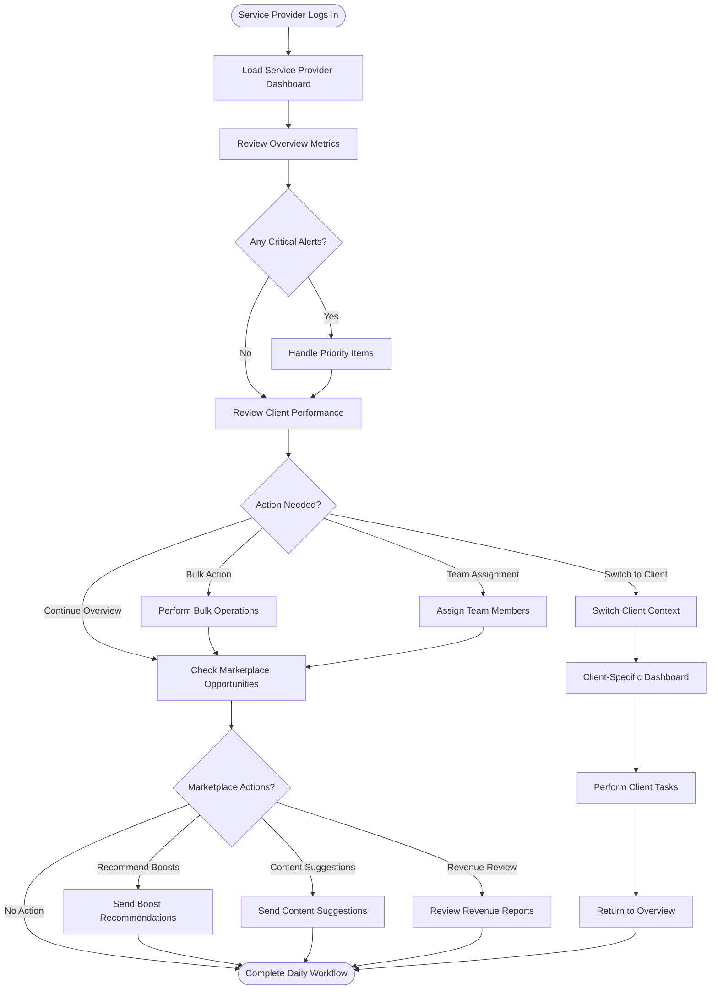
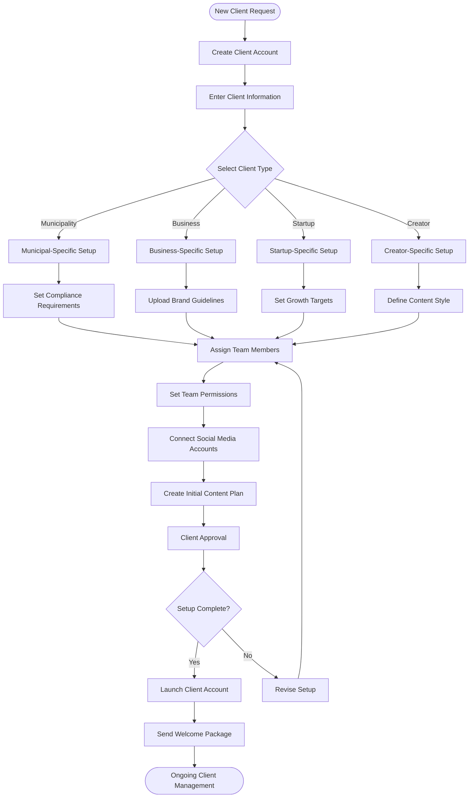
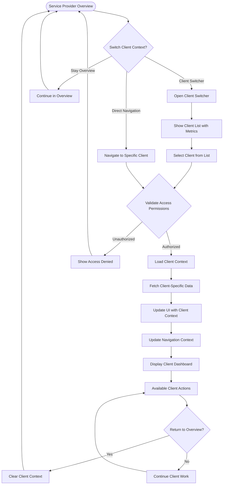
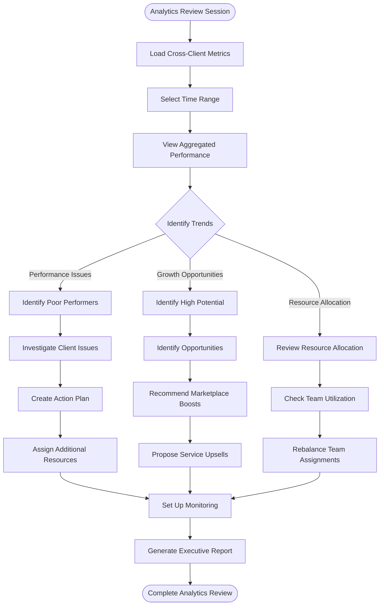
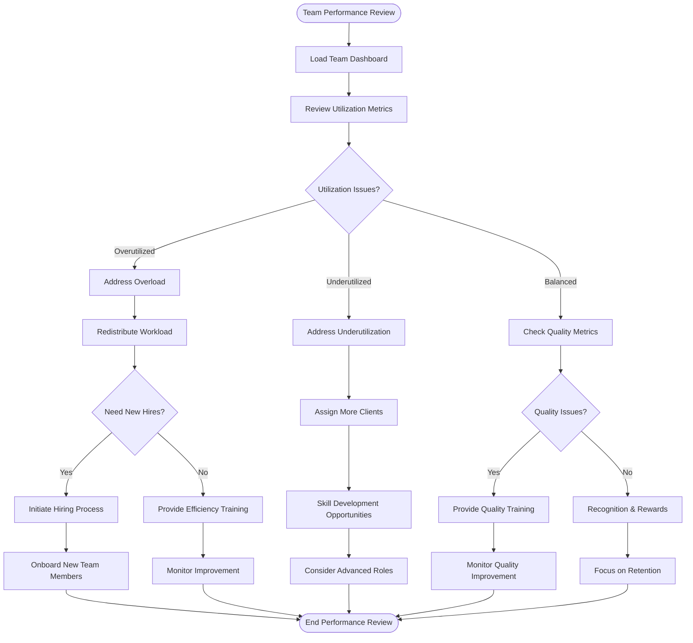
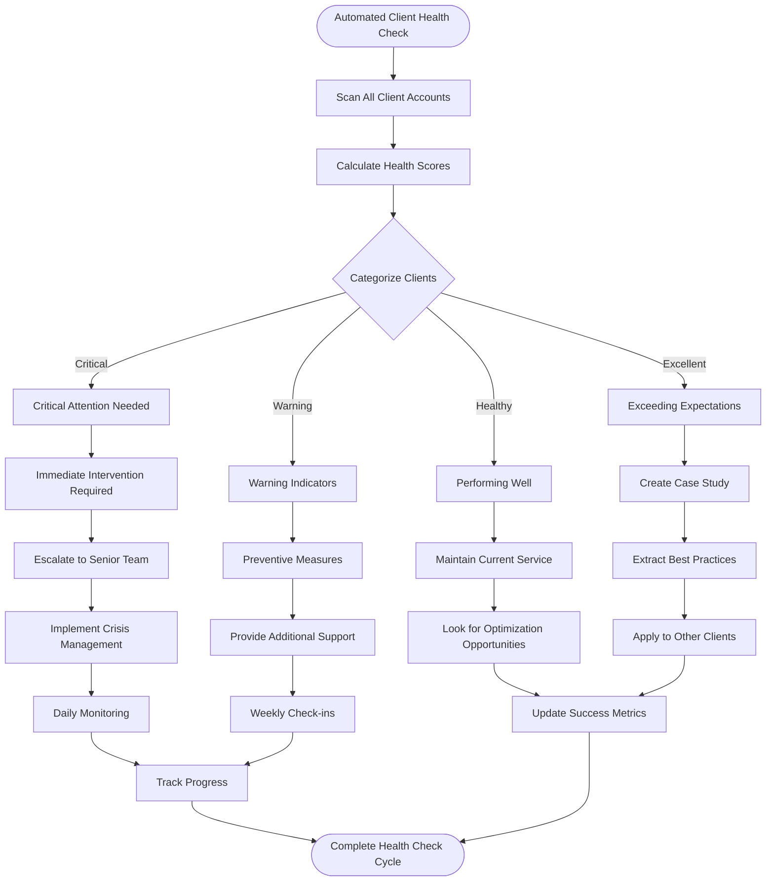
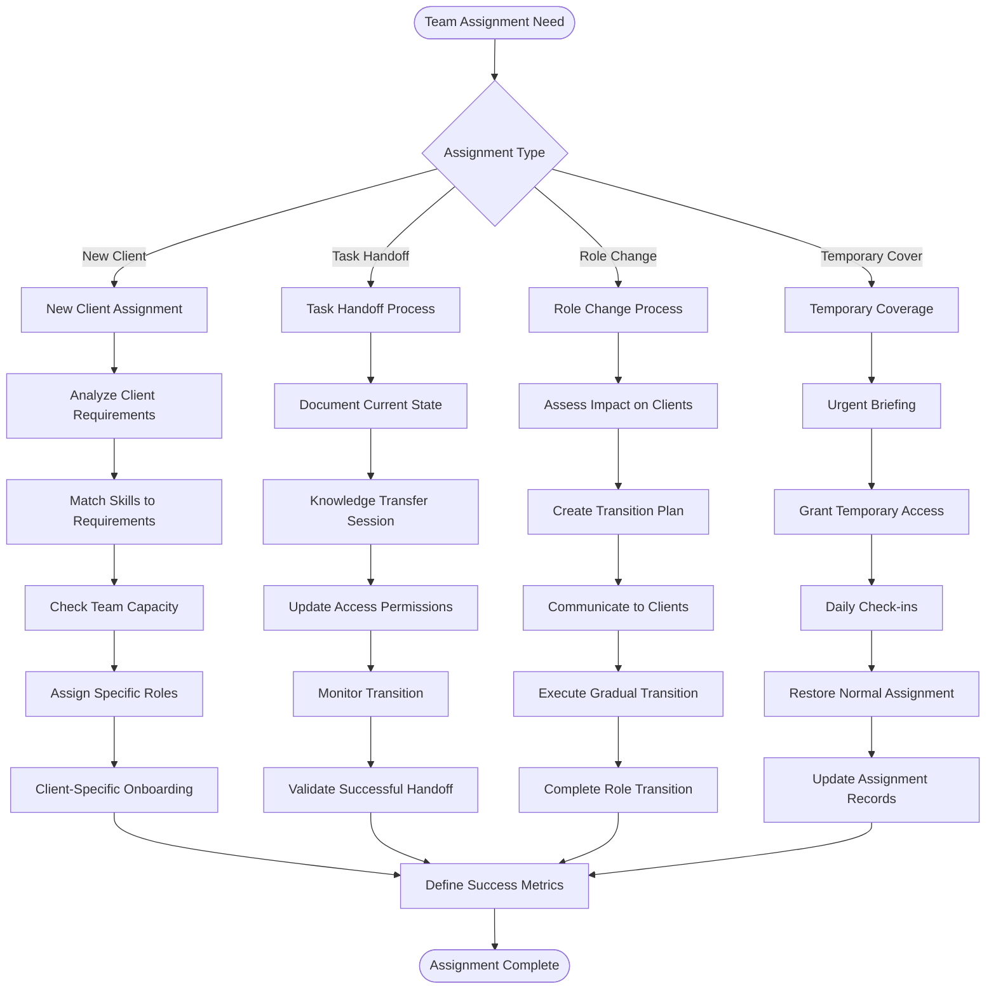
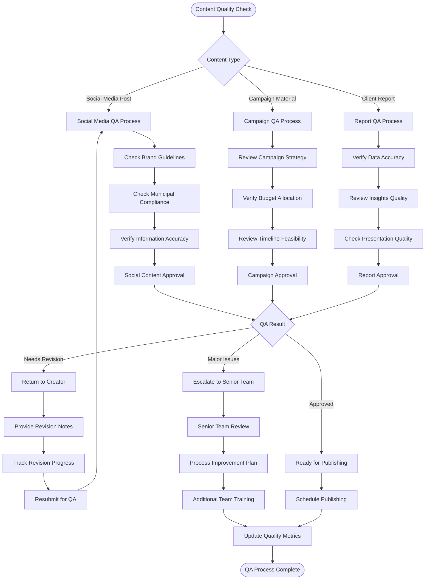
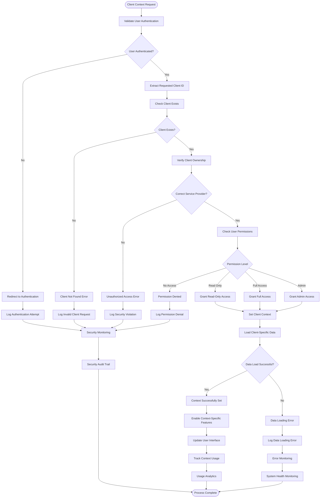

# Service Provider Dashboard - User Flows & Interaction Patterns

## Document Information
- **Version**: 1.0.0
- **Date**: January 2025
- **Purpose**: Detailed user flows and interaction patterns for service provider dashboard
- **Companion to**: ServiceProviderDashboard-TDD.md

---

## Table of Contents

1. [Primary User Flows](#primary-user-flows)
2. [Service Provider Workflows](#service-provider-workflows)
3. [Client Management Flows](#client-management-flows)
4. [Team Collaboration Workflows](#team-collaboration-workflows)
5. [Analytics & Reporting Flows](#analytics--reporting-flows)
6. [Marketplace Integration Flows](#marketplace-integration-flows)
7. [Error Handling & Edge Cases](#error-handling--edge-cases)

---

## Primary User Flows

### 1. Service Provider Daily Workflow


### 2. Client Onboarding Flow


### 3. Context Switching Flow


---

## Service Provider Workflows

### Cross-Client Analytics Review


### Team Performance Management


---

## Client Management Flows

### Client Health Monitoring


### Client Communication Flow
```mermaid
flowchart TD
    START([Client Communication Need]) --> COMM_TYPE{Communication Type}
    
    COMM_TYPE -->|Regular Report| SCHEDULE_REPORT[Schedule Regular Report]
    COMM_TYPE -->|Issue Alert| ISSUE_NOTIFICATION[Send Issue Notification]
    COMM_TYPE -->|Opportunity| OPPORTUNITY_COMM[Share Opportunity]
    COMM_TYPE -->|Feedback Request| REQUEST_FEEDBACK[Request Client Feedback]
    
    SCHEDULE_REPORT --> AUTO_GENERATE[Auto-Generate Report Content]
    AUTO_GENERATE --> CUSTOMIZE[Customize for Client]
    CUSTOMIZE --> REVIEW_INTERNAL[Internal Review]
    REVIEW_INTERNAL --> SEND_REPORT[Send to Client]
    
    ISSUE_NOTIFICATION --> ASSESS_SEVERITY{Assess Issue Severity}
    ASSESS_SEVERITY -->|High| URGENT_CALL[Schedule Urgent Call]
    ASSESS_SEVERITY -->|Medium| EMAIL_DETAILS[Send Detailed Email]
    ASSESS_SEVERITY -->|Low| PORTAL_UPDATE[Update Client Portal]
    
    URGENT_CALL --> RESOLUTION_PLAN[Develop Resolution Plan]
    EMAIL_DETAILS --> ACTION_ITEMS[Include Action Items]
    PORTAL_UPDATE --> MONITOR_RESPONSE[Monitor for Response]
    
    OPPORTUNITY_COMM --> PREPARE_PROPOSAL[Prepare Proposal]
    PREPARE_PROPOSAL --> SCHEDULE_PRESENTATION[Schedule Presentation]
    SCHEDULE_PRESENTATION --> FOLLOW_UP[Follow Up on Interest]
    
    REQUEST_FEEDBACK --> SURVEY_FORM[Send Survey Form]
    SURVEY_FORM --> COLLECT_RESPONSES[Collect Responses]
    COLLECT_RESPONSES --> ANALYZE_FEEDBACK[Analyze Feedback]
    ANALYZE_FEEDBACK --> IMPLEMENT_IMPROVEMENTS[Implement Improvements]
    
    SEND_REPORT --> CLIENT_RESPONSE[Monitor Client Response]
    RESOLUTION_PLAN --> CLIENT_RESPONSE
    ACTION_ITEMS --> CLIENT_RESPONSE
    MONITOR_RESPONSE --> CLIENT_RESPONSE
    FOLLOW_UP --> CLIENT_RESPONSE
    IMPLEMENT_IMPROVEMENTS --> CLIENT_RESPONSE
    
    CLIENT_RESPONSE --> DOCUMENT[Document Communication]
    DOCUMENT --> UPDATE_CRM[Update CRM Records]
    UPDATE_CRM ([Communication Complete])
```

---

## Team Collaboration Workflows

### Assignment & Handoff Process


### Quality Assurance Workflow


---

## Analytics & Reporting Flows

### Automated Reporting Generation
```mermaid
flowchart TD
    START([Scheduled Report Time]) --> CHECK_SCHEDULE[Check Report Schedule]
    CHECK_SCHEDULE --> ACTIVE_REPORTS{Active Reports?}
    
    ACTIVE_REPORTS -->|Yes| GATHER_DATA[Gather Required Data]
    ACTIVE_REPORTS -->|No| WAIT_NEXT[Wait for Next Cycle]
    
    GATHER_DATA --> DATA_SOURCES[Access Multiple Data Sources]
    DATA_SOURCES --> AGGREGATE[Aggregate Cross-Client Data]
    AGGREGATE --> CALCULATE_METRICS[Calculate Performance Metrics]
    
    CALCULATE_METRICS --> GENERATE_INSIGHTS[Generate Automated Insights]
    GENERATE_INSIGHTS --> CREATE_VISUALS[Create Charts and Graphs]
    CREATE_VISUALS --> APPLY_BRANDING[Apply Client Branding]
    
    APPLY_BRANDING --> QUALITY_CHECK[Automated Quality Check]
    QUALITY_CHECK --> QC_RESULT{Quality Check Result}
    
    QC_RESULT -->|Pass| FINALIZE_REPORT[Finalize Report]
    QC_RESULT -->|Fail| FLAG_ISSUES[Flag Data Issues]
    FLAG_ISSUES --> MANUAL_REVIEW[Require Manual Review]
    MANUAL_REVIEW --> RESOLVE_ISSUES[Resolve Data Issues]
    RESOLVE_ISSUES --> GATHER_DATA
    
    FINALIZE_REPORT --> DELIVERY_METHOD{Delivery Method}
    DELIVERY_METHOD -->|Email| EMAIL_REPORT[Send Email Report]
    DELIVERY_METHOD -->|Portal| UPLOAD_PORTAL[Upload to Client Portal]
    DELIVERY_METHOD -->|API| API_DELIVERY[Deliver via API]
    
    EMAIL_REPORT --> TRACK_DELIVERY[Track Email Delivery]
    UPLOAD_PORTAL --> NOTIFY_PORTAL[Notify Portal Upload]
    API_DELIVERY --> CONFIRM_API[Confirm API Delivery]
    
    TRACK_DELIVERY --> LOG_SUCCESS[Log Successful Delivery]
    NOTIFY_PORTAL --> LOG_SUCCESS
    CONFIRM_API --> LOG_SUCCESS
    
    LOG_SUCCESS --> UPDATE_SCHEDULE[Update Next Report Schedule]
    UPDATE_SCHEDULE --> CLEANUP[Cleanup Temporary Data]
    CLEANUP ([Report Generation Complete])
    
    WAIT_NEXT --> CHECK_SCHEDULE
```

### Real-Time Dashboard Updates
```mermaid
flowchart TD
    START([Real-Time Event Occurs]) --> EVENT_TYPE{Event Type}
    
    EVENT_TYPE -->|Social Media Activity| SOCIAL_EVENT[Social Media Event]
    EVENT_TYPE -->|Campaign Activity| CAMPAIGN_EVENT[Campaign Event]
    EVENT_TYPE -->|Team Activity| TEAM_EVENT[Team Activity]
    EVENT_TYPE -->|Client Activity| CLIENT_EVENT[Client Activity]
    
    SOCIAL_EVENT --> PROCESS_SOCIAL[Process Social Metrics]
    CAMPAIGN_EVENT --> PROCESS_CAMPAIGN[Process Campaign Data]
    TEAM_EVENT --> PROCESS_TEAM[Process Team Actions]
    CLIENT_EVENT --> PROCESS_CLIENT[Process Client Actions]
    
    PROCESS_SOCIAL --> UPDATE_METRICS[Update Real-Time Metrics]
    PROCESS_CAMPAIGN --> UPDATE_METRICS
    PROCESS_TEAM --> UPDATE_METRICS
    PROCESS_CLIENT --> UPDATE_METRICS
    
    UPDATE_METRICS --> AFFECTED_CLIENTS{Identify Affected Clients}
    AFFECTED_CLIENTS --> SINGLE_CLIENT[Single Client Impact]
    AFFECTED_CLIENTS --> MULTI_CLIENT[Multi-Client Impact]
    
    SINGLE_CLIENT --> UPDATE_CLIENT_DASH[Update Client Dashboard]
    MULTI_CLIENT --> UPDATE_OVERVIEW[Update Overview Dashboard]
    
    UPDATE_CLIENT_DASH --> PUSH_UPDATE[Push Real-Time Update]
    UPDATE_OVERVIEW --> AGGREGATE_IMPACT[Calculate Aggregate Impact]
    AGGREGATE_IMPACT --> PUSH_UPDATE
    
    PUSH_UPDATE --> WEBSOCKET[Send via WebSocket]
    WEBSOCKET --> CLIENT_RECEIVES[Client Receives Update]
    CLIENT_RECEIVES --> UPDATE_UI[Update Dashboard UI]
    
    UPDATE_UI --> THRESHOLD_CHECK{Significant Change?}
    THRESHOLD_CHECK -->|Yes| TRIGGER_NOTIFICATION[Trigger Notification]
    THRESHOLD_CHECK -->|No| LOG_UPDATE[Log Update]
    
    TRIGGER_NOTIFICATION --> NOTIFICATION_TYPE{Notification Type}
    NOTIFICATION_TYPE -->|Alert| SEND_ALERT[Send Alert Notification]
    NOTIFICATION_TYPE -->|Achievement| SEND_ACHIEVEMENT[Send Achievement Notification]
    NOTIFICATION_TYPE -->|Warning| SEND_WARNING[Send Warning Notification]
    
    SEND_ALERT --> LOG_UPDATE
    SEND_ACHIEVEMENT --> LOG_UPDATE
    SEND_WARNING --> LOG_UPDATE
    
    LOG_UPDATE --> STORE_HISTORY[Store in Update History]
    STORE_HISTORY ([Real-Time Update Complete])
```

---

## Marketplace Integration Flows

### Boost Recommendation Flow
```mermaid
flowchart TD
    START([Analyze Performance Data]) --> CLIENT_SCAN[Scan All Client Accounts]
    CLIENT_SCAN --> PERFORMANCE_ANALYSIS[Analyze Performance Metrics]
    
    PERFORMANCE_ANALYSIS --> IDENTIFY_OPPORTUNITIES{Identify Boost Opportunities}
    IDENTIFY_OPPORTUNITIES -->|Low Engagement| ENGAGEMENT_BOOST[Engagement Boost Opportunity]
    IDENTIFY_OPPORTUNITIES -->|Growth Potential| GROWTH_BOOST[Growth Boost Opportunity]
    IDENTIFY_OPPORTUNITIES -->|Seasonal Campaign| SEASONAL_BOOST[Seasonal Boost Opportunity]
    IDENTIFY_OPPORTUNITIES -->|Competitive Gap| COMPETITIVE_BOOST[Competitive Boost Opportunity]
    
    ENGAGEMENT_BOOST --> MATCH_BOOSTS[Match Available Boosts]
    GROWTH_BOOST --> MATCH_BOOSTS
    SEASONAL_BOOST --> MATCH_BOOSTS
    COMPETITIVE_BOOST --> MATCH_BOOSTS
    
    MATCH_BOOSTS --> RELEVANCE_SCORE[Calculate Relevance Score]
    RELEVANCE_SCORE --> ROI_PREDICTION[Predict ROI]
    ROI_PREDICTION --> RANK_RECOMMENDATIONS[Rank Recommendations]
    
    RANK_RECOMMENDATIONS --> APPROVAL_NEEDED{Client Approval Required?}
    APPROVAL_NEEDED -->|Yes| PREPARE_PROPOSAL[Prepare Client Proposal]
    APPROVAL_NEEDED -->|No| AUTO_IMPLEMENT[Auto-Implement Boost]
    
    PREPARE_PROPOSAL --> SEND_PROPOSAL[Send to Client]
    SEND_PROPOSAL --> AWAIT_RESPONSE[Await Client Response]
    AWAIT_RESPONSE --> CLIENT_DECISION{Client Decision}
    
    CLIENT_DECISION -->|Approved| IMPLEMENT_BOOST[Implement Boost]
    CLIENT_DECISION -->|Rejected| LOG_REJECTION[Log Rejection Reason]
    CLIENT_DECISION -->|Modified| MODIFY_PROPOSAL[Modify Proposal]
    
    AUTO_IMPLEMENT --> IMPLEMENT_BOOST
    MODIFY_PROPOSAL --> SEND_PROPOSAL
    
    IMPLEMENT_BOOST --> MONITOR_PERFORMANCE[Monitor Boost Performance]
    MONITOR_PERFORMANCE --> TRACK_ROI[Track Actual ROI]
    TRACK_ROI --> LEARN_OPTIMIZE[Learn and Optimize Algorithm]
    
    LOG_REJECTION --> ANALYZE_REJECTION[Analyze Rejection Patterns]
    ANALYZE_REJECTION --> IMPROVE_TARGETING[Improve Targeting Algorithm]
    IMPROVE_TARGETING --> LEARN_OPTIMIZE
    
    LEARN_OPTIMIZE --> UPDATE_MODEL[Update Recommendation Model]
    UPDATE_MODEL ([Boost Recommendation Complete])
```

### Revenue Tracking Flow
```mermaid
flowchart TD
    START([Revenue Event Occurs]) --> EVENT_SOURCE{Revenue Source}
    
    EVENT_SOURCE -->|Marketplace Commission| MARKETPLACE_REV[Marketplace Revenue]
    EVENT_SOURCE -->|Service Fees| SERVICE_REV[Service Revenue]
    EVENT_SOURCE -->|Boost Revenue| BOOST_REV[Boost Revenue]
    EVENT_SOURCE -->|Subscription| SUBSCRIPTION_REV[Subscription Revenue]
    
    MARKETPLACE_REV --> COMMISSION_CALC[Calculate Commission]
    SERVICE_REV --> SERVICE_CALC[Calculate Service Fees]
    BOOST_REV --> BOOST_CALC[Calculate Boost Revenue]
    SUBSCRIPTION_REV --> SUB_CALC[Calculate Subscription]
    
    COMMISSION_CALC --> ALLOCATE_CLIENT[Allocate to Client Account]
    SERVICE_CALC --> ALLOCATE_CLIENT
    BOOST_CALC --> ALLOCATE_CLIENT
    SUB_CALC --> ALLOCATE_CLIENT
    
    ALLOCATE_CLIENT --> UPDATE_TOTALS[Update Revenue Totals]
    UPDATE_TOTALS --> CLIENT_BREAKDOWN[Update Client Breakdown]
    CLIENT_BREAKDOWN --> TEAM_ATTRIBUTION[Team Member Attribution]
    
    TEAM_ATTRIBUTION --> PROFIT_CALC[Calculate Profit Margins]
    PROFIT_CALC --> TAX_TRACKING[Track Tax Implications]
    TAX_TRACKING --> DASHBOARD_UPDATE[Update Dashboard Metrics]
    
    DASHBOARD_UPDATE --> REAL_TIME_PUSH[Push Real-Time Updates]
    REAL_TIME_PUSH --> THRESHOLD_CHECK{Revenue Threshold Met?}
    
    THRESHOLD_CHECK -->|Monthly Goal| MONTHLY_ALERT[Monthly Goal Achievement]
    THRESHOLD_CHECK -->|Quarterly Target| QUARTERLY_ALERT[Quarterly Target Alert]
    THRESHOLD_CHECK -->|Annual Milestone| ANNUAL_MILESTONE[Annual Milestone]
    THRESHOLD_CHECK -->|No Threshold| LOG_REVENUE[Log Revenue Event]
    
    MONTHLY_ALERT --> CELEBRATION[Trigger Celebration Notification]
    QUARTERLY_ALERT --> FORECAST_UPDATE[Update Revenue Forecast]
    ANNUAL_MILESTONE --> STRATEGIC_REVIEW[Trigger Strategic Review]
    
    CELEBRATION --> LOG_REVENUE
    FORECAST_UPDATE --> LOG_REVENUE
    STRATEGIC_REVIEW --> LOG_REVENUE
    
    LOG_REVENUE --> STORE_RECORDS[Store Financial Records]
    STORE_RECORDS --> COMPLIANCE_CHECK[Compliance Documentation]
    COMPLIANCE_CHECK ([Revenue Tracking Complete])
```

---

## Error Handling & Edge Cases

### System Error Recovery
```mermaid
flowchart TD
    START([System Error Detected]) --> ERROR_TYPE{Error Type Classification}
    
    ERROR_TYPE -->|Database Error| DB_ERROR[Database Connection Issue]
    ERROR_TYPE -->|API Error| API_ERROR[External API Failure]
    ERROR_TYPE -->|Authentication Error| AUTH_ERROR[Authentication Failure]
    ERROR_TYPE -->|Permission Error| PERM_ERROR[Permission Denied]
    ERROR_TYPE -->|Data Error| DATA_ERROR[Data Corruption/Missing]
    
    DB_ERROR --> DB_RETRY[Retry Database Connection]
    DB_RETRY --> DB_SUCCESS{Connection Restored?}
    DB_SUCCESS -->|Yes| RESUME_OPERATION[Resume Normal Operation]
    DB_SUCCESS -->|No| FAILOVER[Switch to Read Replica]
    FAILOVER --> ADMIN_ALERT[Alert Database Administrator]
    
    API_ERROR --> API_RETRY[Retry API Call]
    API_RETRY --> API_SUCCESS{API Restored?}
    API_SUCCESS -->|Yes| RESUME_OPERATION
    API_SUCCESS -->|No| GRACEFUL_DEGRADE[Graceful Degradation]
    GRACEFUL_DEGRADE --> CACHED_DATA[Use Cached Data]
    CACHED_DATA --> LIMITED_FUNCTIONALITY[Limited Functionality Mode]
    
    AUTH_ERROR --> TOKEN_REFRESH[Attempt Token Refresh]
    TOKEN_REFRESH --> AUTH_SUCCESS{Authentication Fixed?}
    AUTH_SUCCESS -->|Yes| RESUME_OPERATION
    AUTH_SUCCESS -->|No| FORCE_RELOGIN[Force Re-authentication]
    FORCE_RELOGIN --> LOGIN_REDIRECT[Redirect to Login]
    
    PERM_ERROR --> PERMISSION_CHECK[Verify User Permissions]
    PERMISSION_CHECK --> PERM_VALID{Permissions Valid?}
    PERM_VALID -->|Yes| CONTEXT_ISSUE[Check Context Validity]
    PERM_VALID -->|No| ACCESS_DENIED[Show Access Denied Message]
    CONTEXT_ISSUE --> CLEAR_CONTEXT[Clear Invalid Context]
    CLEAR_CONTEXT --> RESUME_OPERATION
    
    DATA_ERROR --> DATA_VALIDATION[Validate Data Integrity]
    DATA_VALIDATION --> DATA_RECOVERY[Attempt Data Recovery]
    DATA_RECOVERY --> RECOVERY_SUCCESS{Recovery Successful?}
    RECOVERY_SUCCESS -->|Yes| RESUME_OPERATION
    RECOVERY_SUCCESS -->|No| MANUAL_INTERVENTION[Require Manual Intervention]
    
    ADMIN_ALERT --> ESCALATION[System Administrator Escalation]
    LIMITED_FUNCTIONALITY --> USER_NOTIFICATION[Notify Users of Limitations]
    LOGIN_REDIRECT --> SESSION_CLEANUP[Clean Up Invalid Session]
    ACCESS_DENIED --> CONTACT_ADMIN[Suggest Contacting Administrator]
    MANUAL_INTERVENTION --> TECHNICAL_SUPPORT[Contact Technical Support]
    
    RESUME_OPERATION --> LOG_RESOLUTION[Log Error Resolution]
    ESCALATION --> LOG_INCIDENT[Log System Incident]
    USER_NOTIFICATION --> LOG_DEGRADATION[Log Service Degradation]
    SESSION_CLEANUP --> LOG_AUTH_ISSUE[Log Authentication Issue]
    CONTACT_ADMIN --> LOG_PERMISSION_ISSUE[Log Permission Issue]
    TECHNICAL_SUPPORT --> LOG_DATA_ISSUE[Log Data Issue]
    
    LOG_RESOLUTION --> MONITOR_STABILITY[Monitor System Stability]
    LOG_INCIDENT --> MONITOR_STABILITY
    LOG_DEGRADATION --> MONITOR_STABILITY
    LOG_AUTH_ISSUE --> MONITOR_STABILITY
    LOG_PERMISSION_ISSUE --> MONITOR_STABILITY
    LOG_DATA_ISSUE --> MONITOR_STABILITY
    
    MONITOR_STABILITY ([Error Recovery Complete])
```

### Client Context Validation


---

*This document provides comprehensive user flows and interaction patterns for implementing the service provider dashboard according to PRD requirements. These flows should be used in conjunction with the main TDD for complete implementation guidance.*