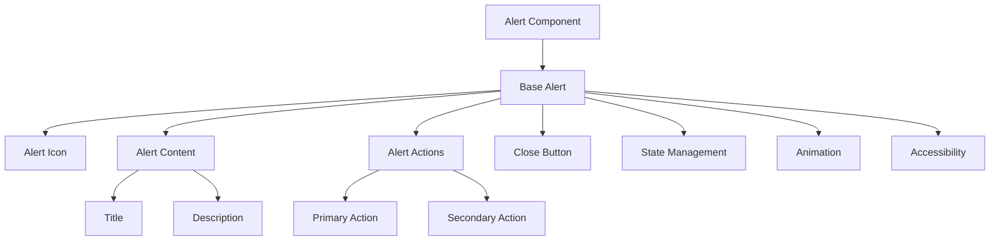
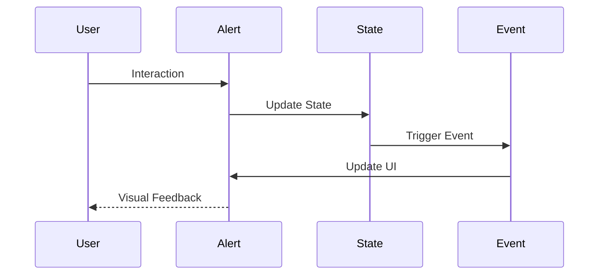
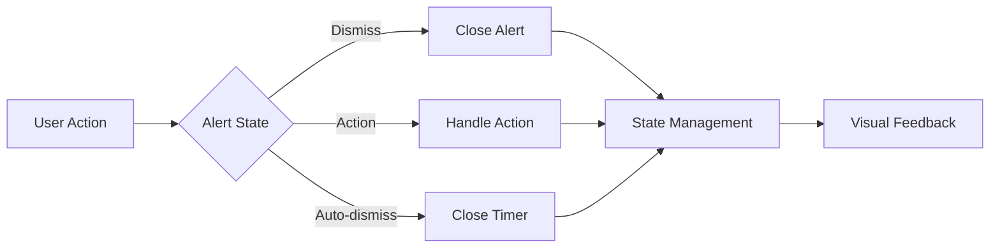

# Alert Component

## Overview
The Alert component is a versatile notification component that displays important messages to users. It supports multiple variants (success, error, warning, info), dismissible states, and custom actions. The component is designed to be accessible, responsive, and consistent with ThriveSend's design system.

## Screenshots

*Main view showing different alert variants*


*Dismissible alert with close button*


*Alert with custom action buttons*


*Mobile view with responsive layout*

## Component Architecture


## Data Flow


## Features
- Multiple variants (success, error, warning, info)
- Dismissible alerts
- Custom actions
- Icon support
- Responsive design
- Keyboard navigation
- Animation support
- State persistence
- Custom themes
- Dark mode support
- RTL support
- Performance optimized
- TypeScript support
- Accessibility support
- Internationalization
- Auto-dismiss
- Custom timing
- Event handling
- State management

## Props
| Name | Type | Required | Default | Description |
|------|------|----------|---------|-------------|
| variant | 'success' \| 'error' \| 'warning' \| 'info' | No | 'info' | Alert variant |
| title | string | No | undefined | Alert title |
| description | string | No | undefined | Alert description |
| dismissible | boolean | No | false | Whether alert can be dismissed |
| onDismiss | () => void | No | undefined | Dismiss handler |
| actions | AlertAction[] | No | undefined | Custom actions |
| icon | ReactNode | No | undefined | Custom icon |
| className | string | No | undefined | Additional CSS classes |
| ariaLabel | string | No | undefined | ARIA label |
| testId | string | No | undefined | Test ID |
| autoDismiss | boolean | No | false | Auto-dismiss after timeout |
| dismissTimeout | number | No | 5000 | Auto-dismiss timeout in ms |

## Usage
```tsx
import { Alert } from '@/components/feedback/Alert';

// Basic usage
<Alert
  variant="success"
  title="Success!"
  description="Your changes have been saved."
  ariaLabel="Success alert"
/>

// Advanced usage
<Alert
  variant="error"
  title="Error"
  description="Something went wrong. Please try again."
  dismissible
  onDismiss={() => console.log('Alert dismissed')}
  actions={[
    {
      label: 'Try Again',
      onClick: () => console.log('Retry clicked'),
      variant: 'primary'
    },
    {
      label: 'Cancel',
      onClick: () => console.log('Cancel clicked'),
      variant: 'secondary'
    }
  ]}
  autoDismiss
  dismissTimeout={3000}
  ariaLabel="Error alert with actions"
/>
```

## User Interaction Workflow


## Components

### Base Alert
- Handles core alert functionality
- Manages state
- Implements animations
- Handles accessibility
- Manages theme

### Alert Icon
- Renders variant icon
- Handles custom icons
- Manages animations
- Implements accessibility
- Handles theme

### Alert Content
- Renders title and description
- Manages layout
- Handles truncation
- Implements accessibility
- Manages theme

### Alert Actions
- Renders action buttons
- Handles click events
- Manages layout
- Implements accessibility
- Handles theme

### Close Button
- Renders close button
- Handles click events
- Manages animations
- Implements accessibility
- Handles theme

## Data Models
```typescript
interface AlertProps {
  variant: 'success' | 'error' | 'warning' | 'info';
  title?: string;
  description?: string;
  dismissible?: boolean;
  onDismiss?: () => void;
  actions?: AlertAction[];
  icon?: ReactNode;
  className?: string;
  ariaLabel?: string;
  testId?: string;
  autoDismiss?: boolean;
  dismissTimeout?: number;
}

interface AlertAction {
  label: string;
  onClick: () => void;
  variant?: 'primary' | 'secondary';
  disabled?: boolean;
}

interface AlertState {
  isVisible: boolean;
  isDismissing: boolean;
  timeoutId?: number;
}

interface AlertEvent {
  type: 'show' | 'hide' | 'action' | 'dismiss';
  timestamp: number;
  data?: {
    action?: string;
    variant?: string;
  };
}
```

## Styling
- Uses Tailwind CSS for styling
- Follows design system color tokens
- Implements consistent spacing
- Supports dark mode
- Maintains accessibility contrast ratios
- Uses CSS variables for theming
- Implements responsive design
- Supports custom animations
- Uses CSS Grid for layout
- Implements proper transitions

## Accessibility
- ARIA labels for screen readers
- Keyboard navigation support
- Focus management
- Color contrast compliance
- State announcements
- RTL support
- Screen reader announcements
- Focus visible states
- Proper role attributes
- Keyboard event handling
- Error message association
- Alert announcements

## Error Handling
- State validation
- Event handling
- Error boundaries
- Fallback content
- Recovery strategies
- User feedback
- Error logging
- State recovery
- Animation fallbacks
- Timeout handling

## Performance Optimizations
- Component memoization
- Render optimization
- Animation optimization
- State batching
- Code splitting
- Bundle optimization
- Memory management
- Event debouncing
- Lazy loading
- Virtual scrolling

## Dependencies
- React
- TypeScript
- Tailwind CSS
- @testing-library/react
- @testing-library/jest-dom
- @testing-library/user-event

## Related Components
- [Toast](../feedback/Toast.md)
- [Modal](../feedback/Modal.md)
- [Button](../ui/Button.md)
- [Icon](../ui/Icon.md)
- [Typography](../ui/Typography.md)

## Examples

### Basic Example
```tsx
import { Alert } from '@/components/feedback/Alert';

export function BasicExample() {
  return (
    <Alert
      variant="success"
      title="Success!"
      description="Your changes have been saved."
      ariaLabel="Success alert"
    />
  );
}
```

### Advanced Example
```tsx
import { Alert } from '@/components/feedback/Alert';
import { useCallback, useState } from 'react';

export function AdvancedExample() {
  const [isVisible, setIsVisible] = useState(true);

  const handleDismiss = useCallback(() => {
    setIsVisible(false);
  }, []);

  const handleRetry = useCallback(() => {
    console.log('Retrying...');
  }, []);

  if (!isVisible) return null;

  return (
    <Alert
      variant="error"
      title="Error"
      description="Something went wrong. Please try again."
      dismissible
      onDismiss={handleDismiss}
      actions={[
        {
          label: 'Try Again',
          onClick: handleRetry,
          variant: 'primary'
        },
        {
          label: 'Cancel',
          onClick: handleDismiss,
          variant: 'secondary'
        }
      ]}
      autoDismiss
      dismissTimeout={3000}
      ariaLabel="Error alert with actions"
    />
  );
}
```

## Best Practices

### Usage Guidelines
1. Use appropriate variants
2. Keep messages concise
3. Include clear actions
4. Handle dismiss events
5. Follow accessibility guidelines
6. Optimize for performance
7. Use TypeScript for type safety
8. Add proper test IDs
9. Handle edge cases
10. Implement proper state

### Performance Tips
1. Memoize components
2. Use proper state management
3. Optimize re-renders
4. Implement proper loading
5. Use proper error boundaries
6. Optimize bundle size
7. Use proper code splitting
8. Implement proper caching
9. Use proper lazy loading
10. Monitor performance metrics

### Security Considerations
1. Validate user input
2. Prevent XSS attacks
3. Handle sensitive data
4. Implement proper authentication
5. Use proper authorization
6. Handle errors securely
7. Implement proper logging
8. Use proper encryption
9. Follow security best practices
10. Regular security audits

## Troubleshooting

### Common Issues
| Issue | Solution |
|-------|----------|
| Alert not showing | Check visibility state |
| Dismiss not working | Verify onDismiss handler |
| Actions not working | Check action handlers |
| Styling issues | Verify Tailwind classes |
| Accessibility issues | Check ARIA labels |

### Error Messages
| Error Code | Description | Resolution |
|------------|-------------|------------|
| ERR001 | Invalid variant | Check variant prop |
| ERR002 | Missing handler | Add required handler |
| ERR003 | Invalid action | Check action config |
| ERR004 | Theme error | Verify theme settings |
| ERR005 | Event error | Check event handlers |

## Contributing

### Development Setup
1. Clone the repository
2. Install dependencies
3. Run development server
4. Make changes
5. Run tests
6. Submit PR

### Testing
```typescript
import { render, screen, fireEvent } from '@testing-library/react';
import { Alert } from './Alert';

describe('Alert', () => {
  it('renders correctly', () => {
    render(
      <Alert
        variant="success"
        title="Success!"
        description="Test description"
      />
    );
    expect(screen.getByText('Success!')).toBeInTheDocument();
    expect(screen.getByText('Test description')).toBeInTheDocument();
  });

  it('handles dismiss', () => {
    const handleDismiss = jest.fn();
    render(
      <Alert
        variant="info"
        dismissible
        onDismiss={handleDismiss}
      />
    );
    fireEvent.click(screen.getByRole('button'));
    expect(handleDismiss).toHaveBeenCalled();
  });
});
```

### Code Style
- Follow TypeScript best practices
- Use ESLint rules
- Follow Prettier configuration
- Write meaningful comments
- Use proper naming conventions
- Follow component patterns
- Use proper documentation
- Follow testing practices
- Use proper error handling
- Follow security guidelines

## Changelog

### Version 1.0.0
- Initial release
- Basic variants
- Dismissible alerts
- Custom actions
- Mobile support

### Version 1.1.0
- Added auto-dismiss
- Improved performance
- Enhanced accessibility
- Added dark mode
- Added RTL support

## Appendix

### Glossary
- **Alert**: Notification component
- **Variant**: Alert type/style
- **Dismissible**: Can be closed
- **Actions**: Custom buttons
- **Auto-dismiss**: Automatic closing

### FAQ
#### How do I make an alert dismissible?
Set the `dismissible` prop to true and provide an `onDismiss` handler.

#### How do I add custom actions?
Use the `actions` prop to provide an array of action buttons.

#### How do I implement auto-dismiss?
Set `autoDismiss` to true and optionally configure `dismissTimeout`. 