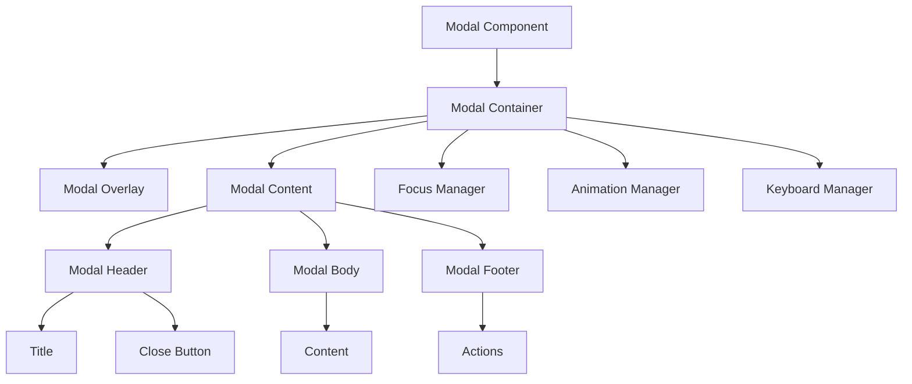
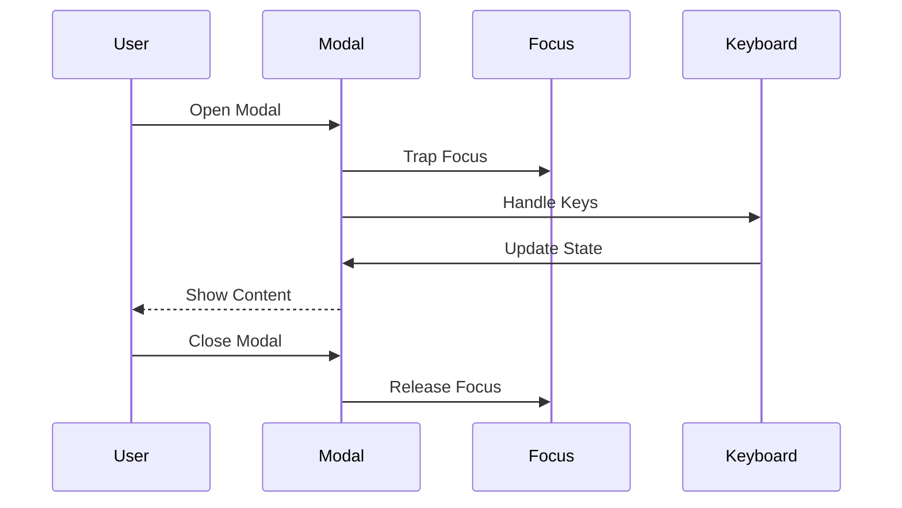
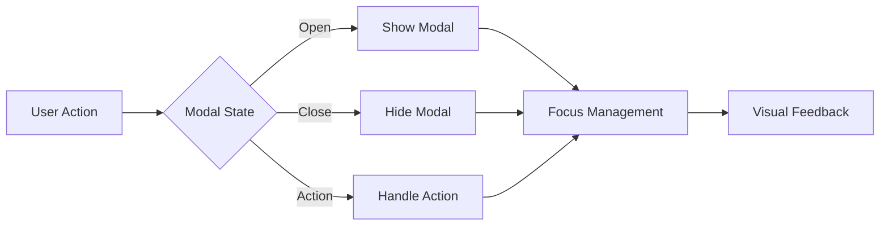

# Modal Component

## Overview
The Modal component is a versatile dialog component that displays content in an overlay. It supports various sizes, custom content, and advanced features like focus trapping and keyboard navigation. The component is designed to be accessible, responsive, and consistent with ThriveSend's design system.

## Screenshots

*Main view showing different modal sizes*


*Modal with form content*


*Mobile view with responsive layout*


*Custom modal with complex content*

## Component Architecture


## Data Flow


## Features
- Multiple sizes (sm, md, lg, xl)
- Custom positioning
- Focus trapping
- Keyboard navigation
- Custom content
- Action buttons
- Icon support
- Responsive design
- Animation support
- State management
- Custom themes
- Dark mode support
- RTL support
- Performance optimized
- TypeScript support
- Accessibility support
- Internationalization
- Backdrop blur
- Custom animations
- Event handling
- State persistence

## Props
| Name | Type | Required | Default | Description |
|------|------|----------|---------|-------------|
| isOpen | boolean | Yes | undefined | Modal visibility |
| onClose | () => void | Yes | undefined | Close handler |
| title | string | No | undefined | Modal title |
| children | ReactNode | No | undefined | Modal content |
| size | 'sm' \| 'md' \| 'lg' \| 'xl' | No | 'md' | Modal size |
| actions | ModalAction[] | No | undefined | Action buttons |
| icon | ReactNode | No | undefined | Custom icon |
| className | string | No | undefined | Additional CSS classes |
| ariaLabel | string | No | undefined | ARIA label |
| testId | string | No | undefined | Test ID |
| closeOnEsc | boolean | No | true | Close on Escape key |
| closeOnOverlayClick | boolean | No | true | Close on overlay click |
| showCloseButton | boolean | No | true | Show close button |
| backdropBlur | boolean | No | false | Enable backdrop blur |

## Usage
```tsx
import { Modal } from '@/components/feedback/Modal';
import { useState } from 'react';

// Basic usage
function BasicModal() {
  const [isOpen, setIsOpen] = useState(false);

  return (
    <>
      <button onClick={() => setIsOpen(true)}>
        Open Modal
      </button>
      <Modal
        isOpen={isOpen}
        onClose={() => setIsOpen(false)}
        title="Basic Modal"
        ariaLabel="Basic modal example"
      >
        <p>Modal content goes here.</p>
      </Modal>
    </>
  );
}

// Advanced usage
function AdvancedModal() {
  const [isOpen, setIsOpen] = useState(false);

  return (
    <>
      <button onClick={() => setIsOpen(true)}>
        Open Advanced Modal
      </button>
      <Modal
        isOpen={isOpen}
        onClose={() => setIsOpen(false)}
        title="Advanced Modal"
        size="lg"
        actions={[
          {
            label: 'Save',
            onClick: () => console.log('Save clicked'),
            variant: 'primary'
          },
          {
            label: 'Cancel',
            onClick: () => setIsOpen(false),
            variant: 'secondary'
          }
        ]}
        closeOnEsc
        closeOnOverlayClick
        showCloseButton
        backdropBlur
        ariaLabel="Advanced modal example"
      >
        <div className="space-y-4">
          <h3>Complex Content</h3>
          <p>This modal contains complex content with multiple sections.</p>
          <form className="space-y-4">
            {/* Form fields */}
          </form>
        </div>
      </Modal>
    </>
  );
}
```

## User Interaction Workflow


## Components

### Modal Container
- Manages modal state
- Handles positioning
- Implements animations
- Manages focus
- Handles theme

### Modal Overlay
- Renders backdrop
- Handles clicks
- Manages blur
- Implements animations
- Handles theme

### Modal Content
- Renders modal content
- Manages layout
- Handles sizing
- Implements accessibility
- Handles theme

### Modal Header
- Renders title
- Handles close button
- Manages layout
- Implements accessibility
- Handles theme

### Modal Body
- Renders content
- Manages scrolling
- Handles overflow
- Implements accessibility
- Handles theme

### Modal Footer
- Renders actions
- Handles layout
- Manages spacing
- Implements accessibility
- Handles theme

## Data Models
```typescript
interface ModalProps {
  isOpen: boolean;
  onClose: () => void;
  title?: string;
  children?: ReactNode;
  size?: 'sm' | 'md' | 'lg' | 'xl';
  actions?: ModalAction[];
  icon?: ReactNode;
  className?: string;
  ariaLabel?: string;
  testId?: string;
  closeOnEsc?: boolean;
  closeOnOverlayClick?: boolean;
  showCloseButton?: boolean;
  backdropBlur?: boolean;
}

interface ModalAction {
  label: string;
  onClick: () => void;
  variant?: 'primary' | 'secondary';
  disabled?: boolean;
}

interface ModalState {
  isVisible: boolean;
  isAnimating: boolean;
  focusableElements: HTMLElement[];
  lastFocusedElement: HTMLElement | null;
}

interface ModalEvent {
  type: 'open' | 'close' | 'action' | 'keydown';
  timestamp: number;
  data?: {
    action?: string;
    key?: string;
  };
}
```

## Styling
- Uses Tailwind CSS for styling
- Follows design system color tokens
- Implements consistent spacing
- Supports dark mode
- Maintains accessibility contrast ratios
- Uses CSS variables for theming
- Implements responsive design
- Supports custom animations
- Uses CSS Grid for layout
- Implements proper transitions

## Accessibility
- ARIA labels for screen readers
- Keyboard navigation support
- Focus management
- Color contrast compliance
- State announcements
- RTL support
- Screen reader announcements
- Focus visible states
- Proper role attributes
- Keyboard event handling
- Error message association
- Modal announcements

## Error Handling
- State validation
- Event handling
- Error boundaries
- Fallback content
- Recovery strategies
- User feedback
- Error logging
- State recovery
- Animation fallbacks
- Focus recovery

## Performance Optimizations
- Component memoization
- Render optimization
- Animation optimization
- State batching
- Code splitting
- Bundle optimization
- Memory management
- Event debouncing
- Lazy loading
- Virtual scrolling

## Dependencies
- React
- TypeScript
- Tailwind CSS
- @testing-library/react
- @testing-library/jest-dom
- @testing-library/user-event

## Related Components
- [Alert](../feedback/Alert.md)
- [Toast](../feedback/Toast.md)
- [Button](../ui/Button.md)
- [Icon](../ui/Icon.md)
- [Typography](../ui/Typography.md)

## Examples

### Basic Example
```tsx
import { Modal } from '@/components/feedback/Modal';
import { useState } from 'react';

export function BasicExample() {
  const [isOpen, setIsOpen] = useState(false);

  return (
    <>
      <button onClick={() => setIsOpen(true)}>
        Open Modal
      </button>
      <Modal
        isOpen={isOpen}
        onClose={() => setIsOpen(false)}
        title="Basic Modal"
        ariaLabel="Basic modal example"
      >
        <p>Modal content goes here.</p>
      </Modal>
    </>
  );
}
```

### Advanced Example
```tsx
import { Modal } from '@/components/feedback/Modal';
import { useState, useCallback } from 'react';

export function AdvancedExample() {
  const [isOpen, setIsOpen] = useState(false);

  const handleSave = useCallback(() => {
    console.log('Save clicked');
    setIsOpen(false);
  }, []);

  return (
    <>
      <button onClick={() => setIsOpen(true)}>
        Open Advanced Modal
      </button>
      <Modal
        isOpen={isOpen}
        onClose={() => setIsOpen(false)}
        title="Advanced Modal"
        size="lg"
        actions={[
          {
            label: 'Save',
            onClick: handleSave,
            variant: 'primary'
          },
          {
            label: 'Cancel',
            onClick: () => setIsOpen(false),
            variant: 'secondary'
          }
        ]}
        closeOnEsc
        closeOnOverlayClick
        showCloseButton
        backdropBlur
        ariaLabel="Advanced modal example"
      >
        <div className="space-y-4">
          <h3>Complex Content</h3>
          <p>This modal contains complex content with multiple sections.</p>
          <form className="space-y-4">
            {/* Form fields */}
          </form>
        </div>
      </Modal>
    </>
  );
}
```

## Best Practices

### Usage Guidelines
1. Use appropriate sizes
2. Keep content focused
3. Include clear actions
4. Handle close events
5. Follow accessibility guidelines
6. Optimize for performance
7. Use TypeScript for type safety
8. Add proper test IDs
9. Handle edge cases
10. Implement proper state

### Performance Tips
1. Memoize components
2. Use proper state management
3. Optimize re-renders
4. Implement proper loading
5. Use proper error boundaries
6. Optimize bundle size
7. Use proper code splitting
8. Implement proper caching
9. Use proper lazy loading
10. Monitor performance metrics

### Security Considerations
1. Validate user input
2. Prevent XSS attacks
3. Handle sensitive data
4. Implement proper authentication
5. Use proper authorization
6. Handle errors securely
7. Implement proper logging
8. Use proper encryption
9. Follow security best practices
10. Regular security audits

## Troubleshooting

### Common Issues
| Issue | Solution |
|-------|----------|
| Modal not showing | Check isOpen state |
| Close not working | Verify onClose handler |
| Actions not working | Check action handlers |
| Styling issues | Verify Tailwind classes |
| Accessibility issues | Check ARIA labels |

### Error Messages
| Error Code | Description | Resolution |
|------------|-------------|------------|
| ERR001 | Invalid size | Check size prop |
| ERR002 | Missing handler | Add required handler |
| ERR003 | Invalid action | Check action config |
| ERR004 | Theme error | Verify theme settings |
| ERR005 | Event error | Check event handlers |

## Contributing

### Development Setup
1. Clone the repository
2. Install dependencies
3. Run development server
4. Make changes
5. Run tests
6. Submit PR

### Testing
```typescript
import { render, screen, fireEvent } from '@testing-library/react';
import { Modal } from './Modal';

describe('Modal', () => {
  it('renders correctly', () => {
    render(
      <Modal
        isOpen={true}
        onClose={() => {}}
        title="Test Modal"
      >
        <p>Test content</p>
      </Modal>
    );
    expect(screen.getByText('Test Modal')).toBeInTheDocument();
    expect(screen.getByText('Test content')).toBeInTheDocument();
  });

  it('handles close', () => {
    const handleClose = jest.fn();
    render(
      <Modal
        isOpen={true}
        onClose={handleClose}
      />
    );
    fireEvent.click(screen.getByRole('button'));
    expect(handleClose).toHaveBeenCalled();
  });
});
```

### Code Style
- Follow TypeScript best practices
- Use ESLint rules
- Follow Prettier configuration
- Write meaningful comments
- Use proper naming conventions
- Follow component patterns
- Use proper documentation
- Follow testing practices
- Use proper error handling
- Follow security guidelines

## Changelog

### Version 1.0.0
- Initial release
- Basic sizes
- Focus management
- Custom actions
- Mobile support

### Version 1.1.0
- Added backdrop blur
- Improved performance
- Enhanced accessibility
- Added dark mode
- Added RTL support

## Appendix

### Glossary
- **Modal**: Dialog component
- **Size**: Modal dimensions
- **Actions**: Custom buttons
- **Focus**: Keyboard focus
- **Backdrop**: Overlay background

### FAQ
#### How do I control modal visibility?
Use the `isOpen` prop and `onClose` handler to manage modal state.

#### How do I customize the size?
Use the `size` prop to set the modal dimensions.

#### How do I add custom actions?
Use the `actions` prop to provide an array of action buttons. 