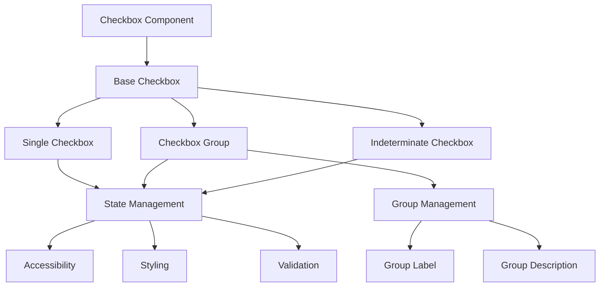
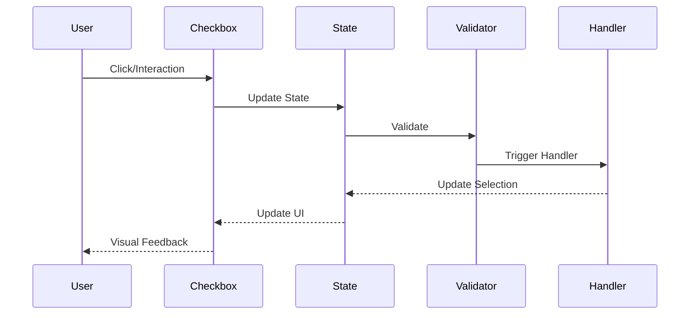
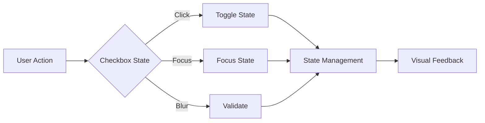

# Checkbox Component

## Overview
The Checkbox component is a fundamental form control that allows users to make binary choices. It supports single and group selection, indeterminate states, and comprehensive accessibility features while maintaining consistent styling and behavior across the application.

## Screenshots

*Main view showing different checkbox variants*


*Different states: unchecked, checked, indeterminate, and disabled*


*Checkbox group with labels and descriptions*


*Checkboxes with custom icons and states*

## Component Architecture


## Data Flow


## Features
- Single and group selection
- Indeterminate state
- Custom icons
- Disabled state
- Error state
- Full accessibility support
- TypeScript type safety
- Performance optimized
- Dark mode support
- Custom theme support
- RTL support
- Focus management
- Form integration
- Group validation
- Custom styling
- Label positioning
- Description support

## Props
| Name | Type | Required | Default | Description |
|------|------|----------|---------|-------------|
| checked | boolean | No | false | Checkbox state |
| onChange | (checked: boolean) => void | No | undefined | Change handler |
| label | string | No | undefined | Checkbox label |
| description | string | No | undefined | Description text |
| disabled | boolean | No | false | Disables the checkbox |
| error | string | No | undefined | Error message |
| indeterminate | boolean | No | false | Shows indeterminate state |
| required | boolean | No | false | Makes checkbox required |
| name | string | No | undefined | Checkbox name |
| id | string | No | undefined | Checkbox ID |
| className | string | No | undefined | Additional CSS classes |
| ariaLabel | string | No | undefined | ARIA label |
| testId | string | No | undefined | Test ID |

## Usage
```tsx
import { Checkbox } from '@/components/forms/Checkbox';

// Basic usage
<Checkbox
  label="Accept terms"
  onChange={handleChange}
  ariaLabel="Accept terms and conditions"
/>

// With description
<Checkbox
  label="Newsletter subscription"
  description="Receive weekly updates"
  onChange={handleChange}
  ariaLabel="Subscribe to newsletter"
/>

// Indeterminate state
<Checkbox
  label="Select all"
  indeterminate={true}
  onChange={handleChange}
  ariaLabel="Select all items"
/>

// With error
<Checkbox
  label="Required field"
  error="This field is required"
  required
  ariaLabel="Required checkbox"
/>
```

## User Interaction Workflow


## Components

### Base Checkbox
- Handles core checkbox functionality
- Manages state transitions
- Implements accessibility features
- Handles event propagation
- Manages focus states

### Checkbox Group
- Manages multiple checkboxes
- Handles group validation
- Manages group state
- Implements group accessibility
- Handles group events

### Checkbox Label
- Renders checkbox label
- Manages label positioning
- Handles label interactions
- Implements label accessibility
- Manages label styling

## Data Models
```typescript
interface CheckboxProps {
  checked?: boolean;
  onChange?: (checked: boolean) => void;
  label?: string;
  description?: string;
  disabled?: boolean;
  error?: string;
  indeterminate?: boolean;
  required?: boolean;
  name?: string;
  id?: string;
  className?: string;
  ariaLabel?: string;
  testId?: string;
}

interface CheckboxState {
  isChecked: boolean;
  isIndeterminate: boolean;
  isFocused: boolean;
  isDisabled: boolean;
  error?: string;
}

interface CheckboxEvent {
  type: 'change' | 'focus' | 'blur';
  timestamp: number;
  target: HTMLInputElement;
}

interface CheckboxGroupProps {
  label?: string;
  description?: string;
  error?: string;
  required?: boolean;
  children: ReactNode;
  onChange?: (values: string[]) => void;
  value?: string[];
  name?: string;
  className?: string;
  ariaLabel?: string;
}
```

## Styling
- Uses Tailwind CSS for styling
- Follows design system color tokens
- Implements consistent spacing
- Supports dark mode
- Maintains accessibility contrast ratios
- Uses CSS variables for theming
- Implements responsive design
- Supports custom animations
- Uses CSS Grid for layout
- Implements proper transitions

## Accessibility
- ARIA labels for screen readers
- Keyboard navigation support
- Focus management
- Color contrast compliance
- State announcements
- RTL support
- Screen reader announcements
- Focus visible states
- Proper role attributes
- Keyboard event handling
- Error message association
- Required field indication

## Error Handling
- Input validation
- Error state management
- Error message display
- Recovery strategies
- User feedback
- Form integration
- Validation rules
- Error boundaries
- Error logging
- Recovery options

## Performance Optimizations
- Memoized callbacks
- Optimized re-renders
- CSS-in-JS optimization
- Event handling optimization
- State batching
- Code splitting
- Bundle optimization
- Memory management
- Render optimization
- Group state optimization

## Dependencies
- React
- TypeScript
- Tailwind CSS
- React Icons (optional)
- @testing-library/react
- @testing-library/jest-dom
- @testing-library/user-event

## Related Components
- [Input](./Input.md)
- [Select](./Select.md)
- [Label](./Label.md)
- [Error](./Error.md)
- [Icon](./Icon.md)

## Examples

### Basic Example
```tsx
import { Checkbox } from '@/components/forms/Checkbox';

export function BasicExample() {
  return (
    <Checkbox
      label="Accept terms"
      onChange={handleChange}
      ariaLabel="Accept terms and conditions"
    />
  );
}
```

### Advanced Example
```tsx
import { Checkbox } from '@/components/forms/Checkbox';
import { useCallback, useState } from 'react';

export function AdvancedExample() {
  const [checked, setChecked] = useState(false);
  const [error, setError] = useState('');
  
  const handleChange = useCallback((isChecked: boolean) => {
    setChecked(isChecked);
    if (!isChecked) {
      setError('You must accept the terms to continue');
    } else {
      setError('');
    }
  }, []);

  return (
    <Checkbox
      label="Accept terms and conditions"
      description="By checking this box, you agree to our terms"
      checked={checked}
      onChange={handleChange}
      error={error}
      required
      ariaLabel="Accept terms and conditions"
    />
  );
}
```

## Best Practices

### Usage Guidelines
1. Always provide proper labels
2. Include appropriate ARIA attributes
3. Handle validation properly
4. Use appropriate state management
5. Implement proper error handling
6. Follow accessibility guidelines
7. Optimize for performance
8. Use TypeScript for type safety
9. Add proper test IDs
10. Handle edge cases

### Performance Tips
1. Memoize event handlers
2. Use proper state management
3. Optimize re-renders
4. Implement proper validation
5. Use proper error boundaries
6. Optimize bundle size
7. Use proper code splitting
8. Implement proper caching
9. Use proper lazy loading
10. Monitor performance metrics

### Security Considerations
1. Validate input data
2. Prevent XSS attacks
3. Handle sensitive data
4. Implement proper authentication
5. Use proper authorization
6. Handle errors securely
7. Implement proper logging
8. Use proper encryption
9. Follow security best practices
10. Regular security audits

## Troubleshooting

### Common Issues
| Issue | Solution |
|-------|----------|
| Checkbox not updating | Check onChange handler and checked prop |
| Indeterminate not working | Verify indeterminate prop and state management |
| Accessibility issues | Verify ARIA labels and keyboard navigation |
| Styling issues | Check Tailwind classes and theme |
| Group state issues | Check group state management and event handling |

### Error Messages
| Error Code | Description | Resolution |
|------------|-------------|------------|
| ERR001 | Invalid state | Check state management |
| ERR002 | Validation failed | Fix validation rules |
| ERR003 | Required field | Provide required value |
| ERR004 | Group error | Check group state |
| ERR005 | Invalid event | Check event handler |

## Contributing

### Development Setup
1. Clone the repository
2. Install dependencies
3. Run development server
4. Make changes
5. Run tests
6. Submit PR

### Testing
```typescript
import { render, screen, fireEvent } from '@testing-library/react';
import { Checkbox } from './Checkbox';

describe('Checkbox', () => {
  it('renders correctly', () => {
    render(<Checkbox label="Test checkbox" />);
    expect(screen.getByLabelText('Test checkbox')).toBeInTheDocument();
  });

  it('handles change events', () => {
    const handleChange = jest.fn();
    render(<Checkbox label="Test checkbox" onChange={handleChange} />);
    fireEvent.click(screen.getByLabelText('Test checkbox'));
    expect(handleChange).toHaveBeenCalledWith(true);
  });
});
```

### Code Style
- Follow TypeScript best practices
- Use ESLint rules
- Follow Prettier configuration
- Write meaningful comments
- Use proper naming conventions
- Follow component patterns
- Use proper documentation
- Follow testing practices
- Use proper error handling
- Follow security guidelines

## Changelog

### Version 1.0.0
- Initial release
- Basic checkbox functionality
- Group support
- Indeterminate state
- Accessibility features

### Version 1.1.0
- Added custom icons
- Improved accessibility
- Enhanced performance
- Added dark mode
- Added RTL support

## Appendix

### Glossary
- **State**: Checkbox interaction state
- **Group**: Collection of related checkboxes
- **Indeterminate**: Partial selection state
- **Label**: Text description of checkbox
- **Validation**: Input validation rules

### FAQ
#### How do I implement an indeterminate state?
Use the indeterminate prop and manage the state in your component.

#### How do I handle checkbox groups?
Use the CheckboxGroup component to manage multiple related checkboxes.

#### How do I make the checkbox accessible?
Include proper ARIA labels and ensure keyboard navigation works. 