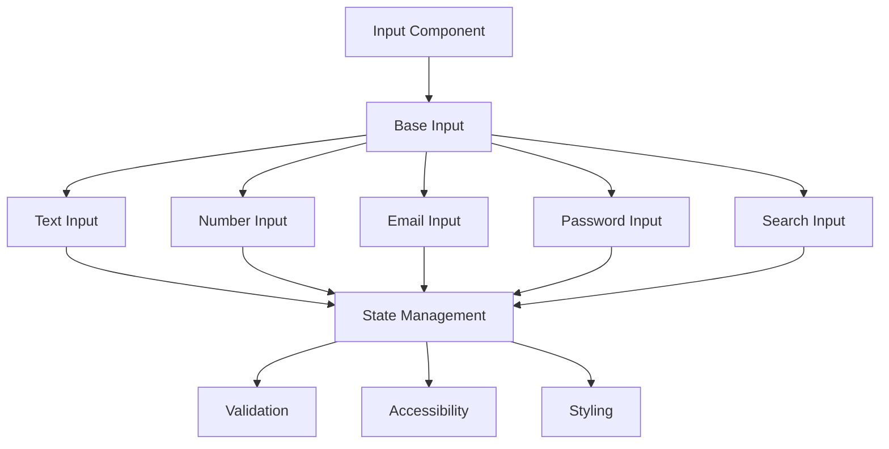
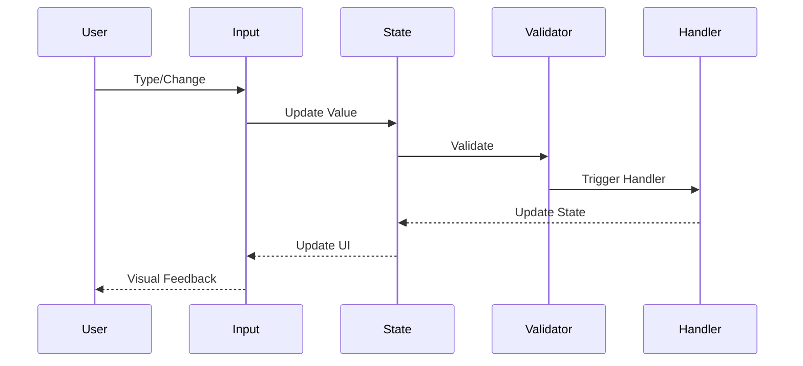
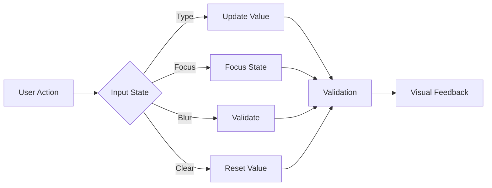

# Input Component

## Overview
The Input component is a versatile form control that allows users to enter text, numbers, and other data types. It supports various input types, validation states, and accessibility features while maintaining consistent styling and behavior across the application.

## Screenshots

*Main view showing different input variants*


*Different states: default, focus, error, and disabled*


*Available input types: text, number, email, password*


*Inputs with icons and validation states*

## Component Architecture


## Data Flow


## Features
- Multiple input types (text, number, email, password)
- Validation states (error, success, warning)
- Icon support (prefix and suffix)
- Disabled state
- Read-only state
- Full accessibility support
- TypeScript type safety
- Performance optimized
- Dark mode support
- Custom theme support
- RTL support
- Focus management
- Keyboard navigation
- Form integration
- Auto-complete support
- Character counter
- Clear button
- Custom validation

## Props
| Name | Type | Required | Default | Description |
|------|------|----------|---------|-------------|
| type | 'text' \| 'number' \| 'email' \| 'password' \| 'search' | No | 'text' | Input type |
| value | string \| number | No | '' | Input value |
| onChange | (value: string \| number) => void | No | undefined | Change handler |
| placeholder | string | No | undefined | Placeholder text |
| disabled | boolean | No | false | Disables the input |
| readOnly | boolean | No | false | Makes input read-only |
| error | string | No | undefined | Error message |
| success | string | No | undefined | Success message |
| warning | string | No | undefined | Warning message |
| prefix | ReactNode | No | undefined | Prefix icon/element |
| suffix | ReactNode | No | undefined | Suffix icon/element |
| maxLength | number | No | undefined | Maximum length |
| minLength | number | No | undefined | Minimum length |
| required | boolean | No | false | Makes input required |
| name | string | No | undefined | Input name |
| id | string | No | undefined | Input ID |
| className | string | No | undefined | Additional CSS classes |
| ariaLabel | string | No | undefined | ARIA label |
| testId | string | No | undefined | Test ID |

## Usage
```tsx
import { Input } from '@/components/forms/Input';

// Basic usage
<Input
  type="text"
  placeholder="Enter your name"
  ariaLabel="Name input"
/>

// With validation
<Input
  type="email"
  value={email}
  onChange={handleEmailChange}
  error={emailError}
  ariaLabel="Email input"
/>

// With icons
<Input
  type="search"
  prefix={<SearchIcon />}
  suffix={<ClearIcon />}
  placeholder="Search..."
  ariaLabel="Search input"
/>

// With character counter
<Input
  type="text"
  maxLength={100}
  showCounter
  ariaLabel="Description input"
/>
```

## User Interaction Workflow


## Components

### Base Input
- Handles core input functionality
- Manages state transitions
- Implements accessibility features
- Handles event propagation
- Manages focus states

### Text Input
- Extends base input
- Handles text validation
- Manages character limits
- Supports auto-complete
- Handles copy/paste

### Number Input
- Extends base input
- Handles number validation
- Manages min/max values
- Supports step increments
- Handles decimal places

### Password Input
- Extends base input
- Manages password visibility
- Handles password strength
- Supports show/hide toggle
- Implements security features

## Data Models
```typescript
interface InputProps {
  type?: 'text' | 'number' | 'email' | 'password' | 'search';
  value?: string | number;
  onChange?: (value: string | number) => void;
  placeholder?: string;
  disabled?: boolean;
  readOnly?: boolean;
  error?: string;
  success?: string;
  warning?: string;
  prefix?: ReactNode;
  suffix?: ReactNode;
  maxLength?: number;
  minLength?: number;
  required?: boolean;
  name?: string;
  id?: string;
  className?: string;
  ariaLabel?: string;
  testId?: string;
}

interface InputState {
  value: string | number;
  isFocused: boolean;
  isDirty: boolean;
  isValid: boolean;
  error?: string;
}

interface InputEvent {
  type: 'change' | 'focus' | 'blur' | 'clear';
  timestamp: number;
  target: HTMLInputElement;
}
```

## Styling
- Uses Tailwind CSS for styling
- Follows design system color tokens
- Implements consistent spacing
- Supports dark mode
- Maintains accessibility contrast ratios
- Uses CSS variables for theming
- Implements responsive design
- Supports custom animations
- Uses CSS Grid for layout
- Implements proper transitions

## Accessibility
- ARIA labels for screen readers
- Keyboard navigation support
- Focus management
- Color contrast compliance
- Error state announcements
- RTL support
- Screen reader announcements
- Focus visible states
- Proper role attributes
- Keyboard event handling
- Error message association
- Required field indication

## Error Handling
- Input validation
- Error state management
- Error message display
- Recovery strategies
- User feedback
- Form integration
- Validation rules
- Error boundaries
- Error logging
- Recovery options

## Performance Optimizations
- Debounced change handler
- Memoized callbacks
- Optimized re-renders
- CSS-in-JS optimization
- Event handling optimization
- State batching
- Code splitting
- Bundle optimization
- Memory management
- Render optimization

## Dependencies
- React
- TypeScript
- Tailwind CSS
- React Icons (optional)
- @testing-library/react
- @testing-library/jest-dom
- @testing-library/user-event
- Form validation library

## Related Components
- [Form](./Form.md)
- [Label](./Label.md)
- [Error](./Error.md)
- [Icon](./Icon.md)
- [Tooltip](./Tooltip.md)

## Examples

### Basic Example
```tsx
import { Input } from '@/components/forms/Input';

export function BasicExample() {
  return (
    <Input
      type="text"
      placeholder="Enter your name"
      ariaLabel="Name input"
    />
  );
}
```

### Advanced Example
```tsx
import { Input } from '@/components/forms/Input';
import { useCallback, useState } from 'react';

export function AdvancedExample() {
  const [value, setValue] = useState('');
  const [error, setError] = useState('');
  
  const handleChange = useCallback((newValue: string) => {
    setValue(newValue);
    if (newValue.length < 3) {
      setError('Name must be at least 3 characters');
    } else {
      setError('');
    }
  }, []);

  return (
    <Input
      type="text"
      value={value}
      onChange={handleChange}
      error={error}
      placeholder="Enter your name"
      ariaLabel="Name input"
      required
    />
  );
}
```

## Best Practices

### Usage Guidelines
1. Always provide proper labels
2. Include appropriate ARIA attributes
3. Handle validation properly
4. Use appropriate input types
5. Implement proper error handling
6. Follow accessibility guidelines
7. Optimize for performance
8. Use TypeScript for type safety
9. Add proper test IDs
10. Handle edge cases

### Performance Tips
1. Debounce change handlers
2. Use proper state management
3. Optimize re-renders
4. Implement proper validation
5. Use proper error boundaries
6. Optimize bundle size
7. Use proper code splitting
8. Implement proper caching
9. Use proper lazy loading
10. Monitor performance metrics

### Security Considerations
1. Validate user input
2. Prevent XSS attacks
3. Handle sensitive data
4. Implement proper authentication
5. Use proper authorization
6. Handle errors securely
7. Implement proper logging
8. Use proper encryption
9. Follow security best practices
10. Regular security audits

## Troubleshooting

### Common Issues
| Issue | Solution |
|-------|----------|
| Input not updating | Check onChange handler and value prop |
| Validation not working | Verify validation rules and error handling |
| Styling issues | Check Tailwind classes and theme |
| Accessibility issues | Verify ARIA labels and keyboard navigation |
| Performance issues | Check debouncing and state management |

### Error Messages
| Error Code | Description | Resolution |
|------------|-------------|------------|
| ERR001 | Invalid input type | Use valid input type |
| ERR002 | Invalid value | Check value format |
| ERR003 | Validation failed | Fix validation rules |
| ERR004 | Required field | Provide required value |
| ERR005 | Invalid state | Check state management |

## Contributing

### Development Setup
1. Clone the repository
2. Install dependencies
3. Run development server
4. Make changes
5. Run tests
6. Submit PR

### Testing
```typescript
import { render, screen, fireEvent } from '@testing-library/react';
import { Input } from './Input';

describe('Input', () => {
  it('renders correctly', () => {
    render(<Input type="text" placeholder="Enter text" />);
    expect(screen.getByPlaceholderText('Enter text')).toBeInTheDocument();
  });

  it('handles change events', () => {
    const handleChange = jest.fn();
    render(<Input type="text" onChange={handleChange} />);
    fireEvent.change(screen.getByRole('textbox'), { target: { value: 'test' } });
    expect(handleChange).toHaveBeenCalledWith('test');
  });
});
```

### Code Style
- Follow TypeScript best practices
- Use ESLint rules
- Follow Prettier configuration
- Write meaningful comments
- Use proper naming conventions
- Follow component patterns
- Use proper documentation
- Follow testing practices
- Use proper error handling
- Follow security guidelines

## Changelog

### Version 1.0.0
- Initial release
- Basic input functionality
- Multiple input types
- Validation support
- Icon support

### Version 1.1.0
- Added character counter
- Improved accessibility
- Enhanced performance
- Added dark mode
- Added RTL support

## Appendix

### Glossary
- **Type**: Input field type
- **Value**: Current input value
- **Validation**: Input validation rules
- **State**: Input interaction state
- **Error**: Validation error message

### FAQ
#### How do I add validation to an input?
Use the error prop and implement validation logic in the onChange handler.

#### How do I handle different input types?
Use the type prop to specify the input type (text, number, email, etc.).

#### How do I make the input accessible?
Include proper ARIA labels and ensure keyboard navigation works. 