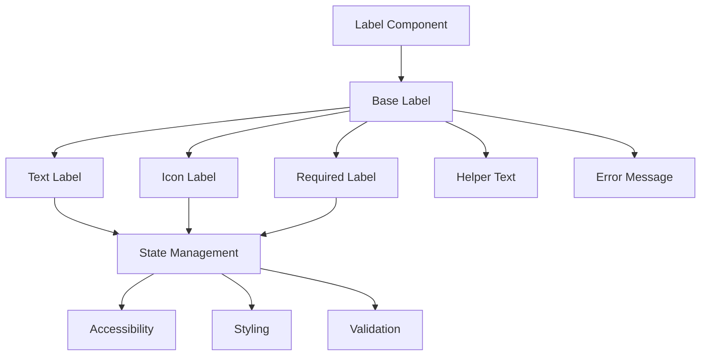
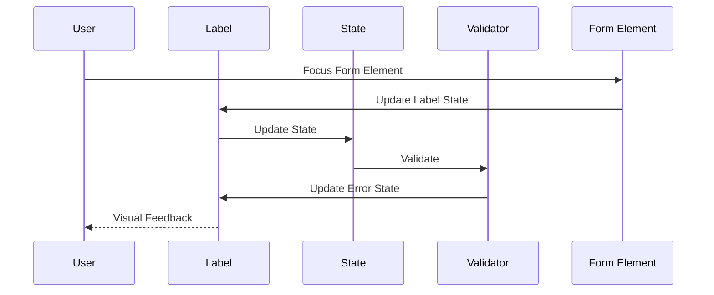
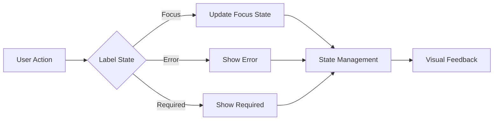

# Label Component

## Overview
The Label component is a fundamental form control that provides accessible labels for form elements. It supports required field indication, error states, and comprehensive accessibility features while maintaining consistent styling and behavior across the application.

## Screenshots

*Main view showing different label variants*


*Different states: default, required, error, and disabled*


*Label with description and helper text*


*Label with icon and additional information*

## Component Architecture


## Data Flow


## Features
- Required field indication
- Error state support
- Helper text
- Icon support
- Full accessibility support
- TypeScript type safety
- Performance optimized
- Dark mode support
- Custom theme support
- RTL support
- Focus management
- Form integration
- Custom styling
- Description support
- HTML for support
- Custom positioning

## Props
| Name | Type | Required | Default | Description |
|------|------|----------|---------|-------------|
| htmlFor | string | No | undefined | ID of the form element |
| children | ReactNode | Yes | undefined | Label content |
| required | boolean | No | false | Shows required indicator |
| error | string | No | undefined | Error message |
| description | string | No | undefined | Helper text |
| disabled | boolean | No | false | Disables the label |
| className | string | No | undefined | Additional CSS classes |
| ariaLabel | string | No | undefined | ARIA label |
| testId | string | No | undefined | Test ID |
| icon | ReactNode | No | undefined | Icon element |
| position | 'top' \| 'left' | No | 'top' | Label position |

## Usage
```tsx
import { Label } from '@/components/forms/Label';

// Basic usage
<Label htmlFor="username">Username</Label>

// With required indicator
<Label htmlFor="email" required>
  Email Address
</Label>

// With description
<Label
  htmlFor="password"
  description="Must be at least 8 characters"
  required
>
  Password
</Label>

// With error
<Label
  htmlFor="confirm-password"
  error="Passwords do not match"
  required
>
  Confirm Password
</Label>
```

## User Interaction Workflow


## Components

### Base Label
- Handles core label functionality
- Manages state transitions
- Implements accessibility features
- Handles event propagation
- Manages focus states

### Text Label
- Renders label text
- Manages text styling
- Handles text truncation
- Implements text accessibility
- Manages text layout

### Icon Label
- Renders label icon
- Manages icon positioning
- Handles icon interactions
- Implements icon accessibility
- Manages icon styling

## Data Models
```typescript
interface LabelProps {
  htmlFor?: string;
  children: ReactNode;
  required?: boolean;
  error?: string;
  description?: string;
  disabled?: boolean;
  className?: string;
  ariaLabel?: string;
  testId?: string;
  icon?: ReactNode;
  position?: 'top' | 'left';
}

interface LabelState {
  isFocused: boolean;
  isDisabled: boolean;
  error?: string;
  isRequired: boolean;
}

interface LabelEvent {
  type: 'focus' | 'blur';
  timestamp: number;
  target: HTMLLabelElement;
}
```

## Styling
- Uses Tailwind CSS for styling
- Follows design system color tokens
- Implements consistent spacing
- Supports dark mode
- Maintains accessibility contrast ratios
- Uses CSS variables for theming
- Implements responsive design
- Supports custom animations
- Uses CSS Grid for layout
- Implements proper transitions

## Accessibility
- ARIA labels for screen readers
- Keyboard navigation support
- Focus management
- Color contrast compliance
- State announcements
- RTL support
- Screen reader announcements
- Focus visible states
- Proper role attributes
- Keyboard event handling
- Error message association
- Required field indication

## Error Handling
- Input validation
- Error state management
- Error message display
- Recovery strategies
- User feedback
- Form integration
- Validation rules
- Error boundaries
- Error logging
- Recovery options

## Performance Optimizations
- Memoized callbacks
- Optimized re-renders
- CSS-in-JS optimization
- Event handling optimization
- State batching
- Code splitting
- Bundle optimization
- Memory management
- Render optimization
- Text optimization

## Dependencies
- React
- TypeScript
- Tailwind CSS
- React Icons (optional)
- @testing-library/react
- @testing-library/jest-dom
- @testing-library/user-event

## Related Components
- [Input](./Input.md)
- [Select](./Select.md)
- [Checkbox](./Checkbox.md)
- [Error](./Error.md)
- [Icon](./Icon.md)

## Examples

### Basic Example
```tsx
import { Label } from '@/components/forms/Label';

export function BasicExample() {
  return (
    <Label htmlFor="username">
      Username
    </Label>
  );
}
```

### Advanced Example
```tsx
import { Label } from '@/components/forms/Label';
import { MailIcon } from '@/components/icons';

export function AdvancedExample() {
  return (
    <Label
      htmlFor="email"
      required
      description="We'll never share your email"
      icon={<MailIcon />}
      position="left"
      ariaLabel="Email address input"
    >
      Email Address
    </Label>
  );
}
```

## Best Practices

### Usage Guidelines
1. Always provide proper labels
2. Include appropriate ARIA attributes
3. Handle validation properly
4. Use appropriate state management
5. Implement proper error handling
6. Follow accessibility guidelines
7. Optimize for performance
8. Use TypeScript for type safety
9. Add proper test IDs
10. Handle edge cases

### Performance Tips
1. Memoize event handlers
2. Use proper state management
3. Optimize re-renders
4. Implement proper validation
5. Use proper error boundaries
6. Optimize bundle size
7. Use proper code splitting
8. Implement proper caching
9. Use proper lazy loading
10. Monitor performance metrics

### Security Considerations
1. Validate input data
2. Prevent XSS attacks
3. Handle sensitive data
4. Implement proper authentication
5. Use proper authorization
6. Handle errors securely
7. Implement proper logging
8. Use proper encryption
9. Follow security best practices
10. Regular security audits

## Troubleshooting

### Common Issues
| Issue | Solution |
|-------|----------|
| Label not associated | Check htmlFor prop and form element ID |
| Required indicator missing | Verify required prop |
| Accessibility issues | Verify ARIA labels and keyboard navigation |
| Styling issues | Check Tailwind classes and theme |
| Position issues | Check position prop and layout |

### Error Messages
| Error Code | Description | Resolution |
|------------|-------------|------------|
| ERR001 | Invalid state | Check state management |
| ERR002 | Validation failed | Fix validation rules |
| ERR003 | Required field | Provide required value |
| ERR004 | Association error | Check htmlFor prop |
| ERR005 | Invalid event | Check event handler |

## Contributing

### Development Setup
1. Clone the repository
2. Install dependencies
3. Run development server
4. Make changes
5. Run tests
6. Submit PR

### Testing
```typescript
import { render, screen } from '@testing-library/react';
import { Label } from './Label';

describe('Label', () => {
  it('renders correctly', () => {
    render(<Label htmlFor="test">Test Label</Label>);
    expect(screen.getByText('Test Label')).toBeInTheDocument();
  });

  it('shows required indicator', () => {
    render(<Label htmlFor="test" required>Test Label</Label>);
    expect(screen.getByText('*')).toBeInTheDocument();
  });
});
```

### Code Style
- Follow TypeScript best practices
- Use ESLint rules
- Follow Prettier configuration
- Write meaningful comments
- Use proper naming conventions
- Follow component patterns
- Use proper documentation
- Follow testing practices
- Use proper error handling
- Follow security guidelines

## Changelog

### Version 1.0.0
- Initial release
- Basic label functionality
- Required indicator
- Error state
- Accessibility features

### Version 1.1.0
- Added icon support
- Improved accessibility
- Enhanced performance
- Added dark mode
- Added RTL support

## Appendix

### Glossary
- **Label**: Text description of form element
- **Required**: Mandatory field indicator
- **Error**: Validation error state
- **Description**: Helper text
- **Icon**: Visual indicator

### FAQ
#### How do I indicate a required field?
Use the required prop to show the required indicator.

#### How do I add helper text?
Use the description prop to add helper text below the label.

#### How do I make the label accessible?
Include proper ARIA labels and ensure proper association with form elements. 