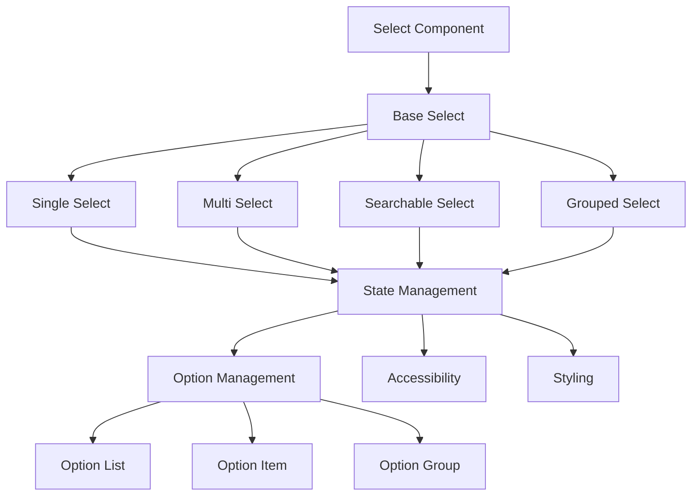
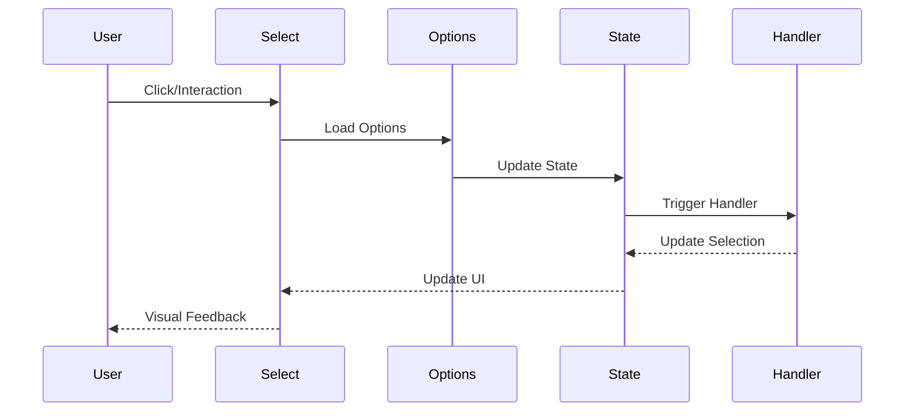
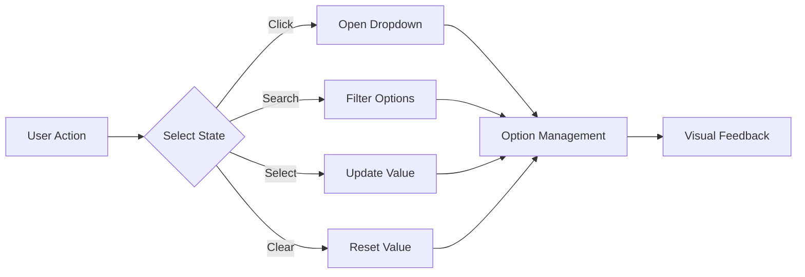

# Select Component

## Overview
The Select component is a versatile form control that allows users to choose from a list of options. It supports single and multiple selection, search functionality, custom option rendering, and comprehensive accessibility features while maintaining consistent styling and behavior across the application.

## Screenshots

*Main view showing different select variants*


*Different states: default, open, focus, and disabled*


*Available types: single select, multi select, searchable select*


*Select with option groups and custom rendering*

## Component Architecture


## Data Flow


## Features
- Single and multiple selection
- Searchable options
- Option groups
- Custom option rendering
- Keyboard navigation
- Clear selection
- Disabled state
- Loading state
- Error state
- Full accessibility support
- TypeScript type safety
- Performance optimized
- Dark mode support
- Custom theme support
- RTL support
- Focus management
- Form integration
- Virtual scrolling
- Custom filtering
- Option highlighting

## Props
| Name | Type | Required | Default | Description |
|------|------|----------|---------|-------------|
| options | Option[] | Yes | [] | Array of select options |
| value | string \| string[] | No | undefined | Selected value(s) |
| onChange | (value: string \| string[]) => void | No | undefined | Change handler |
| placeholder | string | No | 'Select...' | Placeholder text |
| disabled | boolean | No | false | Disables the select |
| loading | boolean | No | false | Shows loading state |
| error | string | No | undefined | Error message |
| multiple | boolean | No | false | Enables multiple selection |
| searchable | boolean | No | false | Enables option search |
| clearable | boolean | No | false | Shows clear button |
| required | boolean | No | false | Makes select required |
| name | string | No | undefined | Select name |
| id | string | No | undefined | Select ID |
| className | string | No | undefined | Additional CSS classes |
| ariaLabel | string | No | undefined | ARIA label |
| testId | string | No | undefined | Test ID |

## Usage
```tsx
import { Select } from '@/components/forms/Select';

// Basic usage
<Select
  options={[
    { value: '1', label: 'Option 1' },
    { value: '2', label: 'Option 2' }
  ]}
  placeholder="Select an option"
  ariaLabel="Basic select"
/>

// With search
<Select
  options={options}
  searchable
  placeholder="Search and select"
  ariaLabel="Searchable select"
/>

// Multiple selection
<Select
  options={options}
  multiple
  value={selectedValues}
  onChange={handleChange}
  ariaLabel="Multi select"
/>

// With groups
<Select
  options={[
    {
      label: 'Group 1',
      options: [
        { value: '1', label: 'Option 1' },
        { value: '2', label: 'Option 2' }
      ]
    }
  ]}
  ariaLabel="Grouped select"
/>
```

## User Interaction Workflow


## Components

### Base Select
- Handles core select functionality
- Manages state transitions
- Implements accessibility features
- Handles event propagation
- Manages focus states

### Option List
- Manages option rendering
- Handles option filtering
- Implements virtual scrolling
- Manages option groups
- Handles option highlighting

### Option Item
- Renders individual options
- Handles option selection
- Manages option states
- Implements custom rendering
- Handles option events

## Data Models
```typescript
interface SelectProps {
  options: Option[];
  value?: string | string[];
  onChange?: (value: string | string[]) => void;
  placeholder?: string;
  disabled?: boolean;
  loading?: boolean;
  error?: string;
  multiple?: boolean;
  searchable?: boolean;
  clearable?: boolean;
  required?: boolean;
  name?: string;
  id?: string;
  className?: string;
  ariaLabel?: string;
  testId?: string;
}

interface Option {
  value: string;
  label: string;
  disabled?: boolean;
  group?: string;
  icon?: ReactNode;
  description?: string;
}

interface SelectState {
  isOpen: boolean;
  searchValue: string;
  selectedValues: string[];
  focusedIndex: number;
  filteredOptions: Option[];
}

interface SelectEvent {
  type: 'open' | 'close' | 'select' | 'search' | 'clear';
  timestamp: number;
  target: HTMLElement;
}
```

## Styling
- Uses Tailwind CSS for styling
- Follows design system color tokens
- Implements consistent spacing
- Supports dark mode
- Maintains accessibility contrast ratios
- Uses CSS variables for theming
- Implements responsive design
- Supports custom animations
- Uses CSS Grid for layout
- Implements proper transitions

## Accessibility
- ARIA labels for screen readers
- Keyboard navigation support
- Focus management
- Color contrast compliance
- Option announcements
- RTL support
- Screen reader announcements
- Focus visible states
- Proper role attributes
- Keyboard event handling
- Error message association
- Required field indication

## Error Handling
- Option validation
- Error state management
- Error message display
- Recovery strategies
- User feedback
- Form integration
- Validation rules
- Error boundaries
- Error logging
- Recovery options

## Performance Optimizations
- Virtualized option list
- Debounced search
- Memoized callbacks
- Optimized re-renders
- CSS-in-JS optimization
- Event handling optimization
- State batching
- Code splitting
- Bundle optimization
- Memory management
- Render optimization

## Dependencies
- React
- TypeScript
- Tailwind CSS
- React Icons (optional)
- @testing-library/react
- @testing-library/jest-dom
- @testing-library/user-event
- react-window (for virtualization)

## Related Components
- [Input](./Input.md)
- [Label](./Label.md)
- [Error](./Error.md)
- [Icon](./Icon.md)
- [Tooltip](./Tooltip.md)

## Examples

### Basic Example
```tsx
import { Select } from '@/components/forms/Select';

export function BasicExample() {
  return (
    <Select
      options={[
        { value: '1', label: 'Option 1' },
        { value: '2', label: 'Option 2' }
      ]}
      placeholder="Select an option"
      ariaLabel="Basic select"
    />
  );
}
```

### Advanced Example
```tsx
import { Select } from '@/components/forms/Select';
import { useCallback, useState } from 'react';

export function AdvancedExample() {
  const [selectedValues, setSelectedValues] = useState<string[]>([]);
  const [error, setError] = useState('');
  
  const handleChange = useCallback((values: string[]) => {
    setSelectedValues(values);
    if (values.length === 0) {
      setError('Please select at least one option');
    } else {
      setError('');
    }
  }, []);

  return (
    <Select
      options={options}
      multiple
      searchable
      value={selectedValues}
      onChange={handleChange}
      error={error}
      placeholder="Search and select options"
      ariaLabel="Advanced select"
      required
    />
  );
}
```

## Best Practices

### Usage Guidelines
1. Always provide proper labels
2. Include appropriate ARIA attributes
3. Handle validation properly
4. Use appropriate option structure
5. Implement proper error handling
6. Follow accessibility guidelines
7. Optimize for performance
8. Use TypeScript for type safety
9. Add proper test IDs
10. Handle edge cases

### Performance Tips
1. Use virtualized lists for large datasets
2. Debounce search operations
3. Optimize re-renders
4. Implement proper validation
5. Use proper error boundaries
6. Optimize bundle size
7. Use proper code splitting
8. Implement proper caching
9. Use proper lazy loading
10. Monitor performance metrics

### Security Considerations
1. Validate option data
2. Prevent XSS attacks
3. Handle sensitive data
4. Implement proper authentication
5. Use proper authorization
6. Handle errors securely
7. Implement proper logging
8. Use proper encryption
9. Follow security best practices
10. Regular security audits

## Troubleshooting

### Common Issues
| Issue | Solution |
|-------|----------|
| Select not updating | Check onChange handler and value prop |
| Search not working | Verify searchable prop and search handler |
| Performance issues | Implement virtualization for large lists |
| Accessibility issues | Verify ARIA labels and keyboard navigation |
| Styling issues | Check Tailwind classes and theme |

### Error Messages
| Error Code | Description | Resolution |
|------------|-------------|------------|
| ERR001 | Invalid option format | Check option structure |
| ERR002 | Invalid value | Check value format |
| ERR003 | Validation failed | Fix validation rules |
| ERR004 | Required field | Provide required value |
| ERR005 | Invalid state | Check state management |

## Contributing

### Development Setup
1. Clone the repository
2. Install dependencies
3. Run development server
4. Make changes
5. Run tests
6. Submit PR

### Testing
```typescript
import { render, screen, fireEvent } from '@testing-library/react';
import { Select } from './Select';

describe('Select', () => {
  it('renders correctly', () => {
    render(
      <Select
        options={[
          { value: '1', label: 'Option 1' },
          { value: '2', label: 'Option 2' }
        ]}
        placeholder="Select an option"
      />
    );
    expect(screen.getByPlaceholderText('Select an option')).toBeInTheDocument();
  });

  it('handles selection', () => {
    const handleChange = jest.fn();
    render(
      <Select
        options={[
          { value: '1', label: 'Option 1' },
          { value: '2', label: 'Option 2' }
        ]}
        onChange={handleChange}
      />
    );
    fireEvent.click(screen.getByRole('combobox'));
    fireEvent.click(screen.getByText('Option 1'));
    expect(handleChange).toHaveBeenCalledWith('1');
  });
});
```

### Code Style
- Follow TypeScript best practices
- Use ESLint rules
- Follow Prettier configuration
- Write meaningful comments
- Use proper naming conventions
- Follow component patterns
- Use proper documentation
- Follow testing practices
- Use proper error handling
- Follow security guidelines

## Changelog

### Version 1.0.0
- Initial release
- Basic select functionality
- Multiple selection
- Search support
- Option groups

### Version 1.1.0
- Added virtual scrolling
- Improved accessibility
- Enhanced performance
- Added dark mode
- Added RTL support

## Appendix

### Glossary
- **Option**: Selectable item in the dropdown
- **Value**: Selected option value
- **Group**: Collection of related options
- **Search**: Option filtering functionality
- **Virtualization**: Performance optimization for large lists

### FAQ
#### How do I implement search functionality?
Use the searchable prop and provide a search handler to filter options.

#### How do I handle multiple selection?
Use the multiple prop and handle array values in the onChange handler.

#### How do I make the select accessible?
Include proper ARIA labels and ensure keyboard navigation works. 