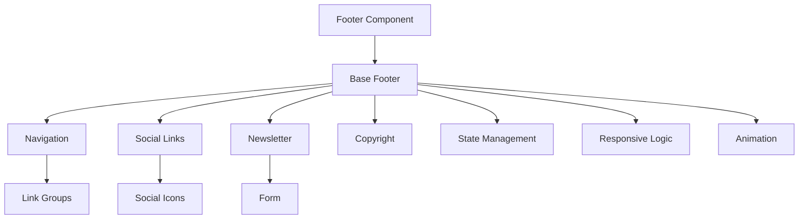
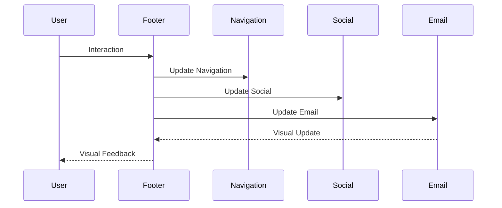
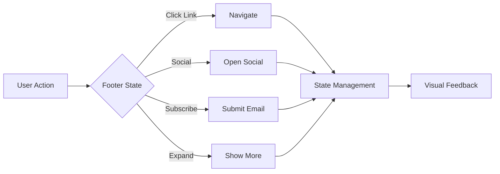

# Footer Component

## Overview
The Footer component is a responsive application footer that provides navigation links, social media links, and additional information. It supports dynamic content, responsive behavior, and maintains consistent styling across the application.

## Screenshots

*Main view showing navigation links and social media*


*Mobile view with stacked layout*


*Dark mode with adjusted contrast*


*Newsletter subscription section*

## Component Architecture


## Data Flow


## Features
- Responsive design
- Dynamic navigation
- Social media links
- Newsletter subscription
- Copyright information
- Mobile support
- Keyboard navigation
- Animation support
- State persistence
- Custom themes
- Dark mode support
- RTL support
- Performance optimized
- TypeScript support
- Accessibility support
- Internationalization
- Link groups
- Quick links
- Contact information
- Legal links

## Props
| Name | Type | Required | Default | Description |
|------|------|----------|---------|-------------|
| navigation | FooterNav[] | No | [] | Navigation links |
| social | SocialLink[] | No | [] | Social media links |
| newsletter | NewsletterConfig | No | undefined | Newsletter configuration |
| copyright | string | No | undefined | Copyright text |
| className | string | No | undefined | Additional CSS classes |
| ariaLabel | string | No | undefined | ARIA label |
| testId | string | No | undefined | Test ID |

## Usage
```tsx
import { Footer } from '@/components/layout/Footer';

// Basic usage
<Footer
  navigation={[
    {
      title: 'Product',
      links: [
        { label: 'Features', href: '/features' },
        { label: 'Pricing', href: '/pricing' }
      ]
    }
  ]}
  ariaLabel="Main footer"
/>

// Advanced usage
<Footer
  navigation={complexNavigation}
  social={[
    {
      platform: 'twitter',
      url: 'https://twitter.com/thrivesend',
      label: 'Twitter'
    }
  ]}
  newsletter={{
    title: 'Subscribe to our newsletter',
    placeholder: 'Enter your email',
    onSubmit: (email) => {/* Handle subscription */}
  }}
  copyright="© 2025 ThriveSend. All rights reserved."
  ariaLabel="Advanced footer with newsletter"
/>
```

## User Interaction Workflow


## Components

### Base Footer
- Handles core footer functionality
- Manages responsive behavior
- Implements animations
- Handles state
- Manages theme

### Navigation
- Renders navigation links
- Handles routing
- Manages groups
- Implements keyboard nav
- Handles mobile layout

### Social Links
- Renders social icons
- Handles external links
- Manages tooltips
- Implements animations
- Handles accessibility

### Newsletter
- Manages subscription form
- Handles validation
- Implements success states
- Manages state
- Handles accessibility

### Copyright
- Displays copyright info
- Handles dynamic year
- Manages legal links
- Implements animations
- Handles accessibility

## Data Models
```typescript
interface FooterNav {
  title: string;
  links: {
    label: string;
    href: string;
    external?: boolean;
  }[];
}

interface SocialLink {
  platform: 'twitter' | 'facebook' | 'linkedin' | 'instagram' | 'youtube';
  url: string;
  label: string;
}

interface NewsletterConfig {
  title?: string;
  placeholder?: string;
  onSubmit: (email: string) => void;
  successMessage?: string;
  errorMessage?: string;
}

interface FooterState {
  isMobile: boolean;
  expandedGroups: string[];
  newsletterState: 'idle' | 'loading' | 'success' | 'error';
  email: string;
}

interface FooterEvent {
  type: 'navigate' | 'social' | 'newsletter' | 'expand';
  timestamp: number;
  data?: {
    link?: string;
    platform?: string;
    email?: string;
    group?: string;
  };
}
```

## Styling
- Uses Tailwind CSS for styling
- Follows design system color tokens
- Implements consistent spacing
- Supports dark mode
- Maintains accessibility contrast ratios
- Uses CSS variables for theming
- Implements responsive design
- Supports custom animations
- Uses CSS Grid for layout
- Implements proper transitions

## Accessibility
- ARIA labels for screen readers
- Keyboard navigation support
- Focus management
- Color contrast compliance
- State announcements
- RTL support
- Screen reader announcements
- Focus visible states
- Proper role attributes
- Keyboard event handling
- Error message association
- Navigation announcements

## Error Handling
- Navigation validation
- State management
- Error boundaries
- Fallback content
- Recovery strategies
- User feedback
- Error logging
- State recovery
- Navigation recovery
- Animation fallbacks

## Performance Optimizations
- Component memoization
- Render optimization
- Animation optimization
- State batching
- Code splitting
- Bundle optimization
- Memory management
- Event debouncing
- Lazy loading
- Virtual scrolling

## Dependencies
- React
- TypeScript
- Tailwind CSS
- React Router
- @testing-library/react
- @testing-library/jest-dom
- @testing-library/user-event

## Related Components
- [Header](./Header.md)
- [Navigation](../navigation/Navigation.md)
- [SocialIcons](../ui/SocialIcons.md)
- [NewsletterForm](../forms/NewsletterForm.md)
- [Link](../ui/Link.md)

## Examples

### Basic Example
```tsx
import { Footer } from '@/components/layout/Footer';

export function BasicExample() {
  const navigation = [
    {
      title: 'Product',
      links: [
        { label: 'Features', href: '/features' },
        { label: 'Pricing', href: '/pricing' }
      ]
    }
  ];

  return (
    <Footer
      navigation={navigation}
      copyright="© 2025 ThriveSend"
      ariaLabel="Basic footer"
    />
  );
}
```

### Advanced Example
```tsx
import { Footer } from '@/components/layout/Footer';
import { useCallback, useState } from 'react';

export function AdvancedExample() {
  const [email, setEmail] = useState('');
  const [newsletterState, setNewsletterState] = useState<'idle' | 'loading' | 'success' | 'error'>('idle');

  const handleNewsletter = useCallback(async (email: string) => {
    setNewsletterState('loading');
    try {
      // Handle subscription
      setNewsletterState('success');
    } catch (error) {
      setNewsletterState('error');
    }
  }, []);

  return (
    <Footer
      navigation={complexNavigation}
      social={[
        {
          platform: 'twitter',
          url: 'https://twitter.com/thrivesend',
          label: 'Twitter'
        },
        {
          platform: 'linkedin',
          url: 'https://linkedin.com/company/thrivesend',
          label: 'LinkedIn'
        }
      ]}
      newsletter={{
        title: 'Subscribe to our newsletter',
        placeholder: 'Enter your email',
        onSubmit: handleNewsletter,
        successMessage: 'Thanks for subscribing!',
        errorMessage: 'Something went wrong. Please try again.'
      }}
      copyright="© 2025 ThriveSend. All rights reserved."
      ariaLabel="Advanced footer with newsletter"
    />
  );
}
```

## Best Practices

### Usage Guidelines
1. Implement proper navigation
2. Handle responsive states
3. Use appropriate icons
4. Implement keyboard nav
5. Follow accessibility guidelines
6. Optimize for performance
7. Use TypeScript for type safety
8. Add proper test IDs
9. Handle edge cases
10. Implement proper state

### Performance Tips
1. Memoize components
2. Use proper state management
3. Optimize re-renders
4. Implement proper loading
5. Use proper error boundaries
6. Optimize bundle size
7. Use proper code splitting
8. Implement proper caching
9. Use proper lazy loading
10. Monitor performance metrics

### Security Considerations
1. Validate navigation
2. Prevent XSS attacks
3. Handle sensitive data
4. Implement proper authentication
5. Use proper authorization
6. Handle errors securely
7. Implement proper logging
8. Use proper encryption
9. Follow security best practices
10. Regular security audits

## Troubleshooting

### Common Issues
| Issue | Solution |
|-------|----------|
| Navigation not working | Check href and router setup |
| Newsletter not working | Verify form configuration |
| Mobile issues | Check responsive breakpoints |
| Accessibility issues | Verify ARIA labels and keyboard nav |
| Styling issues | Check Tailwind classes and theme |

### Error Messages
| Error Code | Description | Resolution |
|------------|-------------|------------|
| ERR001 | Invalid navigation | Check menu items |
| ERR002 | Newsletter error | Verify form config |
| ERR003 | Social link error | Check social links |
| ERR004 | Theme error | Verify theme settings |
| ERR005 | Event error | Check event handlers |

## Contributing

### Development Setup
1. Clone the repository
2. Install dependencies
3. Run development server
4. Make changes
5. Run tests
6. Submit PR

### Testing
```typescript
import { render, screen, fireEvent } from '@testing-library/react';
import { Footer } from './Footer';

describe('Footer', () => {
  it('renders correctly', () => {
    const navigation = [
      {
        title: 'Product',
        links: [
          { label: 'Features', href: '/features' }
        ]
      }
    ];
    render(<Footer navigation={navigation} />);
    expect(screen.getByText('Features')).toBeInTheDocument();
  });

  it('handles newsletter subscription', () => {
    const handleNewsletter = jest.fn();
    render(
      <Footer
        newsletter={{
          onSubmit: handleNewsletter
        }}
      />
    );
    fireEvent.change(screen.getByRole('textbox'), {
      target: { value: 'test@example.com' }
    });
    fireEvent.click(screen.getByRole('button'));
    expect(handleNewsletter).toHaveBeenCalledWith('test@example.com');
  });
});
```

### Code Style
- Follow TypeScript best practices
- Use ESLint rules
- Follow Prettier configuration
- Write meaningful comments
- Use proper naming conventions
- Follow component patterns
- Use proper documentation
- Follow testing practices
- Use proper error handling
- Follow security guidelines

## Changelog

### Version 1.0.0
- Initial release
- Basic navigation
- Social links
- Newsletter
- Mobile support

### Version 1.1.0
- Added advanced newsletter
- Improved performance
- Enhanced accessibility
- Added dark mode
- Added RTL support

## Appendix

### Glossary
- **Footer**: Main application footer
- **Navigation**: Link groups
- **Social Links**: Social media links
- **Newsletter**: Email subscription
- **Copyright**: Legal information

### FAQ
#### How do I implement newsletter subscription?
Use the newsletter prop to configure subscription behavior.

#### How do I handle mobile responsiveness?
The footer automatically handles mobile views with a stacked layout.

#### How do I make the footer accessible?
Include proper ARIA labels and ensure keyboard navigation works. 