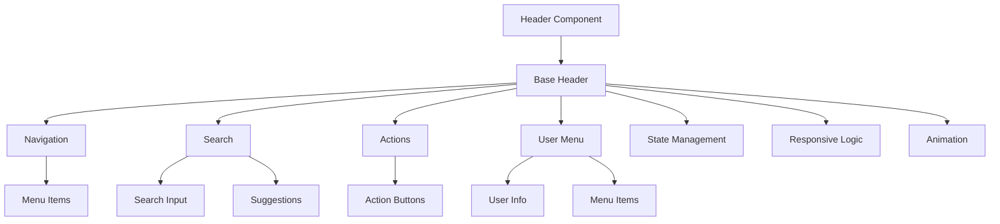
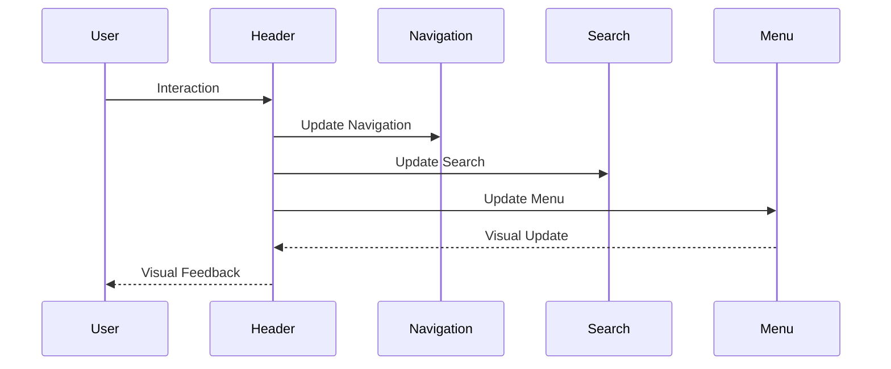
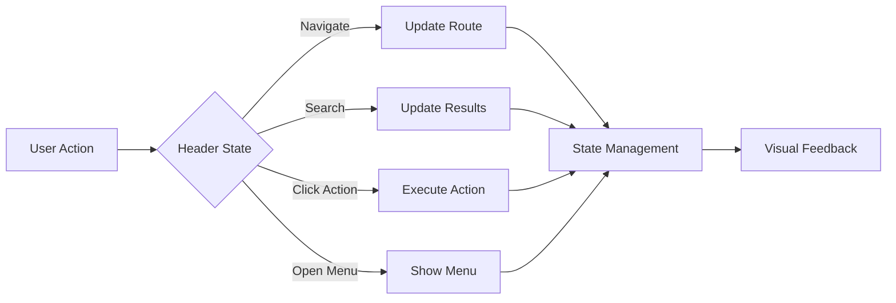

# Header Component

## Overview
The Header component is a responsive application header that provides navigation, user controls, and contextual actions. It supports dynamic content, responsive behavior, and maintains consistent styling across the application.

## Screenshots

*Main view showing navigation and user controls*


*Mobile view with hamburger menu and responsive controls*


*Search functionality with suggestions and filters*


*User menu with profile and actions*

## Component Architecture


## Data Flow


## Features
- Responsive design
- Dynamic navigation
- Search functionality
- User controls
- Action buttons
- Notifications
- Mobile support
- Keyboard navigation
- Animation support
- State persistence
- Custom themes
- Dark mode support
- RTL support
- Performance optimized
- TypeScript support
- Accessibility support
- Internationalization
- Breadcrumb support
- Context actions
- Quick actions

## Props
| Name | Type | Required | Default | Description |
|------|------|----------|---------|-------------|
| title | string | No | undefined | Header title |
| navigation | NavigationItem[] | No | [] | Navigation items |
| user | UserInfo | No | undefined | User information |
| actions | Action[] | No | [] | Action buttons |
| search | SearchConfig | No | undefined | Search configuration |
| className | string | No | undefined | Additional CSS classes |
| ariaLabel | string | No | undefined | ARIA label |
| testId | string | No | undefined | Test ID |

## Usage
```tsx
import { Header } from '@/components/layout/Header';

// Basic usage
<Header
  title="Dashboard"
  navigation={[
    {
      id: 'dashboard',
      label: 'Dashboard',
      href: '/dashboard'
    },
    {
      id: 'content',
      label: 'Content',
      href: '/content'
    }
  ]}
  ariaLabel="Main header"
/>

// Advanced usage
<Header
  title="Content Management"
  navigation={complexNavigation}
  user={{
    name: 'John Doe',
    avatar: '/avatars/john.jpg',
    role: 'Admin'
  }}
  actions={[
    {
      id: 'create',
      label: 'Create',
      icon: 'plus',
      onClick: () => {/* Handle click */}
    }
  ]}
  search={{
    placeholder: 'Search content...',
    onSearch: (query) => {/* Handle search */}
  }}
  ariaLabel="Advanced header with search"
/>
```

## User Interaction Workflow


## Components

### Base Header
- Handles core header functionality
- Manages responsive behavior
- Implements animations
- Handles state
- Manages theme

### Navigation
- Renders navigation items
- Handles routing
- Manages active states
- Implements keyboard nav
- Handles mobile menu

### Search
- Manages search input
- Handles suggestions
- Implements filters
- Manages results
- Handles keyboard nav

### Actions
- Renders action buttons
- Handles click events
- Manages tooltips
- Implements animations
- Handles accessibility

### User Menu
- Displays user info
- Shows menu items
- Handles actions
- Manages state
- Implements animations

## Data Models
```typescript
interface NavigationItem {
  id: string;
  label: string;
  href?: string;
  icon?: string;
  badge?: {
    count: number;
    variant: 'primary' | 'secondary' | 'success' | 'warning' | 'error';
  };
}

interface UserInfo {
  name: string;
  avatar: string;
  role: string;
  actions?: {
    id: string;
    label: string;
    icon?: string;
    onClick: () => void;
  }[];
}

interface Action {
  id: string;
  label: string;
  icon?: string;
  onClick: () => void;
  disabled?: boolean;
  tooltip?: string;
}

interface SearchConfig {
  placeholder?: string;
  onSearch: (query: string) => void;
  suggestions?: string[];
  filters?: {
    id: string;
    label: string;
    options: {
      value: string;
      label: string;
    }[];
  }[];
}

interface HeaderState {
  isMobile: boolean;
  isSearchOpen: boolean;
  isUserMenuOpen: boolean;
  activeItem?: string;
  searchQuery: string;
}

interface HeaderEvent {
  type: 'navigate' | 'search' | 'action' | 'menu';
  timestamp: number;
  data?: {
    itemId?: string;
    query?: string;
    actionId?: string;
  };
}
```

## Styling
- Uses Tailwind CSS for styling
- Follows design system color tokens
- Implements consistent spacing
- Supports dark mode
- Maintains accessibility contrast ratios
- Uses CSS variables for theming
- Implements responsive design
- Supports custom animations
- Uses CSS Grid for layout
- Implements proper transitions

## Accessibility
- ARIA labels for screen readers
- Keyboard navigation support
- Focus management
- Color contrast compliance
- State announcements
- RTL support
- Screen reader announcements
- Focus visible states
- Proper role attributes
- Keyboard event handling
- Error message association
- Navigation announcements

## Error Handling
- Navigation validation
- State management
- Error boundaries
- Fallback content
- Recovery strategies
- User feedback
- Error logging
- State recovery
- Navigation recovery
- Animation fallbacks

## Performance Optimizations
- Component memoization
- Render optimization
- Animation optimization
- State batching
- Code splitting
- Bundle optimization
- Memory management
- Event debouncing
- Lazy loading
- Virtual scrolling

## Dependencies
- React
- TypeScript
- Tailwind CSS
- React Router
- @testing-library/react
- @testing-library/jest-dom
- @testing-library/user-event

## Related Components
- [Sidebar](./Sidebar.md)
- [Navigation](../navigation/Navigation.md)
- [Search](../forms/Search.md)
- [UserMenu](../navigation/UserMenu.md)
- [Button](../ui/Button.md)

## Examples

### Basic Example
```tsx
import { Header } from '@/components/layout/Header';

export function BasicExample() {
  const navigation = [
    {
      id: 'dashboard',
      label: 'Dashboard',
      href: '/dashboard'
    },
    {
      id: 'content',
      label: 'Content',
      href: '/content'
    }
  ];

  return (
    <Header
      title="Dashboard"
      navigation={navigation}
      ariaLabel="Basic header"
    />
  );
}
```

### Advanced Example
```tsx
import { Header } from '@/components/layout/Header';
import { useCallback, useState } from 'react';

export function AdvancedExample() {
  const [searchQuery, setSearchQuery] = useState('');
  const [isUserMenuOpen, setIsUserMenuOpen] = useState(false);

  const handleSearch = useCallback((query: string) => {
    setSearchQuery(query);
    // Additional search logic
  }, []);

  const handleAction = useCallback((actionId: string) => {
    // Handle action
  }, []);

  return (
    <Header
      title="Content Management"
      navigation={complexNavigation}
      user={{
        name: 'John Doe',
        avatar: '/avatars/john.jpg',
        role: 'Admin',
        actions: [
          {
            id: 'profile',
            label: 'Profile',
            icon: 'user',
            onClick: () => {/* Handle click */}
          }
        ]
      }}
      actions={[
        {
          id: 'create',
          label: 'Create',
          icon: 'plus',
          onClick: () => handleAction('create')
        }
      ]}
      search={{
        placeholder: 'Search content...',
        onSearch: handleSearch,
        suggestions: ['Recent searches...'],
        filters: [
          {
            id: 'type',
            label: 'Type',
            options: [
              { value: 'all', label: 'All' },
              { value: 'posts', label: 'Posts' }
            ]
          }
        ]
      }}
      ariaLabel="Advanced header with search"
    />
  );
}
```

## Best Practices

### Usage Guidelines
1. Implement proper navigation
2. Handle responsive states
3. Use appropriate icons
4. Implement keyboard nav
5. Follow accessibility guidelines
6. Optimize for performance
7. Use TypeScript for type safety
8. Add proper test IDs
9. Handle edge cases
10. Implement proper state

### Performance Tips
1. Memoize components
2. Use proper state management
3. Optimize re-renders
4. Implement proper loading
5. Use proper error boundaries
6. Optimize bundle size
7. Use proper code splitting
8. Implement proper caching
9. Use proper lazy loading
10. Monitor performance metrics

### Security Considerations
1. Validate navigation
2. Prevent XSS attacks
3. Handle sensitive data
4. Implement proper authentication
5. Use proper authorization
6. Handle errors securely
7. Implement proper logging
8. Use proper encryption
9. Follow security best practices
10. Regular security audits

## Troubleshooting

### Common Issues
| Issue | Solution |
|-------|----------|
| Navigation not working | Check href and router setup |
| Search not working | Verify search configuration |
| Mobile issues | Check responsive breakpoints |
| Accessibility issues | Verify ARIA labels and keyboard nav |
| Styling issues | Check Tailwind classes and theme |

### Error Messages
| Error Code | Description | Resolution |
|------------|-------------|------------|
| ERR001 | Invalid navigation | Check menu items |
| ERR002 | Search error | Verify search config |
| ERR003 | Action error | Check action handlers |
| ERR004 | Theme error | Verify theme settings |
| ERR005 | Event error | Check event handlers |

## Contributing

### Development Setup
1. Clone the repository
2. Install dependencies
3. Run development server
4. Make changes
5. Run tests
6. Submit PR

### Testing
```typescript
import { render, screen, fireEvent } from '@testing-library/react';
import { Header } from './Header';

describe('Header', () => {
  it('renders correctly', () => {
    const navigation = [
      {
        id: 'dashboard',
        label: 'Dashboard',
        href: '/dashboard'
      }
    ];
    render(<Header navigation={navigation} />);
    expect(screen.getByText('Dashboard')).toBeInTheDocument();
  });

  it('handles search', () => {
    const handleSearch = jest.fn();
    render(
      <Header
        search={{
          onSearch: handleSearch
        }}
      />
    );
    fireEvent.change(screen.getByRole('searchbox'), {
      target: { value: 'test' }
    });
    expect(handleSearch).toHaveBeenCalledWith('test');
  });
});
```

### Code Style
- Follow TypeScript best practices
- Use ESLint rules
- Follow Prettier configuration
- Write meaningful comments
- Use proper naming conventions
- Follow component patterns
- Use proper documentation
- Follow testing practices
- Use proper error handling
- Follow security guidelines

## Changelog

### Version 1.0.0
- Initial release
- Basic navigation
- Search functionality
- User menu
- Mobile support

### Version 1.1.0
- Added advanced search
- Improved performance
- Enhanced accessibility
- Added dark mode
- Added RTL support

## Appendix

### Glossary
- **Header**: Main application header
- **Navigation**: Menu items
- **Search**: Search functionality
- **Actions**: Action buttons
- **User Menu**: User controls

### FAQ
#### How do I implement search functionality?
Use the search prop to configure search behavior.

#### How do I handle mobile responsiveness?
The header automatically handles mobile views with a hamburger menu.

#### How do I make the header accessible?
Include proper ARIA labels and ensure keyboard navigation works. 