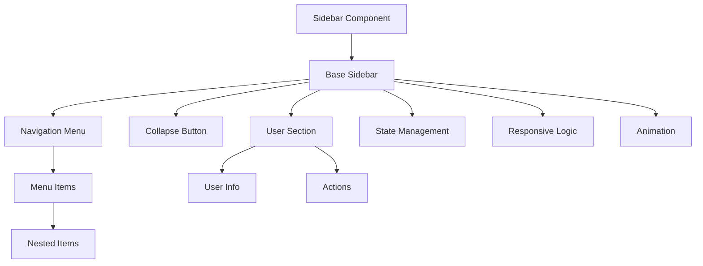
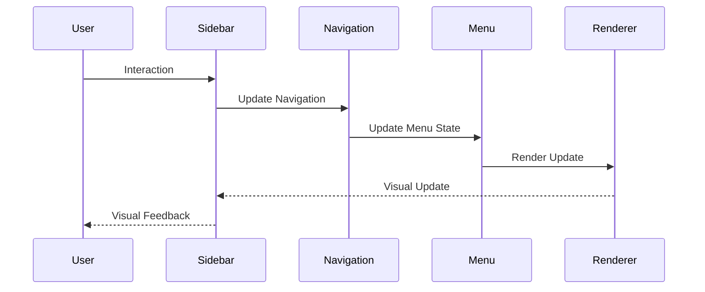
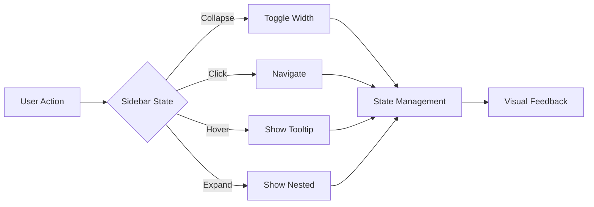

# Sidebar Component

## Overview
The Sidebar component is a responsive navigation sidebar that provides main navigation and secondary actions. It supports collapsible sections, nested navigation, and dynamic content while maintaining consistent styling and behavior across the application.

## Screenshots

*Main view showing expanded sidebar with navigation items*


*Collapsed state showing icons only*


*Mobile view with overlay and backdrop*


*Interactive features: hover states, active items, and nested menus*

## Component Architecture


## Data Flow


## Features
- Responsive design
- Collapsible sections
- Nested navigation
- Dynamic content
- User section
- Custom themes
- Mobile support
- Keyboard navigation
- Animation support
- State persistence
- Custom branding
- Search integration
- Notification badges
- Accessibility support
- Dark mode support
- RTL support
- Performance optimized
- TypeScript support

## Props
| Name | Type | Required | Default | Description |
|------|------|----------|---------|-------------|
| items | MenuItem[] | Yes | undefined | Navigation items |
| collapsed | boolean | No | false | Collapsed state |
| onCollapse | () => void | No | undefined | Collapse handler |
| user | UserInfo | No | undefined | User information |
| logo | string | No | undefined | Logo URL |
| className | string | No | undefined | Additional CSS classes |
| ariaLabel | string | No | undefined | ARIA label |
| testId | string | No | undefined | Test ID |

## Usage
```tsx
import { Sidebar } from '@/components/layout/Sidebar';

// Basic usage
<Sidebar
  items={[
    {
      id: 'dashboard',
      label: 'Dashboard',
      icon: 'dashboard',
      href: '/dashboard'
    },
    {
      id: 'content',
      label: 'Content',
      icon: 'content',
      items: [
        {
          id: 'posts',
          label: 'Posts',
          href: '/content/posts'
        },
        {
          id: 'media',
          label: 'Media',
          href: '/content/media'
        }
      ]
    }
  ]}
  ariaLabel="Main navigation"
/>

// Advanced usage
<Sidebar
  items={complexNavigation}
  collapsed={isCollapsed}
  onCollapse={handleCollapse}
  user={{
    name: 'John Doe',
    avatar: '/avatars/john.jpg',
    role: 'Admin'
  }}
  logo="/logo.svg"
  ariaLabel="Advanced navigation sidebar"
/>
```

## User Interaction Workflow


## Components

### Base Sidebar
- Handles core sidebar functionality
- Manages responsive behavior
- Implements animations
- Handles state
- Manages theme

### Navigation Menu
- Renders menu items
- Handles navigation
- Manages nested items
- Implements keyboard nav
- Handles active states

### Collapse Button
- Toggles sidebar state
- Manages animations
- Handles accessibility
- Provides visual feedback
- Manages state

### User Section
- Displays user info
- Shows user actions
- Handles user menu
- Manages state
- Implements animations

## Data Models
```typescript
interface MenuItem {
  id: string;
  label: string;
  icon?: string;
  href?: string;
  items?: MenuItem[];
  badge?: {
    count: number;
    variant: 'primary' | 'secondary' | 'success' | 'warning' | 'error';
  };
}

interface UserInfo {
  name: string;
  avatar: string;
  role: string;
  actions?: {
    id: string;
    label: string;
    icon?: string;
    onClick: () => void;
  }[];
}

interface SidebarState {
  isCollapsed: boolean;
  isMobile: boolean;
  activeItem?: string;
  expandedItems: string[];
  isUserMenuOpen: boolean;
}

interface SidebarEvent {
  type: 'collapse' | 'navigate' | 'expand' | 'user';
  timestamp: number;
  data?: {
    itemId?: string;
    path?: string;
    action?: string;
  };
}
```

## Styling
- Uses Tailwind CSS for styling
- Follows design system color tokens
- Implements consistent spacing
- Supports dark mode
- Maintains accessibility contrast ratios
- Uses CSS variables for theming
- Implements responsive design
- Supports custom animations
- Uses CSS Grid for layout
- Implements proper transitions

## Accessibility
- ARIA labels for screen readers
- Keyboard navigation support
- Focus management
- Color contrast compliance
- State announcements
- RTL support
- Screen reader announcements
- Focus visible states
- Proper role attributes
- Keyboard event handling
- Error message association
- Navigation announcements

## Error Handling
- Navigation validation
- State management
- Error boundaries
- Fallback content
- Recovery strategies
- User feedback
- Error logging
- State recovery
- Navigation recovery
- Animation fallbacks

## Performance Optimizations
- Component memoization
- Render optimization
- Animation optimization
- State batching
- Code splitting
- Bundle optimization
- Memory management
- Event debouncing
- Lazy loading
- Virtual scrolling

## Dependencies
- React
- TypeScript
- Tailwind CSS
- React Router
- @testing-library/react
- @testing-library/jest-dom
- @testing-library/user-event

## Related Components
- [Header](./Header.md)
- [Menu](../navigation/Menu.md)
- [Navigation](../navigation/Navigation.md)
- [UserMenu](../navigation/UserMenu.md)
- [Logo](../ui/Logo.md)

## Examples

### Basic Example
```tsx
import { Sidebar } from '@/components/layout/Sidebar';

export function BasicExample() {
  const items = [
    {
      id: 'dashboard',
      label: 'Dashboard',
      icon: 'dashboard',
      href: '/dashboard'
    },
    {
      id: 'content',
      label: 'Content',
      icon: 'content',
      items: [
        {
          id: 'posts',
          label: 'Posts',
          href: '/content/posts'
        }
      ]
    }
  ];

  return (
    <Sidebar
      items={items}
      ariaLabel="Basic navigation sidebar"
    />
  );
}
```

### Advanced Example
```tsx
import { Sidebar } from '@/components/layout/Sidebar';
import { useCallback, useState } from 'react';

export function AdvancedExample() {
  const [isCollapsed, setIsCollapsed] = useState(false);
  const [activeItem, setActiveItem] = useState<string>();

  const handleCollapse = useCallback(() => {
    setIsCollapsed(prev => !prev);
  }, []);

  const handleNavigation = useCallback((itemId: string) => {
    setActiveItem(itemId);
    // Additional navigation logic
  }, []);

  return (
    <Sidebar
      items={complexNavigation}
      collapsed={isCollapsed}
      onCollapse={handleCollapse}
      onNavigation={handleNavigation}
      user={{
        name: 'John Doe',
        avatar: '/avatars/john.jpg',
        role: 'Admin',
        actions: [
          {
            id: 'profile',
            label: 'Profile',
            icon: 'user',
            onClick: () => {/* Handle click */}
          }
        ]
      }}
      logo="/logo.svg"
      ariaLabel="Advanced navigation sidebar"
    />
  );
}
```

## Best Practices

### Usage Guidelines
1. Implement proper navigation
2. Handle responsive states
3. Use appropriate icons
4. Implement keyboard nav
5. Follow accessibility guidelines
6. Optimize for performance
7. Use TypeScript for type safety
8. Add proper test IDs
9. Handle edge cases
10. Implement proper state

### Performance Tips
1. Memoize components
2. Use proper state management
3. Optimize re-renders
4. Implement proper loading
5. Use proper error boundaries
6. Optimize bundle size
7. Use proper code splitting
8. Implement proper caching
9. Use proper lazy loading
10. Monitor performance metrics

### Security Considerations
1. Validate navigation
2. Prevent XSS attacks
3. Handle sensitive data
4. Implement proper authentication
5. Use proper authorization
6. Handle errors securely
7. Implement proper logging
8. Use proper encryption
9. Follow security best practices
10. Regular security audits

## Troubleshooting

### Common Issues
| Issue | Solution |
|-------|----------|
| Navigation not working | Check href and router setup |
| Collapse not working | Verify state management |
| Mobile issues | Check responsive breakpoints |
| Accessibility issues | Verify ARIA labels and keyboard nav |
| Styling issues | Check Tailwind classes and theme |

### Error Messages
| Error Code | Description | Resolution |
|------------|-------------|------------|
| ERR001 | Invalid navigation | Check menu items |
| ERR002 | State error | Verify state management |
| ERR003 | Router error | Check router setup |
| ERR004 | Theme error | Verify theme settings |
| ERR005 | Event error | Check event handlers |

## Contributing

### Development Setup
1. Clone the repository
2. Install dependencies
3. Run development server
4. Make changes
5. Run tests
6. Submit PR

### Testing
```typescript
import { render, screen, fireEvent } from '@testing-library/react';
import { Sidebar } from './Sidebar';

describe('Sidebar', () => {
  it('renders correctly', () => {
    const items = [
      {
        id: 'dashboard',
        label: 'Dashboard',
        href: '/dashboard'
      }
    ];
    render(<Sidebar items={items} />);
    expect(screen.getByText('Dashboard')).toBeInTheDocument();
  });

  it('handles collapse', () => {
    const handleCollapse = jest.fn();
    render(
      <Sidebar
        items={[]}
        onCollapse={handleCollapse}
      />
    );
    fireEvent.click(screen.getByRole('button'));
    expect(handleCollapse).toHaveBeenCalled();
  });
});
```

### Code Style
- Follow TypeScript best practices
- Use ESLint rules
- Follow Prettier configuration
- Write meaningful comments
- Use proper naming conventions
- Follow component patterns
- Use proper documentation
- Follow testing practices
- Use proper error handling
- Follow security guidelines

## Changelog

### Version 1.0.0
- Initial release
- Basic navigation
- Collapsible sidebar
- Mobile support
- Accessibility support

### Version 1.1.0
- Added user section
- Improved performance
- Enhanced accessibility
- Added dark mode
- Added RTL support

## Appendix

### Glossary
- **Sidebar**: Main navigation component
- **MenuItem**: Navigation item
- **Collapse**: Toggle sidebar width
- **Nested**: Hierarchical navigation
- **User Section**: User information area

### FAQ
#### How do I implement nested navigation?
Use the items prop to provide nested menu items.

#### How do I handle mobile responsiveness?
The sidebar automatically handles mobile views with overlay.

#### How do I make the sidebar accessible?
Include proper ARIA labels and ensure keyboard navigation works. 