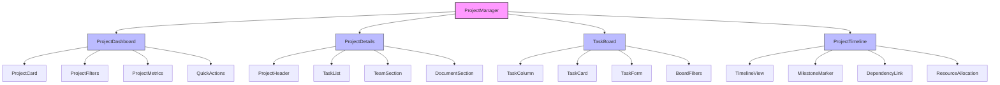
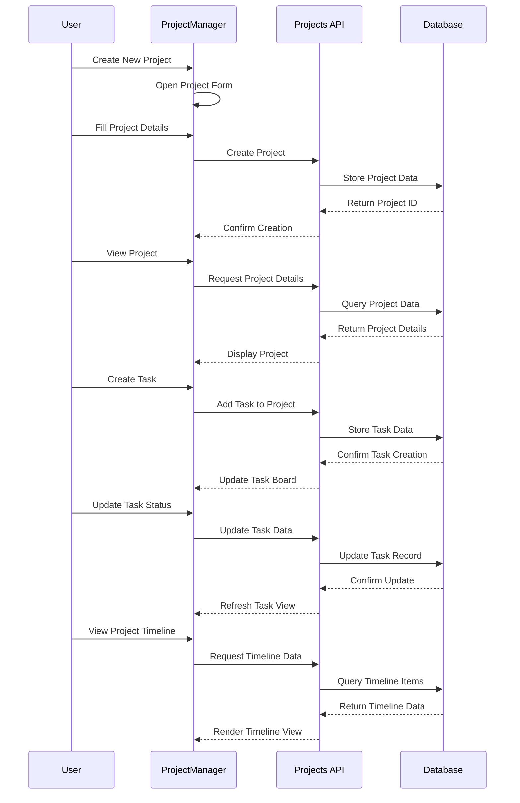
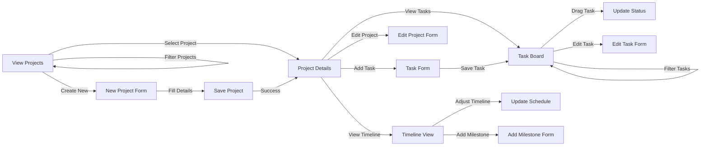

# ProjectManager Component

## Overview
The ProjectManager component provides a comprehensive interface for creating, tracking, and managing marketing projects from inception to completion. It enables teams to plan campaigns, assign tasks, track progress, manage resources, and maintain project documentation in a centralized workspace.

## Screenshots

### Project Dashboard

*The main project dashboard showing active projects, timelines, and status indicators*

### Project Details

*Detailed view of a project with tasks, team members, and progress tracking*

### Task Management

*Task board with drag-and-drop functionality for managing project workflows*

### Project Timeline

*Gantt chart view of project timelines with dependencies and milestones*

## Component Architecture



*Component hierarchy and relationships*

## Data Flow



*Data flow for project management operations*

## Features
- Comprehensive project management
- Task creation and assignment
- Kanban-style task boards
- Gantt chart timeline views
- Team collaboration tools
- File and document management
- Project templates
- Custom project statuses and workflows
- Milestone tracking
- Resource allocation
- Time tracking
- Budget management
- Project analytics and reporting
- Integration with calendar and campaigns
- Automated notifications and reminders

## Props

| Prop | Type | Required | Description |
|------|------|----------|-------------|
| initialView | 'dashboard' \| 'details' \| 'tasks' \| 'timeline' | No | Initial view to display |
| selectedProjectId | string | No | ID of initially selected project |
| filters | ProjectFilters | No | Initial filter configuration |
| onProjectCreate | (project: Project) => void | No | Callback when project is created |
| onProjectUpdate | (project: Project) => void | No | Callback when project is updated |
| onTaskCreate | (projectId: string, task: Task) => void | No | Callback when task is created |
| onTaskUpdate | (taskId: string, updates: Partial<Task>) => void | No | Callback when task is updated |
| teamMembers | TeamMember[] | No | Available team members for assignment |
| templates | ProjectTemplate[] | No | Available project templates |
| integrations | Integration[] | No | External integrations configuration |
| readOnly | boolean | No | Whether the project manager is in read-only mode |

## Usage

```tsx
import { ProjectManager } from '@/components/projects/ProjectManager';

// Basic usage
<ProjectManager />

// With initial selected project
<ProjectManager
  initialView="details"
  selectedProjectId="project-123"
/>

// With filtered view
<ProjectManager
  filters={{
    status: ['active', 'planning'],
    team: ['marketing'],
    dateRange: {
      start: new Date('2024-01-01'),
      end: new Date('2024-12-31')
    }
  }}
/>

// With custom handlers
<ProjectManager
  onProjectCreate={(project) => {
    console.log("New project created:", project);
    trackEvent("project_created", { projectId: project.id });
  }}
  onTaskUpdate={(taskId, updates) => {
    if (updates.status === 'completed') {
      notifyTeam(`Task ${taskId} has been completed!`);
    }
  }}
/>

// With team and templates
<ProjectManager
  teamMembers={organizationMembers}
  templates={[
    { id: 'product-launch', name: 'Product Launch Campaign', tasks: [...] },
    { id: 'content-series', name: 'Content Series', tasks: [...] }
  ]}
/>
```

## User Interaction Workflow



*User interaction flows within the project management component*

## Components

### ProjectDashboard
Displays an overview of all projects with filtering and sorting options.

#### Props
- projects: Project[]
- onSelect: (projectId: string) => void
- filters: ProjectFilters
- onFilterChange: (filters: ProjectFilters) => void
- metrics: ProjectMetrics
- onCreateProject: () => void

### ProjectDetails
Shows comprehensive information about a selected project.

#### Features
- Project header with key information
- Task summary and quick actions
- Team members and roles
- Document repository
- Activity timeline
- Comments and discussion
- Progress metrics and status indicators

### TaskBoard
Kanban-style board for visualizing and managing project tasks.

#### Features
- Customizable columns based on workflow
- Drag-and-drop task management
- Task filtering and searching
- Task details and editing
- Due date visualization
- Assignment indicators
- Task priority highlighting

### ProjectTimeline
Gantt chart view for visualizing project schedule and dependencies.

#### Features
- Timeline visualization with drag-resize capability
- Milestone markers
- Task dependencies
- Critical path highlighting
- Resource allocation view
- Timeline zooming and navigation
- Export and printing options

## Data Models

### Project
```typescript
interface Project {
  id: string;
  name: string;
  description: string;
  status: 'planning' | 'active' | 'onHold' | 'completed' | 'cancelled' | string;
  priority: 'low' | 'medium' | 'high' | 'urgent';
  startDate: Date;
  endDate: Date;
  team: {
    id: string;
    role: string;
  }[];
  tasks: Task[];
  milestones: Milestone[];
  budget?: {
    allocated: number;
    spent: number;
    currency: string;
  };
  tags: string[];
  category?: string;
  documents: Document[];
  activity: ActivityItem[];
  createdBy: string;
  createdAt: Date;
  updatedAt: Date;
  customFields?: Record<string, any>;
  metadata?: {
    completionPercentage: number;
    taskStats: {
      total: number;
      completed: number;
      inProgress: number;
      notStarted: number;
      overdue: number;
    };
    timeTracking?: {
      estimated: number;
      actual: number;
      unit: 'hours' | 'days';
    };
  };
}
```

### Task
```typescript
interface Task {
  id: string;
  projectId: string;
  title: string;
  description?: string;
  status: string; // Customizable based on workflow
  priority: 'low' | 'medium' | 'high' | 'urgent';
  assignees: string[]; // User IDs
  startDate?: Date;
  dueDate?: Date;
  completedDate?: Date;
  estimatedHours?: number;
  actualHours?: number;
  dependencies?: string[]; // Task IDs
  attachments?: Attachment[];
  comments?: Comment[];
  tags?: string[];
  subtasks?: SubTask[];
  createdBy: string;
  createdAt: Date;
  updatedAt: Date;
}
```

### Milestone
```typescript
interface Milestone {
  id: string;
  projectId: string;
  title: string;
  description?: string;
  date: Date;
  status: 'pending' | 'completed' | 'missed';
  relatedTasks?: string[]; // Task IDs
  color?: string;
  createdAt: Date;
  updatedAt: Date;
}
```

## Styling
The component uses a combination of Tailwind CSS and custom styling:
- Responsive layout for all device sizes
- Drag-and-drop interfaces with visual feedback
- Status color coding for quick visual assessment
- Timeline visualization with intuitive controls
- Card-based design for projects and tasks
- Progress indicators and completion visualizations
- Accessible color themes for status and priority

## Accessibility
- ARIA attributes for interactive elements
- Keyboard navigation for all project views
- Focus management for task operations
- Screen reader announcements for status changes
- Alternative interactions for drag-and-drop operations
- Color contrast compliance for status indicators
- Proper heading structure and semantic HTML
- Responsive design for various devices and screen sizes

## Error Handling
- Validation for project and task dates
- Conflict resolution for overlapping schedules
- Error recovery for failed operations
- Optimistic updates with rollback capability
- Form validation with clear error messages
- Dependency cycle detection
- Permission checking for all operations
- Auto-saving of changes with recovery options

## Performance Optimizations
- Virtualized lists for large project collections
- Optimized rendering for timeline view
- Incremental loading of project history
- Efficient task filtering and sorting
- Lazy loading of project details
- Debounced input for search and filter operations
- Optimistic UI updates to reduce perceived latency
- Batch processing for multi-task operations

## Dependencies
- react-beautiful-dnd
- @hello-pangea/dnd (for server components)
- gantt-task-react
- @tanstack/react-query
- @tanstack/react-table
- date-fns
- react-datepicker
- recharts (for project analytics)
- react-dropzone (for file uploads)

## Related Components
- TeamManager
- DocumentLibrary
- CommentSystem
- FileUploader
- ActivityFeed
- ReportGenerator
- TimeTracker
- ResourceAllocator

## Examples

### Basic Implementation
```tsx
import { ProjectManager } from '@/components/projects/ProjectManager';

export default function ProjectsPage() {
  return (
    <div className="p-6">
      <h1 className="text-2xl font-bold mb-6">Project Management</h1>
      <ProjectManager />
    </div>
  );
}
```

### Marketing Campaign Projects
```tsx
import { ProjectManager } from '@/components/projects/ProjectManager';
import { useTeam } from '@/hooks/useTeam';
import { campaignProjectTemplates } from '@/data/projectTemplates';

export default function MarketingProjectsPage() {
  const { teamMembers } = useTeam();
  
  return (
    <div className="p-6">
      <h1 className="text-2xl font-bold mb-6">Marketing Campaigns</h1>
      <ProjectManager
        filters={{
          category: ['campaign'],
          status: ['planning', 'active']
        }}
        teamMembers={teamMembers}
        templates={campaignProjectTemplates}
      />
    </div>
  );
}
```

### Project Timeline Focus
```tsx
import { ProjectManager } from '@/components/projects/ProjectManager';
import { useState } from 'react';
import { useRouter } from 'next/router';

export default function ProjectTimelinePage() {
  const router = useRouter();
  const { projectId } = router.query;
  
  return (
    <div className="p-6">
      <h1 className="text-2xl font-bold mb-6">Project Timeline</h1>
      <ProjectManager
        initialView="timeline"
        selectedProjectId={projectId as string}
        onProjectUpdate={(project) => {
          console.log("Project timeline updated:", project);
        }}
      />
    </div>
  );
}
```

## Best Practices
1. Break large projects into manageable milestones
2. Set clear task dependencies to visualize critical paths
3. Regularly update task status to maintain accurate progress tracking
4. Use consistent naming conventions for projects and tasks
5. Attach relevant documents directly to projects for easy access
6. Set realistic deadlines with buffer time for unexpected issues
7. Regularly review resource allocation to prevent bottlenecks
8. Use templates for recurring project types to ensure consistency

## Troubleshooting

### Common Issues
1. Task dependencies creating impossible schedules
2. Resource over-allocation across multiple projects
3. Inconsistent task status updates
4. Timeline visualization issues with long-running projects
5. Performance issues with large project databases
6. Permission conflicts for shared projects
7. Missing notifications for important updates

### Solutions
1. Use the dependency validator to identify circular dependencies
2. Review the resource allocation view to identify overbooked team members
3. Implement regular status update reminders
4. Use timeline zooming and filtering for large projects
5. Implement pagination and virtualization for large datasets
6. Review and clarify team roles and permissions
7. Check notification settings and system permissions

## Contributing
When contributing to this component:
1. Follow established project management patterns
2. Document task workflow modifications clearly
3. Test timeline visualizations with various project structures
4. Consider resource allocation implications
5. Maintain backward compatibility for project data
6. Add unit tests for critical functions
7. Optimize performance for large projects 