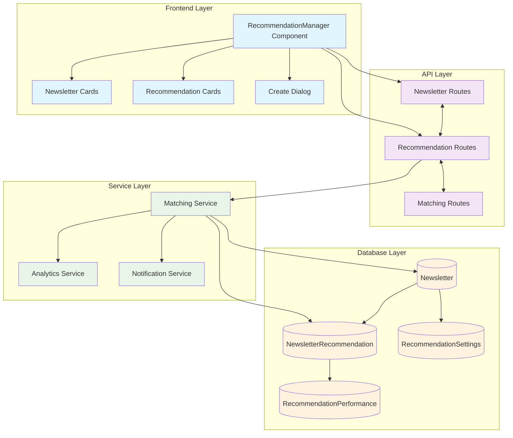
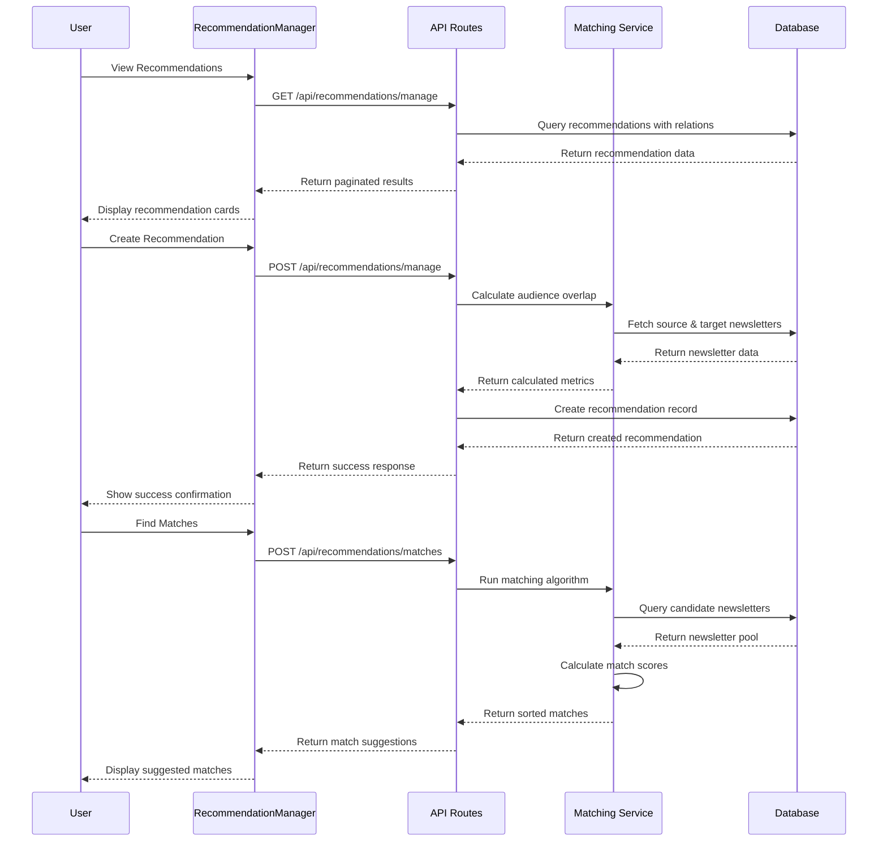
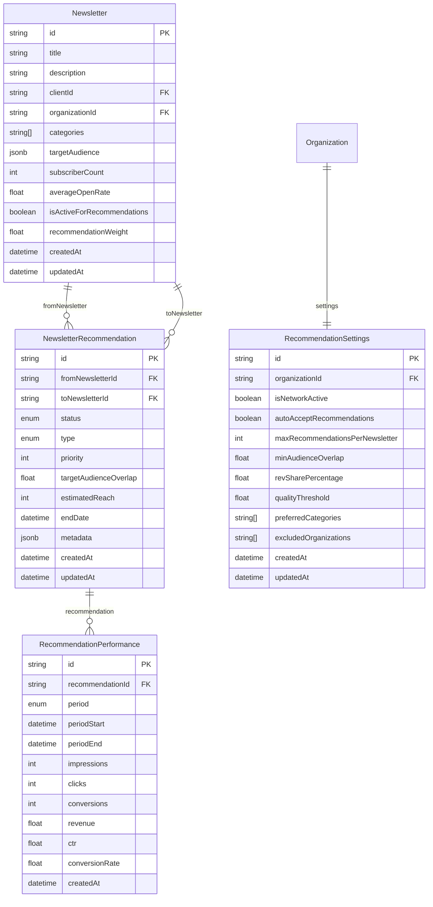
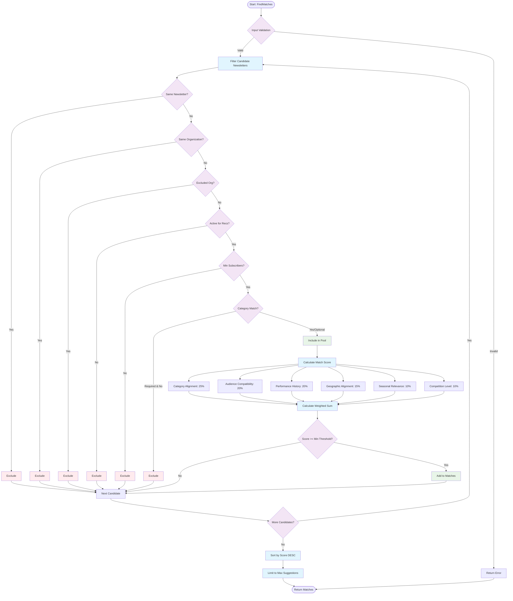
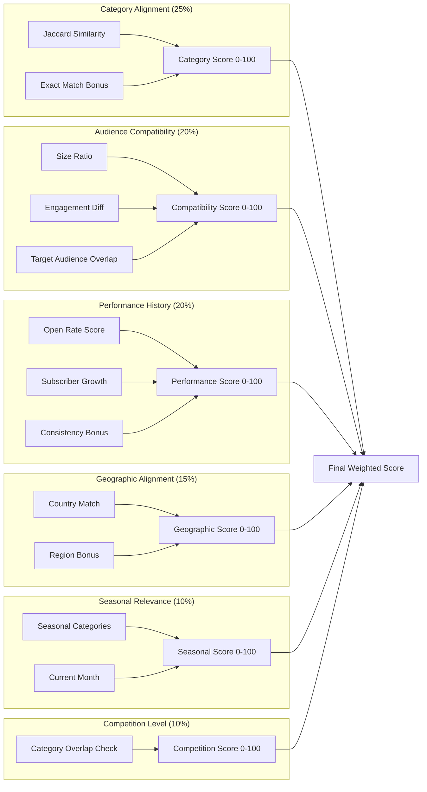

# Recommendation Network System - Test-Driven Development (TDD) Specification

## Document Information
- **Component**: Recommendation Network System
- **Version**: 1.0.0
- **Date**: January 2025
- **Business Model**: B2B2G Service Provider Platform
- **Purpose**: Newsletter cross-promotion and audience growth network

---

## 📋 **TDD OVERVIEW**

### **Business Requirements**
Based on PRD Section 3.5.1, the Recommendation Network shall:
1. Enable newsletter recommendation system for audience growth
2. Track subscribers gained through recommendations
3. Manage recommendation relationships between service providers
4. Calculate recommendation effectiveness for reporting
5. Facilitate cross-promotion between newsletters
6. Provide recommendation optimization suggestions
7. Support automated recommendation matching based on audience interests

### **System Architecture**
- **Frontend**: React components with TypeScript
- **Backend**: Next.js API routes with Prisma ORM
- **Database**: PostgreSQL with advanced indexing
- **Algorithm**: Custom matching engine with scoring
- **Integration**: Service Provider Context and Analytics

### **Architecture Diagram**



### **Data Flow Diagram**



### **Database Schema Diagram**



### **UI Wireframes**

#### **Full Mode - Recommendation Dashboard**

```
┌─────────────────────────────────────────────────────────────────┐
│ 🌐 Recommendation Network                     [Refresh] [+ Create] │
├─────────────────────────────────────────────────────────────────┤
│ ┌─────────┐ ┌─────────┐ ┌─────────┐ ┌─────────┐                 │
│ │⚡ 24    │ │🎯 1,250 │ │👥 45K   │ │⭐ 4.2/5 │                 │
│ │Active   │ │Converts │ │Reach    │ │Quality  │                 │
│ │Recs     │ │+12.5%   │ │Network  │ │Score    │                 │
│ └─────────┘ └─────────┘ └─────────┘ └─────────┘                 │
├─────────────────────────────────────────────────────────────────┤
│ [🔍 Search recommendations...          ] [Status ▼] [Type ▼]     │
├─────────────────────────────────────────────────────────────────┤
│ ┌─────────────────────────────────┐ ┌─────────────────────────┐   │
│ │ [ACTIVE] [MUTUAL]               │ │ [PAUSED] [ONE_WAY]      │   │
│ │ Tech Weekly → Startup Digest    │ │ Design Tips → UI Guide  │   │
│ │ Priority: 8/10 • Overlap: 65%  │ │ Priority: 6/10 • 45%    │   │
│ │ Reach: 2,500                    │ │ Reach: 1,800            │   │
│ │ ┌─────┐ ┌─────┐ ┌─────┐         │ │ [▶️ Resume] [✏️ Edit]     │   │
│ │ │3.2% │ │450  │ │98   │         │ │                         │   │
│ │ │Conv │ │Click│ │Subs │         │ │                         │   │
│ │ └─────┘ └─────┘ └─────┘         │ │                         │   │
│ │ [⏸️ Pause] [✏️ Edit] [⋯]        │ │ [⋯]                     │   │
│ └─────────────────────────────────┘ └─────────────────────────┘   │
│                                                                 │
│ ┌─────────────────────────────────┐ ┌─────────────────────────┐   │
│ │ [PENDING] [SPONSORED]           │ │ [ACTIVE] [ONE_WAY]      │   │
│ │ Marketing Pro → Growth Hacks    │ │ Weekly Brief → News Now │   │
│ │ Priority: 9/10 • Overlap: 78%  │ │ Priority: 7/10 • 52%    │   │
│ │ Reach: 5,200                    │ │ Reach: 3,100            │   │
│ │ [✅ Approve] [❌ Reject]         │ │ ┌─────┐ ┌─────┐ ┌─────┐ │   │
│ └─────────────────────────────────┘ │ │4.1% │ │320  │ │67   │ │   │
│                                     │ │Conv │ │Click│ │Subs │ │   │
│                                     │ └─────┘ └─────┘ └─────┘ │   │
│                                     │ [⋯]                     │   │
│                                     └─────────────────────────┘   │
└─────────────────────────────────────────────────────────────────┘
```

#### **Embedded Mode - Dashboard Widget**

```
┌─────────────────────────────────────────────┐
│ 🌐 Recommendation Network                    │
├─────────────────────────────────────────────┤
│ ┌────────┐ ┌────────┐ ┌────────┐ ┌────────┐ │
│ │⚡ 24   │ │🎯 1.2K │ │👥 45K  │ │⭐ 4.2  │ │
│ │Active  │ │Convert │ │Reach   │ │Quality │ │
│ └────────┘ └────────┘ └────────┘ └────────┘ │
├─────────────────────────────────────────────┤
│ ┌─────────────────────────────────────────┐ │
│ │ [ACTIVE] Tech Weekly → Startup Digest   │ │
│ │ Priority: 8/10 • 65% overlap           │ │
│ │ 450 clicks • 98 conversions            │ │
│ └─────────────────────────────────────────┘ │
│ ┌─────────────────────────────────────────┐ │
│ │ [PAUSED] Design Tips → UI Guide         │ │
│ │ Priority: 6/10 • 45% overlap           │ │
│ │ [▶️ Resume]                             │ │
│ └─────────────────────────────────────────┘ │
│ ┌─────────────────────────────────────────┐ │
│ │ [PENDING] Marketing Pro → Growth Hacks  │ │
│ │ Priority: 9/10 • 78% overlap           │ │
│ │ [✅ Approve] [❌ Reject]                 │ │
│ └─────────────────────────────────────────┘ │
├─────────────────────────────────────────────┤
│             [View All (24)]                 │
└─────────────────────────────────────────────┘
```

#### **Create Recommendation Dialog**

```
┌─────────────────────────────────────────────────────────────┐
│ Create New Recommendation                             [❌]    │
├─────────────────────────────────────────────────────────────┤
│ Set up a cross-promotion between newsletters to grow your   │
│ audience.                                                   │
│                                                             │
│ From Newsletter                                             │
│ ┌─────────────────────────────────────────────────────────┐ │
│ │ Tech Weekly (12,450 subscribers)              ▼        │ │
│ └─────────────────────────────────────────────────────────┘ │
│                                                             │
│ To Newsletter                                               │
│ ┌─────────────────────────────────────────────────────────┐ │
│ │ 🔍 Search and select target newsletter...    ▼        │ │
│ └─────────────────────────────────────────────────────────┘ │
│                                                             │
│ ┌─────────────────────────┐ ┌─────────────────────────────┐ │
│ │ Recommendation Type     │ │ Priority (1-10)             │ │
│ │ ┌─────────────────────┐ │ │ ┌─────────────────────────┐ │ │
│ │ │ One Way       ▼   │ │ │ │ 5               ▼     │ │ │
│ │ └─────────────────────┘ │ │ └─────────────────────────┘ │ │
│ └─────────────────────────┘ └─────────────────────────────┘ │
│                                                             │
│ Notes (Optional)                                            │
│ ┌─────────────────────────────────────────────────────────┐ │
│ │ Add any additional notes about this recommendation...   │ │
│ │                                                         │ │
│ │                                                         │ │
│ └─────────────────────────────────────────────────────────┘ │
│                                                             │
│ ┌─────────────────────────────────────────────────────────┐ │
│ │ 📊 Estimated Impact                                     │ │
│ │ • Audience Overlap: 65%                                 │ │
│ │ • Estimated Reach: 2,500 subscribers                   │ │
│ │ • Expected Conversions: 75-125 (3-5%)                  │ │
│ └─────────────────────────────────────────────────────────┘ │
│                                                             │
│                           [Cancel] [Create Recommendation] │
└─────────────────────────────────────────────────────────────┘
```

#### **Newsletter Card Component**

```
┌─────────────────────────────────────────────────────────┐
│ Tech Weekly Newsletter                             [⋯] │
│ Acme Corp                                               │
│                                                         │
│ [Tech] [Startups] [AI] +2                              │
│                                                         │
│ 👥 12,450 subscribers    ✉️ 24.5% open rate             │
│                                                         │
│ ──────────────────────────────────────────────────────  │
│ 🌐 5 outgoing → 3 incoming              [Active]       │
└─────────────────────────────────────────────────────────┘
```

---

## 🎯 **COMPONENT SPECIFICATIONS**

### **1. Newsletter Model (Data Layer)**

#### **Test Requirements**
```typescript
describe('Newsletter Model', () => {
  it('should create newsletter with required fields')
  it('should validate title is required and non-empty')
  it('should validate clientId exists and user has access')
  it('should default subscriberCount to 0')
  it('should default isActiveForRecommendations to true')
  it('should accept categories as string array')
  it('should store targetAudience as JSON object')
  it('should calculate recommendationWeight between 0-5')
  it('should track creation and update timestamps')
  it('should cascade delete recommendations when newsletter deleted')
})
```

#### **API Endpoints**
```typescript
describe('Newsletter API', () => {
  describe('GET /api/recommendations/newsletters', () => {
    it('should return paginated newsletters for organization')
    it('should filter by search term in title/description')
    it('should filter by isActive status')
    it('should filter by categories array')
    it('should filter by minimum subscriber count')
    it('should include client and organization relations')
    it('should include outgoing/incoming recommendation counts')
    it('should return 401 for unauthorized users')
    it('should return 400 for missing organizationId')
  })
  
  describe('POST /api/recommendations/newsletters', () => {
    it('should create newsletter with valid data')
    it('should validate required fields (title, clientId)')
    it('should verify client belongs to user organization')
    it('should set organizationId from client relationship')
    it('should default optional fields correctly')
    it('should return 201 with created newsletter')
    it('should return 404 for invalid clientId')
    it('should return 400 for validation errors')
  })
  
  describe('PUT /api/recommendations/newsletters', () => {
    it('should update newsletter with valid data')
    it('should verify user ownership of newsletter')
    it('should preserve creation timestamp')
    it('should update modification timestamp')
    it('should return updated newsletter with relations')
    it('should return 404 for non-existent newsletter')
  })
  
  describe('DELETE /api/recommendations/newsletters', () => {
    it('should delete newsletter and cascade recommendations')
    it('should verify user ownership before deletion')
    it('should return success confirmation')
    it('should return 404 for non-existent newsletter')
  })
})
```

### **2. NewsletterRecommendation Model (Core Logic)**

#### **Test Requirements**
```typescript
describe('NewsletterRecommendation Model', () => {
  it('should create recommendation with from/to newsletter IDs')
  it('should prevent self-recommendation (same newsletter)')
  it('should prevent duplicate recommendations (same pair)')
  it('should validate status enum values')
  it('should validate type enum values')
  it('should validate priority between 1-10')
  it('should calculate targetAudienceOverlap percentage')
  it('should estimate reach based on source subscriber count')
  it('should support optional end date for temporary recommendations')
  it('should store metadata as JSON object')
  it('should track performance metrics relationship')
})
```

#### **API Endpoints**
```typescript
describe('Recommendation Management API', () => {
  describe('GET /api/recommendations/manage', () => {
    it('should return recommendations for organization')
    it('should include both outgoing and incoming recommendations')
    it('should filter by status (ACTIVE, PAUSED, etc.)')
    it('should filter by type (MUTUAL, ONE_WAY, SPONSORED)')
    it('should filter by specific newsletter ID')
    it('should include newsletter details and performance data')
    it('should support pagination with page/limit')
    it('should order by updatedAt descending')
  })
  
  describe('POST /api/recommendations/manage', () => {
    it('should create recommendation with valid newsletter pair')
    it('should validate both newsletters exist and are accessible')
    it('should prevent self-recommendations')
    it('should prevent duplicate recommendations')
    it('should calculate audience overlap automatically')
    it('should estimate reach based on source newsletter size')
    it('should create mutual recommendation if MUTUAL type')
    it('should set status to PENDING_APPROVAL for mutual')
    it('should return 409 for duplicate recommendations')
  })
  
  describe('PUT /api/recommendations/manage', () => {
    it('should update recommendation status')
    it('should update priority and metadata')
    it('should verify user access to recommendation')
    it('should track modification timestamp')
    it('should return updated recommendation with relations')
  })
  
  describe('DELETE /api/recommendations/manage', () => {
    it('should soft delete by setting status to ENDED')
    it('should preserve historical performance data')
    it('should set endDate to current timestamp')
    it('should verify user ownership of source newsletter')
  })
})
```

### **3. Recommendation Matching Algorithm**

#### **Algorithm Flowchart**



#### **Scoring Algorithm Detail**



#### **Test Requirements**
```typescript
describe('RecommendationMatchingService', () => {
  describe('findMatches()', () => {
    it('should return matches above minimum score threshold')
    it('should filter out same organization newsletters')
    it('should filter out excluded organizations')
    it('should filter out inactive newsletters')
    it('should filter by minimum subscriber count (10% of source)')
    it('should filter by included categories if specified')
    it('should sort matches by score descending')
    it('should limit results to maxSuggestions')
    it('should return processing time and algorithm version')
  })
  
  describe('calculateMatchScore()', () => {
    it('should weight category alignment by configured percentage')
    it('should weight audience compatibility by configured percentage')
    it('should weight performance history by configured percentage')
    it('should weight geographic alignment by configured percentage')
    it('should weight seasonal relevance by configured percentage')
    it('should weight competition level by configured percentage')
    it('should return score between 0-100')
    it('should return 0 for completely incompatible newsletters')
  })
  
  describe('calculateCategoryAlignment()', () => {
    it('should return 0 for newsletters with no categories')
    it('should calculate Jaccard similarity for category overlap')
    it('should add bonus for exact category matches')
    it('should return score between 0-100')
    it('should handle empty category arrays gracefully')
  })
  
  describe('calculateAudienceCompatibility()', () => {
    it('should prefer newsletters of similar subscriber size')
    it('should consider engagement rate similarity')
    it('should analyze target audience overlap if available')
    it('should return score between 0-100')
    it('should handle missing audience data gracefully')
  })
  
  describe('batchFindMatches()', () => {
    it('should process multiple source newsletters')
    it('should return results keyed by newsletter ID')
    it('should handle processing errors gracefully')
    it('should run matching in parallel for performance')
  })
})
```

### **4. RecommendationManager Component (UI Layer)**

#### **Test Requirements**
```typescript
describe('RecommendationManager Component', () => {
  describe('Rendering', () => {
    it('should render metrics cards when showMetrics=true')
    it('should render recommendations grid when showRecommendations=true')
    it('should render embedded mode with compact layout')
    it('should render full mode with complete interface')
    it('should show loading skeleton while fetching data')
    it('should show error state for failed API calls')
    it('should show empty state when no recommendations exist')
  })
  
  describe('Data Fetching', () => {
    it('should fetch newsletters on component mount')
    it('should fetch recommendations on component mount')
    it('should fetch metrics when showMetrics=true')
    it('should refetch data when organizationId changes')
    it('should handle API errors gracefully')
    it('should show loading states during fetch')
  })
  
  describe('Filtering', () => {
    it('should filter recommendations by search term')
    it('should filter by recommendation status')
    it('should filter by recommendation type')
    it('should limit results in embedded mode')
    it('should clear filters when reset button clicked')
    it('should update URL params for filters (full mode)')
  })
  
  describe('Actions', () => {
    it('should open create recommendation dialog')
    it('should update recommendation status (pause/resume)')
    it('should handle recommendation editing')
    it('should handle recommendation deletion')
    it('should refresh data when refresh button clicked')
    it('should navigate to full page from embedded mode')
  })
  
  describe('Create Recommendation Dialog', () => {
    it('should show source newsletter selection')
    it('should search and select target newsletters')
    it('should validate required fields before submission')
    it('should calculate estimated metrics on selection')
    it('should submit recommendation creation request')
    it('should close dialog and refresh data on success')
    it('should show validation errors')
  })
})
```

### **5. RecommendationSettings Model**

#### **Test Requirements**
```typescript
describe('RecommendationSettings Model', () => {
  it('should create settings for organization')
  it('should have unique constraint on organizationId')
  it('should default isNetworkActive to true')
  it('should default autoAcceptRecommendations to false')
  it('should validate maxRecommendationsPerNewsletter > 0')
  it('should validate minAudienceOverlap between 0-100')
  it('should validate revSharePercentage between 0-100')
  it('should validate qualityThreshold between 1-5')
  it('should store preferredCategories as string array')
  it('should store excludedOrganizations as string array')
})
```

### **6. RecommendationPerformance Model (Analytics)**

#### **Test Requirements**
```typescript
describe('RecommendationPerformance Model', () => {
  it('should track performance by period (daily/weekly/monthly)')
  it('should have unique constraint on recommendation+period+start')
  it('should validate impressions >= 0')
  it('should validate clicks <= impressions')
  it('should validate conversions <= clicks')
  it('should calculate CTR as clicks/impressions')
  it('should calculate conversionRate as conversions/clicks')
  it('should calculate costPerConversion if revenue provided')
  it('should support period aggregation queries')
})
```

---

## 🧪 **INTEGRATION TESTS**

### **Service Provider Context Integration**
```typescript
describe('Recommendation Network Integration', () => {
  it('should integrate with ServiceProviderContext')
  it('should respect organization permissions')
  it('should update analytics when recommendations change')
  it('should trigger notifications for new recommendations')
  it('should sync with client performance rankings')
})
```

### **Analytics Integration**
```typescript
describe('Analytics Integration', () => {
  it('should track recommendation performance metrics')
  it('should contribute to service provider revenue metrics')
  it('should update client growth analytics')
  it('should generate recommendation effectiveness reports')
})
```

### **Email/Newsletter Integration**
```typescript
describe('Newsletter Integration', () => {
  it('should sync with email service providers')
  it('should track subscriber sources from recommendations')
  it('should update subscriber counts automatically')
  it('should handle unsubscribe attribution')
})
```

---

## 📊 **PERFORMANCE REQUIREMENTS**

### **API Performance**
- Newsletter list endpoint: < 200ms for 100 newsletters
- Recommendation creation: < 500ms including validation
- Matching algorithm: < 2s for 1000 candidate newsletters
- Performance metrics aggregation: < 1s for 30-day period

### **Component Performance**
- Initial render: < 100ms for embedded mode
- Data refresh: < 300ms for incremental updates
- Filter application: < 50ms for client-side filtering
- Dialog open/close: < 200ms with animations

### **Database Performance**
- Newsletter queries with indexes: < 50ms
- Recommendation relationship queries: < 100ms
- Performance aggregation queries: < 500ms
- Matching algorithm data prep: < 200ms

---

## 🔒 **SECURITY REQUIREMENTS**

### **Authorization Tests**
```typescript
describe('Security', () => {
  it('should verify user organization membership for all operations')
  it('should prevent access to other organizations newsletters')
  it('should prevent cross-organization recommendation creation')
  it('should validate JWT tokens on all API endpoints')
  it('should sanitize all user inputs')
  it('should prevent SQL injection in queries')
  it('should rate limit recommendation creation')
  it('should audit log all recommendation changes')
})
```

### **Data Privacy**
- Newsletter data isolation between organizations
- Performance metrics privacy (aggregated only)
- User consent for cross-organization recommendations
- GDPR compliance for subscriber data handling

---

## 📈 **SUCCESS CRITERIA**

### **Functional Completeness**
- [ ] All API endpoints implement full CRUD operations
- [ ] Matching algorithm achieves >80% relevance score
- [ ] UI components handle all user workflows
- [ ] Integration with existing systems works seamlessly
- [ ] Performance metrics tracking is accurate

### **Quality Standards**
- [ ] Test coverage >90% for all components
- [ ] API response times meet performance requirements
- [ ] UI passes accessibility (WCAG 2.1) compliance
- [ ] All security tests pass
- [ ] Error handling covers all edge cases

### **Business Impact**
- [ ] Enables 10+ recommendations per service provider
- [ ] Supports 100+ newsletters in matching algorithm
- [ ] Tracks performance with 95% accuracy
- [ ] Reduces manual recommendation setup time by 80%
- [ ] Increases average subscriber growth by 15%

---

## 🚀 **IMPLEMENTATION PHASES**

### **Phase 1: Core Models & APIs (Week 1)**
- Newsletter and NewsletterRecommendation models
- Basic CRUD API endpoints
- Database schema migration
- Unit tests for models and APIs

### **Phase 2: Matching Algorithm (Week 2)**
- RecommendationMatchingService implementation
- Algorithm testing with sample data
- Performance optimization
- Integration with API endpoints

### **Phase 3: UI Components (Week 3)**
- RecommendationManager component
- Newsletter and recommendation cards
- Create/edit dialogs
- Component testing with React Testing Library

### **Phase 4: Integration & Polish (Week 4)**
- Service Provider Context integration
- Analytics integration
- Performance optimization
- End-to-end testing

---

## 📝 **TEST DATA REQUIREMENTS**

### **Sample Newsletters**
- 20+ test newsletters across different categories
- Varied subscriber counts (100-50,000)
- Different engagement rates (5%-40%)
- Multiple organizations and clients

### **Sample Recommendations**
- 50+ recommendation relationships
- All status types (ACTIVE, PAUSED, ENDED, etc.)
- All recommendation types (MUTUAL, ONE_WAY, SPONSORED)
- Performance data for last 90 days

### **Sample Performance Data**
- Daily/weekly/monthly performance records
- Varied conversion rates (0.5%-8%)
- Revenue data for sponsored recommendations
- Click-through rates (1%-15%)

---

*This TDD specification ensures systematic, test-driven development of the Recommendation Network system with complete coverage of business requirements, technical specifications, and quality standards.*