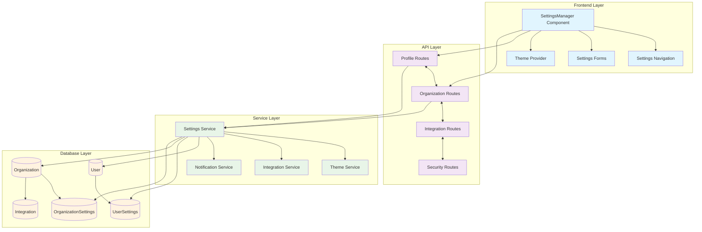
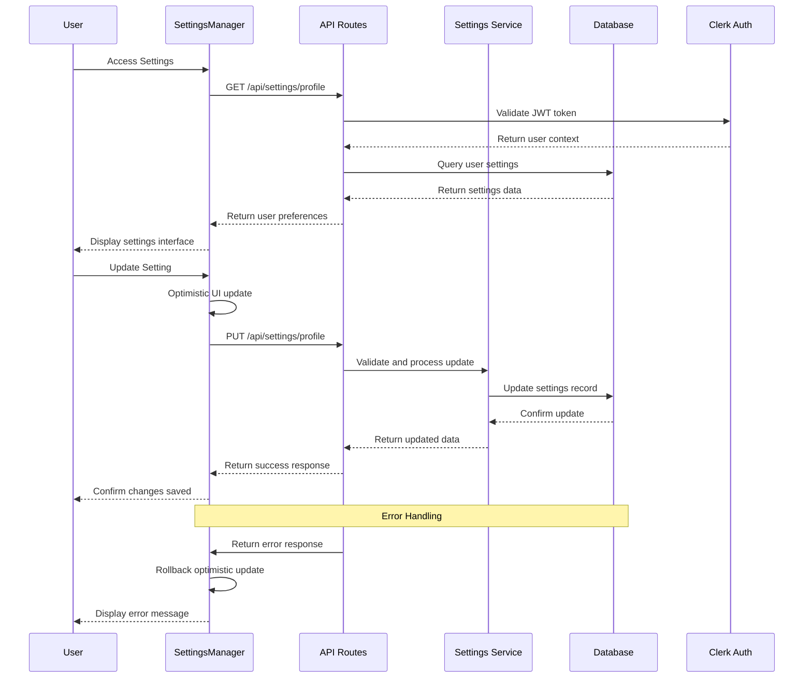
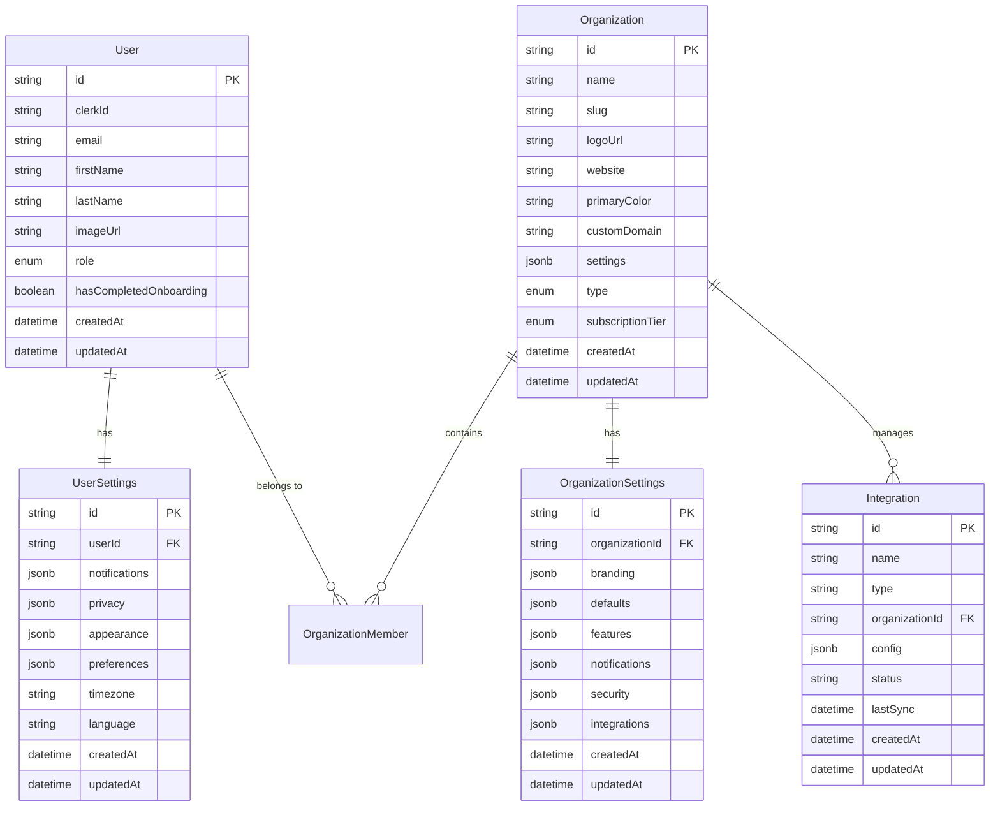

# Settings System - Test-Driven Development (TDD) Specification

## Document Information
- **Component**: Settings System
- **Version**: 1.0.0
- **Date**: January 2025
- **Business Model**: B2B2G Service Provider Platform
- **Purpose**: Comprehensive user and organization preference management

---

## 📋 **TDD OVERVIEW**

### **Business Requirements**
Based on PRD Section 4.2, the Settings System shall:
1. Provide comprehensive user profile and preference management
2. Enable organization-level branding and configuration
3. Support theme customization and accessibility options
4. Manage integrations with external services and APIs
5. Ensure security settings and privacy controls
6. Facilitate notification preferences and communication settings
7. Support multi-tenant architecture with role-based access
8. Enable white-labeling capabilities for enterprise clients

### **System Architecture**
- **Frontend**: React components with TypeScript and Radix UI
- **Backend**: Next.js API routes with Prisma ORM
- **Database**: PostgreSQL with JSONB for flexible settings storage
- **Authentication**: Clerk integration with JWT tokens
- **State Management**: React Context with optimistic updates

### **Architecture Diagram**



### **Data Flow Diagram**



### **Database Schema Diagram**



### **UI Wireframes**

#### **Full Mode - Settings Dashboard**

```
┌─────────────────────────────────────────────────────────────────────────────┐
│ ⚙️ Settings                                           [Save] [Cancel] [Help] │
├─────────────────────────────────────────────────────────────────────────────┤
│ ┌─────────────────┐ ┌─────────────────────────────────────────────────────┐ │
│ │ Navigation      │ │ Profile Settings                                    │ │
│ │                 │ │                                                     │ │
│ │ 👤 Account       │ │ ┌─────────────────┐ ┌─────────────────────────────┐ │ │
│ │  • Profile      │ │ │ [👤 Avatar]     │ │ First Name                  │ │ │
│ │  • Preferences  │ │ │                 │ │ ┌─────────────────────────┐ │ │ │
│ │  • Security     │ │ │ Change Photo    │ │ │ John                  │ │ │ │
│ │                 │ │ └─────────────────┘ │ └─────────────────────────┘ │ │ │
│ │ 🎨 Appearance    │ │                     │                             │ │ │
│ │  • Theme        │ │                     │ Last Name                   │ │ │
│ │  • Colors       │ │                     │ ┌─────────────────────────┐ │ │ │
│ │  • Accessibility│ │                     │ │ Doe                   │ │ │ │
│ │                 │ │                     │ └─────────────────────────┘ │ │ │
│ │ 🏢 Organization  │ │                     │                             │ │ │
│ │  • General      │ │                     │ Email                       │ │ │
│ │  • Members      │ │                     │ ┌─────────────────────────┐ │ │ │
│ │  • Branding     │ │                     │ │ john.doe@company.com  │ │ │ │
│ │  • Billing      │ │                     │ └─────────────────────────┘ │ │ │
│ │                 │ │                     │                             │ │ │
│ │ 🔗 Integrations  │ │                     │ Bio                         │ │ │
│ │  • Social       │ │                     │ ┌─────────────────────────┐ │ │ │
│ │  • APIs         │ │                     │ │ Product manager with    │ │ │ │
│ │  • Webhooks     │ │                     │ │ 5+ years experience... │ │ │ │
│ │                 │ │                     │ └─────────────────────────┘ │ │ │
│ │ 🔔 Notifications │ │                     │                             │ │ │
│ │  • Email        │ │                     │ Website                     │ │ │
│ │  • Push         │ │                     │ ┌─────────────────────────┐ │ │ │
│ │  • Digest       │ │                     │ │ https://johndoe.com   │ │ │ │
│ │                 │ │                     │ └─────────────────────────┘ │ │ │
│ │ 🛡️ Privacy       │ │                     │                             │ │ │
│ │  • Data Export  │ │                     │ Timezone                    │ │ │
│ │  • Account      │ │                     │ ┌─────────────────────────┐ │ │ │
│ │                 │ │                     │ │ UTC-5 (EST)         ▼ │ │ │ │
│ └─────────────────┘ │                     │ └─────────────────────────┘ │ │ │
│                     └─────────────────────────────────────────────────────┘ │
└─────────────────────────────────────────────────────────────────────────────┘
```

#### **Theme Settings Interface**

```
┌─────────────────────────────────────────────────────────────────────────────┐
│ 🎨 Appearance Settings                                                       │
├─────────────────────────────────────────────────────────────────────────────┤
│ Theme Preference                                                            │
│ ┌─────────────────┐ ┌─────────────────┐ ┌─────────────────┐                │
│ │ ☀️ Light         │ │ 🌙 Dark          │ │ ⚙️ System        │                │
│ │ [●]             │ │ [ ]             │ │ [ ]             │                │
│ └─────────────────┘ └─────────────────┘ └─────────────────┘                │
│                                                                             │
│ Color Scheme                                                                │
│ ┌─ Primary Color ────────────────────────────────────────────────────────┐  │
│ │ ┌───┐ ┌───┐ ┌───┐ ┌───┐ ┌───┐ ┌───┐ ┌───┐ ┌───┐                        │  │
│ │ │🔵│ │🟢│ │🟣│ │🟠│ │🔴│ │🟡│ │⚫│ │🎨│ Custom                    │  │
│ │ └───┘ └───┘ └───┘ └───┘ └───┘ └───┘ └───┘ └───┘                        │  │
│ └─────────────────────────────────────────────────────────────────────────┘  │
│                                                                             │
│ UI Density                                                                  │
│ ┌─────────────────┐ ┌─────────────────┐ ┌─────────────────┐                │
│ │ Compact         │ │ Comfortable     │ │ Spacious        │                │
│ │ [ ]             │ │ [●]             │ │ [ ]             │                │
│ └─────────────────┘ └─────────────────┘ └─────────────────┘                │
│                                                                             │
│ Font Size                                                                   │
│ ┌─────────────────┐ ┌─────────────────┐ ┌─────────────────┐                │
│ │ Small           │ │ Medium          │ │ Large           │                │
│ │ [ ]             │ │ [●]             │ │ [ ]             │                │
│ └─────────────────┘ └─────────────────┘ └─────────────────┘                │
│                                                                             │
│ Accessibility                                                               │
│ ┌─ Options ──────────────────────────────────────────────────────────────┐  │
│ │ [✓] High contrast mode                                                  │  │
│ │ [✓] Reduce motion and animations                                        │  │
│ │ [ ] Screen reader optimizations                                         │  │
│ │ [ ] Keyboard navigation highlights                                      │  │
│ └─────────────────────────────────────────────────────────────────────────┘  │
└─────────────────────────────────────────────────────────────────────────────┘
```

#### **Organization Settings Interface**

```
┌─────────────────────────────────────────────────────────────────────────────┐
│ 🏢 Organization Settings                                                     │
├─────────────────────────────────────────────────────────────────────────────┤
│ General Information                                                         │
│                                                                             │
│ Organization Name                                                           │
│ ┌─────────────────────────────────────────────────────────────────────────┐ │
│ │ Acme Corporation                                                        │ │
│ └─────────────────────────────────────────────────────────────────────────┘ │
│                                                                             │
│ Organization Slug                                                           │
│ ┌─────────────────────────────────────────────────────────────────────────┐ │
│ │ acme-corp                                   ✓ Available                 │ │
│ └─────────────────────────────────────────────────────────────────────────┘ │
│                                                                             │
│ ┌─────────────────────────────┐ ┌─────────────────────────────────────────┐ │
│ │ Logo                        │ │ Website                                 │ │
│ │ ┌─────────────────────────┐ │ │ ┌─────────────────────────────────────┐ │ │
│ │ │ [🏢 Current Logo]       │ │ │ │ https://acmecorp.com              │ │ │
│ │ │                         │ │ │ └─────────────────────────────────────┘ │ │
│ │ │ [📁 Upload New]         │ │ │                                         │ │
│ │ └─────────────────────────┘ │ │ Custom Domain                           │ │
│ └─────────────────────────────┘ │ ┌─────────────────────────────────────┐ │ │
│                                 │ │ app.acmecorp.com                  │ │ │
│ Branding Colors                 │ └─────────────────────────────────────┘ │ │
│ ┌─ Color Palette ─────────────┐ └─────────────────────────────────────────┘ │
│ │ Primary   [🔵 #007BFF]     │                                              │
│ │ Secondary [🟢 #28A745]     │ Default Settings                             │
│ │ Accent    [🟣 #6F42C1]     │ ┌─ Campaign Defaults ──────────────────────┐ │
│ │ Success   [🟢 #28A745]     │ │ Default Timezone: UTC-5 (EST)        ▼ │ │
│ │ Warning   [🟡 #FFC107]     │ │ Default Currency: USD                 ▼ │ │
│ │ Error     [🔴 #DC3545]     │ │ Date Format: MM/DD/YYYY               ▼ │ │
│ └─────────────────────────────┘ │ Auto-approve content: [ ]              │ │
│                                 └───────────────────────────────────────────┘ │
└─────────────────────────────────────────────────────────────────────────────┘
```

#### **Integration Management Interface**

```
┌─────────────────────────────────────────────────────────────────────────────┐
│ 🔗 Integration Management                                    [+ Add New] │
├─────────────────────────────────────────────────────────────────────────────┤
│ Connected Services                                                          │
│                                                                             │
│ ┌─ Social Media Platforms ─────────────────────────────────────────────────┐ │
│ │ ┌─────────────────────────────────────────────────────────────────────┐ │ │
│ │ │ 📘 Facebook                                           [Connected] │ │ │
│ │ │ @acmecorp • 5,240 followers                           [⚙️ Settings] │ │ │
│ │ │ Last sync: 2 hours ago                                [🔄 Sync Now] │ │ │
│ │ └─────────────────────────────────────────────────────────────────────┘ │ │
│ │ ┌─────────────────────────────────────────────────────────────────────┐ │ │
│ │ │ 📸 Instagram                                          [Connected] │ │ │
│ │ │ @acme_corp • 12,150 followers                         [⚙️ Settings] │ │ │
│ │ │ Last sync: 30 minutes ago                             [🔄 Sync Now] │ │ │
│ │ └─────────────────────────────────────────────────────────────────────┘ │ │
│ │ ┌─────────────────────────────────────────────────────────────────────┐ │ │
│ │ │ 💼 LinkedIn                                           [Disconnected] │ │ │
│ │ │ Connect your LinkedIn company page                    [🔗 Connect] │ │ │
│ │ └─────────────────────────────────────────────────────────────────────┘ │ │
│ └─────────────────────────────────────────────────────────────────────────┘ │
│                                                                             │
│ ┌─ API Keys & Webhooks ──────────────────────────────────────────────────┐ │
│ │ ┌─────────────────────────────────────────────────────────────────────┐ │ │
│ │ │ Analytics API                            [🟢 Active] [⚙️] [🗑️] │ │ │
│ │ │ Created: Jan 15, 2025 • Last used: 2 hours ago                      │ │ │
│ │ │ Permissions: read:analytics, write:campaigns                         │ │ │
│ │ └─────────────────────────────────────────────────────────────────────┘ │ │
│ │ ┌─────────────────────────────────────────────────────────────────────┐ │ │
│ │ │ Webhook Endpoint                         [🟢 Active] [⚙️] [🗑️] │ │ │
│ │ │ https://api.acmecorp.com/webhooks/thrivesend                        │ │ │
│ │ │ Events: content.published, campaign.completed                       │ │ │
│ │ └─────────────────────────────────────────────────────────────────────┘ │ │
│ └─────────────────────────────────────────────────────────────────────────┘ │
└─────────────────────────────────────────────────────────────────────────────┘
```

#### **Mobile Settings Interface**

```
┌─────────────────────────────────┐
│ ⚙️ Settings                [❌] │
├─────────────────────────────────┤
│                                 │
│ 👤 Account                 [>] │
│ Profile, Preferences, Security  │
│                                 │
│ 🎨 Appearance              [>] │
│ Theme, Colors, Accessibility    │
│                                 │
│ 🏢 Organization            [>] │
│ General, Members, Branding      │
│                                 │
│ 🔗 Integrations            [>] │
│ Social, APIs, Webhooks          │
│                                 │
│ 🤖 AI & Automation         [>] │
│ Providers, Models, Usage        │
│                                 │
│ 🔔 Notifications           [>] │
│ Email, Push, Digest             │
│                                 │
│ 🛡️ Privacy & Data          [>] │
│ Export, Controls, Deletion      │
│                                 │
└─────────────────────────────────┘
```

---

## 🎯 **COMPONENT SPECIFICATIONS**

### 1. SettingsProvider
**Purpose**: Global state management for settings data and operations

**Test Requirements**:
```typescript
describe('SettingsProvider', () => {
  it('should initialize with user and organization settings')
  it('should handle loading states during data fetching')
  it('should provide optimistic updates for setting changes')
  it('should rollback changes on API failures')
  it('should sync settings across browser tabs')
  it('should cache settings data with TTL expiration')
  it('should handle network connectivity issues gracefully')
})
```

### 2. SettingsManager
**Purpose**: Main container component with navigation and section management

**Test Requirements**:
```typescript
describe('SettingsManager', () => {
  it('should render navigation sidebar with all setting categories')
  it('should highlight active section in navigation')
  it('should lazy load setting sections on demand')
  it('should warn users about unsaved changes before navigation')
  it('should handle deep linking to specific setting sections')
  it('should show loading states during section transitions')
  it('should handle permission-based section visibility')
  it('should maintain responsive layout on all screen sizes')
})
```

### 3. Setting Section Components

#### UserProfileSettings
**Purpose**: Personal profile information management

**Test Requirements**:
```typescript
describe('UserProfileSettings', () => {
  it('should load current user profile data from Clerk')
  it('should validate required fields (firstName, lastName, email)')
  it('should update profile picture with image upload')
  it('should handle username availability checking')
  it('should save profile changes with optimistic updates')
  it('should show validation errors inline')
  it('should handle Clerk API failures gracefully')
})
```

#### AccountPreferences
**Purpose**: User preference management including notifications and privacy

**Test Requirements**:
```typescript
describe('AccountPreferences', () => {
  it('should toggle email notification preferences')
  it('should update timezone with automatic detection option')
  it('should manage language preferences with i18n support')
  it('should configure privacy visibility settings')
  it('should set digest frequency preferences')
  it('should handle notification permission requests')
  it('should sync preferences across devices')
})
```

#### SecuritySettings
**Purpose**: Authentication and security configuration

**Test Requirements**:
```typescript
describe('SecuritySettings', () => {
  it('should change password with current password validation')
  it('should enable/disable two-factor authentication')
  it('should show active sessions with location information')
  it('should revoke individual or all sessions')
  it('should manage API keys with permission scopes')
  it('should show security audit log')
  it('should handle security alerts and notifications')
  it('should enforce password strength requirements')
})
```

#### ThemeAppearanceSettings
**Purpose**: Visual customization and accessibility options

**Test Requirements**:
```typescript
describe('ThemeAppearanceSettings', () => {
  it('should toggle between light and dark themes')
  it('should apply custom color schemes per organization')
  it('should adjust UI density (compact/comfortable/spacious)')
  it('should set font size preferences')
  it('should enable high contrast mode for accessibility')
  it('should reduce motion for users with vestibular disorders')
  it('should persist theme preferences in localStorage')
  it('should respect system theme preferences')
})
```

#### OrganizationSettings
**Purpose**: Organization-level configuration and branding

**Test Requirements**:
```typescript
describe('OrganizationSettings', () => {
  it('should update organization name and slug')
  it('should upload and manage organization logos')
  it('should configure organization color schemes')
  it('should set custom domains for white-labeling')
  it('should manage organization-wide notification preferences')
  it('should configure default campaign settings')
  it('should handle organization deletion with confirmation')
  it('should restrict access based on user roles')
})
```

#### MemberManagement
**Purpose**: Team member invitation and role management

**Test Requirements**:
```typescript
describe('MemberManagement', () => {
  it('should list all organization members with roles')
  it('should invite new members via email')
  it('should update member roles and permissions')
  it('should remove members with confirmation dialog')
  it('should show pending invitations with resend option')
  it('should handle member role changes with audit trail')
  it('should restrict admin actions to admin users only')
  it('should validate email addresses for invitations')
})
```

#### IntegrationSettings
**Purpose**: Third-party service connections and API management

**Test Requirements**:
```typescript
describe('IntegrationSettings', () => {
  it('should list all available integrations by category')
  it('should connect social media platforms (Facebook, Instagram, LinkedIn)')
  it('should manage API keys and tokens securely')
  it('should test connection status for each integration')
  it('should configure webhook endpoints and events')
  it('should show integration usage statistics')
  it('should handle OAuth flow for social platforms')
  it('should revoke integration access with confirmation')
})
```

#### BillingSettings
**Purpose**: Subscription and payment management

**Test Requirements**:
```typescript
describe('BillingSettings', () => {
  it('should display current subscription plan and usage')
  it('should upgrade/downgrade subscription plans')
  it('should manage payment methods (add/remove/set default)')
  it('should update billing address and tax information')
  it('should download invoices and billing history')
  it('should handle payment failures and retry logic')
  it('should show usage limits and overages')
  it('should cancel subscription with retention flow')
})
```

#### NotificationSettings
**Purpose**: Advanced notification preference management

**Test Requirements**:
```typescript
describe('NotificationSettings', () => {
  it('should configure email notification categories')
  it('should set push notification preferences')
  it('should customize notification timing and frequency')
  it('should manage notification channels (email, SMS, push)')
  it('should configure digest settings (daily, weekly, monthly)')
  it('should handle notification permission requests')
  it('should test notification delivery')
  it('should manage do-not-disturb schedules')
})
```

#### AISettings
**Purpose**: AI provider and model configuration

**Test Requirements**:
```typescript
describe('AISettings', () => {
  it('should select AI providers (OpenAI, Anthropic, HuggingFace)')
  it('should configure model parameters (temperature, tokens)')
  it('should manage API keys securely')
  it('should show usage statistics and costs')
  it('should test AI provider connections')
  it('should set usage limits per organization')
  it('should configure AI content generation preferences')
  it('should handle provider API failures gracefully')
})
```

#### DataPrivacySettings
**Purpose**: Data management and privacy controls

**Test Requirements**:
```typescript
describe('DataPrivacySettings', () => {
  it('should export user data in standard formats')
  it('should show data retention policies')
  it('should manage cookie preferences')
  it('should configure data sharing settings')
  it('should initiate account deletion process')
  it('should show data processing audit logs')
  it('should handle GDPR compliance requests')
  it('should manage third-party data sharing')
})
```

## API Contracts

### Settings API Endpoints

#### GET /api/settings/profile
**Purpose**: Retrieve user profile settings
```typescript
interface UserProfileResponse {
  id: string;
  firstName: string;
  lastName: string;
  email: string;
  imageUrl?: string;
  bio?: string;
  website?: string;
  timezone: string;
  language: string;
}
```

#### PUT /api/settings/profile
**Purpose**: Update user profile settings
```typescript
interface UpdateProfileRequest {
  firstName?: string;
  lastName?: string;
  bio?: string;
  website?: string;
  timezone?: string;
  language?: string;
}
```

#### GET /api/settings/preferences
**Purpose**: Retrieve user preferences
```typescript
interface UserPreferencesResponse {
  notifications: {
    email: boolean;
    push: boolean;
    marketing: boolean;
    digest: 'daily' | 'weekly' | 'monthly' | 'never';
  };
  privacy: {
    profileVisibility: 'public' | 'private' | 'connections';
    showActivity: boolean;
    allowSearchIndexing: boolean;
  };
  appearance: {
    theme: 'light' | 'dark' | 'system';
    colorScheme?: string;
    density: 'compact' | 'comfortable' | 'spacious';
    fontSize: 'small' | 'medium' | 'large';
    reducedMotion: boolean;
    highContrast: boolean;
  };
}
```

#### GET /api/settings/organization
**Purpose**: Retrieve organization settings
```typescript
interface OrganizationSettingsResponse {
  id: string;
  name: string;
  slug: string;
  logoUrl?: string;
  website?: string;
  primaryColor?: string;
  customDomain?: string;
  branding: {
    colors: {
      primary: string;
      secondary: string;
      accent: string;
    };
    logoVariants: {
      light: string;
      dark: string;
      favicon: string;
    };
  };
  defaults: {
    timezone: string;
    currency: string;
    dateFormat: string;
    campaignDefaults: object;
  };
}
```

#### GET /api/settings/integrations
**Purpose**: Retrieve integration connections
```typescript
interface IntegrationsResponse {
  socialPlatforms: {
    platform: string;
    isConnected: boolean;
    accountName?: string;
    connectionDate?: string;
    lastSync?: string;
    status: 'active' | 'error' | 'expired';
  }[];
  apiKeys: {
    id: string;
    name: string;
    permissions: string[];
    lastUsed?: string;
    expiresAt?: string;
  }[];
  webhooks: {
    id: string;
    url: string;
    events: string[];
    status: 'active' | 'inactive';
  }[];
}
```

### Test Requirements for API Endpoints

```typescript
describe('Settings API', () => {
  describe('GET /api/settings/profile', () => {
    it('should return user profile data for authenticated user')
    it('should return 401 for unauthenticated requests')
    it('should handle user not found scenarios')
  })

  describe('PUT /api/settings/profile', () => {
    it('should update profile with valid data')
    it('should validate required fields')
    it('should sanitize input data')
    it('should return validation errors for invalid data')
    it('should handle concurrent update conflicts')
  })

  describe('Organization settings endpoints', () => {
    it('should restrict access to organization members only')
    it('should require admin role for sensitive operations')
    it('should validate organization slug uniqueness')
  })
})
```

## User Interface Requirements

### Navigation Structure
```
Settings
├── Account
│   ├── Profile
│   ├── Preferences  
│   └── Security
├── Appearance
│   ├── Theme
│   ├── Colors
│   └── Accessibility
├── Organization
│   ├── General
│   ├── Members
│   ├── Branding
│   └── Billing
├── Integrations
│   ├── Social Platforms
│   ├── API Keys
│   └── Webhooks
├── AI & Automation
│   ├── Providers
│   ├── Models
│   └── Usage
├── Notifications
│   ├── Email
│   ├── Push
│   └── Digest
└── Privacy & Data
    ├── Data Export
    ├── Privacy Controls
    └── Account Deletion
```

### UI Component Tests

```typescript
describe('Settings UI Components', () => {
  describe('SettingsNavigation', () => {
    it('should highlight active section')
    it('should show admin-only sections to admins')
    it('should be keyboard navigable')
    it('should collapse on mobile devices')
  })

  describe('SettingsForm', () => {
    it('should show validation errors inline')
    it('should handle form submission states')
    it('should warn about unsaved changes')
    it('should support keyboard navigation')
  })

  describe('ColorPicker', () => {
    it('should show color palette')
    it('should validate hex color codes')
    it('should preview color changes')
    it('should support accessibility standards')
  })
})
```

## Integration Requirements

### Clerk Authentication Integration

```typescript
describe('Clerk Integration', () => {
  it('should sync user data with Clerk user object')
  it('should handle Clerk webhook updates')
  it('should manage organization membership via Clerk')
  it('should respect Clerk session lifecycle')
  it('should handle Clerk API rate limits')
})
```

### Database Integration

```typescript
describe('Database Integration', () => {
  it('should store settings in appropriate database tables')
  it('should handle database connection failures')
  it('should implement optimistic locking for concurrent updates')
  it('should maintain audit trail for setting changes')
  it('should support database migrations for schema changes')
})
```

### External Service Integration

```typescript
describe('External Service Integration', () => {
  it('should handle OAuth flows for social platform connections')
  it('should manage API rate limits for connected services')
  it('should validate webhook signatures')
  it('should handle service outages gracefully')
  it('should log integration errors for debugging')
})
```

## Security & Privacy

### Security Test Requirements

```typescript
describe('Settings Security', () => {
  it('should validate user permissions for each setting')
  it('should sanitize all user input')
  it('should encrypt sensitive data at rest')
  it('should log security-relevant changes')
  it('should implement rate limiting for sensitive operations')
  it('should validate CSRF tokens')
  it('should handle session expiration gracefully')
})
```

### Privacy Test Requirements

```typescript
describe('Settings Privacy', () => {
  it('should allow users to export their data')
  it('should implement data retention policies')
  it('should handle right to deletion requests')
  it('should anonymize user data when required')
  it('should provide transparent privacy controls')
  it('should respect user consent for data processing')
})
```

## Performance Requirements

### Performance Benchmarks
- **Initial Load**: < 1.5 seconds for settings page
- **Section Navigation**: < 200ms for section switches
- **Form Submission**: < 500ms for setting updates
- **Search**: < 100ms for setting search results
- **Mobile Performance**: All benchmarks apply to mobile devices

### Performance Test Requirements

```typescript
describe('Settings Performance', () => {
  it('should lazy load setting sections')
  it('should cache frequently accessed settings')
  it('should implement debounced search')
  it('should optimize image uploads and processing')
  it('should handle large organization member lists efficiently')
  it('should implement virtual scrolling for long lists')
  it('should preload next likely section')
})
```

---

## 📈 **SUCCESS CRITERIA**

### **Functional Completeness**
- [ ] All setting categories implement full CRUD operations
- [ ] Theme system provides consistent theming across application
- [ ] Integration management handles OAuth flows seamlessly
- [ ] Notification preferences sync across all channels
- [ ] Organization branding applies to all user interfaces

### **Quality Standards**
- [ ] Test coverage >95% for all settings components
- [ ] API response times <200ms for all setting operations
- [ ] UI passes WCAG 2.1 AA accessibility compliance
- [ ] All security tests pass OWASP Top 10 requirements
- [ ] Error handling covers all edge cases and network failures

### **Business Impact**
- [ ] Supports 1000+ organization members efficiently
- [ ] Enables complete white-labeling for enterprise clients
- [ ] Reduces settings-related support tickets by 60%
- [ ] Increases user engagement with customization features by 40%
- [ ] Achieves 99.9% uptime for settings functionality

---

## 🚀 **IMPLEMENTATION PHASES**

### **Phase 1: Enhanced Foundation (Week 1-2)**
- Enhance existing SettingsManager with new navigation structure
- Implement comprehensive theme/appearance system
- Add advanced form validation with Zod schemas
- Create responsive settings layout with mobile support
- Unit tests for core settings infrastructure

### **Phase 2: Organization & Integration Features (Week 3-4)**
- Organization branding and customization system
- Integration management hub with OAuth flows
- Advanced notification preference system
- Security settings with audit logging
- API endpoint testing and validation

### **Phase 3: Advanced Features & Polish (Week 5-6)**
- Data privacy controls and export functionality
- White-labeling options for enterprise clients
- Performance optimizations and caching
- Accessibility improvements and testing
- Component testing with React Testing Library

### **Phase 4: Enterprise & Compliance (Week 7-8)**
- Advanced permission systems and role management
- Audit logging and compliance features
- Custom domain support and DNS configuration
- Enterprise SSO integration capabilities
- End-to-end testing with Playwright

---

## 📝 **TEST DATA REQUIREMENTS**

### **Sample Users and Organizations**
- 10+ test users with different roles and permissions
- 5+ organizations with varying subscription tiers
- Different timezone and language preferences
- Multiple device types and screen sizes

### **Sample Settings Data**
- Theme preferences across light/dark/system modes
- Color schemes and accessibility options
- Notification preferences for all channels
- Integration configurations for major platforms

### **Sample Integration Data**
- OAuth tokens for Facebook, Instagram, LinkedIn
- API keys with different permission scopes
- Webhook endpoints with various event types
- Connection status and sync history data

---

*This TDD specification ensures systematic, test-driven development of the Settings System with complete coverage of business requirements, technical specifications, and quality standards for a world-class B2B2G platform.*