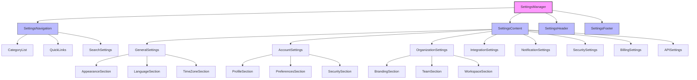
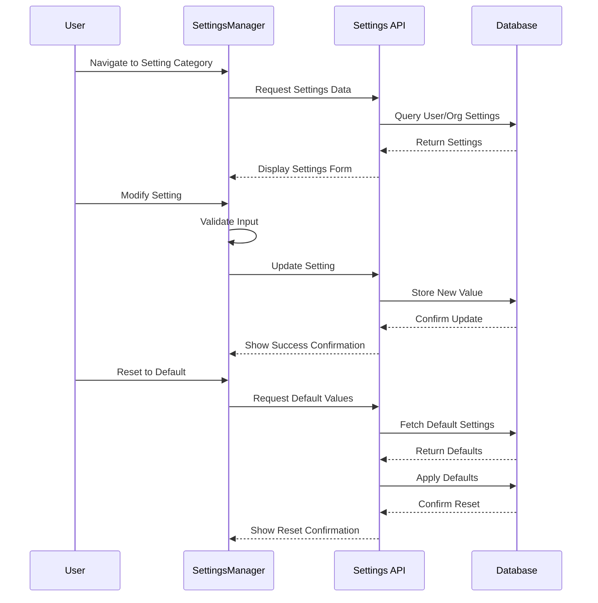
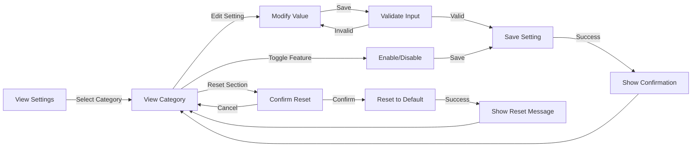

# SettingsManager Component

## Overview
The SettingsManager component provides a comprehensive interface for configuring application preferences, managing user accounts, controlling system behaviors, and customizing the platform to meet specific organizational needs. It centralizes all configuration options in an organized, accessible interface with appropriate permission controls.

## Screenshots

### Settings Dashboard

*The main settings dashboard showing categories and recently modified settings*

### Account Settings

*Personal account settings including profile, preferences, and security options*

### Organization Settings

*Organization-level configuration for branding, defaults, and team management*

### Integration Settings

*Third-party integration configuration and connection management*

## Component Architecture



*Component hierarchy and relationships*

## Data Flow



*Data flow for settings management operations*

## Features
- Comprehensive application configuration
- User account and profile management
- Organization and workspace settings
- Theme and appearance customization
- Notification preferences
- Security and privacy controls
- Integration management
- Billing and subscription settings
- API credentials and webhook configuration
- Role-based access controls
- Audit logging for changes
- Import/export configuration
- Multi-language support
- Accessibility preferences
- Default value management

## Props

| Prop | Type | Required | Description |
|------|------|----------|-------------|
| initialCategory | string | No | Initial settings category to display |
| user | User | Yes | Current user object with permissions |
| organization | Organization | No | Organization data if applicable |
| onSettingChange | (key: string, value: any) => void | No | Callback when setting is changed |
| onReset | (category: string) => void | No | Callback when settings are reset to default |
| permissions | PermissionSet | No | Custom permission overrides |
| uiOptions | UIOptions | No | UI customization options |
| integrations | Integration[] | No | Available third-party integrations |
| showHeader | boolean | No | Whether to show the settings header |
| restrictedCategories | string[] | No | Categories to hide based on permissions |

## Usage

```tsx
import { SettingsManager } from '@/components/settings/SettingsManager';

// Basic usage
<SettingsManager user={currentUser} />

// With initial category
<SettingsManager
  user={currentUser}
  initialCategory="account"
/>

// With organization settings
<SettingsManager
  user={currentUser}
  organization={userOrganization}
  initialCategory="organization"
/>

// With callbacks
<SettingsManager
  user={currentUser}
  onSettingChange={(key, value) => {
    console.log(`Setting ${key} changed to:`, value);
    updateUserPreferences(key, value);
  }}
  onReset={(category) => {
    console.log(`Reset settings for category: ${category}`);
    showNotification(`${category} settings have been reset`);
  }}
/>

// With restricted access
<SettingsManager
  user={currentUser}
  restrictedCategories={['billing', 'api']}
  permissions={{
    canManageUsers: false,
    canManageIntegrations: true,
    canChangeBilling: false
  }}
/>
```

## User Interaction Workflow



*User interaction flows within the settings management component*

## Components

### SettingsNavigation
Provides navigation between different settings categories.

#### Props
- categories: SettingsCategory[]
- activeCategoryId: string
- onCategoryChange: (categoryId: string) => void
- recentSettings: Setting[]
- searchQuery: string
- onSearchChange: (query: string) => void

### GeneralSettings
Manages application-wide settings like appearance, language, and time zone.

#### Features
- Theme selection (light, dark, system)
- Language preference
- Time and date format configuration
- Default view settings
- Accessibility options
- Regional settings

### AccountSettings
Manages user-specific settings and profile information.

#### Features
- Profile information editing
- Password management
- Two-factor authentication
- Login sessions
- Email preferences
- Personal API tokens
- Account deletion

### OrganizationSettings
Manages organization-wide settings and configurations.

#### Features
- Organization profile and branding
- Team member management
- Role and permission configuration
- Workspace settings
- Default project templates
- Organization-wide defaults
- Billing address information

### IntegrationSettings
Manages connections with third-party services and tools.

#### Features
- OAuth connections
- API key management
- Webhook configuration
- Service account setup
- Data sync options
- Integration status monitoring
- Connection testing

## Data Models

### SettingsCategory
```typescript
interface SettingsCategory {
  id: string;
  label: string;
  description: string;
  icon: React.ReactNode;
  sections: SettingsSection[];
  permissions?: string[]; // Required permissions to view/edit
  isVisible: boolean;
  order: number;
}
```

### SettingsSection
```typescript
interface SettingsSection {
  id: string;
  title: string;
  description?: string;
  settings: Setting[];
  collapsible?: boolean;
  defaultCollapsed?: boolean;
  permissions?: string[]; // Required permissions to view/edit
}
```

### Setting
```typescript
interface Setting {
  id: string;
  key: string; // Unique identifier for the setting
  label: string;
  description?: string;
  type: 'text' | 'number' | 'boolean' | 'select' | 'multiselect' | 'color' | 'date' | 'object' | 'array' | 'custom';
  defaultValue: any;
  value: any;
  options?: Array<{
    label: string;
    value: any;
    icon?: React.ReactNode;
  }>;
  validation?: {
    required?: boolean;
    min?: number;
    max?: number;
    pattern?: string;
    custom?: (value: any) => boolean | string;
  };
  permissions?: string[];
  isSecret?: boolean; // For sensitive data like API keys
  scope: 'user' | 'organization' | 'workspace' | 'global';
  component?: React.ComponentType<SettingProps>; // For custom setting UI
  onChange?: (value: any) => void;
  dependsOn?: {
    setting: string;
    value: any;
    condition?: 'equals' | 'notEquals' | 'contains' | 'greaterThan' | 'lessThan';
  };
  restartRequired?: boolean;
  tags?: string[];
}
```

### User
```typescript
interface User {
  id: string;
  email: string;
  name: string;
  avatar?: string;
  role: string;
  permissions: string[];
  preferences: Record<string, any>;
  organizationId?: string;
  settings: Record<string, any>;
  lastLogin?: Date;
  createdAt: Date;
  updatedAt: Date;
}
```

## Styling
The component uses a combination of Tailwind CSS and custom styling:
- Responsive layout for all device sizes
- Accessible form controls with proper labeling
- Visual indicators for setting status (default, modified, invalid)
- Dark and light mode support
- Organized sections with consistent spacing
- Form validation styling
- Interactive elements with appropriate hover/focus states
- Clear visual hierarchy for categories and sections

## Accessibility
- ARIA labels for all form controls
- Keyboard navigation between settings
- Focus management for settings forms
- Screen reader announcements for updates
- High contrast mode options
- Reduced motion settings
- Text size adjustment
- Proper form validation messaging
- Skip links for navigation
- Semantic HTML structure

## Error Handling
- Input validation with clear error messages
- Setting dependency validation
- Permission verification before changes
- Network error handling for settings API
- Conflict resolution for concurrent edits
- Automatic retry for failed saves
- Error boundaries for section isolation
- Transaction-based updates for related settings
- Recovery options for failed operations

## Performance Optimizations
- Lazy loading of settings categories
- Memoization of setting values
- Debounced input for text-based settings
- Efficient change detection
- Batched API updates for multiple changes
- Caching of infrequently changed settings
- Code splitting for complex setting UIs
- Minimal re-renders with optimized state management

## Dependencies
- react-hook-form
- zod (for validation)
- @tanstack/react-query
- react-color (for color pickers)
- react-datepicker
- react-select
- @headlessui/react
- @radix-ui/react-switch
- @radix-ui/react-slider
- luxon (for time/date handling)

## Related Components
- UserProfile
- TeamManagement
- BrandingManager
- SecurityControls
- IntegrationDirectory
- BillingPortal
- APIConsole
- NotificationCenter

## Examples

### Basic Implementation
```tsx
import { SettingsManager } from '@/components/settings/SettingsManager';
import { useAuth } from '@/hooks/useAuth';

export default function SettingsPage() {
  const { user } = useAuth();
  
  if (!user) {
    return <div>Please log in to access settings</div>;
  }
  
  return (
    <div className="p-6">
      <h1 className="text-2xl font-bold mb-6">Application Settings</h1>
      <SettingsManager user={user} />
    </div>
  );
}
```

### Organization Settings with Audit Logging
```tsx
import { SettingsManager } from '@/components/settings/SettingsManager';
import { useAuth } from '@/hooks/useAuth';
import { useOrganization } from '@/hooks/useOrganization';
import { logSettingChange } from '@/lib/audit-logger';

export default function OrganizationSettingsPage() {
  const { user } = useAuth();
  const { organization } = useOrganization();
  
  const handleSettingChange = (key, value) => {
    // Log the change to audit trail
    logSettingChange({
      userId: user.id,
      organizationId: organization.id,
      setting: key,
      oldValue: organization.settings[key],
      newValue: value,
      timestamp: new Date()
    });
    
    // Update the setting
    updateOrganizationSetting(key, value);
  };
  
  return (
    <div className="p-6">
      <h1 className="text-2xl font-bold mb-6">Organization Settings</h1>
      <SettingsManager 
        user={user}
        organization={organization}
        initialCategory="organization"
        onSettingChange={handleSettingChange}
      />
    </div>
  );
}
```

### Settings with Permission Controls
```tsx
import { SettingsManager } from '@/components/settings/SettingsManager';
import { useAuth } from '@/hooks/useAuth';
import { usePermissions } from '@/hooks/usePermissions';
import { useToast } from '@/components/ui/toast';

export default function RestrictedSettingsPage() {
  const { user } = useAuth();
  const { hasPermission, userPermissions } = usePermissions();
  const { toast } = useToast();
  
  // Determine restricted categories based on permissions
  const restrictedCategories = [];
  
  if (!hasPermission('manage_billing')) {
    restrictedCategories.push('billing');
  }
  
  if (!hasPermission('manage_api')) {
    restrictedCategories.push('api');
  }
  
  if (!hasPermission('manage_team')) {
    restrictedCategories.push('team');
  }
  
  const handleSettingChange = (key, value) => {
    // Additional permission check before change
    const settingPermission = getSettingPermission(key);
    if (settingPermission && !hasPermission(settingPermission)) {
      toast({
        title: "Permission Denied",
        description: "You don't have permission to change this setting",
        variant: "destructive"
      });
      return;
    }
    
    // Apply the setting change
    updateSetting(key, value);
    
    toast({
      title: "Setting Updated",
      description: `The setting has been updated successfully.`,
      variant: "success"
    });
  };
  
  return (
    <div className="p-6">
      <h1 className="text-2xl font-bold mb-6">Settings</h1>
      <SettingsManager 
        user={user}
        restrictedCategories={restrictedCategories}
        permissions={userPermissions}
        onSettingChange={handleSettingChange}
      />
    </div>
  );
}
```

## Best Practices
1. Group related settings into logical categories
2. Provide clear descriptions for each setting
3. Use appropriate input controls for different setting types
4. Implement proper validation for all inputs
5. Show immediate feedback when settings are changed
6. Provide reset options for reverting to defaults
7. Implement proper permission checks for sensitive settings
8. Log important setting changes for audit purposes

## Troubleshooting

### Common Issues
1. Settings not saving properly
2. Permission errors when accessing certain settings
3. Settings reset unexpectedly
4. Conflicting settings between user and organization levels
5. Validation errors with complex settings
6. Settings not applied until application restart
7. Integration connection failures

### Solutions
1. Check network requests and API responses
2. Verify user permissions and role assignments
3. Look for automated reset processes or conflicts
4. Review setting scope priority (user vs organization)
5. Validate input according to the expected format
6. Check for settings requiring application restart
7. Verify API keys and connection parameters

## Contributing
When contributing to this component:
1. Follow established settings patterns for consistency
2. Document all settings clearly with examples
3. Implement proper validation for new settings
4. Consider permission implications
5. Add unit tests for critical settings logic
6. Ensure accessibility for all setting controls
7. Maintain backward compatibility for existing settings 