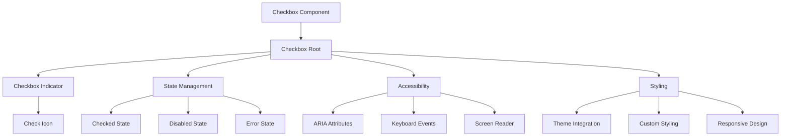
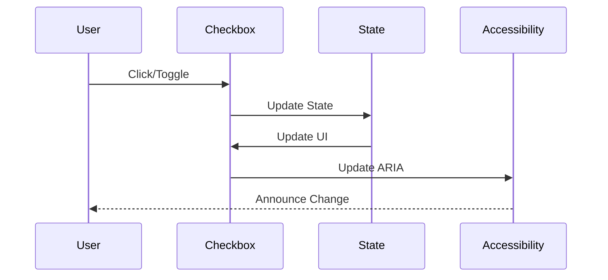
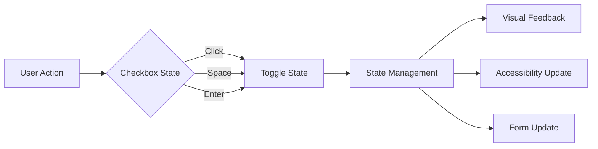

# Checkbox Component

## Overview
The Checkbox component is a fundamental form control that provides a binary selection interface. Built on top of Radix UI's Checkbox primitive, it offers enhanced styling, accessibility features, and consistent design system integration. The component supports both controlled and uncontrolled states, maintains full keyboard navigation, and provides screen reader support.

## Screenshots

*Main view showing different checkbox states*


*Various checkbox states: default, checked, disabled, error*


*Checkbox group with multiple options*


*Checkbox with custom styling and label*

## Component Architecture


## Data Flow


## Features
- Binary selection support
- Controlled and uncontrolled states
- Custom styling
- Keyboard navigation
- Screen reader support
- Form integration
- TypeScript support
- Performance optimized
- RTL support
- Dark mode support
- Mobile support
- Accessibility features
- Error state handling
- Disabled state
- Custom indicators
- Animation support

## Props

### Checkbox Root
| Name | Type | Required | Default | Description |
|------|------|----------|---------|-------------|
| checked | boolean | No | false | Checked state |
| defaultChecked | boolean | No | false | Default checked state |
| disabled | boolean | No | false | Disabled state |
| onCheckedChange | (checked: boolean) => void | No | - | Change handler |
| required | boolean | No | false | Required state |
| name | string | No | - | Form field name |
| value | string | No | - | Form field value |
| className | string | No | undefined | Additional CSS classes |

## Usage
```tsx
import { Checkbox } from '@/components/ui/checkbox';

// Basic usage
<Checkbox />

// Controlled usage
const [checked, setChecked] = React.useState(false);
<Checkbox checked={checked} onCheckedChange={setChecked} />

// With label
<div className="flex items-center space-x-2">
  <Checkbox id="terms" />
  <label
    htmlFor="terms"
    className="text-sm font-medium leading-none peer-disabled:cursor-not-allowed peer-disabled:opacity-70"
  >
    Accept terms and conditions
  </label>
</div>

// Disabled state
<Checkbox disabled />

// Required state
<Checkbox required />
```

## User Interaction Workflow


## Components

### Checkbox Root
- Manages checkbox state
- Handles user interactions
- Provides accessibility
- Controls styling
- Manages form integration

### Checkbox Indicator
- Renders check icon
- Handles animations
- Manages visibility
- Controls styling
- Provides feedback

## Data Models
```typescript
interface CheckboxProps extends React.ComponentPropsWithoutRef<typeof CheckboxPrimitive.Root> {
  checked?: boolean;
  defaultChecked?: boolean;
  disabled?: boolean;
  onCheckedChange?: (checked: boolean) => void;
  required?: boolean;
  name?: string;
  value?: string;
  className?: string;
}
```

## Styling
- Uses Tailwind CSS for styling
- Follows design system color tokens
- Implements consistent spacing
- Supports dark mode
- Maintains accessibility contrast ratios
- Uses CSS variables for theming
- Implements responsive design
- Supports custom animations
- Uses CSS Grid for layout
- Implements proper transitions

## Accessibility
- ARIA labels for screen readers
- Keyboard navigation support
- Focus management
- Color contrast compliance
- State announcements
- RTL support
- Screen reader announcements
- Focus visible states
- Proper role attributes
- Keyboard event handling
- Error message association
- Input announcements

## Error Handling
- Input validation
- Error state management
- Error message display
- Recovery strategies
- User feedback
- Error logging
- State recovery
- Validation recovery
- Animation fallbacks

## Performance Optimizations
- Component memoization
- Render optimization
- Event debouncing
- State batching
- Code splitting
- Bundle optimization
- Memory management
- Lazy loading
- Virtual scrolling

## Dependencies
- React
- TypeScript
- Tailwind CSS
- @radix-ui/react-checkbox
- @testing-library/react
- @testing-library/jest-dom
- @testing-library/user-event

## Related Components
- [Form](../forms/Form.md)
- [Label](../ui/Label.md)
- [ErrorMessage](../ui/ErrorMessage.md)
- [Icon](../ui/Icon.md)
- [Typography](../ui/Typography.md)

## Examples

### Basic Example
```tsx
import { Checkbox } from '@/components/ui/checkbox';

export function BasicExample() {
  return (
    <div className="flex items-center space-x-2">
      <Checkbox id="terms" />
      <label
        htmlFor="terms"
        className="text-sm font-medium leading-none peer-disabled:cursor-not-allowed peer-disabled:opacity-70"
      >
        Accept terms and conditions
      </label>
    </div>
  );
}
```

### Advanced Example
```tsx
import { Checkbox } from '@/components/ui/checkbox';
import { Label } from '@/components/ui/label';
import { ErrorMessage } from '@/components/ui/error-message';

export function AdvancedExample() {
  const [checked, setChecked] = React.useState(false);
  const [error, setError] = React.useState('');

  const handleChange = (newChecked: boolean) => {
    setChecked(newChecked);
    if (!newChecked) {
      setError('You must accept the terms to continue');
    } else {
      setError('');
    }
  };

  return (
    <div className="space-y-2">
      <div className="flex items-center space-x-2">
        <Checkbox
          id="terms"
          checked={checked}
          onCheckedChange={handleChange}
          required
        />
        <Label htmlFor="terms">Accept terms and conditions</Label>
      </div>
      {error && <ErrorMessage>{error}</ErrorMessage>}
    </div>
  );
}
```

## Best Practices

### Usage Guidelines
1. Use appropriate size
2. Provide clear labels
3. Handle validation
4. Show error states
5. Follow accessibility guidelines
6. Optimize for performance
7. Use TypeScript for type safety
8. Add proper test IDs
9. Handle edge cases
10. Implement proper state

### Performance Tips
1. Memoize components
2. Use proper state management
3. Optimize re-renders
4. Implement proper loading
5. Use proper error boundaries
6. Optimize bundle size
7. Use proper code splitting
8. Implement proper caching
9. Use proper lazy loading
10. Monitor performance metrics

### Security Considerations
1. Validate user input
2. Prevent XSS attacks
3. Handle sensitive data
4. Implement proper authentication
5. Use proper authorization
6. Handle errors securely
7. Implement proper logging
8. Use proper encryption
9. Follow security best practices
10. Regular security audits

## Troubleshooting

### Common Issues
| Issue | Solution |
|-------|----------|
| Checkbox not updating | Check onCheckedChange handler |
| Validation not working | Verify validation logic |
| Styling issues | Check Tailwind classes |
| Accessibility issues | Verify ARIA labels |
| Type errors | Check TypeScript types |

### Error Messages
| Error Code | Description | Resolution |
|------------|-------------|------------|
| ERR001 | Invalid state | Check state management |
| ERR002 | Validation error | Verify validation |
| ERR003 | State error | Check state management |
| ERR004 | Theme error | Verify theme settings |
| ERR005 | Event error | Check event handlers |

## Contributing

### Development Setup
1. Clone the repository
2. Install dependencies
3. Run development server
4. Make changes
5. Run tests
6. Submit PR

### Testing
```typescript
import { render, screen, fireEvent } from '@testing-library/react';
import { Checkbox } from './checkbox';

describe('Checkbox', () => {
  it('renders correctly', () => {
    render(<Checkbox />);
    expect(screen.getByRole('checkbox')).toBeInTheDocument();
  });

  it('handles checked state', () => {
    const handleChange = jest.fn();
    render(<Checkbox onCheckedChange={handleChange} />);
    fireEvent.click(screen.getByRole('checkbox'));
    expect(handleChange).toHaveBeenCalledWith(true);
  });

  it('handles disabled state', () => {
    render(<Checkbox disabled />);
    expect(screen.getByRole('checkbox')).toBeDisabled();
  });
});
```

### Code Style
- Follow TypeScript best practices
- Use ESLint rules
- Follow Prettier configuration
- Write meaningful comments
- Use proper naming conventions
- Follow component patterns
- Use proper documentation
- Follow testing practices
- Use proper error handling
- Follow security guidelines

## Changelog

### Version 1.0.0
- Initial release
- Basic checkbox functionality
- Custom styling
- Accessibility support
- Mobile support

### Version 1.1.0
- Added validation
- Improved performance
- Enhanced accessibility
- Added dark mode
- Added RTL support

## Appendix

### Glossary
- **Checkbox**: Binary selection component
- **Indicator**: Check icon element
- **State**: Checkbox state management
- **Accessibility**: A11y features

### FAQ
#### How do I handle checkbox validation?
Use the onCheckedChange handler to implement validation logic and manage error states.

#### How do I customize the checkbox styling?
Use the className prop to add custom Tailwind classes or CSS to the checkbox component.

#### How do I make the checkbox accessible?
The component is built with accessibility in mind, but ensure you provide proper labels and ARIA attributes when needed. 