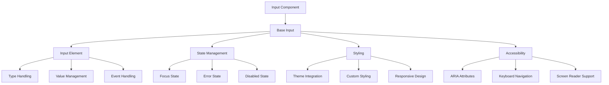
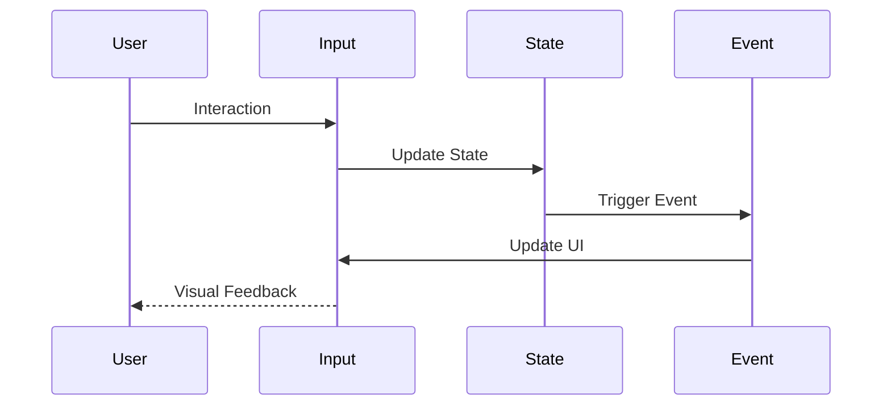
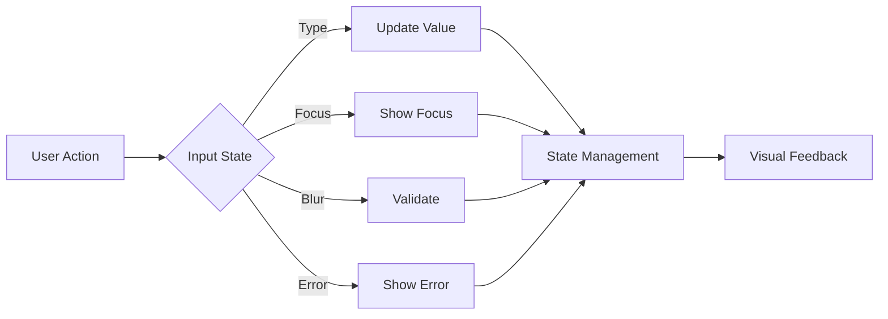

# Input Component

## Overview
The Input component is a versatile form control that extends the native HTML input element with enhanced styling, accessibility features, and consistent design system integration. It supports all standard input types, custom styling, and maintains accessibility compliance while providing a seamless user experience.

## Screenshots

*Main view showing different input states*


*Various input states: default, focus, error, disabled*


*Different input types: text, number, email, password*


*Input with icon and validation state*

## Component Architecture


## Data Flow


## Features
- All HTML input types support
- Custom styling support
- Focus state management
- Error state handling
- Disabled state
- Form integration
- Validation support
- Accessibility features
- Keyboard navigation
- Screen reader support
- Responsive design
- Dark mode support
- RTL support
- Performance optimized
- TypeScript support
- Event handling
- State management

## Props
| Name | Type | Required | Default | Description |
|------|------|----------|---------|-------------|
| type | string | No | 'text' | Input type (text, number, email, etc.) |
| value | string | No | undefined | Input value |
| onChange | (e: ChangeEvent) => void | No | undefined | Change handler |
| placeholder | string | No | undefined | Placeholder text |
| disabled | boolean | No | false | Disabled state |
| className | string | No | undefined | Additional CSS classes |
| ariaLabel | string | No | undefined | ARIA label |
| testId | string | No | undefined | Test ID |
| name | string | No | undefined | Input name |
| id | string | No | undefined | Input ID |
| required | boolean | No | false | Required state |
| error | boolean | No | false | Error state |
| maxLength | number | No | undefined | Maximum length |
| minLength | number | No | undefined | Minimum length |
| pattern | string | No | undefined | Validation pattern |
| autoComplete | string | No | undefined | Autocomplete type |

## Usage
```tsx
import { Input } from '@/components/ui/input';

// Basic usage
<Input
  type="text"
  placeholder="Enter your name"
  ariaLabel="Name input"
/>

// Advanced usage
<Input
  type="email"
  placeholder="Enter your email"
  value={email}
  onChange={(e) => setEmail(e.target.value)}
  required
  error={!!emailError}
  ariaLabel="Email input"
  className="custom-input"
  maxLength={100}
  autoComplete="email"
/>
```

## User Interaction Workflow


## Components

### Base Input
- Handles core input functionality
- Manages state
- Implements styling
- Handles accessibility
- Manages theme

### Input Element
- Renders native input
- Handles types
- Manages value
- Handles events
- Implements validation

### State Management
- Manages focus state
- Handles error state
- Controls disabled state
- Manages validation
- Handles events

### Styling
- Applies theme styles
- Handles custom styles
- Manages responsive design
- Implements animations
- Handles transitions

## Data Models
```typescript
interface InputProps extends React.InputHTMLAttributes<HTMLInputElement> {
  error?: boolean;
  className?: string;
  ariaLabel?: string;
  testId?: string;
}

interface InputState {
  value: string;
  isFocused: boolean;
  hasError: boolean;
  isDisabled: boolean;
}

interface InputEvent {
  type: 'change' | 'focus' | 'blur' | 'error';
  timestamp: number;
  data?: {
    value?: string;
    error?: string;
  };
}
```

## Styling
- Uses Tailwind CSS for styling
- Follows design system color tokens
- Implements consistent spacing
- Supports dark mode
- Maintains accessibility contrast ratios
- Uses CSS variables for theming
- Implements responsive design
- Supports custom animations
- Uses CSS Grid for layout
- Implements proper transitions

## Accessibility
- ARIA labels for screen readers
- Keyboard navigation support
- Focus management
- Color contrast compliance
- State announcements
- RTL support
- Screen reader announcements
- Focus visible states
- Proper role attributes
- Keyboard event handling
- Error message association
- Input announcements

## Error Handling
- Input validation
- Error state management
- Error message display
- Recovery strategies
- User feedback
- Error logging
- State recovery
- Validation recovery
- Animation fallbacks

## Performance Optimizations
- Component memoization
- Render optimization
- Event debouncing
- State batching
- Code splitting
- Bundle optimization
- Memory management
- Lazy loading
- Virtual scrolling

## Dependencies
- React
- TypeScript
- Tailwind CSS
- @testing-library/react
- @testing-library/jest-dom
- @testing-library/user-event

## Related Components
- [Form](../forms/Form.md)
- [Label](../ui/Label.md)
- [ErrorMessage](../ui/ErrorMessage.md)
- [Icon](../ui/Icon.md)
- [Typography](../ui/Typography.md)

## Examples

### Basic Example
```tsx
import { Input } from '@/components/ui/input';

export function BasicExample() {
  return (
    <Input
      type="text"
      placeholder="Enter your name"
      ariaLabel="Name input"
    />
  );
}
```

### Advanced Example
```tsx
import { Input } from '@/components/ui/input';
import { useState, useCallback } from 'react';

export function AdvancedExample() {
  const [email, setEmail] = useState('');
  const [emailError, setEmailError] = useState('');

  const handleChange = useCallback((e: React.ChangeEvent<HTMLInputElement>) => {
    const value = e.target.value;
    setEmail(value);
    
    // Basic email validation
    if (value && !/^[^\s@]+@[^\s@]+\.[^\s@]+$/.test(value)) {
      setEmailError('Please enter a valid email address');
    } else {
      setEmailError('');
    }
  }, []);

  return (
    <Input
      type="email"
      placeholder="Enter your email"
      value={email}
      onChange={handleChange}
      required
      error={!!emailError}
      ariaLabel="Email input"
      className="custom-input"
      maxLength={100}
      autoComplete="email"
    />
  );
}
```

## Best Practices

### Usage Guidelines
1. Use appropriate input types
2. Provide clear labels
3. Handle validation
4. Show error states
5. Follow accessibility guidelines
6. Optimize for performance
7. Use TypeScript for type safety
8. Add proper test IDs
9. Handle edge cases
10. Implement proper state

### Performance Tips
1. Memoize components
2. Use proper state management
3. Optimize re-renders
4. Implement proper loading
5. Use proper error boundaries
6. Optimize bundle size
7. Use proper code splitting
8. Implement proper caching
9. Use proper lazy loading
10. Monitor performance metrics

### Security Considerations
1. Validate user input
2. Prevent XSS attacks
3. Handle sensitive data
4. Implement proper authentication
5. Use proper authorization
6. Handle errors securely
7. Implement proper logging
8. Use proper encryption
9. Follow security best practices
10. Regular security audits

## Troubleshooting

### Common Issues
| Issue | Solution |
|-------|----------|
| Input not updating | Check onChange handler |
| Validation not working | Verify validation logic |
| Styling issues | Check Tailwind classes |
| Accessibility issues | Verify ARIA labels |
| Type errors | Check TypeScript types |

### Error Messages
| Error Code | Description | Resolution |
|------------|-------------|------------|
| ERR001 | Invalid type | Check input type |
| ERR002 | Validation error | Verify validation |
| ERR003 | State error | Check state management |
| ERR004 | Theme error | Verify theme settings |
| ERR005 | Event error | Check event handlers |

## Contributing

### Development Setup
1. Clone the repository
2. Install dependencies
3. Run development server
4. Make changes
5. Run tests
6. Submit PR

### Testing
```typescript
import { render, screen, fireEvent } from '@testing-library/react';
import { Input } from './input';

describe('Input', () => {
  it('renders correctly', () => {
    render(<Input placeholder="Enter text" />);
    const input = screen.getByPlaceholderText('Enter text');
    expect(input).toBeInTheDocument();
    expect(input.tagName).toBe('INPUT');
  });

  it('handles user input', async () => {
    render(<Input placeholder="Type here" />);
    const input = screen.getByPlaceholderText('Type here');
    await userEvent.type(input, 'Hello World');
    expect(input).toHaveValue('Hello World');
  });

  it('handles disabled state', () => {
    render(<Input disabled placeholder="Disabled input" />);
    expect(screen.getByPlaceholderText('Disabled input')).toBeDisabled();
  });
});
```

### Code Style
- Follow TypeScript best practices
- Use ESLint rules
- Follow Prettier configuration
- Write meaningful comments
- Use proper naming conventions
- Follow component patterns
- Use proper documentation
- Follow testing practices
- Use proper error handling
- Follow security guidelines

## Changelog

### Version 1.0.0
- Initial release
- Basic input types
- Custom styling
- Accessibility support
- Mobile support

### Version 1.1.0
- Added validation
- Improved performance
- Enhanced accessibility
- Added dark mode
- Added RTL support

## Appendix

### Glossary
- **Input**: Form control component
- **Type**: Input type (text, number, etc.)
- **Validation**: Input validation
- **State**: Component state
- **Accessibility**: A11y features

### FAQ
#### How do I handle input validation?
Use the error prop and implement validation logic in the onChange handler.

#### How do I customize the input styling?
Use the className prop to add custom Tailwind classes or CSS.

#### How do I make the input accessible?
Include proper ARIA labels and ensure keyboard navigation works. 