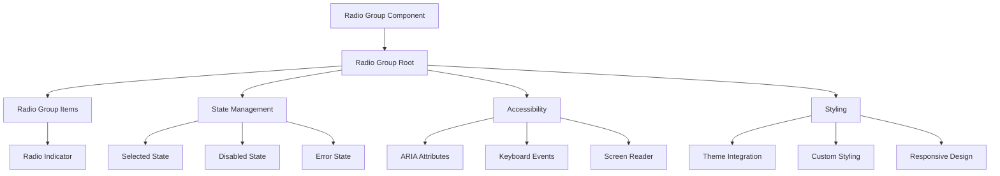
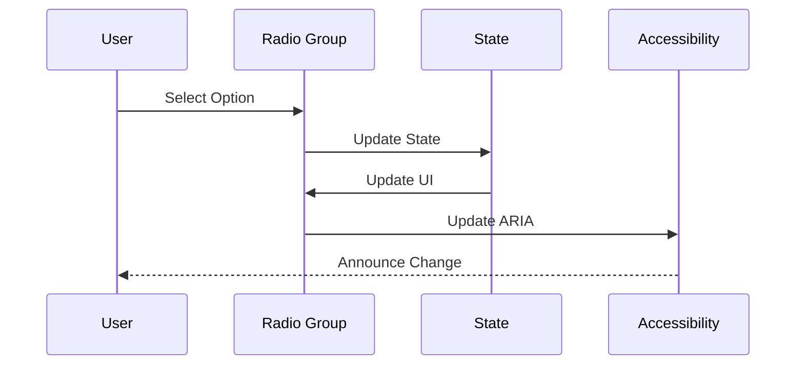
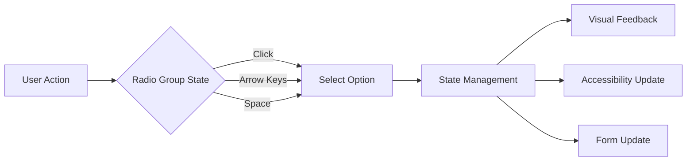

# Radio Group Component

## Overview
The Radio Group component is a form control that allows users to select a single option from a set of choices. Built on top of Radix UI's Radio Group primitive, it provides enhanced styling, accessibility features, and consistent design system integration. The component supports both controlled and uncontrolled states, maintains full keyboard navigation, and provides screen reader support.

## Screenshots

*Main view showing different radio group states*


*Various radio group states: default, selected, disabled, error*


*Radio group with different layout options*


*Radio group with custom styling and labels*

## Component Architecture


## Data Flow


## Features
- Single selection support
- Controlled and uncontrolled states
- Custom styling
- Keyboard navigation
- Screen reader support
- Form integration
- TypeScript support
- Performance optimized
- RTL support
- Dark mode support
- Mobile support
- Accessibility features
- Error state handling
- Disabled state
- Custom indicators
- Animation support

## Props

### Radio Group Root
| Name | Type | Required | Default | Description |
|------|------|----------|---------|-------------|
| value | string | No | - | Selected value |
| defaultValue | string | No | - | Default selected value |
| onValueChange | (value: string) => void | No | - | Change handler |
| disabled | boolean | No | false | Disabled state |
| required | boolean | No | false | Required state |
| name | string | No | - | Form field name |
| className | string | No | undefined | Additional CSS classes |

### Radio Group Item
| Name | Type | Required | Default | Description |
|------|------|----------|---------|-------------|
| value | string | Yes | - | Item value |
| disabled | boolean | No | false | Disabled state |
| className | string | No | undefined | Additional CSS classes |

## Usage
```tsx
import { RadioGroup, RadioGroupItem } from '@/components/ui/radio-group';

// Basic usage
<RadioGroup defaultValue="option-1">
  <RadioGroupItem value="option-1" />
  <RadioGroupItem value="option-2" />
  <RadioGroupItem value="option-3" />
</RadioGroup>

// Controlled usage
const [value, setValue] = React.useState('option-1');
<RadioGroup value={value} onValueChange={setValue}>
  <RadioGroupItem value="option-1" />
  <RadioGroupItem value="option-2" />
  <RadioGroupItem value="option-3" />
</RadioGroup>

// With labels
<RadioGroup defaultValue="option-1">
  <div className="flex items-center space-x-2">
    <RadioGroupItem value="option-1" id="option-1" />
    <label htmlFor="option-1">Option 1</label>
  </div>
  <div className="flex items-center space-x-2">
    <RadioGroupItem value="option-2" id="option-2" />
    <label htmlFor="option-2">Option 2</label>
  </div>
</RadioGroup>

// Disabled state
<RadioGroup disabled>
  <RadioGroupItem value="option-1" />
  <RadioGroupItem value="option-2" />
</RadioGroup>

// Required state
<RadioGroup required>
  <RadioGroupItem value="option-1" />
  <RadioGroupItem value="option-2" />
</RadioGroup>
```

## User Interaction Workflow


## Components

### Radio Group Root
- Manages radio group state
- Handles user interactions
- Provides accessibility
- Controls styling
- Manages form integration

### Radio Group Item
- Renders radio button
- Handles selection state
- Manages focus state
- Controls styling
- Provides feedback

## Data Models
```typescript
interface RadioGroupProps extends React.ComponentPropsWithoutRef<typeof RadioGroupPrimitive.Root> {
  value?: string;
  defaultValue?: string;
  onValueChange?: (value: string) => void;
  disabled?: boolean;
  required?: boolean;
  name?: string;
  className?: string;
}

interface RadioGroupItemProps extends React.ComponentPropsWithoutRef<typeof RadioGroupPrimitive.Item> {
  value: string;
  disabled?: boolean;
  className?: string;
}
```

## Styling
- Uses Tailwind CSS for styling
- Follows design system color tokens
- Implements consistent spacing
- Supports dark mode
- Maintains accessibility contrast ratios
- Uses CSS variables for theming
- Implements responsive design
- Supports custom animations
- Uses CSS Grid for layout
- Implements proper transitions

## Accessibility
- ARIA labels for screen readers
- Keyboard navigation support
- Focus management
- Color contrast compliance
- State announcements
- RTL support
- Screen reader announcements
- Focus visible states
- Proper role attributes
- Keyboard event handling
- Error message association
- Input announcements

## Error Handling
- Input validation
- Error state management
- Error message display
- Recovery strategies
- User feedback
- Error logging
- State recovery
- Validation recovery
- Animation fallbacks

## Performance Optimizations
- Component memoization
- Render optimization
- Event debouncing
- State batching
- Code splitting
- Bundle optimization
- Memory management
- Lazy loading
- Virtual scrolling

## Dependencies
- React
- TypeScript
- Tailwind CSS
- @radix-ui/react-radio-group
- @testing-library/react
- @testing-library/jest-dom
- @testing-library/user-event

## Related Components
- [Form](../forms/Form.md)
- [Label](../ui/Label.md)
- [ErrorMessage](../ui/ErrorMessage.md)
- [Icon](../ui/Icon.md)
- [Typography](../ui/Typography.md)

## Examples

### Basic Example
```tsx
import { RadioGroup, RadioGroupItem } from '@/components/ui/radio-group';

export function BasicExample() {
  return (
    <RadioGroup defaultValue="option-1">
      <div className="flex items-center space-x-2">
        <RadioGroupItem value="option-1" id="option-1" />
        <label htmlFor="option-1">Option 1</label>
      </div>
      <div className="flex items-center space-x-2">
        <RadioGroupItem value="option-2" id="option-2" />
        <label htmlFor="option-2">Option 2</label>
      </div>
    </RadioGroup>
  );
}
```

### Advanced Example
```tsx
import { RadioGroup, RadioGroupItem } from '@/components/ui/radio-group';
import { Label } from '@/components/ui/label';
import { ErrorMessage } from '@/components/ui/error-message';

export function AdvancedExample() {
  const [value, setValue] = React.useState('');
  const [error, setError] = React.useState('');

  const handleChange = (newValue: string) => {
    setValue(newValue);
    if (!newValue) {
      setError('Please select an option');
    } else {
      setError('');
    }
  };

  return (
    <div className="space-y-2">
      <RadioGroup
        value={value}
        onValueChange={handleChange}
        required
      >
        <div className="flex items-center space-x-2">
          <RadioGroupItem value="option-1" id="option-1" />
          <Label htmlFor="option-1">Option 1</Label>
        </div>
        <div className="flex items-center space-x-2">
          <RadioGroupItem value="option-2" id="option-2" />
          <Label htmlFor="option-2">Option 2</Label>
        </div>
      </RadioGroup>
      {error && <ErrorMessage>{error}</ErrorMessage>}
    </div>
  );
}
```

## Best Practices

### Usage Guidelines
1. Use appropriate size
2. Provide clear labels
3. Handle validation
4. Show error states
5. Follow accessibility guidelines
6. Optimize for performance
7. Use TypeScript for type safety
8. Add proper test IDs
9. Handle edge cases
10. Implement proper state

### Performance Tips
1. Memoize components
2. Use proper state management
3. Optimize re-renders
4. Implement proper loading
5. Use proper error boundaries
6. Optimize bundle size
7. Use proper code splitting
8. Implement proper caching
9. Use proper lazy loading
10. Monitor performance metrics

### Security Considerations
1. Validate user input
2. Prevent XSS attacks
3. Handle sensitive data
4. Implement proper authentication
5. Use proper authorization
6. Handle errors securely
7. Implement proper logging
8. Use proper encryption
9. Follow security best practices
10. Regular security audits

## Troubleshooting

### Common Issues
| Issue | Solution |
|-------|----------|
| Radio not updating | Check onValueChange handler |
| Validation not working | Verify validation logic |
| Styling issues | Check Tailwind classes |
| Accessibility issues | Verify ARIA labels |
| Type errors | Check TypeScript types |

### Error Messages
| Error Code | Description | Resolution |
|------------|-------------|------------|
| ERR001 | Invalid state | Check state management |
| ERR002 | Validation error | Verify validation |
| ERR003 | State error | Check state management |
| ERR004 | Theme error | Verify theme settings |
| ERR005 | Event error | Check event handlers |

## Contributing

### Development Setup
1. Clone the repository
2. Install dependencies
3. Run development server
4. Make changes
5. Run tests
6. Submit PR

### Testing
```typescript
import { render, screen, fireEvent } from '@testing-library/react';
import { RadioGroup, RadioGroupItem } from './radio-group';

describe('RadioGroup', () => {
  it('renders correctly', () => {
    render(
      <RadioGroup>
        <RadioGroupItem value="option-1" />
        <RadioGroupItem value="option-2" />
      </RadioGroup>
    );
    expect(screen.getAllByRole('radio')).toHaveLength(2);
  });

  it('handles value change', () => {
    const handleChange = jest.fn();
    render(
      <RadioGroup onValueChange={handleChange}>
        <RadioGroupItem value="option-1" />
        <RadioGroupItem value="option-2" />
      </RadioGroup>
    );
    fireEvent.click(screen.getByRole('radio', { name: 'option-1' }));
    expect(handleChange).toHaveBeenCalledWith('option-1');
  });

  it('handles disabled state', () => {
    render(
      <RadioGroup disabled>
        <RadioGroupItem value="option-1" />
        <RadioGroupItem value="option-2" />
      </RadioGroup>
    );
    screen.getAllByRole('radio').forEach(radio => {
      expect(radio).toBeDisabled();
    });
  });
});
```

### Code Style
- Follow TypeScript best practices
- Use ESLint rules
- Follow Prettier configuration
- Write meaningful comments
- Use proper naming conventions
- Follow component patterns
- Use proper documentation
- Follow testing practices
- Use proper error handling
- Follow security guidelines

## Changelog

### Version 1.0.0
- Initial release
- Basic radio group functionality
- Custom styling
- Accessibility support
- Mobile support

### Version 1.1.0
- Added validation
- Improved performance
- Enhanced accessibility
- Added dark mode
- Added RTL support

## Appendix

### Glossary
- **Radio Group**: Single selection component
- **Radio Item**: Individual radio button
- **Indicator**: Selection indicator
- **State**: Radio group state management
- **Accessibility**: A11y features

### FAQ
#### How do I handle radio group validation?
Use the onValueChange handler to implement validation logic and manage error states.

#### How do I customize the radio group styling?
Use the className prop to add custom Tailwind classes or CSS to the radio group component.

#### How do I make the radio group accessible?
The component is built with accessibility in mind, but ensure you provide proper labels and ARIA attributes when needed. 