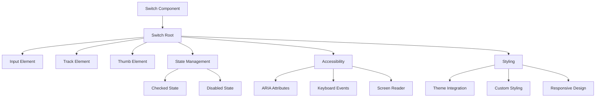
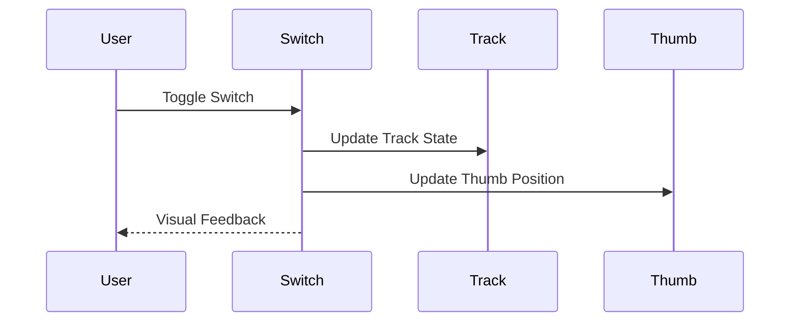
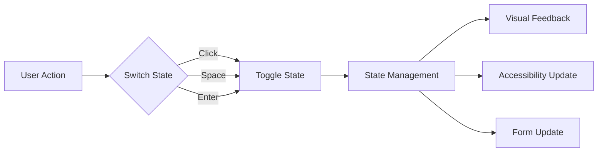

# Switch Component

## Overview
The Switch component is a toggle control that allows users to enable or disable a setting. Built with accessibility in mind, it provides a modern, animated interface for boolean state management. The component supports both controlled and uncontrolled states, maintains full keyboard navigation, and provides screen reader support.

## Screenshots

*Main view showing different switch states*


*Various switch states: default, checked, disabled*


*Switch with custom styling and labels*

## Component Architecture


## Data Flow


## Features
- Toggle state management
- Controlled and uncontrolled states
- Custom styling
- Keyboard navigation
- Screen reader support
- Form integration
- TypeScript support
- Performance optimized
- RTL support
- Dark mode support
- Mobile support
- Accessibility features
- Disabled state
- Custom animations
- Theme integration

## Props

| Name | Type | Required | Default | Description |
|------|------|----------|---------|-------------|
| checked | boolean | No | false | Controlled checked state |
| onCheckedChange | (checked: boolean) => void | No | - | Change handler |
| disabled | boolean | No | false | Disabled state |
| className | string | No | undefined | Additional CSS classes |

## Usage
```tsx
import { Switch } from '@/components/ui/switch';

// Basic usage
<Switch />

// Controlled usage
const [checked, setChecked] = React.useState(false);
<Switch checked={checked} onCheckedChange={setChecked} />

// With labels
<div className="flex items-center space-x-2">
  <Switch id="airplane-mode" />
  <label htmlFor="airplane-mode">Airplane Mode</label>
</div>

// Disabled state
<Switch disabled />

// Custom styling
<Switch className="bg-primary-foreground" />
```

## User Interaction Workflow


## Components

### Switch Root
- Manages switch state
- Handles user interactions
- Provides accessibility
- Controls styling
- Manages form integration

### Track Element
- Renders switch track
- Handles background state
- Manages transitions
- Controls styling

### Thumb Element
- Renders switch thumb
- Handles position state
- Manages animations
- Controls styling

## Data Models
```typescript
interface SwitchProps extends Omit<React.InputHTMLAttributes<HTMLInputElement>, 'type' | 'checked' | 'onChange'> {
  checked?: boolean;
  onCheckedChange?: (checked: boolean) => void;
}
```

## Styling
- Uses Tailwind CSS for styling
- Follows design system color tokens
- Implements consistent spacing
- Supports dark mode
- Maintains accessibility contrast ratios
- Uses CSS variables for theming
- Implements responsive design
- Supports custom animations
- Uses CSS Grid for layout
- Implements proper transitions

## Accessibility
- ARIA labels for screen readers
- Keyboard navigation support
- Focus management
- Color contrast compliance
- State announcements
- RTL support
- Screen reader announcements
- Focus visible states
- Proper role attributes
- Keyboard event handling
- Input announcements

## Error Handling
- Input validation
- State management
- User feedback
- Error logging
- State recovery
- Animation fallbacks

## Performance Optimizations
- Component memoization
- Render optimization
- Event debouncing
- State batching
- Code splitting
- Bundle optimization
- Memory management
- Lazy loading

## Dependencies
- React
- TypeScript
- Tailwind CSS
- @testing-library/react
- @testing-library/jest-dom
- @testing-library/user-event

## Related Components
- [Form](../forms/Form.md)
- [Label](../ui/Label.md)
- [ErrorMessage](../ui/ErrorMessage.md)
- [Icon](../ui/Icon.md)
- [Typography](../ui/Typography.md)

## Examples

### Basic Example
```tsx
import { Switch } from '@/components/ui/switch';

export function BasicExample() {
  return (
    <div className="flex items-center space-x-2">
      <Switch id="airplane-mode" />
      <label htmlFor="airplane-mode">Airplane Mode</label>
    </div>
  );
}
```

### Advanced Example
```tsx
import { Switch } from '@/components/ui/switch';
import { Label } from '@/components/ui/label';

export function AdvancedExample() {
  const [checked, setChecked] = React.useState(false);

  const handleChange = (newChecked: boolean) => {
    setChecked(newChecked);
    // Additional logic here
  };

  return (
    <div className="space-y-2">
      <div className="flex items-center space-x-2">
        <Switch
          id="notifications"
          checked={checked}
          onCheckedChange={handleChange}
        />
        <Label htmlFor="notifications">Enable Notifications</Label>
      </div>
      <p className="text-sm text-muted-foreground">
        {checked ? 'Notifications are enabled' : 'Notifications are disabled'}
      </p>
    </div>
  );
}
```

## Best Practices

### Usage Guidelines
1. Use appropriate size
2. Provide clear labels
3. Handle state changes
4. Show disabled states
5. Follow accessibility guidelines
6. Optimize for performance
7. Use TypeScript for type safety
8. Add proper test IDs
9. Handle edge cases
10. Implement proper state

### Performance Tips
1. Memoize components
2. Use proper state management
3. Optimize re-renders
4. Implement proper loading
5. Use proper error boundaries
6. Optimize bundle size
7. Use proper code splitting
8. Implement proper caching
9. Use proper lazy loading
10. Monitor performance metrics

### Security Considerations
1. Validate user input
2. Prevent XSS attacks
3. Handle sensitive data
4. Implement proper authentication
5. Use proper authorization
6. Handle errors securely
7. Implement proper logging
8. Use proper encryption
9. Follow security best practices
10. Regular security audits

## Troubleshooting

### Common Issues
| Issue | Solution |
|-------|----------|
| Switch not updating | Check onCheckedChange handler |
| Styling issues | Check Tailwind classes |
| Accessibility issues | Verify ARIA labels |
| Type errors | Check TypeScript types |

### Error Messages
| Error Code | Description | Resolution |
|------------|-------------|------------|
| ERR001 | Invalid state | Check state management |
| ERR002 | State error | Check state management |
| ERR003 | Theme error | Verify theme settings |
| ERR004 | Event error | Check event handlers |

## Contributing

### Development Setup
1. Clone the repository
2. Install dependencies
3. Run development server
4. Make changes
5. Run tests
6. Submit PR

### Testing
```typescript
import { render, screen, fireEvent } from '@testing-library/react';
import { Switch } from './switch';

describe('Switch', () => {
  it('renders correctly', () => {
    render(<Switch />);
    expect(screen.getByRole('switch')).toBeInTheDocument();
  });

  it('handles checked state', () => {
    const handleChange = jest.fn();
    render(<Switch onCheckedChange={handleChange} />);
    fireEvent.click(screen.getByRole('switch'));
    expect(handleChange).toHaveBeenCalledWith(true);
  });

  it('handles disabled state', () => {
    render(<Switch disabled />);
    expect(screen.getByRole('switch')).toBeDisabled();
  });
});
```

### Code Style
- Follow TypeScript best practices
- Use ESLint rules
- Follow Prettier configuration
- Write meaningful comments
- Use proper naming conventions
- Follow component patterns
- Use proper documentation
- Follow testing practices
- Use proper error handling
- Follow security guidelines

## Changelog

### Version 1.0.0
- Initial release
- Basic switch functionality
- Custom styling
- Accessibility support
- Mobile support

### Version 1.1.0
- Added controlled state
- Improved performance
- Enhanced accessibility
- Added dark mode
- Added RTL support

## Appendix

### Glossary
- **Switch**: Toggle control component
- **Track**: Background element
- **Thumb**: Moving element
- **State**: Switch state management
- **Accessibility**: A11y features

### FAQ
#### How do I handle switch state changes?
Use the onCheckedChange handler to implement state change logic and manage the switch state.

#### How do I customize the switch styling?
Use the className prop to add custom Tailwind classes or CSS to the switch component.

#### How do I make the switch accessible?
The component is built with accessibility in mind, but ensure you provide proper labels and ARIA attributes when needed. 