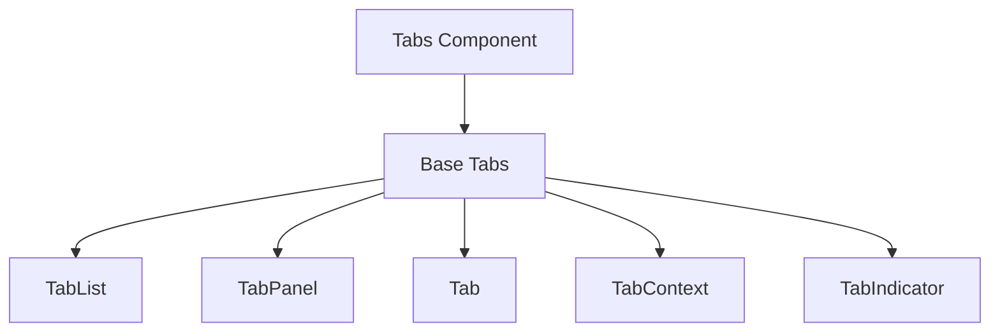
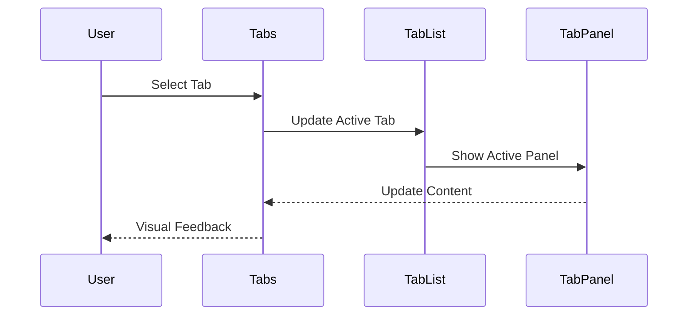
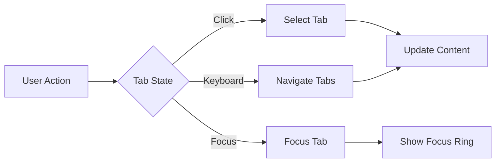

# Tabs Component

## Overview
The Tabs component provides a way to organize content into separate views where only one view is visible at a time. It supports keyboard navigation, accessibility features, and various styling options while maintaining consistent behavior across the ThriveSend application.

## Screenshots

*Different tab variants and layouts*

## Component Architecture


## Data Flow


## Features
- Multiple variants (default, underlined, filled)
- Keyboard navigation
- Animated transitions
- Custom indicators
- Responsive design
- Full accessibility support
- TypeScript type safety
- Performance optimized

## Props
| Prop | Type | Default | Description |
|------|------|---------|-------------|
| variant | 'default' \| 'underlined' \| 'filled' | 'default' | Tab style variant |
| orientation | 'horizontal' \| 'vertical' | 'horizontal' | Tab orientation |
| defaultValue | string | undefined | Default active tab |
| value | string | undefined | Controlled active tab |
| onChange | (value: string) => void | undefined | Tab change handler |
| className | string | undefined | Additional CSS classes |
| isAnimated | boolean | true | Enable animations |
| isDisabled | boolean | false | Disable all tabs |

## Usage
```typescript
import { Tabs } from '@/components/ui/Tabs';

// Basic tabs
<Tabs defaultValue="tab1">
  <Tabs.List>
    <Tabs.Tab value="tab1">Tab 1</Tabs.Tab>
    <Tabs.Tab value="tab2">Tab 2</Tabs.Tab>
    <Tabs.Tab value="tab3">Tab 3</Tabs.Tab>
  </Tabs.List>
  <Tabs.Panel value="tab1">
    Content for tab 1
  </Tabs.Panel>
  <Tabs.Panel value="tab2">
    Content for tab 2
  </Tabs.Panel>
  <Tabs.Panel value="tab3">
    Content for tab 3
  </Tabs.Panel>
</Tabs>

// Controlled tabs
<Tabs 
  value={activeTab}
  onChange={setActiveTab}
  variant="underlined"
>
  <Tabs.List>
    <Tabs.Tab value="tab1">Tab 1</Tabs.Tab>
    <Tabs.Tab value="tab2">Tab 2</Tabs.Tab>
  </Tabs.List>
  <Tabs.Panel value="tab1">
    Content for tab 1
  </Tabs.Panel>
  <Tabs.Panel value="tab2">
    Content for tab 2
  </Tabs.Panel>
</Tabs>

// Vertical tabs
<Tabs 
  orientation="vertical"
  variant="filled"
>
  <Tabs.List>
    <Tabs.Tab value="tab1">Tab 1</Tabs.Tab>
    <Tabs.Tab value="tab2">Tab 2</Tabs.Tab>
  </Tabs.List>
  <Tabs.Panel value="tab1">
    Content for tab 1
  </Tabs.Panel>
  <Tabs.Panel value="tab2">
    Content for tab 2
  </Tabs.Panel>
</Tabs>
```

## User Interaction Workflow


## Components
1. **Base Tabs**
   - Manages tab state
   - Handles tab switching
   - Implements accessibility features

2. **TabList**
   - Manages tab navigation
   - Handles keyboard events
   - Manages tab indicators

3. **Tab**
   - Individual tab button
   - Manages tab state
   - Handles interactions

4. **TabPanel**
   - Manages panel content
   - Handles visibility
   - Manages transitions

5. **TabIndicator**
   - Visual indicator for active tab
   - Handles animations
   - Supports custom styling

## Data Models
```typescript
interface TabsProps {
  variant?: 'default' | 'underlined' | 'filled';
  orientation?: 'horizontal' | 'vertical';
  defaultValue?: string;
  value?: string;
  onChange?: (value: string) => void;
  className?: string;
  isAnimated?: boolean;
  isDisabled?: boolean;
}

interface TabProps {
  value: string;
  disabled?: boolean;
  className?: string;
  children: ReactNode;
}

interface TabPanelProps {
  value: string;
  className?: string;
  children: ReactNode;
}

interface TabsContext {
  value: string;
  onChange: (value: string) => void;
  variant: TabsProps['variant'];
  orientation: TabsProps['orientation'];
  isAnimated: boolean;
  isDisabled: boolean;
}
```

## Styling
- Uses Tailwind CSS for styling
- Follows design system color tokens
- Implements consistent spacing
- Supports dark mode
- Maintains accessibility contrast ratios
- Responsive design patterns
- Smooth transitions

## Accessibility
- ARIA roles and labels
- Keyboard navigation (Arrow keys, Home, End)
- Focus management
- Color contrast compliance
- Screen reader support
- Tab panel announcements

## Error Handling
- Graceful fallback for missing content
- Type checking for variant and orientation
- Validation for tab values
- Error boundaries for panel content
- Disabled state management

## Performance Optimizations
- Lazy loading for panel content
- Optimized re-renders
- CSS-in-JS optimization
- Transition optimizations
- Content virtualization for large panels

## Dependencies
- React
- TypeScript
- Tailwind CSS
- React Icons (optional)
- Framer Motion (for animations)

## Related Components
- [Button](./Button.md)
- [Card](./Card.md)
- [Icon](./Icon.md)

## Examples
### Basic Tabs
```typescript
<Tabs defaultValue="overview">
  <Tabs.List>
    <Tabs.Tab value="overview">Overview</Tabs.Tab>
    <Tabs.Tab value="analytics">Analytics</Tabs.Tab>
    <Tabs.Tab value="settings">Settings</Tabs.Tab>
  </Tabs.List>
  <Tabs.Panel value="overview">
    <Card>
      <Card.Content>
        <h3 className="text-lg font-semibold">Overview</h3>
        <p>Overview content goes here</p>
      </Card.Content>
    </Card>
  </Tabs.Panel>
  <Tabs.Panel value="analytics">
    <Card>
      <Card.Content>
        <h3 className="text-lg font-semibold">Analytics</h3>
        <p>Analytics content goes here</p>
      </Card.Content>
    </Card>
  </Tabs.Panel>
  <Tabs.Panel value="settings">
    <Card>
      <Card.Content>
        <h3 className="text-lg font-semibold">Settings</h3>
        <p>Settings content goes here</p>
      </Card.Content>
    </Card>
  </Tabs.Panel>
</Tabs>
```

### Tabs with Icons
```typescript
<Tabs variant="underlined">
  <Tabs.List>
    <Tabs.Tab value="dashboard">
      <IconComponent className="w-4 h-4 mr-2" />
      Dashboard
    </Tabs.Tab>
    <Tabs.Tab value="reports">
      <IconComponent className="w-4 h-4 mr-2" />
      Reports
    </Tabs.Tab>
  </Tabs.List>
  <Tabs.Panel value="dashboard">
    Dashboard content
  </Tabs.Panel>
  <Tabs.Panel value="reports">
    Reports content
  </Tabs.Panel>
</Tabs>
```

### Vertical Tabs
```typescript
<Tabs 
  orientation="vertical"
  variant="filled"
  className="flex"
>
  <Tabs.List className="w-48">
    <Tabs.Tab value="profile">Profile</Tabs.Tab>
    <Tabs.Tab value="security">Security</Tabs.Tab>
    <Tabs.Tab value="notifications">Notifications</Tabs.Tab>
  </Tabs.List>
  <div className="flex-1 p-4">
    <Tabs.Panel value="profile">
      Profile settings
    </Tabs.Panel>
    <Tabs.Panel value="security">
      Security settings
    </Tabs.Panel>
    <Tabs.Panel value="notifications">
      Notification settings
    </Tabs.Panel>
  </div>
</Tabs>
```

## Best Practices
1. Use appropriate tab variants
2. Maintain consistent spacing
3. Include proper ARIA labels
4. Handle keyboard navigation
5. Implement smooth transitions
6. Follow accessibility guidelines
7. Use TypeScript for type safety
8. Optimize panel content loading

## Troubleshooting
### Common Issues
1. **Tabs not switching**
   - Check value and onChange props
   - Verify tab values match
   - Check for event propagation

2. **Keyboard navigation not working**
   - Verify tab list structure
   - Check focus management
   - Validate keyboard handlers

3. **Content not displaying**
   - Check panel values
   - Verify content structure
   - Check for rendering issues

### Solutions
1. **Switching Issues**
   ```typescript
   // Proper controlled implementation
   const [activeTab, setActiveTab] = useState('tab1');
   
   <Tabs
     value={activeTab}
     onChange={setActiveTab}
   >
     <Tabs.List>
       <Tabs.Tab value="tab1">Tab 1</Tabs.Tab>
       <Tabs.Tab value="tab2">Tab 2</Tabs.Tab>
     </Tabs.List>
     <Tabs.Panel value="tab1">Content 1</Tabs.Panel>
     <Tabs.Panel value="tab2">Content 2</Tabs.Panel>
   </Tabs>
   ```

2. **Keyboard Issues**
   ```typescript
   // Proper keyboard implementation
   <Tabs.List
     role="tablist"
     aria-label="Tabs"
     className="focus:outline-none"
   >
     <Tabs.Tab
       role="tab"
       tabIndex={0}
       value="tab1"
     >
       Tab 1
     </Tabs.Tab>
   </Tabs.List>
   ```

3. **Content Issues**
   ```typescript
   // Proper panel implementation
   <Tabs.Panel
     value="tab1"
     role="tabpanel"
     aria-labelledby="tab1"
   >
     <div className="p-4">
       Panel content
     </div>
   </Tabs.Panel>
   ```

## Contributing
When contributing to the Tabs component:
1. Follow TypeScript best practices
2. Maintain accessibility standards
3. Add appropriate tests
4. Update documentation
5. Follow component guidelines

*Last Updated: 2025-06-04*
*Version: 1.0.0* 