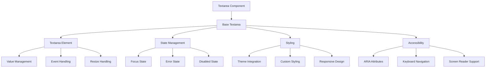
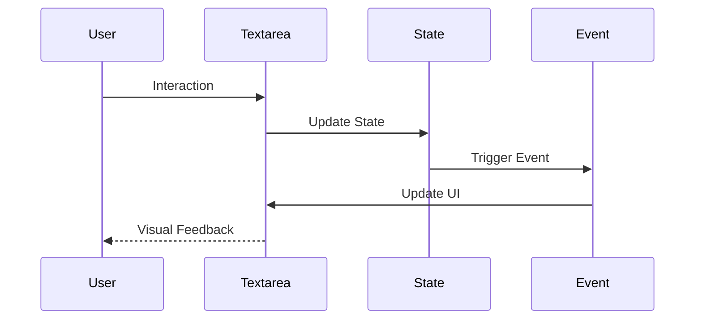
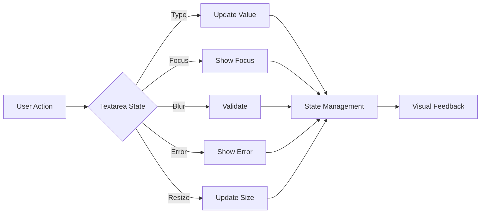

# Textarea Component

## Overview
The Textarea component is a versatile form control that extends the native HTML textarea element with enhanced styling, accessibility features, and consistent design system integration. It provides a multi-line text input field with customizable height, styling, and maintains accessibility compliance while providing a seamless user experience.

## Screenshots

*Main view showing different textarea states*


*Various textarea states: default, focus, error, disabled*


*Different textarea sizes and configurations*


*Textarea with label and helper text*

## Component Architecture


## Data Flow


## Features
- Multi-line text input
- Customizable height
- Auto-resize support
- Custom styling support
- Focus state management
- Error state handling
- Disabled state
- Form integration
- Validation support
- Accessibility features
- Keyboard navigation
- Screen reader support
- Responsive design
- Dark mode support
- RTL support
- Performance optimized
- TypeScript support
- Event handling
- State management

## Props
| Name | Type | Required | Default | Description |
|------|------|----------|---------|-------------|
| value | string | No | undefined | Textarea value |
| onChange | (e: ChangeEvent) => void | No | undefined | Change handler |
| placeholder | string | No | undefined | Placeholder text |
| disabled | boolean | No | false | Disabled state |
| className | string | No | undefined | Additional CSS classes |
| ariaLabel | string | No | undefined | ARIA label |
| testId | string | No | undefined | Test ID |
| name | string | No | undefined | Textarea name |
| id | string | No | undefined | Textarea ID |
| required | boolean | No | false | Required state |
| error | boolean | No | false | Error state |
| maxLength | number | No | undefined | Maximum length |
| minLength | number | No | undefined | Minimum length |
| rows | number | No | 3 | Number of visible rows |
| cols | number | No | undefined | Number of visible columns |
| resize | 'none' \| 'vertical' \| 'horizontal' \| 'both' | No | 'vertical' | Resize behavior |

## Usage
```tsx
import { Textarea } from '@/components/ui/textarea';

// Basic usage
<Textarea
  placeholder="Enter your message"
  ariaLabel="Message input"
/>

// Advanced usage
<Textarea
  placeholder="Enter your message"
  value={message}
  onChange={(e) => setMessage(e.target.value)}
  required
  error={!!messageError}
  ariaLabel="Message input"
  className="custom-textarea"
  maxLength={500}
  rows={5}
  resize="vertical"
/>
```

## User Interaction Workflow


## Components

### Base Textarea
- Handles core textarea functionality
- Manages state
- Implements styling
- Handles accessibility
- Manages theme

### Textarea Element
- Renders native textarea
- Handles value
- Manages events
- Implements validation
- Handles resize

### State Management
- Manages focus state
- Handles error state
- Controls disabled state
- Manages validation
- Handles events

### Styling
- Applies theme styles
- Handles custom styles
- Manages responsive design
- Implements animations
- Handles transitions

## Data Models
```typescript
interface TextareaProps extends React.TextareaHTMLAttributes<HTMLTextAreaElement> {
  error?: boolean;
  className?: string;
  ariaLabel?: string;
  testId?: string;
  resize?: 'none' | 'vertical' | 'horizontal' | 'both';
}

interface TextareaState {
  value: string;
  isFocused: boolean;
  hasError: boolean;
  isDisabled: boolean;
  height: number;
}

interface TextareaEvent {
  type: 'change' | 'focus' | 'blur' | 'error' | 'resize';
  timestamp: number;
  data?: {
    value?: string;
    error?: string;
    height?: number;
  };
}
```

## Styling
- Uses Tailwind CSS for styling
- Follows design system color tokens
- Implements consistent spacing
- Supports dark mode
- Maintains accessibility contrast ratios
- Uses CSS variables for theming
- Implements responsive design
- Supports custom animations
- Uses CSS Grid for layout
- Implements proper transitions

## Accessibility
- ARIA labels for screen readers
- Keyboard navigation support
- Focus management
- Color contrast compliance
- State announcements
- RTL support
- Screen reader announcements
- Focus visible states
- Proper role attributes
- Keyboard event handling
- Error message association
- Input announcements

## Error Handling
- Input validation
- Error state management
- Error message display
- Recovery strategies
- User feedback
- Error logging
- State recovery
- Validation recovery
- Animation fallbacks

## Performance Optimizations
- Component memoization
- Render optimization
- Event debouncing
- State batching
- Code splitting
- Bundle optimization
- Memory management
- Lazy loading
- Virtual scrolling

## Dependencies
- React
- TypeScript
- Tailwind CSS
- @testing-library/react
- @testing-library/jest-dom
- @testing-library/user-event

## Related Components
- [Form](../forms/Form.md)
- [Label](../ui/Label.md)
- [ErrorMessage](../ui/ErrorMessage.md)
- [Icon](../ui/Icon.md)
- [Typography](../ui/Typography.md)

## Examples

### Basic Example
```tsx
import { Textarea } from '@/components/ui/textarea';

export function BasicExample() {
  return (
    <Textarea
      placeholder="Enter your message"
      ariaLabel="Message input"
    />
  );
}
```

### Advanced Example
```tsx
import { Textarea } from '@/components/ui/textarea';
import { useState, useCallback } from 'react';

export function AdvancedExample() {
  const [message, setMessage] = useState('');
  const [messageError, setMessageError] = useState('');

  const handleChange = useCallback((e: React.ChangeEvent<HTMLTextAreaElement>) => {
    const value = e.target.value;
    setMessage(value);
    
    // Basic validation
    if (value.length > 500) {
      setMessageError('Message must be less than 500 characters');
    } else {
      setMessageError('');
    }
  }, []);

  return (
    <Textarea
      placeholder="Enter your message"
      value={message}
      onChange={handleChange}
      required
      error={!!messageError}
      ariaLabel="Message input"
      className="custom-textarea"
      maxLength={500}
      rows={5}
      resize="vertical"
    />
  );
}
```

## Best Practices

### Usage Guidelines
1. Use appropriate size
2. Provide clear labels
3. Handle validation
4. Show error states
5. Follow accessibility guidelines
6. Optimize for performance
7. Use TypeScript for type safety
8. Add proper test IDs
9. Handle edge cases
10. Implement proper state

### Performance Tips
1. Memoize components
2. Use proper state management
3. Optimize re-renders
4. Implement proper loading
5. Use proper error boundaries
6. Optimize bundle size
7. Use proper code splitting
8. Implement proper caching
9. Use proper lazy loading
10. Monitor performance metrics

### Security Considerations
1. Validate user input
2. Prevent XSS attacks
3. Handle sensitive data
4. Implement proper authentication
5. Use proper authorization
6. Handle errors securely
7. Implement proper logging
8. Use proper encryption
9. Follow security best practices
10. Regular security audits

## Troubleshooting

### Common Issues
| Issue | Solution |
|-------|----------|
| Textarea not updating | Check onChange handler |
| Validation not working | Verify validation logic |
| Styling issues | Check Tailwind classes |
| Accessibility issues | Verify ARIA labels |
| Type errors | Check TypeScript types |

### Error Messages
| Error Code | Description | Resolution |
|------------|-------------|------------|
| ERR001 | Invalid value | Check input value |
| ERR002 | Validation error | Verify validation |
| ERR003 | State error | Check state management |
| ERR004 | Theme error | Verify theme settings |
| ERR005 | Event error | Check event handlers |

## Contributing

### Development Setup
1. Clone the repository
2. Install dependencies
3. Run development server
4. Make changes
5. Run tests
6. Submit PR

### Testing
```typescript
import { render, screen, fireEvent } from '@testing-library/react';
import { Textarea } from './textarea';

describe('Textarea', () => {
  it('renders correctly', () => {
    render(<Textarea placeholder="Enter text" />);
    const textarea = screen.getByPlaceholderText('Enter text');
    expect(textarea).toBeInTheDocument();
    expect(textarea.tagName).toBe('TEXTAREA');
  });

  it('handles user input', async () => {
    render(<Textarea placeholder="Type here" />);
    const textarea = screen.getByPlaceholderText('Type here');
    await userEvent.type(textarea, 'Hello\nWorld');
    expect(textarea).toHaveValue('Hello\nWorld');
  });

  it('handles disabled state', () => {
    render(<Textarea disabled placeholder="Disabled textarea" />);
    expect(screen.getByPlaceholderText('Disabled textarea')).toBeDisabled();
  });
});
```

### Code Style
- Follow TypeScript best practices
- Use ESLint rules
- Follow Prettier configuration
- Write meaningful comments
- Use proper naming conventions
- Follow component patterns
- Use proper documentation
- Follow testing practices
- Use proper error handling
- Follow security guidelines

## Changelog

### Version 1.0.0
- Initial release
- Basic textarea functionality
- Custom styling
- Accessibility support
- Mobile support

### Version 1.1.0
- Added validation
- Improved performance
- Enhanced accessibility
- Added dark mode
- Added RTL support

## Appendix

### Glossary
- **Textarea**: Multi-line form control component
- **Resize**: Textarea resize behavior
- **Validation**: Input validation
- **State**: Component state
- **Accessibility**: A11y features

### FAQ
#### How do I handle textarea validation?
Use the error prop and implement validation logic in the onChange handler.

#### How do I customize the textarea styling?
Use the className prop to add custom Tailwind classes or CSS.

#### How do I make the textarea accessible?
Include proper ARIA labels and ensure keyboard navigation works. 