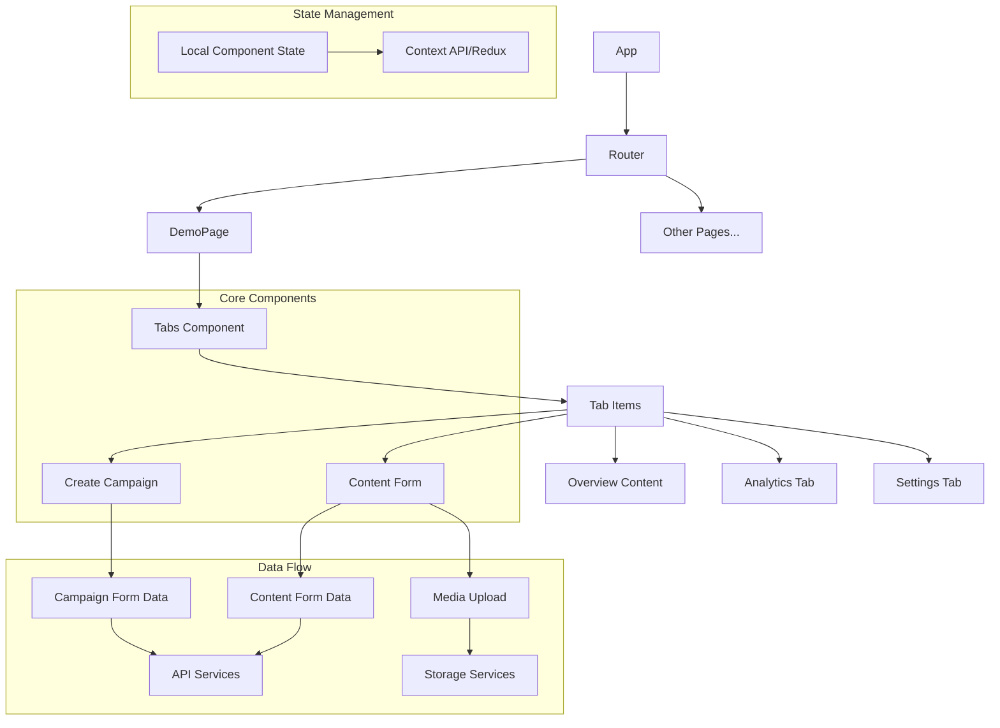

# Component Architecture

The following diagram illustrates the architecture and relationships between the components in our Marketing Platform UI.

This diagram shows how our components are structured and interact with each other. The Tabs component serves as a container for various content sections, while the form components handle specific functionality for campaign creation and content management.