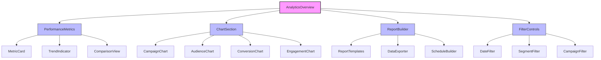
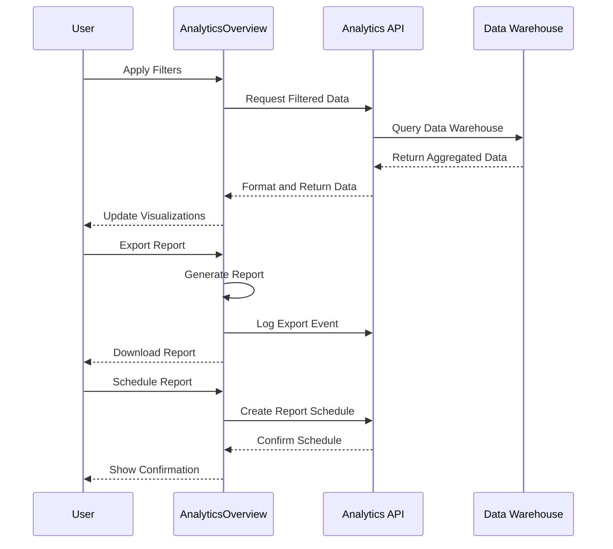
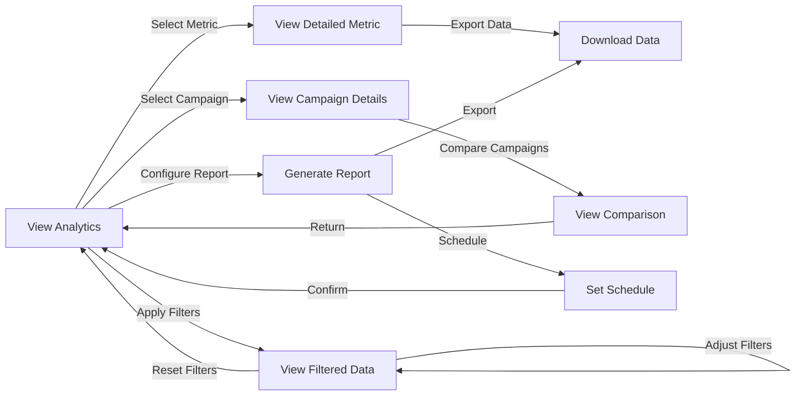

# AnalyticsOverview Component

## Overview
The AnalyticsOverview component provides advanced analytics and visualization tools for tracking campaign performance, subscriber engagement, and conversion metrics. It offers comprehensive data analysis capabilities with customizable charts, filters, and reporting options.

## Screenshots

### Analytics Dashboard

*The main analytics dashboard showing key performance metrics and visualizations*

### Campaign Performance

*Detailed campaign performance analytics with engagement metrics*

### Audience Insights

*Audience segmentation and demographic insights visualization*

### Custom Reports

*Custom report builder interface with export options*

## Component Architecture



*Component hierarchy and relationships*

## Data Flow



*Data flow for analytics operations*

## Features
- Real-time analytics dashboard
- Campaign performance tracking
- Audience segmentation analysis
- Conversion funnel visualization
- Email engagement metrics
- A/B test result comparison
- Custom report generation
- Scheduled report delivery
- Data export in multiple formats
- Trend analysis and forecasting
- UTM parameter tracking
- Integration with external analytics tools

## Props

| Prop | Type | Required | Description |
|------|------|----------|-------------|
| dateRange | { start: Date, end: Date } | Yes | Time period for analytics data |
| campaigns | string[] | No | Array of campaign IDs to include |
| segments | string[] | No | Audience segments to analyze |
| metrics | AnalyticsMetric[] | No | Specific metrics to display |
| comparisonPeriod | 'previous' \| 'year' \| none | No | Period to use for comparison |
| refreshInterval | number | No | Auto-refresh interval in seconds |
| onExport | (format: string, data: any) => void | No | Export callback function |
| showCharts | boolean | No | Whether to show chart section |

## Usage

```tsx
import { AnalyticsOverview } from '@/components/analytics/AnalyticsOverview';

// Basic usage with date range
<AnalyticsOverview 
  dateRange={{
    start: new Date('2024-01-01'),
    end: new Date('2024-01-31')
  }}
/>

// Advanced usage with filters
<AnalyticsOverview 
  dateRange={{
    start: new Date('2024-01-01'),
    end: new Date('2024-01-31')
  }}
  campaigns={['campaign-123', 'campaign-456']}
  segments={['new-subscribers', 'engaged']}
  metrics={['open-rate', 'click-rate', 'conversion-rate']}
  comparisonPeriod="previous"
  refreshInterval={300}
  onExport={(format, data) => handleExport(format, data)}
/>
```

## User Interaction Workflow



*User interaction flows within the analytics component*

## Components

### PerformanceMetrics
Displays key performance indicators with comparison to previous periods.

#### Props
- metrics: Metric[]
- comparisonPeriod: 'previous' | 'year' | none
- showChange: boolean

### CampaignChart
Visualizes campaign performance over time with multiple metrics.

#### Features
- Line/bar/area chart visualization
- Multiple metric overlay
- Time period comparison
- Interactive tooltips

### AudienceChart
Displays audience segmentation and demographic information.

#### Features
- Pie/donut charts for segments
- Geographic distribution maps
- Device and platform breakdown
- Subscription source analysis

### ReportBuilder
Interface for creating custom reports with multiple visualizations.

#### Features
- Drag-and-drop layout
- Template selection
- Scheduled delivery options
- Multiple export formats

## Data Models

### AnalyticsMetric
```typescript
interface AnalyticsMetric {
  id: string;
  name: string;
  value: number;
  previousValue?: number;
  change?: number;
  changeDirection?: 'increase' | 'decrease' | 'neutral';
  format: 'number' | 'percentage' | 'currency' | 'time';
  description?: string;
}
```

### ChartDataset
```typescript
interface ChartDataset {
  id: string;
  label: string;
  data: number[];
  backgroundColor: string | string[];
  borderColor?: string;
  type?: 'line' | 'bar' | 'pie' | 'doughnut' | 'area';
  yAxisID?: string;
  hidden?: boolean;
}
```

### AnalyticsReport
```typescript
interface AnalyticsReport {
  id: string;
  name: string;
  description?: string;
  dateRange: {
    start: Date;
    end: Date;
  };
  sections: ReportSection[];
  filters: ReportFilter[];
  schedule?: {
    frequency: 'daily' | 'weekly' | 'monthly';
    recipients: string[];
    nextDelivery: Date;
  };
  createdAt: Date;
  updatedAt: Date;
}
```

## Styling
The component uses a combination of Tailwind CSS and custom styling:
- Responsive grid layout for different screen sizes
- Custom chart themes and colors
- Print-optimized styles for reports
- Interactive hover and focus states
- Animation for data transitions
- Consistent branding elements
- Dark mode support

## Accessibility
- ARIA labels for interactive chart elements
- Keyboard navigation for all controls
- Screen reader announcements for data changes
- Focus management for complex interactions
- Alternative text descriptions for visual data
- Color contrast compliance
- Keyboard shortcuts for common actions

## Error Handling
- Graceful degradation when data is unavailable
- Informative error messages for API failures
- Fallback displays for missing metrics
- Data validation before visualization
- Automatic retry for transient API errors
- Loading states during data fetching
- Error boundaries for component isolation

## Performance Optimizations
- Data aggregation and sampling for large datasets
- Windowing for long lists of metrics
- Memoization of expensive calculations
- Dynamic import of chart libraries
- Canvas rendering for complex visualizations
- Throttled event handlers for resize/scroll
- Web workers for data processing
- Request batching for multiple metrics

## Dependencies
- chart.js / react-chartjs-2
- d3.js (for advanced visualizations)
- @tanstack/react-query
- date-fns
- @react-pdf/renderer (for PDF exports)
- react-table (for data tables)
- react-window (for virtualized lists)
- jspdf and xlsx (for exports)

## Related Components
- DashboardOverview
- CampaignPerformance
- AudienceInsights
- ConversionFunnel
- ReportGenerator
- ExportControls
- FilterPanel

## Examples

### Basic Implementation
```tsx
import { AnalyticsOverview } from '@/components/analytics/AnalyticsOverview';

export default function AnalyticsPage() {
  const today = new Date();
  const thirtyDaysAgo = new Date(today);
  thirtyDaysAgo.setDate(today.getDate() - 30);
  
  return (
    <div className="p-6">
      <h1 className="text-2xl font-bold mb-6">Campaign Analytics</h1>
      <AnalyticsOverview 
        dateRange={{
          start: thirtyDaysAgo,
          end: today
        }}
      />
    </div>
  );
}
```

### With Campaign Filtering
```tsx
import { AnalyticsOverview } from '@/components/analytics/AnalyticsOverview';
import { useState } from 'react';

export default function CampaignAnalyticsPage() {
  const [selectedCampaigns, setSelectedCampaigns] = useState(['campaign-123']);
  
  const handleCampaignChange = (campaigns) => {
    setSelectedCampaigns(campaigns);
  };
  
  return (
    <div className="p-6">
      <h1 className="text-2xl font-bold mb-6">Campaign Analysis</h1>
      <CampaignSelector 
        onChange={handleCampaignChange} 
        selected={selectedCampaigns} 
      />
      <AnalyticsOverview 
        dateRange={{
          start: new Date('2024-01-01'),
          end: new Date('2024-01-31')
        }}
        campaigns={selectedCampaigns}
      />
    </div>
  );
}
```

### With Export Functionality
```tsx
import { AnalyticsOverview } from '@/components/analytics/AnalyticsOverview';
import { saveAs } from 'file-saver';

export default function ExportableAnalyticsPage() {
  const handleExport = (format, data) => {
    if (format === 'csv') {
      const blob = new Blob([data], { type: 'text/csv;charset=utf-8' });
      saveAs(blob, `analytics-export-${new Date().toISOString()}.csv`);
    } else if (format === 'pdf') {
      // Handle PDF export
    } else if (format === 'xlsx') {
      // Handle Excel export
    }
  };
  
  return (
    <div className="p-6">
      <AnalyticsOverview 
        dateRange={{
          start: new Date('2024-01-01'),
          end: new Date('2024-01-31')
        }}
        onExport={handleExport}
      />
    </div>
  );
}
```

## Best Practices
1. Always provide a valid date range for analytics data
2. Consider data volume when requesting multiple metrics
3. Implement client-side caching for frequently accessed data
4. Use appropriate chart types for different metrics
5. Provide context and comparison for numeric metrics
6. Include filtering options for data exploration
7. Optimize for print when designing exportable reports
8. Consider time zone differences in date-based analytics

## Troubleshooting

### Common Issues
1. Missing or incomplete data for specific date ranges
2. Performance issues with large datasets
3. Chart rendering problems in different browsers
4. Export formatting inconsistencies
5. Timezone discrepancies in data
6. API timeout on complex queries
7. Filter combinations returning no data

### Solutions
1. Check API error responses for specific data restrictions
2. Implement data sampling for large date ranges
3. Use feature detection for browser-specific chart rendering
4. Test exports across different applications
5. Normalize all dates to a consistent timezone
6. Implement query optimization and caching
7. Provide clear empty states for no-data scenarios

## Contributing
When contributing to this component:
1. Follow established visualization best practices
2. Document complex data transformations
3. Add unit tests for data processing functions
4. Maintain backward compatibility for report formats
5. Test with various data volumes and patterns
6. Consider localization for numeric formats
7. Optimize bundle size when adding new visualizations 