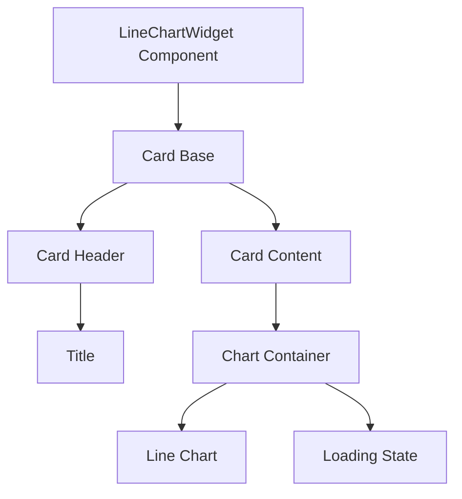
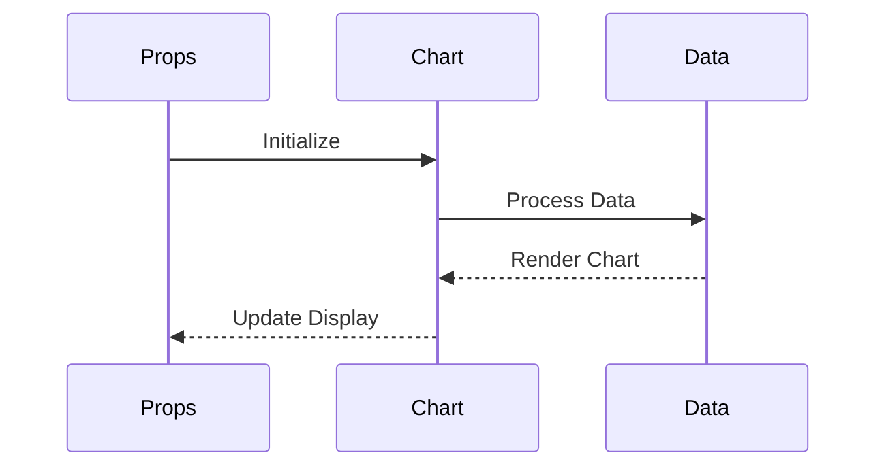
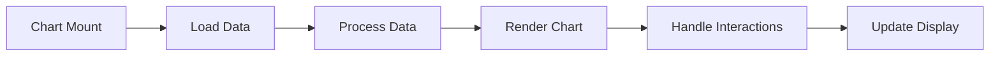

# LineChartWidget Component

## Overview
The LineChartWidget component is a powerful data visualization component that renders line charts using Chart.js. It provides a consistent way to display time-series data and trends across the application, with support for multiple datasets, custom styling, and loading states.

## Screenshots

*Different LineChartWidget states and configurations*

## Component Architecture


## Data Flow


## Features
- Line chart visualization
- Multiple dataset support
- Custom styling options
- Loading states
- Responsive design
- TypeScript type safety
- Accessibility support
- Performance optimized
- Chart.js integration

## Props
| Prop | Type | Default | Description |
|------|------|---------|-------------|
| title | string | required | Chart title |
| data | ChartData | required | Chart data object |
| options | object | undefined | Chart.js options |
| isLoading | boolean | false | Loading state |
| className | string | undefined | Additional CSS classes |

## Usage
```typescript
import { LineChartWidget } from '@/components/analytics/LineChartWidget';

// Basic usage
<LineChartWidget
  title="Monthly Revenue"
  data={{
    labels: ['Jan', 'Feb', 'Mar', 'Apr', 'May', 'Jun'],
    datasets: [{
      label: 'Revenue',
      data: [1200, 1900, 1500, 2100, 1800, 2400],
      borderColor: 'rgb(75, 192, 192)',
      backgroundColor: 'rgba(75, 192, 192, 0.2)',
      fill: true
    }]
  }}
/>

// Multiple datasets
<LineChartWidget
  title="User Growth"
  data={{
    labels: ['Jan', 'Feb', 'Mar', 'Apr', 'May', 'Jun'],
    datasets: [
      {
        label: 'New Users',
        data: [100, 150, 200, 180, 250, 300],
        borderColor: 'rgb(75, 192, 192)',
        backgroundColor: 'rgba(75, 192, 192, 0.2)',
        fill: true
      },
      {
        label: 'Active Users',
        data: [500, 600, 700, 650, 800, 900],
        borderColor: 'rgb(255, 99, 132)',
        backgroundColor: 'rgba(255, 99, 132, 0.2)',
        fill: true
      }
    ]
  }}
/>

// With custom options
<LineChartWidget
  title="Performance Metrics"
  data={performanceData}
  options={{
    responsive: true,
    plugins: {
      legend: {
        position: 'top',
      },
      title: {
        display: true,
        text: 'Performance Over Time'
      }
    }
  }}
/>
```

## User Interaction Workflow


## Components
1. **Card Base**
   - Manages chart container
   - Handles responsive behavior
   - Implements accessibility features

2. **Card Header**
   - Displays chart title
   - Manages spacing
   - Handles loading state

3. **Chart Container**
   - Manages chart dimensions
   - Handles data rendering
   - Implements loading skeleton

## Data Models
```typescript
interface LineChartWidgetProps {
  title: string;
  data: {
    labels: string[];
    datasets: {
      label: string;
      data: number[];
      borderColor?: string;
      backgroundColor?: string;
      fill?: boolean | string;
    }[];
  };
  options?: object;
  isLoading?: boolean;
  className?: string;
}
```

## Styling
- Uses Tailwind CSS for styling
- Follows design system color tokens
- Implements consistent spacing
- Supports dark mode
- Maintains accessibility contrast ratios
- Responsive design patterns
- Smooth transitions

## Accessibility
- ARIA roles and attributes
- Semantic HTML structure
- Color contrast compliance
- Screen reader support
- Keyboard navigation
- Focus management
- Chart accessibility features

## Error Handling
- Data validation
- Loading states
- Error boundaries
- Fallback content
- Type checking
- Null checks

## Performance Optimizations
- Memoized callbacks
- Data processing optimization
- Render optimization
- Chart.js optimization
- State management
- Event handler optimization

## Dependencies
- React
- TypeScript
- Chart.js
- react-chartjs-2
- Tailwind CSS
- Custom UI components

## Related Components
- [Card](../ui/Card.md)
- [AnalyticsCard](./AnalyticsCard.md)
- [BarChartWidget](./BarChartWidget.md)
- [PieChartWidget](./PieChartWidget.md)

## Examples
### Basic Line Chart
```typescript
import { LineChartWidget } from '@/components/analytics/LineChartWidget';

function RevenueChart() {
  const data = {
    labels: ['Jan', 'Feb', 'Mar', 'Apr', 'May', 'Jun'],
    datasets: [{
      label: 'Revenue',
      data: [1200, 1900, 1500, 2100, 1800, 2400],
      borderColor: 'rgb(75, 192, 192)',
      backgroundColor: 'rgba(75, 192, 192, 0.2)',
      fill: true
    }]
  };

  return (
    <LineChartWidget
      title="Monthly Revenue"
      data={data}
    />
  );
}
```

### Multiple Datasets
```typescript
import { LineChartWidget } from '@/components/analytics/LineChartWidget';

function UserGrowthChart() {
  const data = {
    labels: ['Jan', 'Feb', 'Mar', 'Apr', 'May', 'Jun'],
    datasets: [
      {
        label: 'New Users',
        data: [100, 150, 200, 180, 250, 300],
        borderColor: 'rgb(75, 192, 192)',
        backgroundColor: 'rgba(75, 192, 192, 0.2)',
        fill: true
      },
      {
        label: 'Active Users',
        data: [500, 600, 700, 650, 800, 900],
        borderColor: 'rgb(255, 99, 132)',
        backgroundColor: 'rgba(255, 99, 132, 0.2)',
        fill: true
      }
    ]
  };

  return (
    <LineChartWidget
      title="User Growth"
      data={data}
    />
  );
}
```

### With Loading State
```typescript
import { LineChartWidget } from '@/components/analytics/LineChartWidget';

function PerformanceChart() {
  const [isLoading, setIsLoading] = useState(true);
  const [data, setData] = useState(null);

  useEffect(() => {
    // Fetch data
    fetchData().then(result => {
      setData(result);
      setIsLoading(false);
    });
  }, []);

  return (
    <LineChartWidget
      title="Performance Metrics"
      data={data}
      isLoading={isLoading}
    />
  );
}
```

## Best Practices
1. Use clear, descriptive titles
2. Format data appropriately
3. Provide meaningful labels
4. Use consistent styling
5. Follow accessibility guidelines
6. Use TypeScript for type safety
7. Optimize performance
8. Handle loading states

## Troubleshooting
### Common Issues
1. **Chart not rendering**
   - Check data structure
   - Verify Chart.js registration
   - Check styling classes

2. **Data not displaying**
   - Verify data format
   - Check dataset structure
   - Validate labels

3. **Styling issues**
   - Check className usage
   - Verify Chart.js options
   - Check for style conflicts

### Solutions
1. **Chart Rendering Issues**
   ```typescript
   // Proper Chart.js registration
   import {
     Chart as ChartJS,
     LineElement,
     CategoryScale,
     LinearScale,
     PointElement,
     Tooltip,
     Legend,
     Filler
   } from "chart.js";
   
   ChartJS.register(
     LineElement,
     CategoryScale,
     LinearScale,
     PointElement,
     Tooltip,
     Legend,
     Filler
   );
   ```

2. **Data Format Issues**
   ```typescript
   // Proper data structure
   const data = {
     labels: ['Jan', 'Feb', 'Mar'],
     datasets: [{
       label: 'Dataset',
       data: [1, 2, 3],
       borderColor: 'rgb(75, 192, 192)',
       backgroundColor: 'rgba(75, 192, 192, 0.2)',
       fill: true
     }]
   };
   ```

3. **Styling Issues**
   ```typescript
   // Proper styling implementation
   <LineChartWidget
     className="custom-chart"
     options={{
       responsive: true,
       maintainAspectRatio: false
     }}
   />
   ```

## Contributing
When contributing to the LineChartWidget component:
1. Follow TypeScript best practices
2. Maintain accessibility standards
3. Add appropriate tests
4. Update documentation
5. Follow component guidelines

*Last Updated: 2025-06-04*
*Version: 1.0.0* 