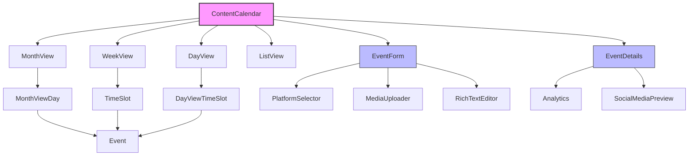
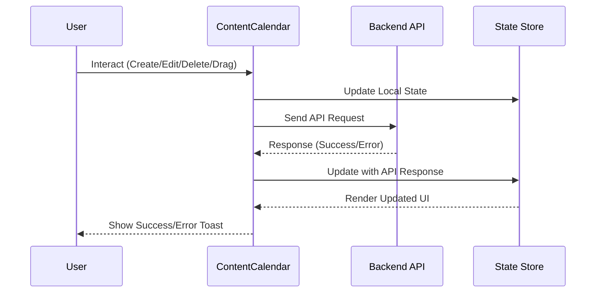
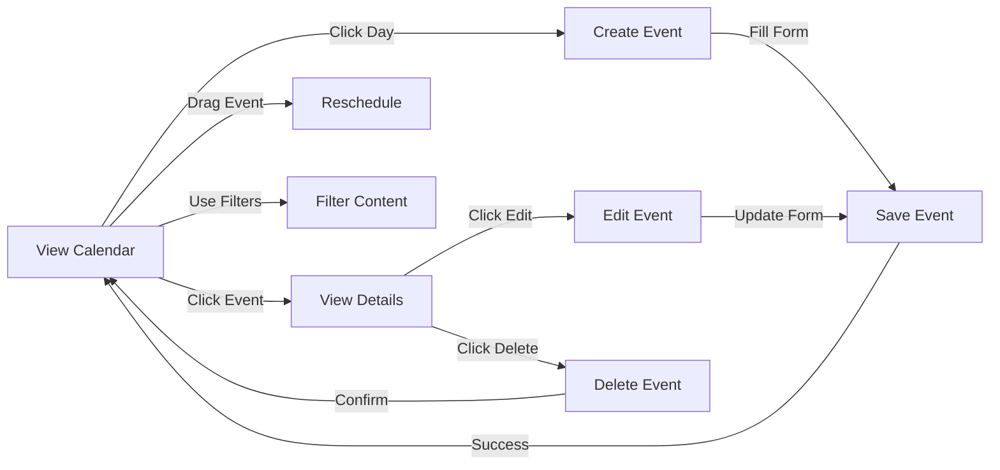

# ContentCalendar Component

## Overview
The Content Calendar is a complex, feature-rich component that allows users to schedule, manage, and track various types of content including social media posts, emails, blog posts, and articles. It provides an interactive calendar interface with multiple views (month, week, day, list) and supports drag-and-drop rescheduling of content.

## Screenshots

### Month View

*The default month view showing various content types color-coded by type*

### Week View

*Week view with time slots and event positioning*

### Event Details

*Detailed view of a calendar event showing analytics and platform previews*

### Create/Edit Form

*Form for creating and editing calendar events with platform-specific content*

## Component Architecture



*Component hierarchy and relationships*

## Data Flow



*Data flow during user interactions*

## Features
- Multiple calendar views (month, week, day, list)
- Content creation, editing, and deletion
- Filtering by content type, status, or search terms
- Drag-and-drop content rescheduling
- Social media content previews
- Analytics display for published content
- Responsive design for desktop and mobile

## Props

| Prop | Type | Required | Description |
|------|------|----------|-------------|
| events | CalendarEvent[] | No | Array of calendar events to display |
| onEventCreate | (event: Omit<CalendarEvent, "id">) => Promise<CalendarEvent> | No | Handler for creating new events |
| onEventUpdate | (event: CalendarEvent) => Promise<CalendarEvent> | No | Handler for updating existing events |
| onEventDelete | (eventId: string) => Promise<boolean> | No | Handler for deleting events |
| onDateSelect | (day: string) => void | No | Handler for date selection |
| fetchEvents | () => Promise<CalendarEvent[]> | No | Function to fetch events from API |
| defaultView | CalendarView | No | Initial view mode (month, week, day, list) |
| onViewChange | (view: CalendarView) => void | No | Handler for view mode changes |
| onSyncClick | () => void | No | Handler for sync button click |
| onSettingsClick | () => void | No | Handler for settings button click |

## Usage

```tsx
import { ContentCalendar } from "@/components/content/content-calendar";

// Example event data
const events = [
  {
    id: "1",
    title: "Welcome Email",
    description: "Send welcome email to new subscribers",
    type: "email",
    status: "scheduled",
    date: "2023-09-15",
    time: "09:00",
    socialMediaContent: {
      platforms: [],
      mediaUrls: [],
      crossPost: false,
      platformSpecificContent: {}
    },
    organizationId: "org-123",
    createdBy: "user-456"
  }
];

// Basic implementation
function CalendarPage() {
  return (
    <ContentCalendar
      events={events}
      defaultView="month"
    />
  );
}

// Advanced implementation with API integration
function CalendarPageWithAPI() {
  const handleEventCreate = async (event) => {
    const response = await fetch('/api/calendar/events', {
      method: 'POST',
      body: JSON.stringify(event)
    });
    return await response.json();
  };

  const handleEventUpdate = async (event) => {
    const response = await fetch(`/api/calendar/events/${event.id}`, {
      method: 'PUT',
      body: JSON.stringify(event)
    });
    return await response.json();
  };

  const handleEventDelete = async (eventId) => {
    await fetch(`/api/calendar/events/${eventId}`, {
      method: 'DELETE'
    });
    return true;
  };

  const fetchEvents = async () => {
    const response = await fetch('/api/calendar/events');
    const data = await response.json();
    return data.events;
  };

  return (
    <ContentCalendar
      onEventCreate={handleEventCreate}
      onEventUpdate={handleEventUpdate}
      onEventDelete={handleEventDelete}
      fetchEvents={fetchEvents}
      defaultView="month"
    />
  );
}
```

## User Interaction Workflow



*User interaction flows within the calendar component*

## Components

### ContentCalendar
The main container component that handles state management, data fetching, and event handling.

### EventForm
Form component for creating and editing calendar events.

#### Features
- Dynamic form fields based on content type
- Social media platform selection
- Media uploads
- Rich text editing
- Form validation

### EventDetails
Component for displaying detailed information about a calendar event.

#### Features
- Platform-specific previews
- Analytics display
- Edit and delete actions
- Status indicators

### MonthView
Displays events in a traditional calendar grid.

#### Features
- Day cells with events
- Drag and drop support
- Event color coding by type
- "More events" indicator

## Data Models

### CalendarEvent Interface

```typescript
export interface CalendarEvent {
  id: string;
  title: string;
  description: string;
  type: ContentType;
  status: 'draft' | 'scheduled' | 'sent' | 'failed';
  date: string;
  time?: string;
  duration?: number;
  startTime?: string;
  endTime?: string;
  scheduledDate?: string;
  scheduledTime?: string;
  socialMediaContent: SocialMediaContent;
  analytics?: {
    views?: number;
    engagement?: {
      likes?: number;
      shares?: number;
      comments?: number;
    };
    clicks?: number;
    lastUpdated?: string;
  };
  preview?: {
    thumbnail?: string;
    platformPreviews?: {
      [key in SocialPlatform]?: {
        previewUrl?: string;
        status?: 'pending' | 'approved' | 'rejected';
        rejectionReason?: string;
      };
    };
  };
  organizationId: string;
  createdBy: string;
  tags?: string[];
}

export type ContentType = 'social' | 'blog' | 'email' | 'custom' | 'article';

export interface SocialMediaContent {
  platforms: SocialPlatform[];
  mediaUrls: string[];
  crossPost: boolean;
  platformSpecificContent: {
    [key in SocialPlatform]?: {
      text: string;
      mediaUrls: string[];
      scheduledTime?: string;
    };
  };
}

export type SocialPlatform = 'FACEBOOK' | 'TWITTER' | 'INSTAGRAM' | 'LINKEDIN';
```

## Styling
The component uses a combination of Tailwind CSS and custom styles:
- Responsive grid layouts for different views
- Color coding for different content types and statuses
- Hover and active states for interactive elements
- Accessibility-focused styling

## Accessibility
- ARIA attributes for interactive elements
- Keyboard navigation support
- Focus management
- Screen reader friendly text alternatives
- High contrast visual indicators

## Error Handling
- API failures are caught and displayed with toast notifications
- Network errors trigger a fallback direct fetch mechanism
- Validation errors in forms provide detailed feedback
- Failed operations can be retried

## Performance Optimizations
- Memoization with useMemo and useCallback
- Lazy loading with React.lazy and Suspense
- Virtualization for large datasets
- Debouncing for search inputs
- Component memoization with React.memo

## Dependencies
- date-fns and date-fns-tz for date handling
- @dnd-kit/core for drag and drop functionality
- lucide-react for icons
- @/components/ui/* for UI components

## Related Components
- RichTextEditor
- MediaUploader
- Calendar (from UI components)
- Dialog (from UI components)

## Best Practices
1. Always provide a fetchEvents function or events array
2. Implement proper error handling for API calls
3. Consider timezone handling for date/time display
4. Test drag and drop functionality thoroughly
5. Ensure proper validation in forms

## Troubleshooting

### Common Issues
1. Event not showing on calendar: Ensure the event has a valid `date` property in the format "YYYY-MM-DD".
2. Drag and drop not working: Check if the `onEventUpdate` prop is provided and correctly implemented.
3. Time display issues: The calendar uses the user's timezone, make sure `userTimezone` is correctly set.
4. Events not loading: Verify the fetchEvents function is returning properly formatted CalendarEvent objects.

### Solutions
1. Check browser console for API errors
2. Verify event object structure matches the CalendarEvent interface
3. Test with mock data to isolate API vs rendering issues
4. Ensure timezone handling is consistent

## Contributing
When contributing to the Content Calendar component:
1. Follow the established code patterns and organization
2. Update documentation for any new features or changes
3. Add appropriate accessibility attributes
4. Ensure all components are properly memoized
5. Write tests for new functionality
6. Consider performance implications of any changes 