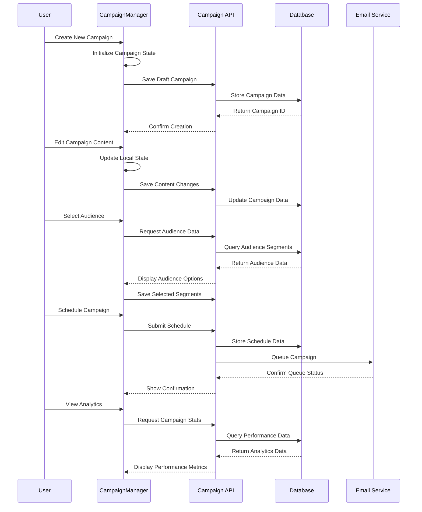
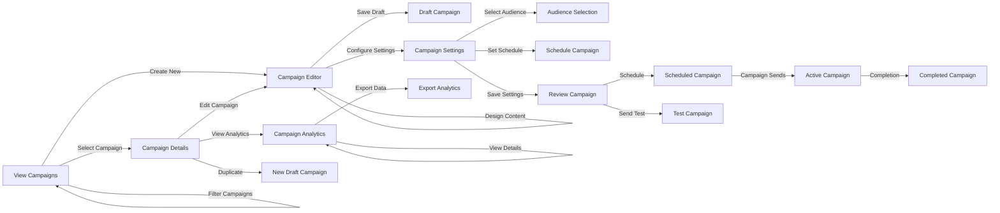

# CampaignManager Component

## Overview
The CampaignManager component provides a comprehensive interface for creating, managing, and analyzing marketing campaigns. It enables users to design campaign content, schedule deliveries, track performance metrics, and manage subscriber segments all within a unified workflow.

## Screenshots

### Campaigns Dashboard

*The main campaigns dashboard showing active, scheduled, and completed campaigns*

### Campaign Editor

*The campaign content editor with design tools and template options*

### Campaign Analytics

*Performance analytics for an individual campaign showing engagement metrics*

### Audience Targeting

*Audience segmentation and targeting interface for campaign delivery*

## Component Architecture

```mermaid
graph TD
    A[CampaignManager] --> B[CampaignList]
    A --> C[CampaignEditor]
    A --> D[CampaignAnalytics]
    A --> E[CampaignSettings]
    
    B --> F[CampaignCard]
    B --> G[FilterPanel]
    B --> H[BulkActions]
    
    C --> I[ContentEditor]
    C --> J[TemplateSelector]
    C --> K[MediaLibrary]
    C --> L[PreviewPane]
    
    D --> M[PerformanceMetrics]
    D --> N[EngagementCharts]
    D --> O[AudienceInsights]
    D --> P[LinkAnalytics]
    
    E --> Q[SchedulingOptions]
    E --> R[AudienceSelector]
    E --> S[DeliverySettings]
    E --> T[TrackingOptions]
    
    style A fill:#f9f,stroke:#333,stroke-width:2px
    style B fill:#bbf,stroke:#333,stroke-width:1px
    style C fill:#bbf,stroke:#333,stroke-width:1px
    style D fill:#bbf,stroke:#333,stroke-width:1px
    style E fill:#bbf,stroke:#333,stroke-width:1px
```



*Component hierarchy and relationships*

## Data Flow



*Data flow for campaign management operations*

## Features
- Complete campaign creation workflow
- Rich content editor with templates
- Email, social media, and SMS campaign types
- A/B testing capabilities
- Audience segmentation and targeting
- Campaign scheduling and delivery management
- Comprehensive performance analytics
- Automated campaign sequences
- Template management
- Media library integration
- Personalization and dynamic content
- Link tracking and click analytics
- Compliance and permission management

## Props

| Prop | Type | Required | Description |
|------|------|----------|-------------|
| initialView | 'list' \| 'editor' \| 'analytics' \| 'settings' | No | Initial view to display |
| selectedCampaignId | string | No | ID of initially selected campaign |
| campaignType | 'email' \| 'social' \| 'sms' \| 'all' | No | Type of campaigns to display |
| filters | CampaignFilters | No | Initial filter configuration |
| onCampaignCreate | (campaign: Campaign) => void | No | Callback when campaign is created |
| onCampaignUpdate | (campaign: Campaign) => void | No | Callback when campaign is updated |
| onCampaignSchedule | (campaign: Campaign, schedule: Schedule) => void | No | Callback when campaign is scheduled |
| onCampaignDelete | (campaignId: string) => void | No | Callback when campaign is deleted |
| templates | Template[] | No | Custom templates available for campaigns |
| mediaLibrary | MediaItem[] | No | Media items available for use in campaigns |

## Usage

```tsx
import { CampaignManager } from '@/components/campaigns/CampaignManager';

// Basic usage
<CampaignManager />

// With initial selected campaign in editor view
<CampaignManager
  initialView="editor"
  selectedCampaignId="campaign-123"
/>

// With custom handling and filtered by type
<CampaignManager
  campaignType="email"
  onCampaignCreate={(campaign) => {
    console.log("New campaign created:", campaign);
    trackEvent("campaign_created");
  }}
  onCampaignSchedule={(campaign, schedule) => {
    notifyTeam(`Campaign ${campaign.name} scheduled for ${schedule.date}`);
  }}
/>

// With custom templates
<CampaignManager
  templates={[
    { id: 'welcome', name: 'Welcome Email', thumbnail: '/templates/welcome.jpg' },
    { id: 'newsletter', name: 'Monthly Newsletter', thumbnail: '/templates/newsletter.jpg' }
  ]}
  mediaLibrary={myOrganizationMediaLibrary}
/>
```

## User Interaction Workflow



*User interaction flows within the campaign management component*

## Components

### CampaignList
Displays a list of campaigns with filtering and sorting options.

#### Props
- campaigns: Campaign[]
- onSelect: (campaignId: string) => void
- filters: CampaignFilters
- onFilterChange: (filters: CampaignFilters) => void
- onBulkAction: (action: string, campaignIds: string[]) => void

### CampaignEditor
Rich editor interface for creating and editing campaign content.

#### Features
- WYSIWYG editing
- Template-based design
- Drag-and-drop components
- Media insertion
- Personalization tokens
- Mobile preview
- Spam check
- A/B testing setup

### CampaignAnalytics
Displays performance metrics and engagement data for campaigns.

#### Features
- Open and click rates
- Conversion tracking
- Audience engagement metrics
- Geographic data
- Device and client information
- Time-based analytics
- Comparison with industry benchmarks

### CampaignSettings
Configuration options for campaign delivery and tracking.

#### Features
- Scheduling options
- Audience targeting
- Sender information
- Reply-to settings
- Tracking parameters
- Social media integration
- Compliance settings

## Data Models

### Campaign
```typescript
interface Campaign {
  id: string;
  name: string;
  type: 'email' | 'social' | 'sms' | 'push';
  status: 'draft' | 'scheduled' | 'sending' | 'sent' | 'archived';
  subject?: string;
  content: {
    html?: string;
    text?: string;
    socialPost?: string;
    smsText?: string;
  };
  template?: {
    id: string;
    name: string;
  };
  audience: {
    segments: string[];
    excludedSegments?: string[];
    estimatedSize: number;
  };
  schedule?: {
    sendDate: Date;
    timeZone: string;
    isRecurring: boolean;
    recurringPattern?: RecurringPattern;
  };
  settings: {
    sender: {
      name: string;
      email: string;
    };
    replyTo?: string;
    trackOpens: boolean;
    trackClicks: boolean;
    utmParameters?: {
      source?: string;
      medium?: string;
      campaign?: string;
    };
  };
  analytics?: CampaignAnalytics;
  createdAt: Date;
  updatedAt: Date;
  sentAt?: Date;
  createdBy: string;
}
```

### CampaignAnalytics
```typescript
interface CampaignAnalytics {
  sent: number;
  delivered: number;
  opens: number;
  uniqueOpens: number;
  clicks: number;
  uniqueClicks: number;
  bounces: {
    soft: number;
    hard: number;
  };
  unsubscribes: number;
  complaints: number;
  engagementRate: number;
  clickToOpenRate: number;
  linkPerformance: {
    url: string;
    clicks: number;
    uniqueClicks: number;
  }[];
  deviceBreakdown: {
    desktop: number;
    mobile: number;
    tablet: number;
    unknown: number;
  };
  geographicData?: {
    country: string;
    count: number;
  }[];
  timeData: {
    timestamp: Date;
    opens: number;
    clicks: number;
  }[];
}
```

### Template
```typescript
interface Template {
  id: string;
  name: string;
  description?: string;
  thumbnail: string;
  content: {
    html: string;
    text?: string;
  };
  category?: string;
  tags?: string[];
  createdAt: Date;
  updatedAt: Date;
  isDefault?: boolean;
  isCustom?: boolean;
}
```

## Styling
The component uses a combination of Tailwind CSS and custom styling:
- Responsive design for all device sizes
- Drag-and-drop interfaces with visual feedback
- Interactive charts and data visualizations
- Preview modes for different device sizes
- Consistent brand styling
- Visual differentiation of campaign states
- Accessibility-focused color system

## Accessibility
- ARIA roles and landmarks for all interactive elements
- Keyboard navigation through editor interfaces
- Screen reader support for analytics data
- Focus management for complex workflows
- Alternative text for visual elements
- High contrast mode support
- Semantic HTML structure
- Accessibility checker for created content

## Error Handling
- Form validation for all campaign data
- Error recovery for failed saves
- Connection status monitoring
- Autosave functionality
- Version history for content changes
- Validation for email deliverability
- Spam score checking
- Responsive design validation

## Performance Optimizations
- Optimistic UI updates
- Lazy loading of campaign content
- Virtualized lists for large campaign collections
- Chunked saving of large content blocks
- Debounced editor inputs
- On-demand loading of analytics data
- Image optimization in templates
- Code splitting for editor components

## Dependencies
- react-email-editor
- @tanstack/react-query
- chart.js / react-chartjs-2
- date-fns
- react-beautiful-dnd
- tinymce / react-tinymce
- draft-js (for rich text editing)
- @tanstack/react-table
- react-calendar

## Related Components
- TemplateLibrary
- AudienceManager
- MediaLibrary
- EmailDesigner
- A/B TestManager
- AutomationBuilder
- DeliveryMonitor

## Examples

### Basic Implementation
```tsx
import { CampaignManager } from '@/components/campaigns/CampaignManager';

export default function CampaignsPage() {
  return (
    <div className="p-6">
      <h1 className="text-2xl font-bold mb-6">Campaign Management</h1>
      <CampaignManager />
    </div>
  );
}
```

### With Custom Templates and Handlers
```tsx
import { CampaignManager } from '@/components/campaigns/CampaignManager';
import { useToast } from '@/components/ui/toast';
import { useApiClient } from '@/lib/api';

export default function CustomCampaignsPage() {
  const { toast } = useToast();
  const apiClient = useApiClient();
  
  const customTemplates = [
    {
      id: 'welcome-series',
      name: 'Welcome Series',
      description: 'A series of emails to welcome new subscribers',
      thumbnail: '/images/templates/welcome-series.jpg',
      content: {
        html: '...',
        text: '...'
      },
      category: 'Onboarding',
      tags: ['welcome', 'onboarding', 'series'],
      createdAt: new Date(),
      updatedAt: new Date(),
      isCustom: true
    },
    // Additional templates...
  ];
  
  const handleCampaignCreate = async (campaign) => {
    try {
      await apiClient.campaigns.create(campaign);
      toast({
        title: "Campaign Created",
        description: `${campaign.name} has been created successfully.`,
        variant: "success"
      });
    } catch (error) {
      toast({
        title: "Error",
        description: "Failed to create campaign. Please try again.",
        variant: "destructive"
      });
    }
  };
  
  return (
    <div className="p-6">
      <CampaignManager 
        templates={customTemplates}
        onCampaignCreate={handleCampaignCreate}
        onCampaignSchedule={(campaign, schedule) => {
          toast({
            title: "Campaign Scheduled",
            description: `${campaign.name} scheduled for ${new Date(schedule.sendDate).toLocaleDateString()}`,
            variant: "success"
          });
        }}
      />
    </div>
  );
}
```

### Email-Only Campaign Manager with Analytics Focus
```tsx
import { CampaignManager } from '@/components/campaigns/CampaignManager';
import { useState } from 'react';

export default function EmailCampaignsAnalyticsPage() {
  const [selectedCampaign, setSelectedCampaign] = useState(null);
  
  return (
    <div className="p-6">
      <h1 className="text-2xl font-bold mb-6">Email Campaign Performance</h1>
      <CampaignManager
        campaignType="email"
        initialView={selectedCampaign ? "analytics" : "list"}
        selectedCampaignId={selectedCampaign}
        filters={{
          status: ["sent", "archived"],
          dateRange: {
            start: new Date(Date.now() - 90 * 24 * 60 * 60 * 1000), // Last 90 days
            end: new Date()
          }
        }}
        onCampaignSelect={(campaignId) => setSelectedCampaign(campaignId)}
      />
    </div>
  );
}
```

## Best Practices
1. Design mobile-first campaign templates
2. Implement proper permission validation before sending
3. Test campaigns with multiple email clients
4. Use segmentation for targeted messaging
5. Set up proper tracking parameters
6. Follow email deliverability best practices
7. Maintain consistent branding across campaigns
8. Review analytics to optimize future campaigns

## Troubleshooting

### Common Issues
1. Email deliverability problems
2. Template rendering inconsistencies across clients
3. Tracking pixel blocking affecting analytics
4. Scheduling across different time zones
5. Large audience segments causing slow performance
6. Image sizing and responsive design issues
7. Personalization token errors

### Solutions
1. Verify sender authentication (SPF, DKIM, DMARC)
2. Test templates with email testing tools
3. Implement link tracking as alternative to pixel tracking
4. Use clear time zone indicators in scheduling UI
5. Implement pagination and progressive loading for large audiences
6. Enforce image size limits and responsive guidelines
7. Add validation for personalization tokens

## Contributing
When contributing to this component:
1. Follow email marketing best practices
2. Test with various email clients and devices
3. Maintain compliance with anti-spam regulations
4. Document template structures
5. Add unit tests for critical functions
6. Consider internationalization requirements
7. Optimize for both campaign creators and recipients 