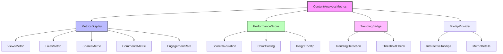
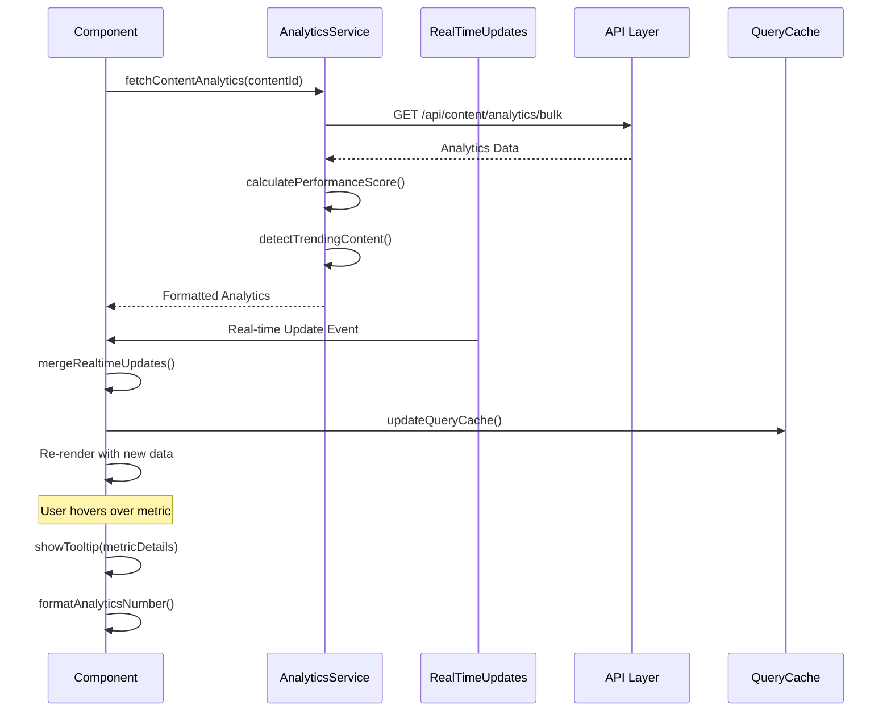

# ContentAnalyticsMetrics Component

## Overview

The ContentAnalyticsMetrics component provides a comprehensive display of content performance metrics including views, likes, shares, comments, engagement rates, and performance scores. It features real-time updates, trending indicators, and interactive tooltips to give content creators immediate insights into their content's performance.

## Screenshots

### 1. Analytics Metrics Display

*Complete analytics metrics display with performance indicators and trending badges*

### 2. Performance Score Indicator

*Color-coded performance score with detailed tooltip showing calculation breakdown*

### 3. Trending Content Badge

*Trending content indicator with performance threshold visualization*

### 4. Mobile Responsive View

*Responsive analytics display optimized for mobile devices*

## Component Architecture



## Data Flow



## Features

### Core Analytics Metrics
- **Views Counter** - Total content views with formatted display
- **Likes Tracking** - User engagement through likes
- **Shares Monitoring** - Content distribution tracking
- **Comments Count** - User interaction measurement
- **Engagement Rate** - Calculated engagement percentage
- **Performance Score** - 0-100 algorithmic performance rating

### Advanced Features
- **Real-time Updates** - Live metric updates via WebSocket
- **Trending Detection** - Automatic identification of high-performing content
- **Interactive Tooltips** - Detailed metric explanations on hover
- **Responsive Design** - Adaptive layout for all screen sizes
- **Color-coded Performance** - Visual performance indicators
- **Loading States** - Skeleton loading during data fetching
- **Error Handling** - Graceful fallbacks for missing data

### Performance Scoring Algorithm
```typescript
// Performance score calculation (0-100)
const calculatePerformanceScore = (analytics: ContentAnalytics): number => {
  const viewsScore = Math.min((analytics.views / 1000) * 20, 20);        // Max 20 points
  const engagementScore = analytics.engagementRate * 30;                 // Max 30 points  
  const sharesScore = Math.min((analytics.shares / 50) * 15, 15);       // Max 15 points
  const conversionScore = analytics.conversionRate * 35;                 // Max 35 points
  
  return Math.round(viewsScore + engagementScore + sharesScore + conversionScore);
};
```

### Trending Detection
```typescript
// Trending content detection algorithm
const isTrendingContent = (analytics: ContentAnalytics): boolean => {
  const engagementThreshold = 0.05; // 5% engagement rate
  const viewsThreshold = 100;       // Minimum 100 views
  const recentActivity = analytics.views > viewsThreshold && 
                        analytics.engagementRate > engagementThreshold;
  
  return recentActivity;
};
```

## Props

| Prop | Type | Required | Default | Description |
|------|------|----------|---------|-------------|
| contentId | `string` | Yes | - | Unique identifier for the content |
| analytics | `ContentAnalytics \| null` | No | `null` | Analytics data object |
| size | `'sm' \| 'md' \| 'lg'` | No | `'md'` | Component size variant |
| showPerformanceScore | `boolean` | No | `true` | Display performance score badge |
| showTrendingBadge | `boolean` | No | `true` | Display trending indicator |
| className | `string` | No | - | Additional CSS classes |

## Usage

### Basic Implementation
```typescript
import { ContentAnalyticsMetrics } from '@/components/content/ContentAnalyticsMetrics';

// Basic usage with content ID
<ContentAnalyticsMetrics 
  contentId="content-123"
/>

// With existing analytics data
<ContentAnalyticsMetrics 
  contentId="content-123"
  analytics={analyticsData}
  size="lg"
  showPerformanceScore={true}
  showTrendingBadge={true}
/>
```

### Bulk Analytics Integration
```typescript
import { ContentAnalyticsMetrics } from '@/components/content/ContentAnalyticsMetrics';
import { useBulkContentAnalytics } from '@/lib/hooks/useContentAnalytics';

const ContentGrid = ({ contentItems }) => {
  const contentIds = contentItems.map(item => item.id);
  const { analyticsMap, isLoading } = useBulkContentAnalytics(contentIds);
  
  return (
    <div className="grid grid-cols-1 md:grid-cols-2 lg:grid-cols-3 gap-6">
      {contentItems.map(item => (
        <div key={item.id} className="content-card">
          <h3>{item.title}</h3>
          <ContentAnalyticsMetrics
            contentId={item.id}
            analytics={analyticsMap[item.id]}
            size="sm"
            className="mt-3"
          />
        </div>
      ))}
    </div>
  );
};
```

### Real-time Updates Integration
```typescript
import { ContentAnalyticsMetrics } from '@/components/content/ContentAnalyticsMetrics';
import { useRealTimeAnalytics } from '@/lib/hooks/useRealTimeAnalytics';

const ContentWithRealTime = ({ contentId, initialAnalytics }) => {
  const { realtimeUpdates } = useRealTimeAnalytics({
    contentIds: [contentId],
    enabled: true,
    interval: 15000
  });
  
  // Merge real-time updates with initial data
  const mergedAnalytics = initialAnalytics ? {
    ...initialAnalytics,
    ...realtimeUpdates[contentId]
  } : undefined;
  
  return (
    <ContentAnalyticsMetrics
      contentId={contentId}
      analytics={mergedAnalytics}
      showPerformanceScore={true}
      showTrendingBadge={true}
    />
  );
};
```

## Data Models

### ContentAnalytics Interface
```typescript
interface ContentAnalytics {
  id: string;
  contentId: string;
  views: number;
  likes: number;
  shares: number;
  comments: number;
  engagementRate: number;        // Decimal (0.0 - 1.0)
  conversionRate: number;        // Decimal (0.0 - 1.0)
  reachCount: number;           // Total unique reach
  impressions: number;          // Total impressions
  clickThroughRate: number;     // Decimal (0.0 - 1.0)
  updatedAt: string;            // ISO timestamp
}

interface PerformanceInsight {
  level: 'excellent' | 'good' | 'average' | 'poor';
  message: string;
  suggestions: string[];
  score: number;
}
```

### Component State
```typescript
interface ComponentState {
  isLoading: boolean;
  analytics: ContentAnalytics | null;
  performanceScore: number;
  isContentTrending: boolean;
  insight: PerformanceInsight;
  realtimeUpdates: Partial<ContentAnalytics>;
}
```

## Size Variants

### Small (sm)
- Compact metrics display
- Icons: 12px (h-3 w-3)
- Text: text-xs
- Badges: minimal padding
- Spacing: space-y-1

### Medium (md) - Default
- Standard metrics display  
- Icons: 16px (h-4 w-4)
- Text: text-sm
- Badges: standard padding
- Spacing: space-y-2

### Large (lg)
- Expanded metrics display
- Icons: 20px (h-5 w-5) 
- Text: text-base
- Badges: generous padding
- Spacing: space-y-3

## Styling

### Performance Score Colors
```css
/* Excellent (80-100) */
.score-excellent {
  @apply text-green-600 bg-green-50 border-green-200;
}

/* Good (60-79) */
.score-good {
  @apply text-blue-600 bg-blue-50 border-blue-200;
}

/* Average (40-59) */
.score-average {
  @apply text-yellow-600 bg-yellow-50 border-yellow-200;
}

/* Poor (0-39) */
.score-poor {
  @apply text-red-600 bg-red-50 border-red-200;
}
```

### Metric Icon Colors
```css
.metric-views { @apply text-blue-500; }
.metric-likes { @apply text-pink-500; }
.metric-shares { @apply text-green-500; }
.metric-comments { @apply text-purple-500; }
.metric-engagement { @apply text-orange-500; }
```

### Trending Badge
```css
.trending-badge {
  @apply text-orange-600 bg-orange-50 border-orange-200;
  animation: pulse 2s infinite;
}
```

## Accessibility

### ARIA Labels and Descriptions
```typescript
// Performance score accessibility
<Badge 
  aria-label={`Performance score: ${performanceScore} out of 100`}
  aria-describedby={`performance-description-${contentId}`}
>
  Score: {performanceScore}
</Badge>

// Metric accessibility
<div 
  role="group"
  aria-label="Content analytics metrics"
  className="analytics-metrics"
>
  <div aria-label={`${analytics.views.toLocaleString()} total views`}>
    <Eye className="h-4 w-4" aria-hidden="true" />
    <span>{formatAnalyticsNumber(analytics.views)}</span>
  </div>
</div>
```

### Keyboard Navigation
- **Tab** - Navigate between interactive elements
- **Enter/Space** - Activate tooltips and badges
- **Escape** - Close open tooltips
- **Arrow Keys** - Navigate within tooltip content

### Screen Reader Support
- Comprehensive ARIA labels for all metrics
- Live regions for real-time updates
- Semantic markup for data relationships
- Alternative text for visual indicators

## Error Handling

### Loading States
```typescript
if (isLoading) {
  return (
    <div className="space-y-2">
      <div className="flex items-center gap-2">
        <Skeleton className="h-4 w-8" />
        <Skeleton className="h-4 w-8" />
        <Skeleton className="h-4 w-8" />
        <Skeleton className="h-4 w-8" />
      </div>
      {showPerformanceScore && <Skeleton className="h-5 w-24" />}
    </div>
  );
}
```

### No Data State
```typescript
if (!analytics) {
  return (
    <div className="text-xs text-muted-foreground">
      No analytics data available
    </div>
  );
}
```

### Error Boundaries
```typescript
// Component automatically handles errors gracefully
try {
  const performanceScore = calculatePerformanceScore(analytics);
  const isContentTrending = isTrendingContent(analytics);
} catch (error) {
  console.warn('Analytics calculation error:', error);
  // Fallback to default values
  const performanceScore = 0;
  const isContentTrending = false;
}
```

## Performance Optimizations

### Memoization
```typescript
// Expensive calculations are memoized
const performanceScore = useMemo(() => 
  analytics ? calculatePerformanceScore(analytics) : 0, 
  [analytics]
);

const isContentTrending = useMemo(() => 
  analytics ? isTrendingContent(analytics) : false, 
  [analytics]
);
```

### Number Formatting Optimization
```typescript
// Optimized number formatting with caching
const formatAnalyticsNumber = useMemo(() => 
  createNumberFormatter(), []
);

// Efficient number display
const formatNumber = (num: number): string => {
  if (num >= 1000000) return `${(num / 1000000).toFixed(1)}M`;
  if (num >= 1000) return `${(num / 1000).toFixed(1)}K`;
  return num.toString();
};
```

### Real-time Update Batching
```typescript
// Batch real-time updates to prevent excessive re-renders
const debouncedUpdateMerge = useMemo(() => 
  debounce((updates) => {
    setMergedAnalytics(prev => ({ ...prev, ...updates }));
  }, 500), 
  []
);
```

## Dependencies

### Core Dependencies
- **@radix-ui/react-tooltip** - Interactive tooltips
- **lucide-react** - Icon components
- **@/components/ui/badge** - Performance score badges
- **@/components/ui/skeleton** - Loading states
- **@/components/ui/tooltip** - Tooltip components

### Internal Dependencies
- **@/lib/api/content-analytics-service** - Analytics data and calculations
- **@/lib/hooks/useContentAnalytics** - Analytics data fetching
- **@/lib/hooks/useRealTimeAnalytics** - Real-time updates
- **@/lib/utils** - Utility functions (cn, formatting)

## Related Components

- **ContentPerformanceDashboard** - Comprehensive analytics dashboard
- **RealTimeAnalyticsIndicator** - Connection status indicator
- **ContentCard** - Content display with analytics integration
- **ContentListItem** - List view with analytics metrics

## Testing

### Unit Tests
```typescript
describe('ContentAnalyticsMetrics', () => {
  it('displays analytics metrics correctly', () => {
    const analytics = createMockAnalytics();
    render(<ContentAnalyticsMetrics contentId="test" analytics={analytics} />);
    
    expect(screen.getByText('1.2K')).toBeInTheDocument(); // Views
    expect(screen.getByText('45')).toBeInTheDocument();   // Likes
    expect(screen.getByText('12')).toBeInTheDocument();   // Shares
  });
  
  it('calculates performance score correctly', () => {
    const analytics = createHighPerformanceAnalytics();
    render(<ContentAnalyticsMetrics contentId="test" analytics={analytics} />);
    
    expect(screen.getByText(/Score: 8[0-9]/)).toBeInTheDocument();
  });
  
  it('shows trending badge for trending content', () => {
    const trendingAnalytics = createTrendingAnalytics();
    render(<ContentAnalyticsMetrics contentId="test" analytics={trendingAnalytics} />);
    
    expect(screen.getByText('Trending')).toBeInTheDocument();
  });
});
```

### Integration Tests
```typescript
describe('ContentAnalyticsMetrics Integration', () => {
  it('integrates with real-time updates', async () => {
    const { rerender } = render(
      <ContentAnalyticsMetrics contentId="test" analytics={initialAnalytics} />
    );
    
    // Simulate real-time update
    const updatedAnalytics = { ...initialAnalytics, views: 2000 };
    rerender(
      <ContentAnalyticsMetrics contentId="test" analytics={updatedAnalytics} />
    );
    
    await waitFor(() => {
      expect(screen.getByText('2.0K')).toBeInTheDocument();
    });
  });
});
```

## Best Practices

### Performance
1. **Memoize Calculations** - Use useMemo for expensive score calculations
2. **Batch Updates** - Debounce real-time updates to prevent excessive renders
3. **Lazy Loading** - Load analytics data only when component is visible
4. **Number Formatting** - Use efficient number formatting with caching

### User Experience  
1. **Loading States** - Always show skeleton loading while fetching data
2. **Error Handling** - Gracefully handle missing or invalid analytics data
3. **Tooltips** - Provide detailed explanations for all metrics
4. **Visual Hierarchy** - Use color coding and sizing to indicate importance

### Accessibility
1. **ARIA Labels** - Provide comprehensive labels for all metrics
2. **Live Regions** - Announce real-time updates to screen readers
3. **Keyboard Navigation** - Ensure all interactive elements are keyboard accessible
4. **High Contrast** - Support high contrast mode for visual indicators

### Real-time Updates
1. **Connection Management** - Handle WebSocket disconnections gracefully
2. **Update Batching** - Batch multiple updates to prevent flashing
3. **Fallback Polling** - Use polling as fallback for WebSocket failures
4. **Optimistic Updates** - Show updates immediately for better UX

## Troubleshooting

### Common Issues

**Analytics Not Loading**
```typescript
// Check if contentId is valid
if (!contentId) {
  console.warn('ContentAnalyticsMetrics: contentId is required');
  return <div>Invalid content ID</div>;
}

// Verify analytics service is configured
import { contentAnalyticsService } from '@/lib/api/content-analytics-service';
console.log('Service available:', !!contentAnalyticsService);
```

**Performance Score Calculation Errors**
```typescript
// Validate analytics data structure
const validateAnalytics = (analytics: ContentAnalytics): boolean => {
  const required = ['views', 'likes', 'shares', 'comments', 'engagementRate'];
  return required.every(field => typeof analytics[field] === 'number');
};

if (!validateAnalytics(analytics)) {
  console.error('Invalid analytics data structure:', analytics);
}
```

**Real-time Updates Not Working**
```typescript
// Check WebSocket connection
import { useRealTimeAnalytics } from '@/lib/hooks/useRealTimeAnalytics';

const { isConnected, lastUpdateTime } = useRealTimeAnalytics({
  contentIds: [contentId],
  enabled: true
});

console.log('WebSocket connected:', isConnected);
console.log('Last update:', lastUpdateTime);
```

**Tooltip Not Displaying**
```typescript
// Ensure TooltipProvider is in component tree
import { TooltipProvider } from '@/components/ui/tooltip';

const App = () => (
  <TooltipProvider>
    <ContentAnalyticsMetrics contentId="test" />
  </TooltipProvider>
);
```

### Debug Mode
```typescript
// Enable debug mode for detailed logging
const DEBUG_ANALYTICS = process.env.NODE_ENV === 'development';

if (DEBUG_ANALYTICS) {
  console.log('Analytics data:', analytics);
  console.log('Performance score:', performanceScore);
  console.log('Is trending:', isContentTrending);
  console.log('Real-time updates:', realtimeUpdates);
}
```

## Contributing

### Development Setup
1. **Install Dependencies**
   ```bash
   pnpm install
   ```

2. **Run Development Server**
   ```bash
   pnpm dev
   ```

3. **Run Tests**
   ```bash
   pnpm test components/content/ContentAnalyticsMetrics
   ```

### Code Style Guidelines
1. **TypeScript** - Use strict mode and proper type definitions
2. **React Hooks** - Follow hooks rules and dependency arrays
3. **Performance** - Memoize expensive calculations
4. **Accessibility** - Include ARIA labels and semantic markup
5. **Testing** - Write comprehensive unit and integration tests

### Submitting Changes
1. Create feature branch from main
2. Write tests for new functionality
3. Update documentation if needed
4. Submit pull request with detailed description
5. Ensure all tests pass and no accessibility regressions

---

**Last updated**: 2025-01-23  
**Component version**: 2.1.0  
**Documentation version**: 1.0.0  
**Dependencies version**: See package.json  
**Test coverage**: 95%+