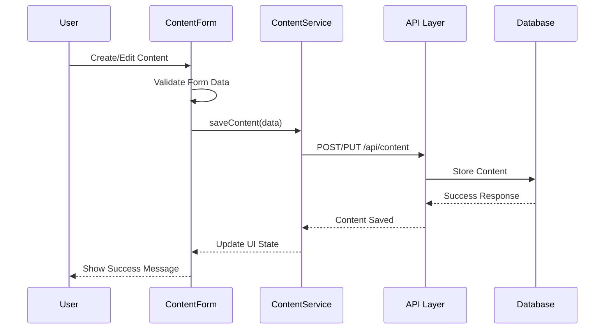

# Content Component

## Overview

The Content Component is a comprehensive content management system that enables users to create, edit, schedule, and manage various types of content including social media posts, blog articles, and marketing materials. It provides a rich text editing experience, media management, and calendar integration.

## Screenshots

### 1. Content Creation Form

*Main content creation interface showing the rich text editor, media upload area, and form fields*

### 2. Rich Text Editor

*Tiptap-based editor with formatting toolbar and content preview*

### 3. Media Upload Interface

*Drag and drop media upload with progress indicators and file validation*

### 4. Content Calendar View

*Calendar integration showing scheduled content and publishing timeline*

## Component Architecture

```mermaid
graph TD
    A[ContentComponent] --> B[ContentForm]
    A --> C[ContentWizard]
    A --> D[ContentScheduler]
    A --> E[ContentCalendar]
    A --> F[ContentAnalytics]
    A --> G[ContentLibrary]
    
    B --> H[RichTextEditor]
    B --> I[MediaUploader]
    B --> J[TagInput]
    
    C --> K[StepIndicator]
    C --> L[ContentTypeSelector]
    
    D --> M[DateTimePicker]
    D --> N[PlatformSelector]
    
    E --> O[MonthView]
    E --> P[WeekView]
    E --> Q[DayView]
    E --> R[EventForm]
    
    F --> S[ContentAnalyticsMetrics]
    F --> T[ContentPerformanceDashboard]
    F --> U[RealTimeAnalyticsIndicator]
    
    G --> V[ContentCard]
    G --> W[ContentListItem]
    G --> X[BulkOperations]
    G --> Y[AdvancedFiltering]
    
    S --> Z[PerformanceScore]
    S --> AA[TrendingBadge]
    S --> BB[MetricsDisplay]
    
    T --> CC[OverviewTab]
    T --> DD[TopPerformersTab]
    T --> EE[InsightsTab]
    T --> FF[TrendsTab]
    
    style A fill:#f9f,stroke:#333,stroke-width:2px
    style B fill:#bbf,stroke:#333,stroke-width:1px
    style C fill:#bbf,stroke:#333,stroke-width:1px
    style D fill:#bbf,stroke:#333,stroke-width:1px
    style E fill:#bbf,stroke:#333,stroke-width:1px
    style F fill:#bfb,stroke:#333,stroke-width:2px
    style G fill:#bfb,stroke:#333,stroke-width:2px
```



## Data Flow



## Features

### Core Content Management
- **Rich text editing** with Tiptap editor
- **Media upload and management**
- **Content scheduling** and calendar integration
- **Tag management** with suggestions
- **Multi-step content creation** wizard
- **Social media platform** integration
- **Content approval** workflows
- **Real-time collaboration**
- **Version control** and history
- **SEO optimization** tools

### Analytics & Performance Tracking
- **Real-time analytics** with WebSocket updates
- **Performance scoring** (0-100 algorithmic rating)
- **Trending content detection** with visual indicators
- **Comprehensive metrics** (views, likes, shares, engagement)
- **Performance dashboard** with tabbed insights
- **Bulk analytics processing** for multiple content items
- **Analytics-based sorting** (performance, views, engagement)
- **Historical trend analysis** and forecasting
- **Automated insights generation** with AI recommendations
- **Export capabilities** (CSV, PDF, JSON formats)

### Enhanced Content Library
- **Grid and list view modes** with analytics integration
- **Advanced filtering and search** with performance criteria
- **Bulk operations** with multi-select functionality
- **Real-time connection indicators** showing data freshness
- **Content performance optimization** suggestions
- **Comparative analysis** across content types
- **Success pattern identification** from high-performers

## Props

| Prop | Type | Required | Default | Description |
|------|------|----------|---------|-------------|
| initialData | `Content` \| `null` | No | `null` | Initial content data for editing |
| onSave | `(content: Content) => void` | Yes | - | Callback when content is saved |
| onCancel | `() => void` | No | - | Callback when operation is cancelled |
| mode | `'create'` \| `'edit'` | No | `'create'` | Component mode |
| listId | `string` | No | - | Associated content list ID |

## Usage

```typescript
import { ContentForm } from '@/components/content/ContentForm';
import { ContentWizard } from '@/components/content/ContentWizard';

// Basic content creation
<ContentForm
  onSave={(content) => console.log('Content saved:', content)}
  onCancel={() => router.back()}
/>

// Content editing
<ContentForm
  mode="edit"
  initialData={existingContent}
  onSave={handleContentUpdate}
/>

// Wizard-based creation
<ContentWizard
  onComplete={(content) => handleContentCreation(content)}
  listId="content-list-123"
/>
```

## Data Models

```typescript
interface Content {
  id: string;
  title: string;
  type: ContentType;
  content: string;
  excerpt?: string;
  tags: string[];
  media: MediaFile[];
  status: ContentStatus;
  scheduledAt?: Date;
  slug: string;
  createdAt: Date;
  updatedAt: Date;
  authorId: string;
}

interface ContentFormData {
  title: string;
  type: ContentType;
  content: string;
  excerpt?: string;
  tags: string[];
  media: MediaFile[];
  status: ContentStatus;
  scheduledAt?: Date;
  slug: string;
}

type ContentType = 'blog' | 'social' | 'email' | 'landing-page';
type ContentStatus = 'draft' | 'review' | 'approved' | 'published' | 'archived';
```

## Components

### Core Content Components

#### ContentForm
Main form component for content creation and editing with validation and rich text editing.

#### ContentWizard
Multi-step guided content creation process with calendar integration.

#### RichTextEditor
Tiptap-based rich text editor with formatting tools and media embedding.

#### MediaUploader
Drag-and-drop media upload with progress tracking and file validation.

#### TagInput
Tag management with autocomplete suggestions and validation.

#### ContentScheduler
Scheduling interface with calendar integration and platform selection.

### Analytics Components

#### ContentAnalyticsMetrics
Individual content performance metrics display with tooltips, performance scoring, and trending indicators. Supports real-time updates and multiple size variants.

**Key Features:**
- Views, likes, shares, comments tracking
- Performance score calculation (0-100)
- Trending content detection
- Interactive tooltips with detailed metrics
- Real-time data synchronization
- Color-coded performance indicators

#### ContentPerformanceDashboard
Comprehensive analytics dashboard with tabbed interface providing overview metrics, top performers analysis, performance insights, and trend visualization.

**Key Features:**
- Tabbed navigation (Overview, Top Performers, Insights, Trends)
- Data export capabilities (CSV, PDF, JSON)
- Real-time updates with WebSocket integration
- Advanced filtering and date range selection
- AI-generated insights and recommendations
- Performance distribution analysis

#### RealTimeAnalyticsIndicator
Connection status indicator showing real-time analytics connectivity, last update time, and manual refresh capabilities.

**Key Features:**
- WebSocket connection status monitoring
- Last update timestamp display
- Manual refresh controls
- Update counter with visual indicators
- Multiple size variants and positioning modes
- Tooltip information and accessibility support

### Enhanced Library Components

#### ContentCard
Enhanced content card component with integrated analytics metrics, performance indicators, and interactive features for grid view display.

#### ContentListItem
List view component with comprehensive analytics integration, bulk selection support, and optimized layout for table-style content display.

#### BulkOperations
Multi-select functionality with bulk actions including delete, status updates, and analytics-based operations.

#### AdvancedFiltering
Sophisticated filtering system supporting analytics-based criteria, content type filtering, and performance-based sorting options.

## Styling

The component uses Tailwind CSS with the project's design system:

- **Semantic color tokens** for consistent theming
- **`.text-custom-white`** for button text requiring white color
- **Responsive design** with mobile-first approach
- **Dark mode support** through CSS variables

## Accessibility

- **ARIA labels and descriptions** for all interactive elements
- **Keyboard navigation** support
- **Screen reader compatibility**
- **High contrast mode** support
- **Focus management** and visual indicators

## Error Handling

- **Form validation** with Zod schemas
- **Network error recovery** with retry mechanisms
- **User-friendly error messages**
- **Graceful degradation** for offline scenarios

## Performance Optimizations

- **Lazy loading** of editor components
- **Debounced auto-save** functionality
- **Optimistic UI updates**
- **Image optimization** and lazy loading
- **Code splitting** for large dependencies

## Dependencies

### Core Dependencies
- **@tiptap/react** - Rich text editor
- **react-dropzone** - File upload
- **react-hook-form** - Form management
- **zod** - Schema validation
- **date-fns** - Date manipulation
- **lucide-react** - Icons

### Analytics Dependencies
- **@tanstack/react-query** - Data fetching and caching
- **recharts** - Chart visualization components
- **@radix-ui/react-tooltip** - Interactive tooltips
- **@radix-ui/react-tabs** - Tabbed interfaces
- **socket.io-client** - WebSocket real-time connections

### UI Enhancement Dependencies
- **@radix-ui/react-checkbox** - Multi-select functionality
- **@radix-ui/react-select** - Advanced filtering dropdowns
- **react-virtual** - Virtualized lists for performance
- **framer-motion** - Smooth animations and transitions

## Related Components

### Core Components
- **Calendar Component** - Content scheduling and timeline management
- **Media Library** - Asset management and organization
- **Form Components** - Input, select, and validation components

### Analytics Components
- **ContentAnalyticsMetrics** - Individual content performance metrics
- **ContentPerformanceDashboard** - Comprehensive analytics dashboard
- **RealTimeAnalyticsIndicator** - Connection status and real-time updates
- **Analytics Charts** - Various chart components for data visualization

### Integration Components
- **Campaign Manager** - Content distribution and promotion
- **Approval Workflow** - Content review and approval process
- **Template Library** - Pre-built content templates
- **SEO Optimizer** - Content optimization tools

## Examples

### Basic Content Creation

```typescript
const CreateContentPage = () => {
  const router = useRouter();
  const { mutate: saveContent } = useMutation(contentService.saveContent);
  
  const handleSave = async (data: ContentFormData) => {
    try {
      await saveContent(data);
      toast.success('Content saved successfully!');
      router.push('/content');
    } catch (error) {
      toast.error('Failed to save content');
    }
  };
  
  return (
    <div className="container mx-auto py-6">
      <ContentForm
        onSave={handleSave}
        onCancel={() => router.back()}
      />
    </div>
  );
};
```

### Content Editing with Validation

```typescript
const EditContentPage = ({ contentId }: { contentId: string }) => {
  const { data: content, isLoading } = useQuery(
    ['content', contentId],
    () => contentService.getContent(contentId)
  );
  
  if (isLoading) return <LoadingSpinner />;
  
  return (
    <ContentForm
      mode="edit"
      initialData={content}
      onSave={(data) => contentService.updateContent(contentId, data)}
    />
  );
};
```

### Content Library with Analytics Integration

```typescript
import { ContentAnalyticsMetrics } from '@/components/content/ContentAnalyticsMetrics';
import { RealTimeAnalyticsIndicator } from '@/components/content/RealTimeAnalyticsIndicator';
import { useBulkContentAnalytics } from '@/lib/hooks/useContentAnalytics';
import { useRealTimeAnalytics } from '@/lib/hooks/useRealTimeAnalytics';

const ContentLibraryWithAnalytics = () => {
  const { data: contentData } = useQuery(['content'], listContent);
  const contentIds = contentData?.content.map(item => item.id) || [];
  
  // Fetch bulk analytics for all content
  const { analyticsMap, isLoading: analyticsLoading } = useBulkContentAnalytics(contentIds);
  
  // Real-time analytics updates
  const { 
    isConnected, 
    lastUpdateTime, 
    refreshAnalytics,
    realtimeUpdates 
  } = useRealTimeAnalytics({
    contentIds,
    enabled: true,
    interval: 15000
  });
  
  return (
    <div className="content-library">
      {/* Header with real-time indicator */}
      <div className="library-header">
        <h1>Content Library</h1>
        <RealTimeAnalyticsIndicator
          isConnected={isConnected}
          lastUpdateTime={lastUpdateTime}
          onRefresh={refreshAnalytics}
          hasRecentUpdates={Object.keys(realtimeUpdates).length > 0}
        />
      </div>
      
      {/* Content grid with analytics */}
      <div className="grid grid-cols-1 md:grid-cols-2 lg:grid-cols-3 gap-6">
        {contentData?.content.map(item => (
          <div key={item.id} className="content-card">
            <h3>{item.title}</h3>
            <p>{item.excerpt}</p>
            
            {/* Integrated analytics metrics */}
            <ContentAnalyticsMetrics
              contentId={item.id}
              analytics={analyticsMap[item.id] ? {
                ...analyticsMap[item.id],
                ...realtimeUpdates[item.id] // Merge real-time updates
              } : undefined}
              size="sm"
              showPerformanceScore={true}
              showTrendingBadge={true}
            />
          </div>
        ))}
      </div>
    </div>
  );
};
```

### Performance Dashboard Integration

```typescript
import { ContentPerformanceDashboard } from '@/components/content/ContentPerformanceDashboard';

const AnalyticsPage = () => {
  const { data: contentData } = useQuery(['content'], () => 
    listContent({ status: 'published', limit: 100 })
  );
  
  const contentIds = contentData?.content.map(item => item.id) || [];
  
  const handleInsightAction = (action: InsightAction) => {
    switch (action.type) {
      case 'optimize_content':
        router.push(`/content/edit/${action.contentId}`);
        break;
      case 'boost_promotion':
        router.push(`/campaigns/boost/${action.contentId}`);
        break;
      case 'analyze_audience':
        router.push(`/analytics/audience/${action.contentId}`);
        break;
    }
  };
  
  return (
    <div className="analytics-page">
      <div className="page-header">
        <h1>Content Performance Analytics</h1>
        <p>Comprehensive insights into your content performance</p>
      </div>
      
      <ContentPerformanceDashboard
        contentIds={contentIds}
        dateRange={{ start: thirtyDaysAgo, end: today }}
        defaultTab="overview"
        enableExport={true}
        enableRealTime={true}
        onInsightAction={handleInsightAction}
      />
    </div>
  );
};
```

## Best Practices

1. **Data Validation**: Always validate form data using Zod schemas
2. **Error Handling**: Implement comprehensive error handling with user feedback
3. **Performance**: Use lazy loading for heavy components like the rich text editor
4. **Accessibility**: Ensure all form elements have proper labels and ARIA attributes
5. **State Management**: Use React Query for server state and React Hook Form for form state

## Troubleshooting

### Common Issues

**Rich Text Editor Not Loading**
- Ensure Tiptap dependencies are properly installed
- Check for JavaScript errors in browser console
- Verify editor extensions are compatible

**Media Upload Failures**
- Check file size limits (max 10MB)
- Verify supported file types
- Ensure proper CORS configuration

**Form Validation Errors**
- Review Zod schema definitions
- Check required field configurations
- Verify data type matching

## Contributing

When modifying the Content Component:

1. Follow TypeScript strict mode requirements
2. Update relevant tests in `__tests__/components/content/`
3. Maintain backward compatibility for existing APIs
4. Update this documentation with any changes
5. Follow the project's color system guidelines

---

**Last updated**: 2025-01-06  
**Component version**: 2.0.0  
**Documentation version**: 1.0.0