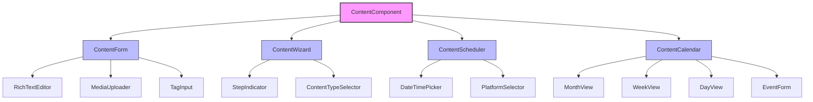
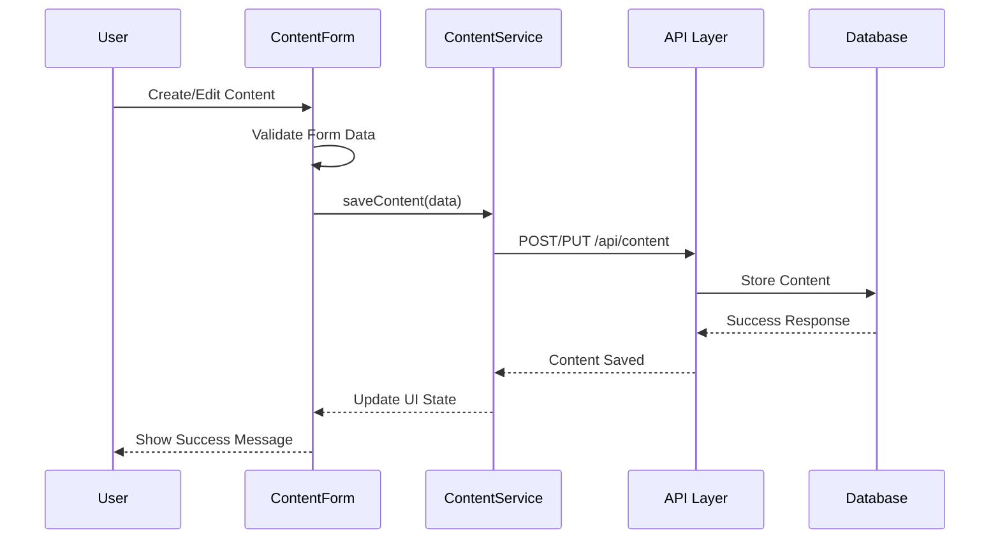

# Content Component

## Overview

The Content Component is a comprehensive content management system that enables users to create, edit, schedule, and manage various types of content including social media posts, blog articles, and marketing materials. It provides a rich text editing experience, media management, and calendar integration.

## Screenshots

### 1. Content Creation Form

*Main content creation interface showing the rich text editor, media upload area, and form fields*

### 2. Rich Text Editor

*Tiptap-based editor with formatting toolbar and content preview*

### 3. Media Upload Interface

*Drag and drop media upload with progress indicators and file validation*

### 4. Content Calendar View

*Calendar integration showing scheduled content and publishing timeline*

## Component Architecture



## Data Flow



## Features

- **Rich text editing** with Tiptap editor
- **Media upload and management**
- **Content scheduling** and calendar integration
- **Tag management** with suggestions
- **Multi-step content creation** wizard
- **Social media platform** integration
- **Content approval** workflows
- **Real-time collaboration**
- **Version control** and history
- **SEO optimization** tools

## Props

| Prop | Type | Required | Default | Description |
|------|------|----------|---------|-------------|
| initialData | `Content` \| `null` | No | `null` | Initial content data for editing |
| onSave | `(content: Content) => void` | Yes | - | Callback when content is saved |
| onCancel | `() => void` | No | - | Callback when operation is cancelled |
| mode | `'create'` \| `'edit'` | No | `'create'` | Component mode |
| listId | `string` | No | - | Associated content list ID |

## Usage

```typescript
import { ContentForm } from '@/components/content/ContentForm';
import { ContentWizard } from '@/components/content/ContentWizard';

// Basic content creation
<ContentForm
  onSave={(content) => console.log('Content saved:', content)}
  onCancel={() => router.back()}
/>

// Content editing
<ContentForm
  mode="edit"
  initialData={existingContent}
  onSave={handleContentUpdate}
/>

// Wizard-based creation
<ContentWizard
  onComplete={(content) => handleContentCreation(content)}
  listId="content-list-123"
/>
```

## Data Models

```typescript
interface Content {
  id: string;
  title: string;
  type: ContentType;
  content: string;
  excerpt?: string;
  tags: string[];
  media: MediaFile[];
  status: ContentStatus;
  scheduledAt?: Date;
  slug: string;
  createdAt: Date;
  updatedAt: Date;
  authorId: string;
}

interface ContentFormData {
  title: string;
  type: ContentType;
  content: string;
  excerpt?: string;
  tags: string[];
  media: MediaFile[];
  status: ContentStatus;
  scheduledAt?: Date;
  slug: string;
}

type ContentType = 'blog' | 'social' | 'email' | 'landing-page';
type ContentStatus = 'draft' | 'review' | 'approved' | 'published' | 'archived';
```

## Components

### ContentForm
Main form component for content creation and editing with validation and rich text editing.

### ContentWizard
Multi-step guided content creation process with calendar integration.

### RichTextEditor
Tiptap-based rich text editor with formatting tools and media embedding.

### MediaUploader
Drag-and-drop media upload with progress tracking and file validation.

### TagInput
Tag management with autocomplete suggestions and validation.

### ContentScheduler
Scheduling interface with calendar integration and platform selection.

## Styling

The component uses Tailwind CSS with the project's design system:

- **Semantic color tokens** for consistent theming
- **`.text-custom-white`** for button text requiring white color
- **Responsive design** with mobile-first approach
- **Dark mode support** through CSS variables

## Accessibility

- **ARIA labels and descriptions** for all interactive elements
- **Keyboard navigation** support
- **Screen reader compatibility**
- **High contrast mode** support
- **Focus management** and visual indicators

## Error Handling

- **Form validation** with Zod schemas
- **Network error recovery** with retry mechanisms
- **User-friendly error messages**
- **Graceful degradation** for offline scenarios

## Performance Optimizations

- **Lazy loading** of editor components
- **Debounced auto-save** functionality
- **Optimistic UI updates**
- **Image optimization** and lazy loading
- **Code splitting** for large dependencies

## Dependencies

- **@tiptap/react** - Rich text editor
- **react-dropzone** - File upload
- **react-hook-form** - Form management
- **zod** - Schema validation
- **date-fns** - Date manipulation
- **lucide-react** - Icons

## Related Components

- **Calendar Component**
- **Media Library**
- **Form Components**

## Examples

### Basic Content Creation

```typescript
const CreateContentPage = () => {
  const router = useRouter();
  const { mutate: saveContent } = useMutation(contentService.saveContent);
  
  const handleSave = async (data: ContentFormData) => {
    try {
      await saveContent(data);
      toast.success('Content saved successfully!');
      router.push('/content');
    } catch (error) {
      toast.error('Failed to save content');
    }
  };
  
  return (
    <div className="container mx-auto py-6">
      <ContentForm
        onSave={handleSave}
        onCancel={() => router.back()}
      />
    </div>
  );
};
```

### Content Editing with Validation

```typescript
const EditContentPage = ({ contentId }: { contentId: string }) => {
  const { data: content, isLoading } = useQuery(
    ['content', contentId],
    () => contentService.getContent(contentId)
  );
  
  if (isLoading) return <LoadingSpinner />;
  
  return (
    <ContentForm
      mode="edit"
      initialData={content}
      onSave={(data) => contentService.updateContent(contentId, data)}
    />
  );
};
```

## Best Practices

1. **Data Validation**: Always validate form data using Zod schemas
2. **Error Handling**: Implement comprehensive error handling with user feedback
3. **Performance**: Use lazy loading for heavy components like the rich text editor
4. **Accessibility**: Ensure all form elements have proper labels and ARIA attributes
5. **State Management**: Use React Query for server state and React Hook Form for form state

## Troubleshooting

### Common Issues

**Rich Text Editor Not Loading**
- Ensure Tiptap dependencies are properly installed
- Check for JavaScript errors in browser console
- Verify editor extensions are compatible

**Media Upload Failures**
- Check file size limits (max 10MB)
- Verify supported file types
- Ensure proper CORS configuration

**Form Validation Errors**
- Review Zod schema definitions
- Check required field configurations
- Verify data type matching

## Contributing

When modifying the Content Component:

1. Follow TypeScript strict mode requirements
2. Update relevant tests in `__tests__/components/content/`
3. Maintain backward compatibility for existing APIs
4. Update this documentation with any changes
5. Follow the project's color system guidelines

---

**Last updated**: 2025-01-06  
**Component version**: 2.0.0  
**Documentation version**: 1.0.0