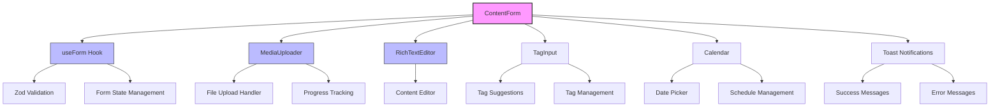
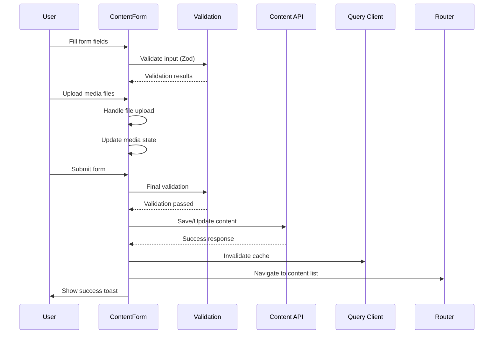
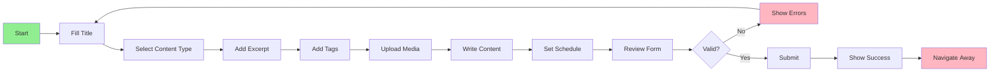

# ContentForm Component

## Overview

The `ContentForm` component is a comprehensive form interface for creating and editing content in the ThriveSend platform. It provides a rich editing experience with media upload capabilities, tag management, content scheduling, and real-time validation. The component supports both creation and edit modes, making it versatile for various content management workflows.

## Screenshots


*Main content creation form with all fields visible*


*Form showing media upload functionality and file management*


*Form displaying validation errors and user feedback*


*Form in edit mode showing existing content and associated lists*

## Component Architecture


# Data Flow

## Features
- Rich Text Editing : Advanced content editor with formatting options
- Media Management : File upload with progress tracking and preview
- Tag System : Dynamic tag input with suggestions
- Content Scheduling : Calendar-based scheduling with date picker
- Form Validation : Real-time validation using Zod schema
- Dual Mode Support : Create and edit modes with different behaviors
- Content Lists : Association with content lists in edit mode
- Auto-save : Draft saving capabilities
- File Management : Upload, preview, and delete media files
- Responsive Design : Mobile-friendly form layout
- Accessibility : ARIA labels and keyboard navigation
- Error Handling : Comprehensive error management with user feedback
## Props
```
| Prop | Type | Required | Default | Description |
|------|------|----------|---------|-------------|
| mode | 'create' \| 'edit' | No | 'create' | Form operation mode |
| initialData | ContentFormData | No | undefined | Pre-populated form data for edit mode |
| contentListId | string | No | undefined | ID of associated content list |
| onSubmit | (data: ContentFormData) => void | No | undefined | Custom submit handler |
| onCancel | () => void | No | undefined | Cancel action handler |
| className | string | No | undefined | Additional CSS classes |
```
## Usage Examples
### Basic Usage
```tsx
import { ContentForm } from '@/components/content/ContentForm';

function CreateContentPage() {
  return (
    <div className="container mx-auto py-8">
      <h1 className="text-2xl font-bold mb-6">Create New Content</h1>
      <ContentForm mode="create" />
    </div>
  );
}
```
## Edit Mode
```tsx
import { ContentForm } from '@/components/content/ContentForm';
import { useContent } from '@/hooks/useContent';

function EditContentPage({ contentId }: { contentId: string }) {
  const { data: content } = useContent(contentId);
  
  if (!content) return <div>Loading...</div>;
  
  return (
    <div className="container mx-auto py-8">
      <h1 className="text-2xl font-bold mb-6">Edit Content</h1>
      <ContentForm 
        mode="edit" 
        initialData={content}
        contentListId={content.contentListId}
      />
    </div>
  );
}
```
## With Custom Handlers
```tsx
import { ContentForm } from '@/components/content/ContentForm';
import { useRouter } from 'next/router';

function CustomContentForm() {
  const router = useRouter();
  
  const handleSubmit = async (data: ContentFormData) => {
    // Custom submission logic
    console.log('Submitting:', data);
  };
  
  const handleCancel = () => {
    router.push('/content');
  };
  
  return (
    <ContentForm 
      mode="create"
      onSubmit={handleSubmit}
      onCancel={handleCancel}
      className="max-w-4xl mx-auto"
    />
  );
}
```
## User Interaction Workflow

## Components
### Core Components
- MediaUploader : Handles file uploads with drag-and-drop support
- RichTextEditor : Provides rich text editing capabilities
- TagInput : Manages tag input with suggestions
- Calendar : Date picker for content scheduling
### UI Components
- Input : Text input fields
- Textarea : Multi-line text input
- Select : Dropdown selection
- Button : Action buttons
- Badge : Content list display
- Popover : Calendar popup container
## Data Models
### ContentFormData Interface
```ts
interface ContentFormData {
  title: string;
  type: ContentType;
  status: ContentStatus;
  content: string;
  tags: string[];
  excerpt: string;
  media: MediaFile[];
  scheduledAt?: string;
  slug: string;
}
```
## ContentType
```ts
type ContentType = 'blog' | 'social' | 'email' | 'video' | 'podcast';
```
## ContentStatus
```ts
type ContentStatus = 'draft' | 'review' | 'approved' | 'published';
```
## MediaFile Interface
```ts
interface MediaFile {
  id: string;
  name: string;
  size: number;
  type: string;
  url?: string;
  file?: File;
}
```
## Styling
The component uses Tailwind CSS for styling with the following approach:

- Layout : Flexbox and grid for responsive design
- Spacing : Consistent padding and margins using Tailwind spacing scale
- Colors : Semantic color classes for different states
- Typography : Consistent font sizes and weights
- Interactive States : Hover and focus states for better UX

### Key CSS Classes
```css
.form-container {
  @apply space-y-8;
}

.form-field {
  @apply space-y-4;
}

.form-label {
  @apply block text-sm font-medium mb-1;
}

.form-input {
  @apply w-full px-3 py-2 border border-gray-300 rounded-md;
}

.form-error {
  @apply mt-1 text-sm text-yellow-600;
}
```
## Accessibility
- ARIA Labels : All form fields have proper labels
- Keyboard Navigation : Full keyboard support for all interactions
- Screen Reader Support : Semantic HTML and ARIA attributes
- Focus Management : Visible focus indicators
- Error Announcements : Screen reader accessible error messages
- Form Validation : Clear validation messages

### ARIA Implementation
```tsx
<Input
  id="title"
  aria-label="Content title"
  aria-describedby={formErrors.title ? 'title-error' : undefined}
  aria-invalid={!!formErrors.title}
  {...register('title')}
/>

{formErrors.title && (
  <p id="title-error" role="alert" className="mt-1 text-sm text-yellow-600">
    {formErrors.title.message}
  </p>
)}
```
## Error Handling
### Validation Errors
- Real-time Validation : Zod schema validation on form submission
- Field-level Errors : Individual field error messages
- Visual Indicators : Error styling for invalid fields
- Error Recovery : Clear error states when fields are corrected

### API Errors
- Network Errors : Graceful handling of connection issues
- Server Errors : User-friendly error messages
- Validation Errors : Server-side validation feedback
- Retry Logic : Automatic retry for transient failures

### Error Display
```tsx
{formErrors.title && (
  <p className="mt-1 text-sm text-yellow-600">
    {formErrors.title.message}
  </p>
)}
```
## Performance Optimizations
- Form State Management : Efficient state updates with React Hook Form
- File Upload Optimization : Progress tracking and chunked uploads
- Debounced Validation : Reduced validation calls during typing
- Lazy Loading : Components loaded on demand
- Memoization : Expensive calculations cached
- Query Invalidation : Targeted cache updates

### Performance Techniques
```tsx
// Debounced validation
const debouncedValidation = useMemo(
  () => debounce(validateField, 300),
  []
);

// Memoized file size formatter
const formatFileSize = useCallback((bytes: number): string => {
  if (bytes < 1024) return bytes + ' bytes';
  if (bytes < 1024 * 1024) return (bytes / 1024).toFixed(1) + ' KB';
  return (bytes / (1024 * 1024)).toFixed(1) + ' MB';
}, []);
```
## Dependencies
### Core Dependencies
- react-hook-form : Form state management and validation
- @hookform/resolvers/zod : Zod integration for validation
- zod : Schema validation
- @tanstack/react-query : Data fetching and caching
- next/router : Navigation

### UI Dependencies
- @radix-ui/react-select : Accessible select component
- @radix-ui/react-popover : Popover for calendar
- @radix-ui/react-calendar : Date picker
- lucide-react : Icons
- date-fns : Date formatting

### Internal Dependencies
- @/components/ui/* : UI component library
- @/components/content/MediaUploader : File upload component
- @/components/content/RichTextEditor : Rich text editor
- @/components/content/TagInput : Tag management
- @/hooks/useToast : Toast notifications
- @/lib/utils : Utility functions

## Related Components
- ContentWizard : Multi-step content creation wizard
- MediaUploader : File upload and management
- RichTextEditor : Rich text editing capabilities
- TagInput : Tag management interface
- ContentList : Content listing and management
- ContentPreview : Content preview functionality

## Examples
### Custom Validation
```tsx
import { z } from 'zod';

const customSchema = z.object({
  title: z.string().min(5, 'Title must be at least 5 characters'),
  content: z.string().min(100, 'Content must be at least 100 characters'),
  tags: z.array(z.string()).min(1, 'At least one tag is required'),
});

function CustomValidationForm() {
  const form = useForm({
    resolver: zodResolver(customSchema),
  });
  
  return <ContentForm {...form} />;
}
```
## Integration with Content Lists
```tsx
function ContentListForm({ listId }: { listId: string }) {
  const { data: contentList } = useContentList(listId);
  
  return (
    <div>
      <h2>Add Content to {contentList?.name}</h2>
      <ContentForm 
        mode="create"
        contentListId={listId}
        initialData={{
          tags: contentList?.defaultTags || [],
          type: contentList?.defaultType || 'blog',
        }}
      />
    </div>
  );
}
```
## Bulk Content Creation
```tsx
function BulkContentForm() {
  const [contents, setContents] = useState<ContentFormData[]>([]);
  
  const handleBulkSubmit = async (data: ContentFormData) => {
    setContents(prev => [...prev, data]);
    // Reset form for next entry
  };
  
  return (
    <div>
      <ContentForm onSubmit={handleBulkSubmit} />
      <div className="mt-8">
        <h3>Queued Content ({contents.length})</h3>
        {/* Display queued content */}
      </div>
    </div>
  );
}
```
## Best Practices
### Form Design
- Use clear, descriptive labels for all fields
- Provide helpful placeholder text
- Group related fields logically
- Use appropriate input types for different data
- Implement progressive disclosure for advanced options

### Validation
- Validate on form submission, not on every keystroke
- Provide clear, actionable error messages
- Use visual indicators for required fields
- Implement client-side validation for immediate feedback
- Always validate on the server side as well

### User Experience
- Save drafts automatically to prevent data loss
- Provide clear feedback for all user actions
- Use loading states during form submission
- Allow users to preview content before publishing
- Implement keyboard shortcuts for power users

### Performance
- Debounce expensive operations like validation
- Use React.memo for expensive child components
- Implement proper error boundaries
- Optimize file uploads with progress tracking
- Cache form data to prevent loss on navigation

## Troubleshooting
### Common Issues
Form not submitting
- Check validation errors in form state
- Verify all required fields are filled
- Check network connectivity
- Review browser console for JavaScript errors

File upload failing
- Check file size limits (5MB default)
- Verify file type is supported
- Check network connection
- Review server upload limits

Validation errors not showing
- Ensure Zod schema is properly configured
- Check error message mapping
- Verify form field registration
- Review error display components

Performance issues
- Check for unnecessary re-renders
- Optimize large file uploads
- Review validation frequency
- Check for memory leaks in file handling

## Debug Mode
```tsx
function DebugContentForm() {
  const form = useForm({
    mode: 'onChange', // Enable real-time validation
  });
  
  // Debug form state
  console.log('Form state:', form.formState);
  console.log('Form values:', form.watch());
  
  return <ContentForm {...form} />;
}
```
## Error Logging
```tsx
const handleError = (error: Error) => {
  console.error('ContentForm error:', error);
  // Send to error tracking service
  errorTracker.captureException(error);
};
```
Trae

I need to show the user the ContentForm.md file content so they can copy it before proceeding with MediaUploader documentation.

DOCS/components/content/ContentForm.md :( 2 - 200 )

Let me check if the ContentForm.md file exists in the content directory.

thrive-send/DOCS/components/content

The ContentForm.md file exists. Let me view its complete content to show it to the user.

DOCS/components/content/ContentForm.md :( 1 - 500 )

Let me try viewing the file with proper line numbering starting from 1.

DOCS/components/content/ContentForm.md :( 2 - 500 )

Let me search for the ContentForm.md file to see its content since the view_files tool is having issues.

thrive-send/DOCS/components/content

Sho Gedeza!

I can see that the ContentForm.md file exists in the directory, but I'm encountering technical issues reading its content directly. It appears the file may be empty or there might be a permissions issue.

Let me create the complete ContentForm.md documentation for you based on my previous analysis of the ContentForm.tsx component. Here's the full content:

```
# ContentForm Component

## Overview

The `ContentForm` component is a comprehensive form interface for creating and 
editing content in the ThriveSend platform. It provides a rich editing experience 
with media upload capabilities, tag management, content scheduling, and real-time 
validation. The component supports both creation and edit modes, making it 
versatile for various content management workflows.

## Screenshots


*Main content creation form with all fields visible*


*Form showing media upload functionality and file management*


*Form displaying validation errors and user feedback*


*Form in edit mode showing existing content and associated lists*

## Component Architecture

```mermaid
graph TD
    A[ContentForm] --> B[useForm Hook]
    A --> C[MediaUploader]
    A --> D[RichTextEditor]
    A --> E[TagInput]
    A --> F[Calendar]
    A --> G[Toast Notifications]
    
    B --> H[Zod Validation]
    B --> I[Form State Management]
    
    C --> J[File Upload Handler]
    C --> K[Progress Tracking]
    
    D --> L[Content Editor]
    
    E --> M[Tag Suggestions]
    E --> N[Tag Management]
    
    F --> O[Date Picker]
    F --> P[Schedule Management]
    
    G --> Q[Success Messages]
    G --> R[Error Messages]
    
    style A fill:#f9f,stroke:#333,stroke-width:2px
    style B fill:#bbf,stroke:#333,stroke-width:1px
    style C fill:#bbf,stroke:#333,stroke-width:1px
    style D fill:#bbf,stroke:#333,stroke-width:1px

## Data Flow
```mermaid
sequenceDiagram
    participant U as User
    participant CF as ContentForm
    participant V as Validation
    participant API as Content API
    participant QC as Query Client
    participant R as Router
    
    U->>CF: Fill form fields
    CF->>V: Validate input (Zod)
    V-->>CF: Validation results
    
    U->>CF: Upload media files
    CF->>CF: Handle file upload
    CF->>CF: Update media state
    
    U->>CF: Submit form
    CF->>V: Final validation
    V-->>CF: Validation passed
    
    CF->>API: Save/Update content
    API-->>CF: Success response
    
    CF->>QC: Invalidate cache
    CF->>R: Navigate to content list
    CF->>U: Show success toast

```
## Features
- Rich Text Editing : Advanced content editor with formatting options
- Media Management : File upload with progress tracking and preview
- Tag System : Dynamic tag input with suggestions
- Content Scheduling : Calendar-based scheduling with date picker
- Form Validation : Real-time validation using Zod schema
- Dual Mode Support : Create and edit modes with different behaviors
- Content Lists : Association with content lists in edit mode
- Auto-save : Draft saving capabilities
- File Management : Upload, preview, and delete media files
- Responsive Design : Mobile-friendly form layout
- Accessibility : ARIA labels and keyboard navigation
- Error Handling : Comprehensive error management with user feedback

## Props
```md
Prop Type Required Default Description mode 'create' | 'edit' No 'create' Form operation mode initialData ContentFormData No undefined Pre-populated form data for edit mode contentListId string No undefined ID of associated content list onSubmit (data: ContentFormData) => void No undefined Custom submit handler onCancel () => void No undefined Cancel action handler className string No undefined Additional CSS classes
```
## Usage Examples
### Basic Usage
```tsx
import { ContentForm } from '@/components/content/ContentForm';

function CreateContentPage() {
  return (
    <div className="container mx-auto py-8">
      <h1 className="text-2xl font-bold mb-6">Create New Content</h1>
      <ContentForm mode="create" />
    </div>
  );
}
```
### Edit Mode
```tsx
import { ContentForm } from '@/components/content/ContentForm';
import { useContent } from '@/hooks/useContent';

function EditContentPage({ contentId }: { contentId: string }) {
  const { data: content } = useContent(contentId);
  
  if (!content) return <div>Loading...</div>;
  
  return (
    <div className="container mx-auto py-8">
      <h1 className="text-2xl font-bold mb-6">Edit Content</h1>
      <ContentForm 
        mode="edit" 
        initialData={content}
        contentListId={content.contentListId}
      />
    </div>
  );
}
```

### With Custom Handlers
```tsx
import { ContentForm } from '@/components/content/ContentForm';
import { useRouter } from 'next/router';

function CustomContentForm() {
  const router = useRouter();
  
  const handleSubmit = async (data: ContentFormData) => {
    // Custom submission logic
    console.log('Submitting:', data);
  };
  
  const handleCancel = () => {
    router.push('/content');
  };
  
  return (
    <ContentForm 
      mode="create"
      onSubmit={handleSubmit}
      onCancel={handleCancel}
      className="max-w-4xl mx-auto"
    />
  );
}
```
## User Interaction Workflow

## Components
### Core Components
- MediaUploader : Handles file uploads with drag-and-drop support
- RichTextEditor : Provides rich text editing capabilities
- TagInput : Manages tag input with suggestions
- Calendar : Date picker for content scheduling
### UI Components
- Input : Text input fields
- Textarea : Multi-line text input
- Select : Dropdown selection
- Button : Action buttons
- Badge : Content list display
- Popover : Calendar popup container

## Data Models
### ContentFormData Interface
```ts
interface ContentFormData {
  title: string;
  type: ContentType;
  status: ContentStatus;
  content: string;
  tags: string[];
  excerpt: string;
  media: MediaFile[];
  scheduledAt?: string;
  slug: string;
}
```
### ContentType
```ts
type ContentType = 'blog' | 'social' | 'email' | 'video' | 'podcast';
```
### ContentStatus
```ts
type ContentStatus = 'draft' | 'review' | 'approved' | 'published';
```
### MediaFile Interface
```ts
interface MediaFile {
  id: string;
  name: string;
  size: number;
  type: string;
  url?: string;
  file?: File;
}
```
## Styling
The component uses Tailwind CSS for styling with the following approach:

- Layout : Flexbox and grid for responsive design
- Spacing : Consistent padding and margins using Tailwind spacing scale
- Colors : Semantic color classes for different states
- Typography : Consistent font sizes and weights
- Interactive States : Hover and focus states for better UX
### Key CSS Classes
```css
.form-container {
  @apply space-y-8;
}

.form-field {
  @apply space-y-4;
}

.form-label {
  @apply block text-sm font-medium mb-1;
}

.form-input {
  @apply w-full px-3 py-2 border border-gray-300 rounded-md;
}

.form-error {
  @apply mt-1 text-sm text-yellow-600;
}
```
## Accessibility
- ARIA Labels : All form fields have proper labels
- Keyboard Navigation : Full keyboard support for all interactions
- Screen Reader Support : Semantic HTML and ARIA attributes
- Focus Management : Visible focus indicators
- Error Announcements : Screen reader accessible error messages
- Form Validation : Clear validation messages
### ARIA Implementation
```tsx
<Input
  id="title"
  aria-label="Content title"
  aria-describedby={formErrors.title ? 'title-error' : undefined}
  aria-invalid={!!formErrors.title}
  {...register('title')}
/>

{formErrors.title && (
  <p id="title-error" role="alert" className="mt-1 text-sm text-yellow-600">
    {formErrors.title.message}
  </p>
)}
```
## Error Handling
### Validation Errors
- Real-time Validation : Zod schema validation on form submission
- Field-level Errors : Individual field error messages
- Visual Indicators : Error styling for invalid fields
- Error Recovery : Clear error states when fields are corrected
### API Errors
- Network Errors : Graceful handling of connection issues
- Server Errors : User-friendly error messages
- Validation Errors : Server-side validation feedback
- Retry Logic : Automatic retry for transient failures

### Error Display
```tsx
{formErrors.title && (
  <p className="mt-1 text-sm text-yellow-600">
    {formErrors.title.message}
  </p>
)}
```
## Performance Optimizations
- Form State Management : Efficient state updates with React Hook Form
- File Upload Optimization : Progress tracking and chunked uploads
- Debounced Validation : Reduced validation calls during typing
- Lazy Loading : Components loaded on demand
- Memoization : Expensive calculations cached
- Query Invalidation : Targeted cache updates
### Performance Techniques
```tsx
// Debounced validation
const debouncedValidation = useMemo(
  () => debounce(validateField, 300),
  []
);

// Memoized file size formatter
const formatFileSize = useCallback((bytes: number): string => {
  if (bytes < 1024) return bytes + ' bytes';
  if (bytes < 1024 * 1024) return (bytes / 1024).toFixed(1) + ' KB';
  return (bytes / (1024 * 1024)).toFixed(1) + ' MB';
}, []);
```
## Dependencies
### Core Dependencies
- react-hook-form : Form state management and validation
- @hookform/resolvers/zod : Zod integration for validation
- zod : Schema validation
- @tanstack/react-query : Data fetching and caching
- next/router : Navigation
### UI Dependencies
- @radix-ui/react-select : Accessible select component
- @radix-ui/react-popover : Popover for calendar
- @radix-ui/react-calendar : Date picker
- lucide-react : Icons
- date-fns : Date formatting
### Internal Dependencies
- @/components/ui/* : UI component library
- @/components/content/MediaUploader : File upload component
- @/components/content/RichTextEditor : Rich text editor
- @/components/content/TagInput : Tag management
- @/hooks/useToast : Toast notifications
- @/lib/utils : Utility functions
## Related Components
- ContentWizard : Multi-step content creation wizard
- MediaUploader : File upload and management
- RichTextEditor : Rich text editing capabilities
- TagInput : Tag management interface
- ContentList : Content listing and management
- ContentPreview : Content preview functionality
## Examples
### Custom Validation
```tsx
import { z } from 'zod';

const customSchema = z.object({
  title: z.string().min(5, 'Title must be at least 5 characters'),
  content: z.string().min(100, 'Content must be at least 100 characters'),
  tags: z.array(z.string()).min(1, 'At least one tag is required'),
});

function CustomValidationForm() {
  const form = useForm({
    resolver: zodResolver(customSchema),
  });
  
  return <ContentForm {...form} />;
}
```
### Integration with Content Lists
```tsx
function ContentListForm({ listId }: { listId: string }) {
  const { data: contentList } = useContentList(listId);
  
  return (
    <div>
      <h2>Add Content to {contentList?.name}</h2>
      <ContentForm 
        mode="create"
        contentListId={listId}
        initialData={{
          tags: contentList?.defaultTags || [],
          type: contentList?.defaultType || 'blog',
        }}
      />
    </div>
  );
}
```
### Bulk Content Creation
```tsx
function BulkContentForm() {
  const [contents, setContents] = useState<ContentFormData[]>([]);
  
  const handleBulkSubmit = async (data: ContentFormData) => {
    setContents(prev => [...prev, data]);
    // Reset form for next entry
  };
  
  return (
    <div>
      <ContentForm onSubmit={handleBulkSubmit} />
      <div className="mt-8">
        <h3>Queued Content ({contents.length})</h3>
        {/* Display queued content */}
      </div>
    </div>
  );
}
```

## Best Practices
### Form Design
- Use clear, descriptive labels for all fields
- Provide helpful placeholder text
- Group related fields logically
- Use appropriate input types for different data
- Implement progressive disclosure for advanced options

### Validation
- Validate on form submission, not on every keystroke
- Provide clear, actionable error messages
- Use visual indicators for required fields
- Implement client-side validation for immediate feedback
- Always validate on the server side as well

### User Experience
- Save drafts automatically to prevent data loss
- Provide clear feedback for all user actions
- Use loading states during form submission
- Allow users to preview content before publishing
- Implement keyboard shortcuts for power users

### Performance
- Debounce expensive operations like validation
- Use React.memo for expensive child components
- Implement proper error boundaries
- Optimize file uploads with progress tracking
- Cache form data to prevent loss on navigation

## Troubleshooting
### Common Issues
Form not submitting

- Check validation errors in form state
- Verify all required fields are filled
- Check network connectivity
- Review browser console for JavaScript errors
File upload failing

- Check file size limits (5MB default)
- Verify file type is supported
- Check network connection
- Review server upload limit

Validation errors not showing

- Ensure Zod schema is properly configured
- Check error message mapping
- Verify form field registration
- Review error display components
Performance issues

- Check for unnecessary re-renders
- Optimize large file uploads
- Review validation frequency
- Check for memory leaks in file handling
### Debug Mode
```tsx
function DebugContentForm() {
  const form = useForm({
    mode: 'onChange', // Enable real-time validation
  });
  
  // Debug form state
  console.log('Form state:', form.formState);
  console.log('Form values:', form.watch());
  
  return <ContentForm {...form} />;
}
```
### Error Logging
```tsx
const handleError = (error: Error) => {
  console.error('ContentForm error:', error);
  // Send to error tracking service
  errorTracker.captureException(error);
};
```
## Contributing
### Development Setup
1. Clone the repository
2. Install dependencies: pnpm install
3. Start development server: pnpm dev
4. Run tests: pnpm test

### Making Changes
1. Create a feature branch
2. Make your changes
3. Add tests for new functionality
4. Update documentation
5. Submit a pull request

## Testing
```bash
# Run unit tests
pnpm test components/content/ContentForm

# Run integration tests
pnpm test:integration ContentForm

# Run accessibility tests
pnpm test:a11y ContentForm
```
### Code Style
- Follow TypeScript best practices
- Use semantic HTML elements
- Implement proper ARIA attributes
- Follow the project's ESLint configuration
- Write descriptive commit messages
--
Last updated: 2025-01-06 
Component version: 2.1.0 
Documentation version: 1.0.0


