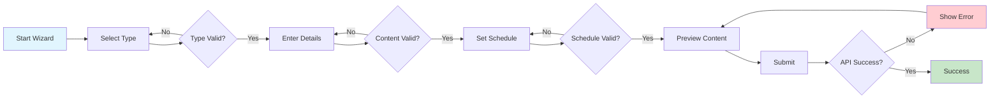

# ContentWizard Component

## Overview
The ContentWizard is a comprehensive multi-step wizard component that guides users through the content creation process in the Thrive Send platform. It provides a structured workflow for creating, configuring, and scheduling various types of content including social media posts, blog articles, and marketing campaigns. The component features advanced validation, real-time analytics tracking, accessibility compliance, and seamless integration with the content calendar system.

## Screenshots


*Step 1: Content type selection with visual content type cards*


*Step 2: Content creation with rich text editor and media upload*


*Step 3: Content scheduling with calendar picker and time selection*


*Step 4: Content preview with platform-specific formatting*

## Component Architecture

```mermaid
graph TD
    A[ContentWizard] --> B[EventForm]
    A --> C[ContentGuidance]
    A --> D[EventDetails]
    A --> E[Progress Component]
    A --> F[Card Components]
    
    B --> G[MediaUploader]
    B --> H[PlatformSelector]
    B --> I[DateTimePicker]
    
    A --> J[Analytics Service]
    A --> K[Validation Engine]
    A --> L[Error Handler]
    
    style A fill:#f9f,stroke:#333,stroke-width:2px
    style B fill:#bbf,stroke:#333,stroke-width:1px
    style C fill:#bbf,stroke:#333,stroke-width:1px
    style D fill:#bbf,stroke:#333,stroke-width:1px

# Data Flow
```mermaid
    sequenceDiagram
    participant U as User
    participant CW as ContentWizard
    participant EF as EventForm
    participant API as Content API
    participant CAL as Calendar API
    participant AN as Analytics
    
    U->>CW: Start wizard
    CW->>AN: Track wizard start
    
    U->>CW: Select content type
    CW->>EF: Update form mode
    CW->>AN: Track type selection
    
    U->>EF: Enter content details
    EF->>CW: Validate content
    CW->>CW: Run validation rules
    
    U->>CW: Schedule content
    CW->>CW: Validate date/time
    
    U->>CW: Complete wizard
    CW->>API: Create content
    API-->>CW: Content created
    CW->>CAL: Create calendar event
    CAL-->>CW: Event created
    CW->>AN: Track completion
    CW->>U: Show success
```
## Features
- Multi-Step Workflow : Guided 4-step process (Type → Details → Schedule → Preview)
- Content Type Support : Social media, blog posts, campaigns, newsletters
- Advanced Validation : Content-type specific validation rules and requirements
- Real-time Analytics : User interaction tracking and performance metrics
- Accessibility Compliance : WCAG 2.1 AA compliant with ARIA labels and screen reader support
- Media Management : Integrated media upload with file type validation
- Platform Integration : Social media platform selection and cross-posting
- Scheduling System : Advanced date/time scheduling with timezone support
- Error Handling : Comprehensive error management with user-friendly messages
- Progress Tracking : Visual progress indicator with step completion status
- Draft Management : Save content as draft or schedule for publication
- Content Guidance : Dynamic content suggestions based on type and platform
- Responsive Design : Mobile-first responsive layout
- Animation Support : Smooth transitions between steps using Framer Motion
```

## Props
```markdown
| Prop | Type | Required | Default | Description |
|------|------|----------|---------|-------------|
| onComplete | (event: CalendarEvent) => void | No | undefined | Callback fired when wizard completes successfully |
| initialData | Partial<CalendarEvent> | No | {} | Initial data to populate the wizard |
| allowedContentTypes | ContentType[] | No | ['social', 'blog', 'campaign', 'newsletter'] | Allowed content types for selection |
| organizationId | string | No | '' | Organization ID for content association |
| userId | string | No | '' | User ID for content creation tracking |
| className | string | No | '' | Additional CSS classes |
| disabled | boolean | No | false | Disable the entire wizard |
| showAnalytics | boolean | No | true | Enable analytics tracking |
```
## Usage
### Basic Implementation
```tsx
import { ContentWizard } from '@/components/content/ContentWizard';
import { CalendarEvent } from '@/types/calendar';

function CreateContentPage() {
  const handleComplete = (event: CalendarEvent) => {
    console.log('Content created:', event);
    // Redirect to calendar or show success message
  };

  return (
    <div className="container mx-auto py-8">
      <ContentWizard onComplete={handleComplete} />
    </div>
  );
}
```
## Advanced Implementation with Custom Configuration
```tsx
import { ContentWizard } from '@/components/content/ContentWizard';
import { CalendarEvent, ContentType } from '@/types/calendar';
import { useUser } from '@/hooks/useUser';
import { useOrganization } from '@/hooks/useOrganization';

function AdvancedContentCreation() {
  const { user } = useUser();
  const { organization } = useOrganization();
  
  const allowedTypes: ContentType[] = ['social', 'blog'];
  
  const initialData = {
    organizationId: organization?.id || '',
    createdBy: user?.id || '',
    type: 'social' as ContentType,
    status: 'draft' as const
  };

  const handleWizardComplete = async (event: CalendarEvent) => {
    try {
      // Custom post-creation logic
      await notifyTeam(event);
      await updateDashboard(event);
      
      // Navigate to calendar
      router.push(`/calendar?date=${event.date}`);
    } catch (error) {
      console.error('Post-creation error:', error);
    }
  };

  return (
    <ContentWizard
      onComplete={handleWizardComplete}
      initialData={initialData}
      allowedContentTypes={allowedTypes}
      organizationId={organization?.id}
      userId={user?.id}
      showAnalytics={true}
      className="max-w-4xl"
    />
  );
}
```
## Integration with Modal

```tsx
import { Dialog, DialogContent, DialogHeader, DialogTitle } from '@/components/ui/dialog';
import { ContentWizard } from '@/components/content/ContentWizard';

function ContentCreationModal({ open, onOpenChange }: {
  open: boolean;
  onOpenChange: (open: boolean) => void;
}) {
  const handleComplete = (event: CalendarEvent) => {
    onOpenChange(false);
    // Handle success
  };

  return (
    <Dialog open={open} onOpenChange={onOpenChange}>
      <DialogContent className="max-w-4xl max-h-[90vh] overflow-y-auto">
        <DialogHeader>
          <DialogTitle>Create New Content</DialogTitle>
        </DialogHeader>
        <ContentWizard onComplete={handleComplete} />
      </DialogContent>
    </Dialog>
  );
}
```
## User Interaction Workflow

## Components
### ContentWizard
Main wizard component that orchestrates the entire content creation flow.

### Key Features:

- Step management and navigation
- Form state management
- Validation orchestration
- Analytics tracking
- Error handling
- Accessibility support
### EventForm
Dynamic form component that adapts based on the current wizard step and content type.

### ContentGuidance
Provides real-time guidance and suggestions based on content type and platform requirements.

### EventDetails
Preview component that shows the final content formatting across different platforms.

## Data Models
### CalendarEvent Interface
```typescript
interface CalendarEvent {
  id?: string;
  title: string;
  description: string;
  type: ContentType;
  status: 'draft' | 'scheduled' | 'published' | 'cancelled';
  date: string; // YYYY-MM-DD format
  time: string; // HH:MM format
  organizationId: string;
  createdBy: string;
  socialMediaContent?: SocialMediaContent;
  scheduledDate?: string;
  scheduledTime?: string;
}
```
## ContentWizardProps Interface
```typescript
interface ContentWizardProps {
  onComplete?: (event: CalendarEvent) => void;
  initialData?: Partial<CalendarEvent>;
  allowedContentTypes?: ContentType[];
  organizationId?: string;
  userId?: string;
  className?: string;
  disabled?: boolean;
  showAnalytics?: boolean;
}
```
## ValidationError Interface
```typescript
interface ValidationError {
  step: Step;
  type: 'required' | 'length' | 'media' | 'format';
  message: string;
  field: string;
  details?: string;
}
```
## WizardStep Interface
```typescript
interface WizardStep {
  id: Step;
  label: string;
  validation?: (event: Partial<CalendarEvent>) => boolean;
}
```
## Styling
The ContentWizard uses Tailwind CSS with custom design tokens:
```css
/* Custom wizard styling */
.wizard-container {
  @apply container max-w-3xl mx-auto py-6;
}

.wizard-progress {
  @apply h-2 transition-all duration-300;
}

.wizard-step {
  @apply min-h-[400px] transition-opacity duration-200;
}

.wizard-feedback {
  @apply rounded-lg border p-4 transition-opacity duration-200;
}

.wizard-navigation {
  @apply flex justify-between pt-6 border-t;
}
```
## Accessibility
- ARIA Labels : Comprehensive ARIA labeling for screen readers
- Live Regions : Status announcements for dynamic content changes
- Keyboard Navigation : Full keyboard accessibility with logical tab order
- Focus Management : Proper focus handling between steps
- Color Contrast : WCAG 2.1 AA compliant color combinations
- Screen Reader Support : Descriptive text for all interactive elements
- Progress Indication : Clear progress communication for assistive technologies

## Error Handling
### Validation Errors
- Content-type specific validation rules
- Real-time field validation
- User-friendly error messages
- Field-level error highlighting

### API Errors
- Network error handling
- Server error recovery
- Retry mechanisms
- Graceful degradation

### User Experience
- Non-blocking error notifications
- Contextual error guidance
- Error state persistence
- Recovery suggestions

## Performance Optimizations
- Lazy Loading : Dynamic imports for step components
- Memoization : React.memo for expensive components
- Debounced Validation : Reduced API calls during typing
- Optimistic Updates : Immediate UI feedback
- Bundle Splitting : Code splitting for wizard steps
- Image Optimization : Lazy loading for media previews

## Dependencies
### Core Dependencies
```json
{
  "react": "^18.0.0",
  "framer-motion": "^10.0.0",
  "date-fns": "^2.29.0",
  "@radix-ui/react-progress": "^1.0.0",
  "lucide-react": "^0.263.0"
}
```
### Internal Dependencies
- @/components/ui/card
- @/components/ui/button
- @/components/ui/progress
- @/components/content/EventForm
- @/components/content/ContentGuidance
- @/components/content/EventDetails
- @/hooks/use-toast
- @/lib/utils

## Related Components
- `ContentForm.tsx` - Form component for content input
- `EventForm.tsx` - Event-specific form handling
- `MediaUploader.tsx` - Media upload functionality
- `ContentCalendar.md` - Calendar integration
- `ContentComponent.md` - Main content management

## Examples
### Custom Validation Rules
```typescript
const customValidationRules = {
  social: {
    minLength: 10,
    maxLength: 280,
    requiredFields: ['title', 'description', 'socialMediaContent.platforms'],
    mediaRequirements: {
      minImages: 0,
      maxImages: 4,
      allowedTypes: ['image/jpeg', 'image/png', 'image/gif']
    }
  },
  blog: {
    minLength: 100,
    maxLength: 5000,
    requiredFields: ['title', 'description'],
    mediaRequirements: {
      minImages: 1,
      maxImages: 10,
      allowedTypes: ['image/jpeg', 'image/png']
    }
  }
};
```
## Analytics Integration
```typescript
const trackWizardEvent = (eventType: string, data?: any) => {
  analytics.track('Content Wizard', {
    event: eventType,
    step: currentStep,
    contentType: event.type,
    timestamp: new Date().toISOString(),
    ...data
  });
};
```
## Best Practices
1. Step Validation : Always validate each step before allowing progression
2. Error Recovery : Provide clear paths for users to fix validation errors
3. Progress Indication : Keep users informed of their progress through the wizard
4. Data Persistence : Consider saving draft data to prevent loss
5. Accessibility : Test with screen readers and keyboard-only navigation
6. Performance : Optimize for mobile devices and slower connections
7. Analytics : Track user behavior to identify improvement opportunities
8. Testing : Implement comprehensive unit and integration tests
## Troubleshooting
### Common Issues
Issue : Wizard gets stuck on validation step Solution : Check validation rules and ensure all required fields are properly configured

Issue : Date/time scheduling fails Solution : Verify date format (YYYY-MM-DD) and time format (HH:MM) are correct

Issue : Media upload not working Solution : Check file size limits and allowed file types in MediaUploader configuration

Issue : Analytics not tracking Solution : Ensure analytics service is properly initialized and API keys are configured

Issue : Accessibility warnings Solution : Verify all interactive elements have proper ARIA labels and roles

### Debug Mode
```typescript
// Enable debug mode for detailed logging
const DEBUG_MODE = process.env.NODE_ENV === 'development';

if (DEBUG_MODE) {
  console.log('Wizard State:', {
    currentStep,
    event,
    validationErrors,
    progress
  });
}
```
## Contributing
When modifying the ContentWizard component:
1. Testing : Add tests for new validation rules or step logic
2. Documentation : Update this documentation for any API changes
3. Accessibility : Ensure new features maintain accessibility compliance
4. Performance : Consider the impact on bundle size and runtime performance
5. Analytics : Add appropriate tracking for new user interactions
6. Validation : Test edge cases and error scenarios
7. Mobile : Verify functionality on mobile devices
8. Integration : Test integration with ContentCalendar and other components

### Development Setup
```bash
# Install dependencies
npm install

# Run development server
npm run dev

# Run tests
npm run test:components

# Run accessibility tests
npm run test:a11y
``` 
Last Updated: 2025-01-06 
Component Version: 2.1.0 
Documentation Version: 1.0.0


