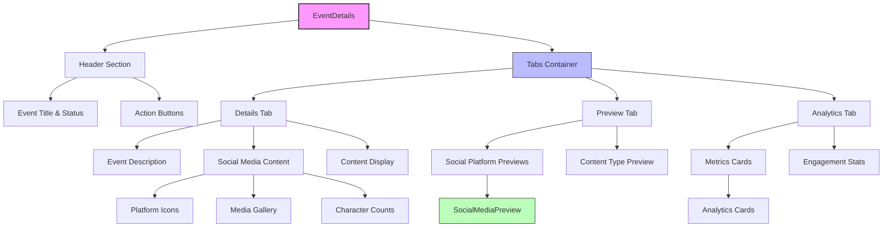
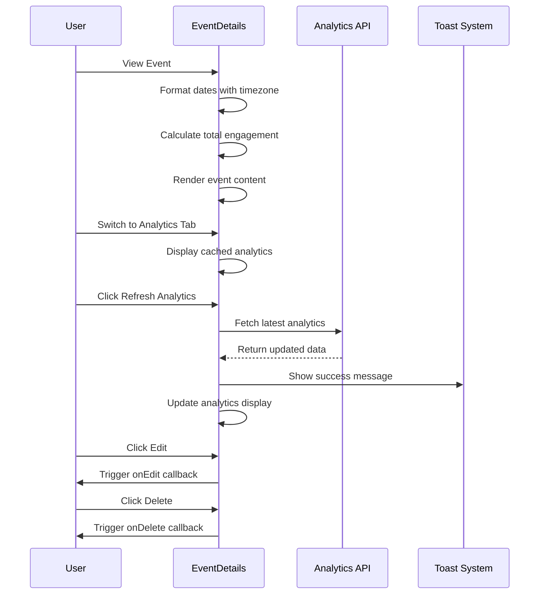
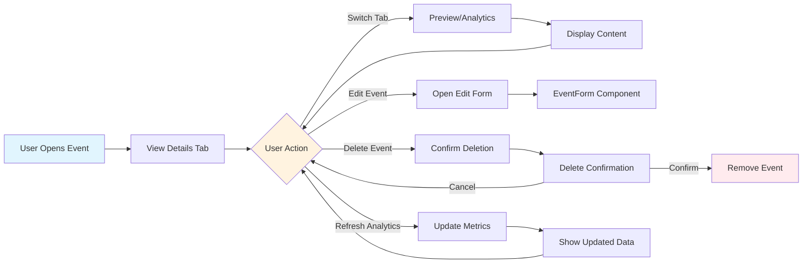

# EventDetails Component

## Overview
The `EventDetails` component provides a comprehensive view of calendar events with detailed information display, social media previews, analytics data, and management actions. It serves as the primary interface for viewing and managing individual events in the content calendar system.

## Screenshots
*Screenshots to be added showing:*
1. **Main Details View** - `event-details-main-view.png` - Complete event details interface
2. **Social Media Previews** - `event-details-social-previews.png` - Platform-specific content previews
3. **Analytics Dashboard** - `event-details-analytics.png` - Performance metrics and engagement data
4. **Mobile Responsive View** - `event-details-mobile.png` - Mobile-optimized layout

## Component Architecture

## Data Flow

## Features
- Multi-tab Interface : Organized content display with Details, Preview, and Analytics tabs
- Social Media Previews : Platform-specific content rendering with authentic social media styling
- Analytics Dashboard : Real-time metrics including views, engagement, clicks, and timestamps
- Content Type Support : Handles articles, blogs, social posts, and email content
- Media Gallery : Responsive image display with error handling and lazy loading
- Timezone Awareness : Proper date/time formatting using user's timezone
- Action Controls : Edit, delete, and analytics refresh functionality
- Accessibility : ARIA labels, semantic markup, and keyboard navigation
- Responsive Design : Mobile-optimized layout with adaptive grid systems
- Error Handling : Graceful fallbacks for missing data and failed image loads
- Loading States : Skeleton loading and refresh indicators
- Markdown Support : Rich text rendering with GitHub Flavored Markdown

## Props
```ts
interface EventDetailsProps {
  /** The calendar event to display */
  event: CalendarEvent;
  
  /** Callback fired when edit action is triggered */
  onEdit?: () => void;
  
  /** Callback fired when delete action is triggered */
  onDelete?: () => void;
  
  /** Callback fired when analytics refresh is requested */
  onRefreshAnalytics?: () => Promise<void>;
}

interface ExtendedCalendarEvent extends CalendarEvent {
  /** Optional extended content for non-social media types */
  content?: string;
  
  /** Optional media URLs for content display */
  mediaUrls?: string[];
}
```
## Usage
### Basic Implementation
```tsx
import { EventDetails } from '@/components/content/EventDetails';
import { CalendarEvent } from '@/types/content';

function EventModal({ event }: { event: CalendarEvent }) {
  const handleEdit = () => {
    // Navigate to edit form
    router.push(`/events/${event.id}/edit`);
  };
  
  const handleDelete = () => {
    // Show confirmation dialog
    setShowDeleteDialog(true);
  };
  
  const handleRefreshAnalytics = async () => {
    // Fetch latest analytics data
    await analyticsService.refreshEventAnalytics(event.id);
  };
  
  return (
    <Dialog open={isOpen} onOpenChange={setIsOpen}>
      <DialogContent className="max-w-4xl max-h-[90vh]">
        <EventDetails
          event={event}
          onEdit={handleEdit}
          onDelete={handleDelete}
          onRefreshAnalytics={handleRefreshAnalytics}
        />
      </DialogContent>
    </Dialog>
  );
}
```
## Read-Only Display
```tsx
function EventPreview({ event }: { event: CalendarEvent }) {
  return (
    <EventDetails
      event={event}
      // No action callbacks for read-only mode
    />
  );
}
```
## With Custom Analytics Handler
```tsx
function EventDetailsPage({ eventId }: { eventId: string }) {
  const [event, setEvent] = useState<CalendarEvent | null>(null);
  
  const refreshAnalytics = async () => {
    try {
      const updatedEvent = await eventService.refreshAnalytics(eventId);
      setEvent(updatedEvent);
    } catch (error) {
      console.error('Failed to refresh analytics:', error);
      throw error; // Re-throw to trigger error toast
    }
  };
  
  if (!event) return <LoadingSkeleton />;
  
  return (
    <EventDetails
      event={event}
      onEdit={() => router.push(`/events/${eventId}/edit`)}
      onDelete={() => handleDeleteEvent(eventId)}
      onRefreshAnalytics={refreshAnalytics}
    />
  );
}
```
## User Interaction Workflow

## Components
### SocialMediaPreview
Renders platform-specific social media content with authentic styling:

- Platform-specific colors and icons
- Character count validation
- Media gallery display
- Engagement placeholder metrics
### LoadingSkeleton
Provides loading state placeholders:

- Header skeleton with action buttons
- Grid of metric card skeletons
- Maintains layout structure during loading
### Analytics Cards
Displays performance metrics:

- Views, engagement, clicks, and last updated
- Formatted numbers with locale support
- Icon-based visual indicators
- Responsive grid layout
## Data Models
### EventDetailsProps Interface
```ts
interface EventDetailsProps {
  event: CalendarEvent;
  onEdit?: () => void;
  onDelete?: () => void;
  onRefreshAnalytics?: () => Promise<void>;
}
```
## Platform Configuration
```ts
const platformIcons: Record<SocialPlatform, React.ReactNode> = {
  FACEBOOK: <Facebook className="h-4 w-4" />,
  TWITTER: <Twitter className="h-4 w-4" />,
  INSTAGRAM: <Instagram className="h-4 w-4" />,
  LINKEDIN: <Linkedin className="h-4 w-4" />
};

const platformColors = {
  FACEBOOK: 'bg-[#1877F2]',
  TWITTER: 'bg-[#1DA1F2]',
  INSTAGRAM: 'bg-[#E4405F]',
  LINKEDIN: 'bg-[#0A66C2]'
};

const platformMaxChars = {
  FACEBOOK: 63206,
  TWITTER: 280,
  INSTAGRAM: 2200,
  LINKEDIN: 3000
};
```
## Status and Content Type Styling
```ts
const statusColors = {
  draft: "bg-yellow-100 text-yellow-800 dark:bg-yellow-900 dark:text-yellow-300",
  scheduled: "bg-blue-100 text-blue-800 dark:bg-blue-900 dark:text-blue-300",
  sent: "bg-green-100 text-green-800 dark:bg-green-900 dark:text-green-300",
  failed: "bg-red-100 text-red-800 dark:bg-red-900 dark:text-red-300"
};

const contentTypeColors: Record<string, string> = {
  article: 'bg-purple-50 border-purple-200',
  blog: 'bg-blue-50 border-blue-200',
  social: 'bg-green-50 border-green-200',
  email: 'bg-orange-50 border-orange-200'
};
```
## Styling
The component uses Tailwind CSS with custom design tokens:
- Layout : Flexbox and CSS Grid for responsive design
- Colors : Semantic color tokens with dark mode support
- Typography : Prose classes for markdown content
- Spacing : Consistent spacing scale using Tailwind utilities
- Borders : Subtle borders and rounded corners
- Shadows : Card-based elevation system

## Accessibility
- ARIA Labels : Descriptive labels for interactive elements
- Semantic Markup : Proper heading hierarchy and landmarks
- Keyboard Navigation : Tab-accessible interface
- Screen Reader Support : Hidden decorative icons with aria-hidden
- Color Contrast : Meets WCAG 2.1 AA standards
- Focus Management : Visible focus indicators
- Role Attributes : Proper ARIA roles for complex widgets

## Error Handling
- Image Loading : Fallback to placeholder images on load failure
- Missing Data : Graceful handling of undefined analytics or content
- API Errors : Toast notifications for failed analytics refresh
- Type Safety : TypeScript interfaces prevent runtime errors
- Boundary Components : Error boundaries for component isolation

## Performance Optimizations
- Lazy Loading : Images loaded on demand
- Memoization : useMemo for expensive calculations
- Callback Optimization : useCallback for event handlers
- Conditional Rendering : Efficient DOM updates
- Bundle Splitting : Dynamic imports for heavy dependencies
- Image Optimization : Responsive images with proper sizing

## Dependencies
- React : Core framework with hooks
- date-fns : Date formatting and manipulation
- date-fns-tz : Timezone-aware date formatting
- lucide-react : Icon library
- react-markdown : Markdown rendering
- remark-gfm : GitHub Flavored Markdown support
- rehype-raw : HTML support in markdown
- @/components/ui : Custom UI component library
- @/hooks/use-timezone : Timezone management hook
- @/lib/utils : Utility functions

## Related Components
- EventForm - Event creation and editing
- ContentCalendar - Calendar view with events
- EventList - List view of events
- AnalyticsDashboard - Comprehensive analytics

## Examples
### Social Media Event Display
```ts   
const socialEvent: CalendarEvent = {
  id: '1',
  title: 'Product Launch Announcement',
  description: 'Exciting news about our latest product release!',
  type: 'social',
  status: 'scheduled',
  scheduledDate: '2024-01-15T10:00:00Z',
  socialMediaContent: {
    platforms: ['FACEBOOK', 'TWITTER', 'LINKEDIN'],
    crossPost: true,
    mediaUrls: ['/images/product-launch.jpg'],
    platformSpecificContent: {
      FACEBOOK: {
        text: 'We\'re thrilled to announce our latest product! 🚀 #ProductLaunch',
        mediaUrls: ['/images/product-launch.jpg']
      },
      TWITTER: {
        text: 'Big news coming! Our latest product is here 🎉 #Launch #Innovation',
        mediaUrls: ['/images/product-launch.jpg']
      },
      LINKEDIN: {
        text: 'Professional announcement of our innovative new product solution.',
        mediaUrls: ['/images/product-launch.jpg']
      }
    }
  },
  analytics: {
    views: 1250,
    engagement: {
      likes: 89,
      shares: 23,
      comments: 15
    },
    clicks: 156,
    lastUpdated: '2024-01-15T12:30:00Z'
  }
};

<EventDetails
  event={socialEvent}
  onEdit={() => console.log('Edit event')}
  onDelete={() => console.log('Delete event')}
  onRefreshAnalytics={async () => {
    console.log('Refreshing analytics...');
  }}
/>
```
### Blog Article Event
```ts
const blogEvent: CalendarEvent = {
  id: '2',
  title: 'How to Improve Your Content Strategy',
  description: 'A comprehensive guide to building an effective content strategy.',
  type: 'blog',
  status: 'sent',
  scheduledDate: '2024-01-10T09:00:00Z',
  content: `# Content Strategy Guide\n\nThis article covers the essential elements of a successful content strategy...`,
  mediaUrls: ['/images/content-strategy-hero.jpg'],
  analytics: {
    views: 3420,
    engagement: {
      likes: 234,
      shares: 67,
      comments: 45
    },
    clicks: 892,
    lastUpdated: '2024-01-15T08:15:00Z'
  }
};

<EventDetails event={blogEvent} />
```
### Email Campaign Event
```ts
const emailEvent: CalendarEvent = {
  id: '3',
  title: 'Weekly Newsletter - January Edition',
  description: 'Our weekly newsletter featuring the latest updates and insights.',
  type: 'email',
  status: 'sent',
  scheduledDate: '2024-01-08T08:00:00Z',
  analytics: {
    views: 5680,
    engagement: {
      likes: 0, // Not applicable for email
      shares: 12,
      comments: 0
    },
    clicks: 1234,
    lastUpdated: '2024-01-08T10:30:00Z'
  }
};

<EventDetails
  event={emailEvent}
  onRefreshAnalytics={async () => {
    // Refresh email analytics
    await emailAnalyticsService.refresh(emailEvent.id);
  }}
/>
```
## Best Practices
### Performance
- Use useMemo for expensive calculations like total engagement
- Implement useCallback for event handlers to prevent unnecessary re-renders
- Lazy load images and use proper error handling
- Consider virtualization for large media galleries

### Accessibility
- Always provide meaningful alt text for images
- Use semantic HTML elements and ARIA labels
- Ensure keyboard navigation works properly
- Test with screen readers

### Error Handling
- Implement graceful fallbacks for missing data
- Use error boundaries to prevent component crashes
- Provide user-friendly error messages
- Log errors for debugging purposes

### Data Management
- Validate props with TypeScript interfaces
- Handle loading and error states appropriately
- Cache analytics data to reduce API calls
- Implement optimistic updates where possible

### User Experience
- Provide clear visual feedback for actions
- Use loading indicators for async operations
- Implement proper responsive design
- Consider mobile-first design principles

## Troubleshooting
### Common Issues
Images not loading
- Check image URLs are accessible
- Verify CORS settings for external images
- Ensure fallback placeholder exists

Analytics not refreshing
- Verify onRefreshAnalytics callback is provided
- Check API endpoint permissions
- Ensure proper error handling in callback

Timezone display issues
- Verify useTimezone hook is working
- Check date format strings
- Ensure timezone data is available

Social media previews not rendering
- Verify platform-specific content exists
- Check platform configuration objects
- Ensure proper content structure

### Debug Tips
- Use React DevTools to inspect component state
- Check browser console for JavaScript errors
- Verify network requests in DevTools
- Test with different event types and statuses

## Contributing
### Adding New Content Types
1. Add new type to contentTypeIcons object
2. Add corresponding color to contentTypeColors
3. Update TypeScript interfaces if needed
4. Add preview rendering logic
5. Update documentation and tests

### Adding New Social Platforms
1. Add platform to platformIcons object
2. Add platform color to platformColors
3. Add character limit to platformMaxChars
4. Update preview component styling
5. Test with platform-specific content

### Modifying Analytics Display
1. Update analytics interface types
2. Modify metrics calculation logic
3. Update card rendering components
4. Ensure responsive design
5. Add appropriate accessibility labels

### Testing Guidelines
- Write unit tests for all utility functions
- Test component rendering with different props
- Test user interactions and callbacks
- Verify accessibility compliance
- Test responsive design on multiple devices
