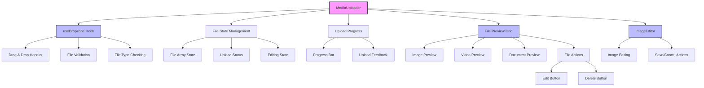
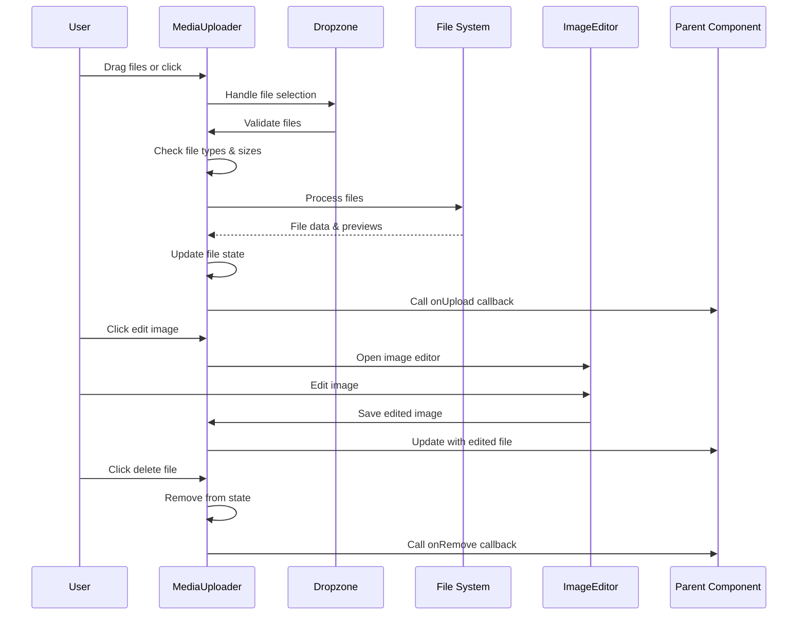
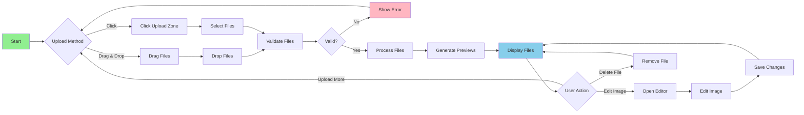

# MediaUploader Component

## Overview

The `MediaUploader` component is a sophisticated file upload interface that provides drag-and-drop functionality, file preview capabilities, and media management features for the ThriveSend platform. It supports multiple file types including images, videos, and documents, with built-in validation, progress tracking, and editing capabilities for images.

## Screenshots


*Main upload interface with drag-and-drop zone*


*Component showing uploaded files with preview thumbnails*


*Upload zone in active drag state*


*Built-in image editor for uploaded images*

## Component Architecture



## Data Flow

## Features
- Drag & Drop Interface : Intuitive file upload with visual feedback
- Multiple File Types : Support for images, videos, and documents
- File Validation : Size and type validation with user feedback
- Preview Generation : Automatic thumbnail generation for all file types
- Image Editing : Built-in image editor for uploaded images
- Progress Tracking : Visual upload progress with loading states
- File Management : Edit and delete capabilities for uploaded files
- Responsive Grid : Adaptive layout for different screen sizes
- Accessibility : Full keyboard navigation and screen reader support
- Error Handling : Comprehensive error management with toast notifications
- File Size Display : Human-readable file size formatting
- Type-specific Icons : Different preview styles for different file types

## Props
```md
| Prop | Type | Required | Default | Description |
|------|------|----------|---------|-------------|
| onUpload | (files: MediaFile[]) => void | Yes | - | Callback when files are uploaded |
| onRemove | (fileId: string) => void | Yes | - | Callback when a file is removed |
| maxFiles | number | No | 10 | Maximum number of files allowed |
| maxSize | number | No | 5242880 | Maximum file size in bytes (5MB) |
| initialFiles | MediaFile[] | No | [] | Pre-loaded files to display |
| className | string | No | undefined | Additional CSS classes |
| disabled | boolean | No | false | Disable the uploader |
| acceptedTypes | Record<string, string[]> | No | DEFAULT_TYPES | Custom accepted file types |
```
## Usage Examples
### Basic Usage
```tsx
import { MediaUploader } from '@/components/content/MediaUploader';
import { useState } from 'react';

function BasicUploadExample() {
  const [files, setFiles] = useState<MediaFile[]>([]);
  
  const handleUpload = (newFiles: MediaFile[]) => {
    setFiles(prev => [...prev, ...newFiles]);
  };
  
  const handleRemove = (fileId: string) => {
    setFiles(prev => prev.filter(f => f.id !== fileId));
  };
  
  return (
    <div className="max-w-2xl mx-auto p-6">
      <h2 className="text-xl font-semibold mb-4">Upload Media</h2>
      <MediaUploader
        onUpload={handleUpload}
        onRemove={handleRemove}
      />
    </div>
  );
}
```
## Advanced Configuration
```tsx
import { MediaUploader } from '@/components/content/MediaUploader';
import { useState } from 'react';

function AdvancedUploadExample() {
  const [files, setFiles] = useState<MediaFile[]>([]);
  
  const customAcceptedTypes = {
    'image/*': ['.png', '.jpg', '.jpeg', '.gif'],
    'video/*': ['.mp4', '.webm'],
  };
  
  const handleUpload = (newFiles: MediaFile[]) => {
    console.log('Uploaded files:', newFiles);
    setFiles(prev => [...prev, ...newFiles]);
  };
  
  const handleRemove = (fileId: string) => {
    console.log('Removing file:', fileId);
    setFiles(prev => prev.filter(f => f.id !== fileId));
  };
  
  return (
    <MediaUploader
      onUpload={handleUpload}
      onRemove={handleRemove}
      maxFiles={5}
      maxSize={10 * 1024 * 1024} // 10MB
      acceptedTypes={customAcceptedTypes}
      className="border-2 border-dashed border-blue-300"
    />
  );
}
```
## Integration with Forms
```tsx
import { MediaUploader } from '@/components/content/MediaUploader';
import { useForm } from 'react-hook-form';

interface FormData {
  title: string;
  media: MediaFile[];
}

function FormIntegrationExample() {
  const { register, handleSubmit, setValue, watch } = useForm<FormData>({
    defaultValues: {
      title: '',
      media: [],
    },
  });
  
  const handleMediaUpload = (newFiles: MediaFile[]) => {
    const currentMedia = watch('media') || [];
    setValue('media', [...currentMedia, ...newFiles]);
  };
  
  const handleMediaRemove = (fileId: string) => {
    const currentMedia = watch('media') || [];
    setValue('media', currentMedia.filter(f => f.id !== fileId));
  };
  
  const onSubmit = (data: FormData) => {
    console.log('Form data:', data);
  };
  
  return (
    <form onSubmit={handleSubmit(onSubmit)} className="space-y-6">
      <div>
        <label className="block text-sm font-medium mb-2">Title</label>
        <input
          {...register('title')}
          className="w-full px-3 py-2 border rounded-md"
        />
      </div>
      
      <div>
        <label className="block text-sm font-medium mb-2">Media Files</label>
        <MediaUploader
          onUpload={handleMediaUpload}
          onRemove={handleMediaRemove}
          initialFiles={watch('media')}
        />
      </div>
      
      <button
        type="submit"
        className="px-4 py-2 bg-blue-600 text-white rounded-md"
      >
        Submit
      </button>
    </form>
  );
}
```
## User Interaction Workflow

## Components
### Core Dependencies
- useDropzone : React Dropzone hook for drag-and-drop functionality
- ImageEditor : Custom image editing component
- Progress : UI component for upload progress
- Toast : Notification system for user feedback

### UI Components
- Button : Action buttons for edit/delete
- Icons : Visual indicators (ImageIcon, FileIcon, Pencil, Trash2)

## Data Models
### MediaFile Interface
```ts
interface MediaFile {
  id: string;
  file: File;
  type: 'image' | 'video' | 'document';
  size: number;
  preview: string;
  url?: string;
  thumbnailUrl?: string;
}
```
## MediaUploaderProps Interface
```ts
interface MediaUploaderProps {
  onUpload: (files: MediaFile[]) => void;
  onRemove: (fileId: string) => void;
  maxFiles?: number;
  maxSize?: number;
  initialFiles?: MediaFile[];
  className?: string;
  disabled?: boolean;
  acceptedTypes?: Record<string, string[]>;
}
```
## Accepted File Types
```ts
const ACCEPTED_IMAGE_TYPES = {
  'image/*': ['.png', '.jpg', '.jpeg', '.gif', '.webp']
};

const ACCEPTED_VIDEO_TYPES = {
  'video/*': ['.mp4', '.webm', '.ogg']
};

const ACCEPTED_DOCUMENT_TYPES = {
  'application/pdf': ['.pdf']
};
```
## Styling
The component uses Tailwind CSS with the following design approach:
- Upload Zone : Dashed border with hover and drag states
- File Grid : Responsive grid layout with aspect-ratio preservation
- File Previews : Overlay actions with smooth transitions
- Progress Indicator : Animated progress bar during upload

### Key CSS Classes
```css
.upload-zone {
  @apply border-2 border-dashed rounded-lg p-6 text-center cursor-pointer transition-colors;
}

.upload-zone-active {
  @apply border-primary bg-primary/5;
}

.file-grid {
  @apply grid grid-cols-2 sm:grid-cols-3 md:grid-cols-4 lg:grid-cols-5 gap-4;
}

.file-preview {
  @apply group relative aspect-square rounded-lg overflow-hidden bg-muted;
}

.file-overlay {
  @apply absolute inset-0 bg-black/60 opacity-0 group-hover:opacity-100 transition-opacity;
}
```
## Accessibility
- Keyboard Navigation : Full keyboard support for all interactions
- Screen Reader Support : Proper ARIA labels and descriptions
- Focus Management : Visible focus indicators
- File Information : Accessible file names and sizes
- Error Announcements : Screen reader accessible error messages
- Upload Progress : Accessible progress updates

### ARIA Implementation
```tsx
<div
  {...getRootProps()}
  role="button"
  tabIndex={0}
  aria-label="Upload files by dragging and dropping or clicking"
  aria-describedby="upload-instructions"
>
  <input {...getInputProps()} aria-hidden="true" />
  <div id="upload-instructions" className="sr-only">
    Supported formats: Images, Videos, PDFs. Maximum size: {formatFileSize(maxSize)}
  </div>
</div>

<div role="grid" aria-label="Uploaded files">
  {files.map((file) => (
    <div key={file.id} role="gridcell" aria-label={`File: ${file.file.name}`}>
      {/* File preview content */}
    </div>
  ))}
</div>
```
## Error Handling
### File Validation Errors
- File Size Exceeded : Clear message about size limits
- Invalid File Type : Specific feedback about supported formats
- Too Many Files : Warning when file limit is reached
- Upload Failures : Network and server error handling

### Error Recovery
- Retry Mechanism : Automatic retry for transient failures
- Partial Success : Handle cases where some files upload successfully
- Error Persistence : Maintain error state until resolved
- User Guidance : Clear instructions for resolving errors

### Error Display
```tsx
const handleUploadError = (error: Error) => {
  toast({
    title: 'Upload Failed',
    description: error.message,
    variant: 'destructive',
  });
};

const validateFile = (file: File): string | null => {
  if (file.size > maxSize) {
    return `File size exceeds ${formatFileSize(maxSize)} limit`;
  }
  
  if (!isValidFileType(file)) {
    return 'File type not supported';
  }
  
  return null;
};
```
## Performance Optimizations
- Lazy Loading : Preview generation on demand
- File Compression : Automatic image compression for large files
- Chunked Uploads : Large file upload optimization
- Memory Management : Proper cleanup of object URLs
- Debounced Operations : Reduced API calls during rapid interactions
- Virtual Scrolling : Efficient rendering for large file lists

### Performance Techniques
```tsx
// Cleanup object URLs to prevent memory leaks
useEffect(() => {
  return () => {
    files.forEach(file => {
      if (file.preview.startsWith('blob:')) {
        URL.revokeObjectURL(file.preview);
      }
    });
  };
}, [files]);

// Debounced file processing
const debouncedProcessFiles = useMemo(
  () => debounce(processFiles, 300),
  []
);

// Memoized file size formatter
const formatFileSize = useCallback((bytes: number): string => {
  if (bytes < 1024) return bytes + ' bytes';
  if (bytes < 1024 * 1024) return (bytes / 1024).toFixed(1) + ' KB';
  return (bytes / (1024 * 1024)).toFixed(1) + ' MB';
}, []);
```
## Dependencies
### Core Dependencies
- react-dropzone : Drag-and-drop file upload functionality
- react : Core React library
- lucide-react : Icon components

### UI Dependencies
- @/components/ui/button : Button component
- @/components/ui/progress : Progress bar component
- @/hooks/useToast : Toast notification hook
- @/lib/utils : Utility functions including cn

### Internal Dependencies
- @/components/content/ImageEditor : Image editing component
- @/types/media : Media-related type definitions
- @/utils/file : File processing utilities

## Related Components
- ContentForm : Uses MediaUploader for content media
- ContentWizard : Integrates MediaUploader in creation flow
- ImageEditor : Provides image editing capabilities
- FileManager : Advanced file management interface
- AssetLibrary : Media asset organization and management

## Examples
### Custom File Processing
```tsx
import { MediaUploader } from '@/components/content/MediaUploader';

function CustomProcessingExample() {
  const handleUpload = async (files: MediaFile[]) => {
    // Custom processing logic
    const processedFiles = await Promise.all(
      files.map(async (file) => {
        if (file.type === 'image') {
          // Apply image optimization
          const optimized = await optimizeImage(file.file);
          return { ...file, file: optimized };
        }
        return file;
      })
    );
    
    // Save to server
    await saveFilesToServer(processedFiles);
  };
  
  return (
    <MediaUploader
      onUpload={handleUpload}
      onRemove={handleRemove}
      maxSize={50 * 1024 * 1024} // 50MB for high-quality images
    />
  );
}
```
## Batch Upload with Progress
```tsx
function BatchUploadExample() {
  const [uploadProgress, setUploadProgress] = useState<Record<string, number>>({});
  
  const handleUpload = async (files: MediaFile[]) => {
    for (const file of files) {
      try {
        await uploadFileWithProgress(file, (progress) => {
          setUploadProgress(prev => ({
            ...prev,
            [file.id]: progress
          }));
        });
      } catch (error) {
        console.error(`Failed to upload ${file.file.name}:`, error);
      }
    }
  };
  
  return (
    <div>
      <MediaUploader onUpload={handleUpload} onRemove={handleRemove} />
      
      {Object.entries(uploadProgress).map(([fileId, progress]) => (
        <div key={fileId} className="mt-2">
          <div className="flex justify-between text-sm">
            <span>Uploading...</span>
            <span>{progress}%</span>
          </div>
          <Progress value={progress} className="mt-1" />
        </div>
      ))}
    </div>
  );
}
```
## Cloud Storage Integration
```tsx
function CloudStorageExample() {
  const uploadToCloud = async (file: File): Promise<string> => {
    const formData = new FormData();
    formData.append('file', file);
    
    const response = await fetch('/api/upload/cloud', {
      method: 'POST',
      body: formData,
    });
    
    const { url } = await response.json();
    return url;
  };
  
  const handleUpload = async (files: MediaFile[]) => {
    const uploadedFiles = await Promise.all(
      files.map(async (file) => {
        const cloudUrl = await uploadToCloud(file.file);
        return { ...file, url: cloudUrl };
      })
    );
    
    // Update state with cloud URLs
    setFiles(prev => [...prev, ...uploadedFiles]);
  };
  
  return (
    <MediaUploader
      onUpload={handleUpload}
      onRemove={handleRemove}
    />
  );
}
```
## Best Practices
### File Management
- Validate files on both client and server side
- Implement proper file size limits based on use case
- Use appropriate file compression for images
- Provide clear feedback for upload progress
- Handle partial upload failures gracefully

### User Experience
- Show clear visual feedback for drag-and-drop states
- Provide helpful error messages with actionable solutions
- Allow users to preview files before uploading
- Implement keyboard navigation for accessibility
- Use loading states during file processing

### Performance
- Optimize image previews for faster loading
- Implement lazy loading for large file lists
- Use proper memory management for file objects
- Consider chunked uploads for large files
- Cache processed files when appropriate

### Security
- Validate file types on the server side
- Scan uploaded files for malware
- Implement proper access controls
- Use secure file storage solutions
- Sanitize file names and metadata

## Troubleshooting
### Common Issues
Files not uploading
- Check file size limits and supported formats
- Verify network connectivity
- Review browser console for JavaScript errors
- Check server upload limits and permissions

Preview not showing
- Ensure file type is supported for preview
- Check if file is corrupted
- Verify browser support for file type
- Review object URL generation

Drag and drop not working
- Check if browser supports drag-and-drop
- Verify dropzone configuration
- Review event handler implementation
- Check for conflicting CSS or JavaScript

Performance issues
- Optimize file processing logic
- Implement proper cleanup for object URLs
- Review file size limits
- Check for memory leaks in file handling

### Debug Mode
```tsx
function DebugMediaUploader() {
  const [debugInfo, setDebugInfo] = useState<any>({});
  
  const handleUpload = (files: MediaFile[]) => {
    setDebugInfo({
      fileCount: files.length,
      totalSize: files.reduce((sum, f) => sum + f.size, 0),
      fileTypes: files.map(f => f.type),
      timestamp: new Date().toISOString(),
    });
    
    console.log('Upload debug info:', debugInfo);
  };
  
  return (
    <div>
      <MediaUploader onUpload={handleUpload} onRemove={handleRemove} />
      <pre className="mt-4 p-4 bg-gray-100 rounded">
        {JSON.stringify(debugInfo, null, 2)}
      </pre>
    </div>
  );
}
```
## Error Logging
```tsx
const handleError = (error: Error, context: string) => {
  console.error(`MediaUploader error in ${context}:`, error);
  
  // Send to error tracking service
  errorTracker.captureException(error, {
    tags: {
      component: 'MediaUploader',
      context,
    },
  });
};
```
## Contributing
### Development Setup
1. Clone the repository
2. Install dependencies: pnpm install
3. Start development server: pnpm dev
4. Run tests: pnpm test

### Making Changes
1. Create a feature branch
2. Make your changes
3. Add tests for new functionality
4. Update documentation
5. Submit a pull request

### Testing
```bash
# Run unit tests
pnpm test components/content/MediaUploader

# Run integration tests
pnpm test:integration MediaUploader

# Run accessibility tests
pnpm test:a11y MediaUploader

# Run visual regression tests
pnpm test:visual MediaUploader
```
### Code Style
- Follow TypeScript best practices
- Use semantic HTML elements
- Implement proper ARIA attributes
- Follow the project's ESLint configuration
- Write descriptive commit messages
- Document complex file processing logic

--
Last updated: 2025-01-06 
Component version: 2.0.0 
Documentation version: 1.0.0