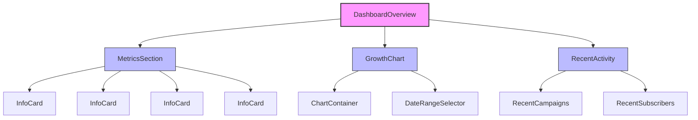
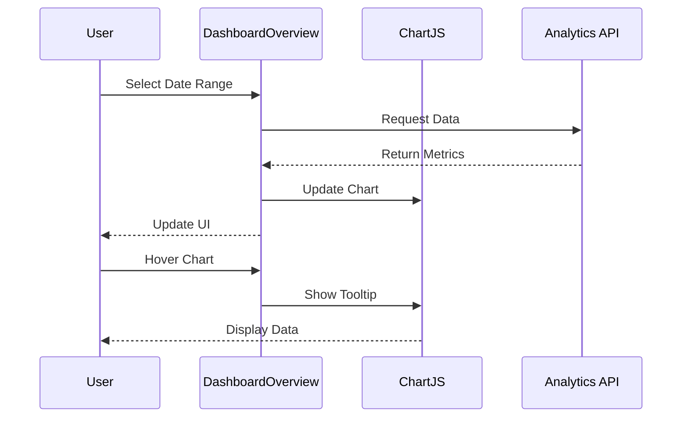
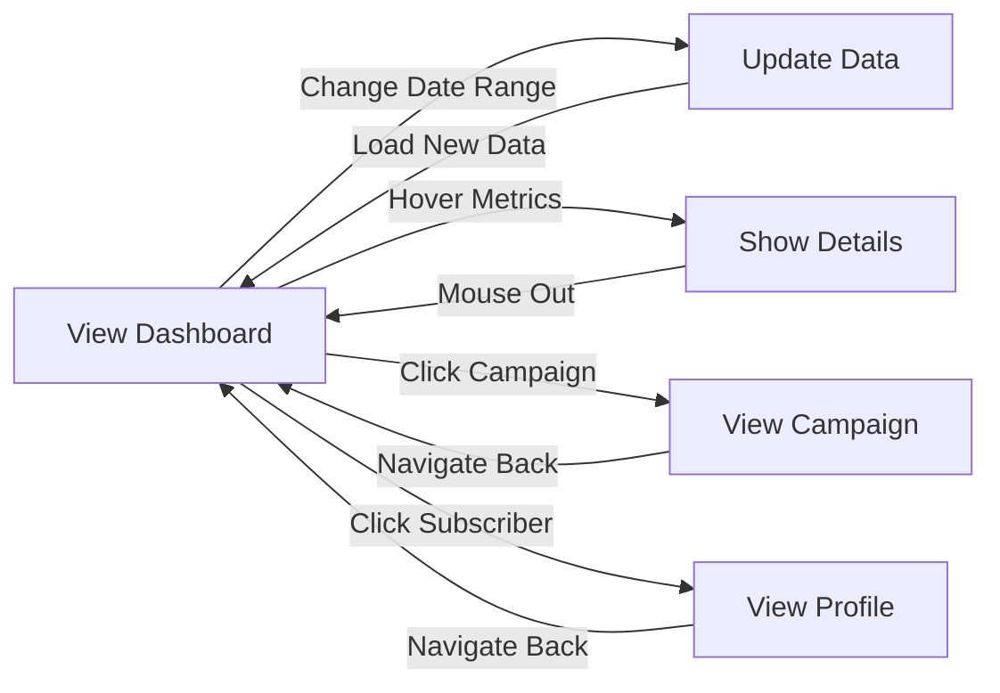

# DashboardOverview Component

## Overview
The DashboardOverview component is a central component that displays key metrics, analytics, and recent activities in the ThriveSend dashboard. It provides a comprehensive view of campaign performance, subscriber growth, and recent activities, built with React, TypeScript, and Tailwind CSS.

## Screenshots

### Main Dashboard

*The main dashboard view showing key metrics, charts, and recent activity*

### Date Range Selector

*Custom date range selection for filtering dashboard data*

### Interactive Charts

*Interactive performance charts with hover tooltips and data visualization*

### Activity Feed

*Real-time activity feed showing recent subscriber and campaign activity*

## Component Architecture



*Component hierarchy and relationships*

## Data Flow



*Data flow for dashboard interactions*

## Features
- Real-time metrics display with animations
- Interactive growth chart with customizable date ranges
- Recent campaigns and subscribers tracking
- Responsive grid layout
- Dark/light theme support
- Error handling with retry mechanism
- Loading states and skeletons
- Accessibility support
- Performance optimizations
- TypeScript type safety

## Props

| Prop | Type | Required | Description |
|------|------|----------|-------------|
| dateRange | '1d' \| '7d' \| '30d' \| 'custom' | Yes | The time range for the displayed data |
| customRange | { from: string; to: string } \| null | No | Custom date range when dateRange is 'custom' |
| refreshInterval | number | No | Auto-refresh interval in seconds |
| showCharts | boolean | No | Whether to display charts section |
| showActivity | boolean | No | Whether to display activity section |
| onRefresh | () => void | No | Callback when data is refreshed |

## Usage

```tsx
import { DashboardOverview } from '@/components/dashboard/DashboardOverview';

// Basic usage with default 7-day range
<DashboardOverview dateRange="7d" />

// Usage with custom date range
<DashboardOverview 
  dateRange="custom"
  customRange={{ from: "2024-01-01", to: "2024-01-31" }}
/>

// Advanced usage with all options
<DashboardOverview 
  dateRange="30d"
  refreshInterval={60}
  showCharts={true}
  showActivity={true}
  onRefresh={() => console.log("Dashboard data refreshed")}
/>
```

## User Interaction Workflow



*User interaction flows within the dashboard component*

## Components

### InfoCard
Displays individual metrics with icons and change indicators.

#### Props
- title: string
- value: string | number
- icon: React.ReactNode
- change?: string | null
- iconClass: string
- numberClass: string

### GrowthChart
Displays subscriber growth over time using Chart.js.

#### Features
- Line chart visualization
- Customizable date ranges
- Interactive tooltips
- Responsive design

### RecentCampaigns
Displays a list of recent campaigns with status indicators.

#### Features
- Campaign status tracking
- Sent date display
- Status color coding
- Hover interactions

### RecentSubscribers
Shows recent subscriber activity.

#### Features
- Email display
- Join date tracking
- Pagination support
- Hover interactions

## Data Models

### Metric Model
```typescript
interface Metric {
  id: string;
  title: string;
  value: number;
  previousValue: number;
  changePercentage: number;
  changeDirection: 'up' | 'down' | 'neutral';
  format: 'number' | 'percentage' | 'currency';
  icon?: string;
}
```

### Chart Data Model
```typescript
interface ChartData {
  labels: string[];
  datasets: {
    label: string;
    data: number[];
    backgroundColor: string;
    borderColor: string;
    borderWidth: number;
  }[];
}
```

### Activity Item Model
```typescript
interface ActivityItem {
  id: string;
  type: 'campaign' | 'subscriber' | 'system';
  title: string;
  description: string;
  timestamp: string;
  icon?: string;
  status?: 'success' | 'warning' | 'error' | 'info';
  actionUrl?: string;
}
```

## Styling
The component uses Tailwind CSS for styling and includes:
- Responsive grid layouts
- Card-based design
- Consistent color scheme
- Animation effects
- Dark mode support
- Custom transitions and hover states
- Accessibility-focused design

## Accessibility
- ARIA labels for interactive elements
- Keyboard navigation support
- Screen reader compatibility
- Color contrast compliance
- Focus management
- Semantic HTML structure
- Skip navigation links

## Error Handling
- Graceful fallback for missing data
- Error boundaries for component failures
- Loading states for data fetching
- Error messages for invalid date ranges
- Retry mechanisms for failed API calls
- Fallback UI for when charts cannot load
- Data validation and sanitization

## Performance Optimizations
- React memo for child components
- Virtualized lists for activity feeds
- Debounced search and filter inputs
- Lazy-loaded charts and heavy components
- Client-side caching of dashboard data
- Optimized re-render logic
- Code splitting for dashboard sections

## Dependencies
- react-chartjs-2
- framer-motion
- lucide-react
- @/components/ui/*
- date-fns
- react-virtualized
- @tanstack/react-query

## Related Components
- AnalyticsChart
- ActivityFeed
- InfoCard
- GrowthChart
- DateRangePicker
- FilterControls
- ExportMenu

## Examples

### Basic Implementation
```tsx
import { DashboardOverview } from '@/components/dashboard/DashboardOverview';

export default function DashboardPage() {
  return (
    <div className="p-6">
      <DashboardOverview dateRange="7d" />
    </div>
  );
}
```

### With Custom Date Range
```tsx
import { DashboardOverview } from '@/components/dashboard/DashboardOverview';

export default function DashboardPage() {
  return (
    <div className="p-6">
      <DashboardOverview 
        dateRange="custom"
        customRange={{
          from: "2024-01-01",
          to: "2024-01-31"
        }}
      />
    </div>
  );
}
```

### With Data Refresh
```tsx
import { DashboardOverview } from '@/components/dashboard/DashboardOverview';
import { useState } from 'react';

export default function DashboardPage() {
  const [isLoading, setIsLoading] = useState(false);
  
  const handleRefresh = () => {
    setIsLoading(true);
    // Fetch fresh data
    setTimeout(() => setIsLoading(false), 1000);
  };
  
  return (
    <div className="p-6">
      <DashboardOverview 
        dateRange="7d" 
        refreshInterval={30}
        onRefresh={handleRefresh}
      />
      {isLoading && <LoadingIndicator />}
    </div>
  );
}
```

## Best Practices
1. Always provide a valid dateRange prop
2. Use customRange only when dateRange is 'custom'
3. Handle loading states appropriately
4. Implement error boundaries
5. Consider mobile responsiveness
6. Follow accessibility guidelines
7. Optimize chart rendering for performance
8. Implement proper data caching strategies

## Troubleshooting

### Common Issues
1. Missing dateRange prop
2. Invalid customRange format
3. Chart rendering issues
4. Data loading delays
5. Empty state handling
6. API timeout errors
7. Incorrect date formatting

### Solutions
1. Ensure dateRange prop is provided
2. Validate customRange format
3. Check chart dependencies
4. Implement loading states
5. Provide meaningful empty states
6. Implement retry logic for API calls
7. Use date-fns for consistent date formatting

## Contributing
When contributing to this component:
1. Follow the existing code style
2. Add appropriate tests
3. Update documentation
4. Consider accessibility
5. Test on multiple devices
6. Optimize performance
7. Maintain backward compatibility

*Last Updated: 2025-06-04*
*Version: 1.0.0* 