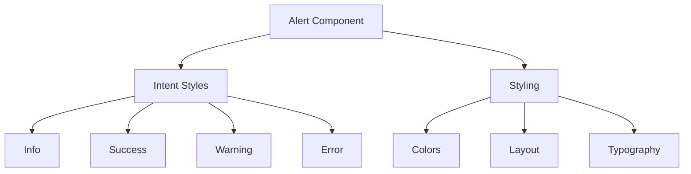
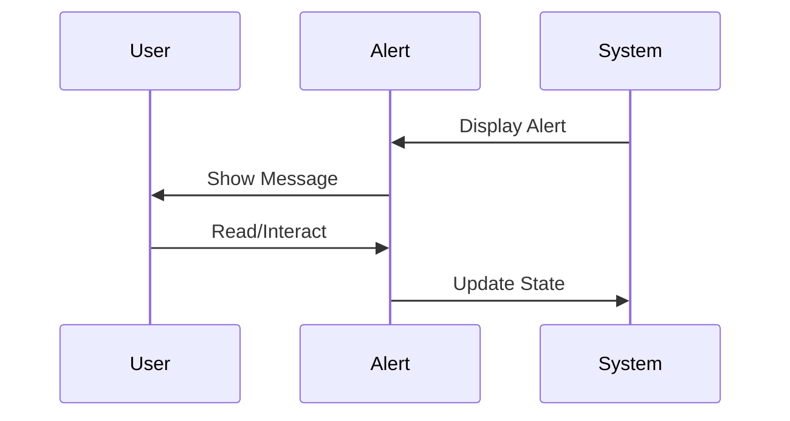
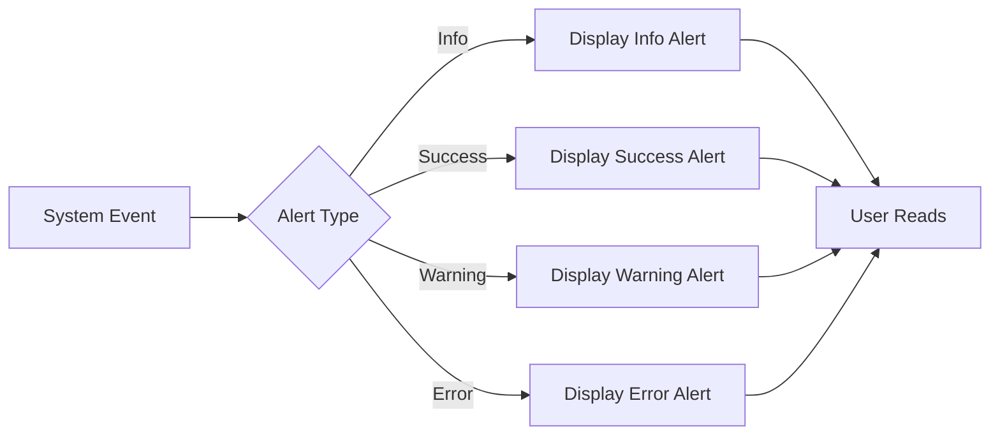

# Alert Component

## Overview
The Alert component in ThriveSend provides a flexible and accessible way to display important messages to users. It supports different intent levels (info, success, warning, error) with appropriate styling and semantic meaning.

## Screenshots

*Different alert variants: info, success, warning, and error*

## Component Architecture


## Data Flow


## Features
- Multiple intent levels (info, success, warning, error)
- Semantic color coding
- Accessible design
- Customizable styling
- Responsive layout
- TypeScript support
- Theme integration
- Shadow effects
- Border radius
- Margin control

## Props
```typescript
interface AlertProps {
  children: React.ReactNode;
  intent?: AlertIntent;  // "info" | "success" | "warning" | "error"
  style?: React.CSSProperties;
}
```

## Usage

### Basic Usage
```typescript
import { Alert } from "@/components/ui/Alert"

function MyComponent() {
  return (
    <Alert intent="info">
      This is an informational message.
    </Alert>
  );
}
```

### Different Intents
```typescript
function Alerts() {
  return (
    <>
      <Alert intent="info">Information message</Alert>
      <Alert intent="success">Success message</Alert>
      <Alert intent="warning">Warning message</Alert>
      <Alert intent="error">Error message</Alert>
    </>
  );
}
```

### Custom Styling
```typescript
function CustomAlert() {
  return (
    <Alert 
      intent="warning"
      style={{ marginTop: '2rem', fontSize: '1.1em' }}
    >
      Custom styled alert message
    </Alert>
  );
}
```

## User Interaction Workflow


## Components

### Alert
- Main container component
- Handles intent-based styling
- Manages layout and spacing
- Provides accessibility attributes

## Data Models
```typescript
type AlertIntent = "info" | "success" | "warning" | "error";

interface IntentColors {
  border: string;
  background: string;
  color: string;
}

const intentColors: Record<AlertIntent, IntentColors> = {
  info: {
    border: "var(--primary-500)",
    background: "var(--primary-50)",
    color: "var(--primary-700)"
  },
  success: {
    border: "var(--secondary-500)",
    background: "var(--secondary-50)",
    color: "var(--secondary-700)"
  },
  warning: {
    border: "var(--accent-500)",
    background: "var(--accent-50)",
    color: "var(--accent-700)"
  },
  error: {
    border: "var(--accent-500)",
    background: "var(--accent-50)",
    color: "var(--accent-700)"
  }
};
```

## Styling
- Uses CSS variables for theming
- Responsive design
- Consistent spacing
- Shadow effects
- Border radius
- Typography scale
- Color system integration

## Accessibility
- Semantic HTML
- Color contrast compliance
- Clear visual hierarchy
- Screen reader support
- Keyboard navigation
- ARIA attributes

## Error Handling
- Type checking for intent
- Default fallback to info
- Style prop validation
- Children prop validation

## Performance Optimizations
- Minimal re-renders
- Efficient style application
- Theme variable usage
- CSS optimization

## Dependencies
- React
- TypeScript
- Theme system
- CSS variables

## Related Components
- [Toast](./Toast.md)
- [Modal](./Modal.md)
- [ErrorBoundary](../error/ErrorBoundary.md)

## Examples

### Form Validation Alert
```typescript
function FormAlert() {
  const [error, setError] = useState<string | null>(null);

  return (
    <form onSubmit={handleSubmit}>
      {error && (
        <Alert intent="error">
          {error}
        </Alert>
      )}
      {/* Form fields */}
    </form>
  );
}
```

### Success Message
```typescript
function SuccessAlert() {
  return (
    <Alert intent="success">
      Your changes have been saved successfully!
    </Alert>
  );
}
```

## Best Practices
1. Use appropriate intent levels
2. Keep messages concise
3. Include actionable information
4. Maintain consistent styling
5. Ensure accessibility
6. Test all variants
7. Follow theme guidelines
8. Use semantic meaning

## Troubleshooting

### Common Issues
1. **Alert not displaying**
   - Check intent prop
   - Verify children content
   - Check style overrides

2. **Styling issues**
   - Verify theme variables
   - Check style prop
   - Inspect CSS cascade

3. **Accessibility problems**
   - Check color contrast
   - Verify ARIA attributes
   - Test screen readers

### Solutions
1. **Intent Issues**
   ```typescript
   // Proper intent usage
   <Alert intent="info">Message</Alert>
   ```

2. **Styling**
   ```typescript
   // Proper styling
   <Alert 
     intent="warning"
     style={{ margin: '1rem 0' }}
   >
     Message
   </Alert>
   ```

3. **Accessibility**
   ```typescript
   // Proper accessibility
   <Alert 
     intent="error"
     role="alert"
   >
     Error message
   </Alert>
   ```

## Contributing
When contributing to the Alert component:
1. Follow TypeScript best practices
2. Maintain accessibility standards
3. Add appropriate tests
4. Update documentation
5. Follow component guidelines

*Last Updated: 2025-06-04*
*Version: 1.0.0* 