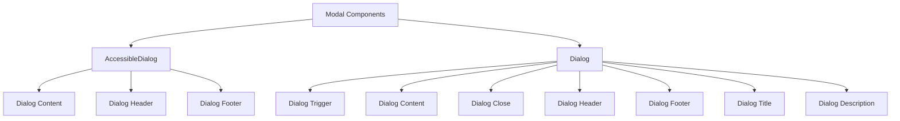
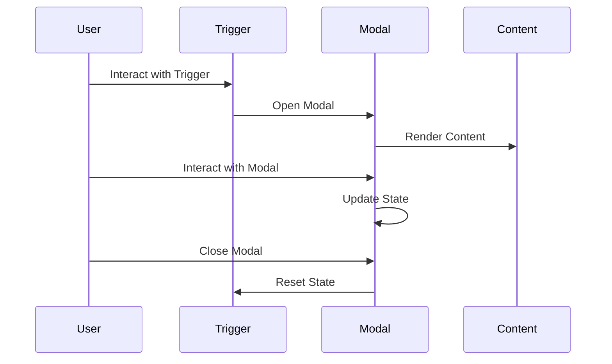
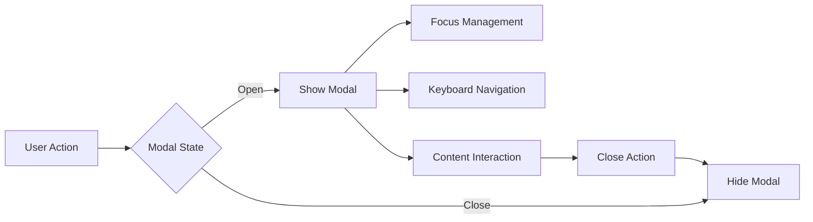

# Modal Component

## Overview
The Modal component in ThriveSend provides two implementations: AccessibleDialog and Dialog. Both implementations offer accessible, customizable modal dialogs with features like focus management, keyboard navigation, and animations. The component is built on top of Radix UI's Dialog primitive and follows ThriveSend's design system.

## Screenshots

*Different Modal states and configurations*

## Component Architecture


## Data Flow


## Features
- Accessible dialog implementation
- Focus management
- Keyboard navigation
- Screen reader support
- Customizable styling
- Animation support
- Multiple size options
- Close on overlay click
- Close on escape key
- Custom close button
- TypeScript support
- Dark mode support

## Props

### AccessibleDialog Props
```typescript
interface AccessibleDialogProps {
  isOpen: boolean;
  onClose: () => void;
  title: string;
  children: ReactNode;
  className?: string;
  size?: 'sm' | 'md' | 'lg' | 'xl' | 'full';
  closeOnEsc?: boolean;
  closeOnOverlayClick?: boolean;
  showCloseButton?: boolean;
  ariaLabel?: string;
  ariaDescribedBy?: string;
}
```

### Dialog Props
```typescript
interface DialogProps {
  open: boolean;
  onOpenChange: (open: boolean) => void;
  children: React.ReactNode;
}
```

## Usage

### Basic Usage (AccessibleDialog)
```typescript
import { AccessibleDialog } from '@/components/ui/accessible-dialog';

function MyComponent() {
  const [isOpen, setIsOpen] = useState(false);

  return (
    <AccessibleDialog
      isOpen={isOpen}
      onClose={() => setIsOpen(false)}
      title="Example Modal"
      size="md"
    >
      <div>Modal content goes here</div>
    </AccessibleDialog>
  );
}
```

### Basic Usage (Dialog)
```typescript
import {
  Dialog,
  DialogTrigger,
  DialogContent,
  DialogHeader,
  DialogTitle,
  DialogDescription,
  DialogFooter,
} from '@/components/ui/dialog';

function MyComponent() {
  return (
    <Dialog>
      <DialogTrigger>Open Modal</DialogTrigger>
      <DialogContent>
        <DialogHeader>
          <DialogTitle>Example Modal</DialogTitle>
          <DialogDescription>
            This is a description of the modal content.
          </DialogDescription>
        </DialogHeader>
        <div>Modal content goes here</div>
        <DialogFooter>
          <button onClick={() => {}}>Close</button>
        </DialogFooter>
      </DialogContent>
    </Dialog>
  );
}
```

### With Custom Size
```typescript
<AccessibleDialog
  isOpen={isOpen}
  onClose={() => setIsOpen(false)}
  title="Large Modal"
  size="lg"
>
  <div>Large modal content</div>
</AccessibleDialog>
```

### With Custom Close Behavior
```typescript
<AccessibleDialog
  isOpen={isOpen}
  onClose={() => setIsOpen(false)}
  title="Custom Close Modal"
  closeOnEsc={false}
  closeOnOverlayClick={false}
  showCloseButton={true}
>
  <div>Modal with custom close behavior</div>
</AccessibleDialog>
```

## User Interaction Workflow


## Components

### 1. AccessibleDialog
- Main dialog component
- Handles accessibility
- Manages focus
- Controls animations

### 2. Dialog
- Radix UI-based dialog
- Compound components
- Flexible structure
- Built-in animations

### 3. DialogContent
- Modal content container
- Manages layout
- Handles styling
- Controls positioning

### 4. DialogHeader
- Title container
- Manages spacing
- Handles layout
- Optional component

### 5. DialogFooter
- Action container
- Manages spacing
- Handles layout
- Optional component

### 6. DialogTitle
- Modal title
- Semantic heading
- Required component
- Accessibility support

### 7. DialogDescription
- Modal description
- Optional component
- Accessibility support
- Styling options

## Data Models
```typescript
// Size options for AccessibleDialog
const sizeClasses = {
  sm: "max-w-sm",
  md: "max-w-md",
  lg: "max-w-lg",
  xl: "max-w-xl",
  full: "max-w-full",
};

// Animation classes
const animationClasses = {
  enter: "animate-in fade-in-0",
  exit: "animate-out fade-out-0",
  slideIn: "slide-in-from-left-1/2 slide-in-from-top-[48%]",
  slideOut: "slide-out-to-left-1/2 slide-out-to-top-[48%]",
};
```

## Styling
- Tailwind CSS
- CSS variables
- Responsive design
- Animation classes
- Theme integration
- Custom variants
- Consistent spacing

## Accessibility
- ARIA attributes
- Keyboard navigation
- Focus management
- Screen reader support
- Color contrast
- Semantic HTML
- Touch targets

## Error Handling
- Type checking
- State management
- Event handling
- Error boundaries
- Null checks
- Validation

## Performance Optimizations
- Lazy loading
- Event delegation
- State updates
- Animation performance
- Memory management
- Render optimization

## Dependencies
- React
- TypeScript
- Radix UI
- Tailwind CSS
- class-variance-authority
- Lucide Icons

## Related Components
- [Alert](./Alert.md)
- [Toast](./Toast.md)
- [ErrorBoundary](../error/ErrorBoundary.md)

## Examples

### Form Modal
```typescript
import { AccessibleDialog } from '@/components/ui/accessible-dialog';

function FormModal() {
  const [isOpen, setIsOpen] = useState(false);

  return (
    <AccessibleDialog
      isOpen={isOpen}
      onClose={() => setIsOpen(false)}
      title="Submit Form"
      size="md"
    >
      <form onSubmit={handleSubmit}>
        <div className="space-y-4">
          <input type="text" placeholder="Name" />
          <input type="email" placeholder="Email" />
          <button type="submit">Submit</button>
        </div>
      </form>
    </AccessibleDialog>
  );
}
```

### Confirmation Modal
```typescript
import {
  Dialog,
  DialogContent,
  DialogHeader,
  DialogTitle,
  DialogFooter,
} from '@/components/ui/dialog';

function ConfirmationModal() {
  return (
    <Dialog>
      <DialogContent>
        <DialogHeader>
          <DialogTitle>Confirm Action</DialogTitle>
        </DialogHeader>
        <p>Are you sure you want to proceed?</p>
        <DialogFooter>
          <button onClick={() => {}}>Cancel</button>
          <button onClick={() => {}}>Confirm</button>
        </DialogFooter>
      </DialogContent>
    </Dialog>
  );
}
```

### Custom Styled Modal
```typescript
import { AccessibleDialog } from '@/components/ui/accessible-dialog';

function CustomModal() {
  return (
    <AccessibleDialog
      isOpen={isOpen}
      onClose={() => setIsOpen(false)}
      title="Custom Modal"
      className="bg-gradient-to-r from-blue-500 to-purple-500 text-white"
      size="lg"
    >
      <div className="p-6">
        <h3 className="text-xl font-bold">Custom Content</h3>
        <p className="mt-2">This modal has custom styling applied.</p>
      </div>
    </AccessibleDialog>
  );
}
```

## Best Practices
1. Use semantic HTML
2. Implement proper focus management
3. Provide clear titles and descriptions
4. Handle keyboard navigation
5. Support screen readers
6. Use appropriate sizing
7. Implement proper animations
8. Handle edge cases

## Troubleshooting

### Common Issues
1. **Modal not opening**
   - Check isOpen state
   - Verify event handlers
   - Check for errors

2. **Focus issues**
   - Verify focus trap
   - Check tab order
   - Test keyboard navigation

3. **Styling problems**
   - Check className usage
   - Verify theme variables
   - Check for conflicts

### Solutions
1. **Modal Opening Issues**
   ```typescript
   // Proper state management
   const [isOpen, setIsOpen] = useState(false);
   
   <AccessibleDialog
     isOpen={isOpen}
     onClose={() => setIsOpen(false)}
     title="Example"
   />
   ```

2. **Focus Management**
   ```typescript
   // Proper focus trap
   const dialogRef = useFocusTrap<HTMLDivElement>(isOpen);
   
   <div ref={dialogRef}>
     {/* Modal content */}
   </div>
   ```

3. **Styling Issues**
   ```typescript
   // Proper styling implementation
   <AccessibleDialog
     className="custom-modal"
     size="md"
   />
   ```

## Contributing
When contributing to the Modal component:
1. Follow accessibility guidelines
2. Maintain TypeScript types
3. Add appropriate tests
4. Update documentation
5. Follow component guidelines

*Last Updated: 2025-06-04*
*Version: 1.0.0* 