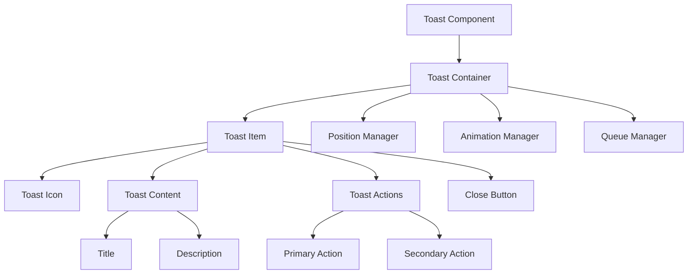
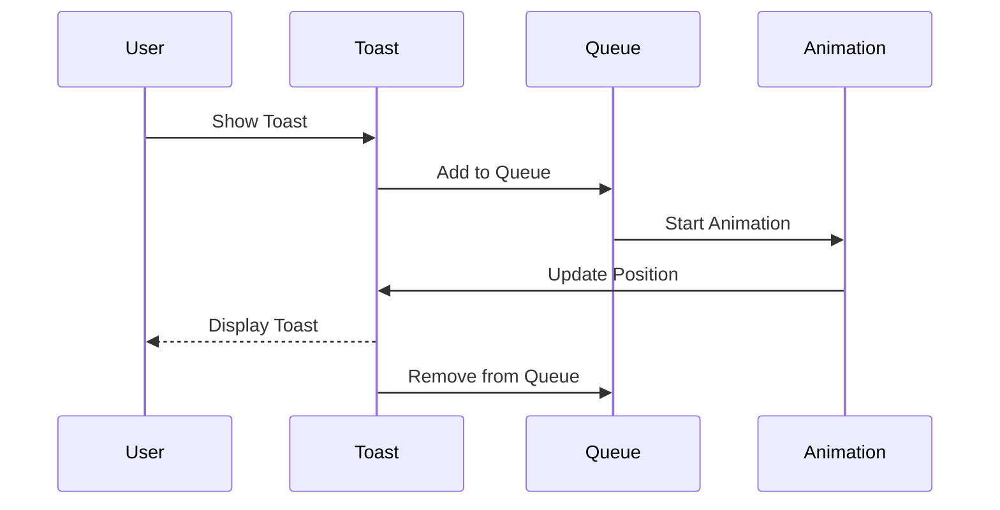
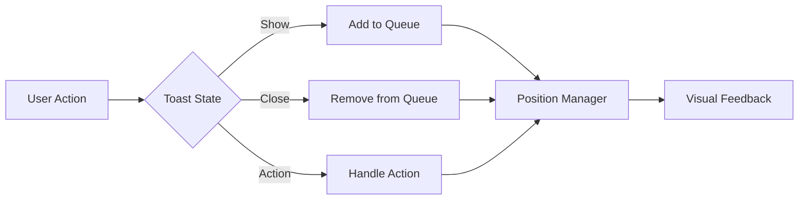

# Toast Component

## Overview
The Toast component is a non-intrusive notification system that displays temporary messages to users. It supports multiple variants (success, error, warning, info), customizable positioning, and automatic dismissal. The component is designed to be accessible, responsive, and consistent with ThriveSend's design system.

## Screenshots

*Main view showing different toast variants*


*Multiple toasts stacked with proper spacing*


*Mobile view with responsive layout*


*Custom toast with action buttons*

## Component Architecture


## Data Flow


## Features
- Multiple variants (success, error, warning, info)
- Custom positioning
- Auto-dismiss
- Custom timing
- Action buttons
- Icon support
- Responsive design
- Keyboard navigation
- Animation support
- Queue management
- Custom themes
- Dark mode support
- RTL support
- Performance optimized
- TypeScript support
- Accessibility support
- Internationalization
- Stack management
- Progress indicator
- Event handling
- State management

## Props
| Name | Type | Required | Default | Description |
|------|------|----------|---------|-------------|
| variant | 'success' \| 'error' \| 'warning' \| 'info' | No | 'info' | Toast variant |
| title | string | No | undefined | Toast title |
| description | string | No | undefined | Toast description |
| duration | number | No | 5000 | Display duration in ms |
| position | 'top-right' \| 'top-left' \| 'bottom-right' \| 'bottom-left' | No | 'top-right' | Toast position |
| actions | ToastAction[] | No | undefined | Custom actions |
| icon | ReactNode | No | undefined | Custom icon |
| className | string | No | undefined | Additional CSS classes |
| ariaLabel | string | No | undefined | ARIA label |
| testId | string | No | undefined | Test ID |
| showProgress | boolean | No | true | Show progress bar |
| onClose | () => void | No | undefined | Close handler |

## Usage
```tsx
import { Toast } from '@/components/feedback/Toast';
import { useToast } from '@/hooks/useToast';

// Basic usage
const { showToast } = useToast();

showToast({
  variant: 'success',
  title: 'Success!',
  description: 'Your changes have been saved.',
  ariaLabel: 'Success toast'
});

// Advanced usage
showToast({
  variant: 'error',
  title: 'Error',
  description: 'Something went wrong. Please try again.',
  duration: 3000,
  position: 'top-right',
  actions: [
    {
      label: 'Try Again',
      onClick: () => console.log('Retry clicked'),
      variant: 'primary'
    },
    {
      label: 'Cancel',
      onClick: () => console.log('Cancel clicked'),
      variant: 'secondary'
    }
  ],
  showProgress: true,
  onClose: () => console.log('Toast closed'),
  ariaLabel: 'Error toast with actions'
});
```

## User Interaction Workflow


## Components

### Toast Container
- Manages toast queue
- Handles positioning
- Implements animations
- Manages state
- Handles theme

### Toast Item
- Renders individual toast
- Manages lifecycle
- Handles interactions
- Implements accessibility
- Manages theme

### Toast Icon
- Renders variant icon
- Handles custom icons
- Manages animations
- Implements accessibility
- Handles theme

### Toast Content
- Renders title and description
- Manages layout
- Handles truncation
- Implements accessibility
- Manages theme

### Toast Actions
- Renders action buttons
- Handles click events
- Manages layout
- Implements accessibility
- Handles theme

### Close Button
- Renders close button
- Handles click events
- Manages animations
- Implements accessibility
- Handles theme

## Data Models
```typescript
interface ToastProps {
  variant: 'success' | 'error' | 'warning' | 'info';
  title?: string;
  description?: string;
  duration?: number;
  position?: 'top-right' | 'top-left' | 'bottom-right' | 'bottom-left';
  actions?: ToastAction[];
  icon?: ReactNode;
  className?: string;
  ariaLabel?: string;
  testId?: string;
  showProgress?: boolean;
  onClose?: () => void;
}

interface ToastAction {
  label: string;
  onClick: () => void;
  variant?: 'primary' | 'secondary';
  disabled?: boolean;
}

interface ToastState {
  isVisible: boolean;
  isExiting: boolean;
  progress: number;
  timeoutId?: number;
}

interface ToastEvent {
  type: 'show' | 'hide' | 'action' | 'close';
  timestamp: number;
  data?: {
    action?: string;
    variant?: string;
    position?: string;
  };
}

interface ToastQueue {
  toasts: ToastProps[];
  add: (toast: ToastProps) => void;
  remove: (id: string) => void;
  clear: () => void;
}
```

## Styling
- Uses Tailwind CSS for styling
- Follows design system color tokens
- Implements consistent spacing
- Supports dark mode
- Maintains accessibility contrast ratios
- Uses CSS variables for theming
- Implements responsive design
- Supports custom animations
- Uses CSS Grid for layout
- Implements proper transitions

## Accessibility
- ARIA labels for screen readers
- Keyboard navigation support
- Focus management
- Color contrast compliance
- State announcements
- RTL support
- Screen reader announcements
- Focus visible states
- Proper role attributes
- Keyboard event handling
- Error message association
- Toast announcements

## Error Handling
- Queue management
- State validation
- Event handling
- Error boundaries
- Fallback content
- Recovery strategies
- User feedback
- Error logging
- State recovery
- Animation fallbacks
- Timeout handling

## Performance Optimizations
- Component memoization
- Render optimization
- Animation optimization
- State batching
- Code splitting
- Bundle optimization
- Memory management
- Event debouncing
- Lazy loading
- Virtual scrolling

## Dependencies
- React
- TypeScript
- Tailwind CSS
- @testing-library/react
- @testing-library/jest-dom
- @testing-library/user-event

## Related Components
- [Alert](../feedback/Alert.md)
- [Modal](../feedback/Modal.md)
- [Button](../ui/Button.md)
- [Icon](../ui/Icon.md)
- [Typography](../ui/Typography.md)

## Examples

### Basic Example
```tsx
import { useToast } from '@/hooks/useToast';

export function BasicExample() {
  const { showToast } = useToast();

  const handleSuccess = () => {
    showToast({
      variant: 'success',
      title: 'Success!',
      description: 'Your changes have been saved.',
      ariaLabel: 'Success toast'
    });
  };

  return (
    <button onClick={handleSuccess}>
      Show Success Toast
    </button>
  );
}
```

### Advanced Example
```tsx
import { useToast } from '@/hooks/useToast';
import { useCallback } from 'react';

export function AdvancedExample() {
  const { showToast } = useToast();

  const handleError = useCallback(() => {
    showToast({
      variant: 'error',
      title: 'Error',
      description: 'Something went wrong. Please try again.',
      duration: 3000,
      position: 'top-right',
      actions: [
        {
          label: 'Try Again',
          onClick: () => console.log('Retry clicked'),
          variant: 'primary'
        },
        {
          label: 'Cancel',
          onClick: () => console.log('Cancel clicked'),
          variant: 'secondary'
        }
      ],
      showProgress: true,
      onClose: () => console.log('Toast closed'),
      ariaLabel: 'Error toast with actions'
    });
  }, [showToast]);

  return (
    <button onClick={handleError}>
      Show Error Toast
    </button>
  );
}
```

## Best Practices

### Usage Guidelines
1. Use appropriate variants
2. Keep messages concise
3. Include clear actions
4. Handle close events
5. Follow accessibility guidelines
6. Optimize for performance
7. Use TypeScript for type safety
8. Add proper test IDs
9. Handle edge cases
10. Implement proper state

### Performance Tips
1. Memoize components
2. Use proper state management
3. Optimize re-renders
4. Implement proper loading
5. Use proper error boundaries
6. Optimize bundle size
7. Use proper code splitting
8. Implement proper caching
9. Use proper lazy loading
10. Monitor performance metrics

### Security Considerations
1. Validate user input
2. Prevent XSS attacks
3. Handle sensitive data
4. Implement proper authentication
5. Use proper authorization
6. Handle errors securely
7. Implement proper logging
8. Use proper encryption
9. Follow security best practices
10. Regular security audits

## Troubleshooting

### Common Issues
| Issue | Solution |
|-------|----------|
| Toast not showing | Check queue management |
| Close not working | Verify onClose handler |
| Actions not working | Check action handlers |
| Styling issues | Verify Tailwind classes |
| Accessibility issues | Check ARIA labels |

### Error Messages
| Error Code | Description | Resolution |
|------------|-------------|------------|
| ERR001 | Invalid variant | Check variant prop |
| ERR002 | Missing handler | Add required handler |
| ERR003 | Invalid action | Check action config |
| ERR004 | Theme error | Verify theme settings |
| ERR005 | Event error | Check event handlers |

## Contributing

### Development Setup
1. Clone the repository
2. Install dependencies
3. Run development server
4. Make changes
5. Run tests
6. Submit PR

### Testing
```typescript
import { render, screen, fireEvent } from '@testing-library/react';
import { Toast } from './Toast';
import { ToastProvider } from './ToastProvider';

describe('Toast', () => {
  it('renders correctly', () => {
    render(
      <ToastProvider>
        <Toast
          variant="success"
          title="Success!"
          description="Test description"
        />
      </ToastProvider>
    );
    expect(screen.getByText('Success!')).toBeInTheDocument();
    expect(screen.getByText('Test description')).toBeInTheDocument();
  });

  it('handles close', () => {
    const handleClose = jest.fn();
    render(
      <ToastProvider>
        <Toast
          variant="info"
          onClose={handleClose}
        />
      </ToastProvider>
    );
    fireEvent.click(screen.getByRole('button'));
    expect(handleClose).toHaveBeenCalled();
  });
});
```

### Code Style
- Follow TypeScript best practices
- Use ESLint rules
- Follow Prettier configuration
- Write meaningful comments
- Use proper naming conventions
- Follow component patterns
- Use proper documentation
- Follow testing practices
- Use proper error handling
- Follow security guidelines

## Changelog

### Version 1.0.0
- Initial release
- Basic variants
- Queue management
- Custom actions
- Mobile support

### Version 1.1.0
- Added progress bar
- Improved performance
- Enhanced accessibility
- Added dark mode
- Added RTL support

## Appendix

### Glossary
- **Toast**: Notification component
- **Variant**: Toast type/style
- **Queue**: Toast management
- **Actions**: Custom buttons
- **Progress**: Time indicator

### FAQ
#### How do I show a toast?
Use the `useToast` hook and call `showToast` with your configuration.

#### How do I customize the position?
Use the `position` prop to set the toast position.

#### How do I add custom actions?
Use the `actions` prop to provide an array of action buttons. 