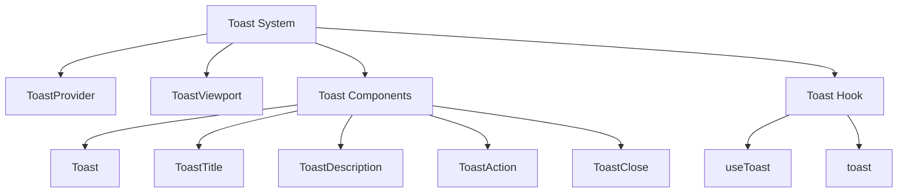
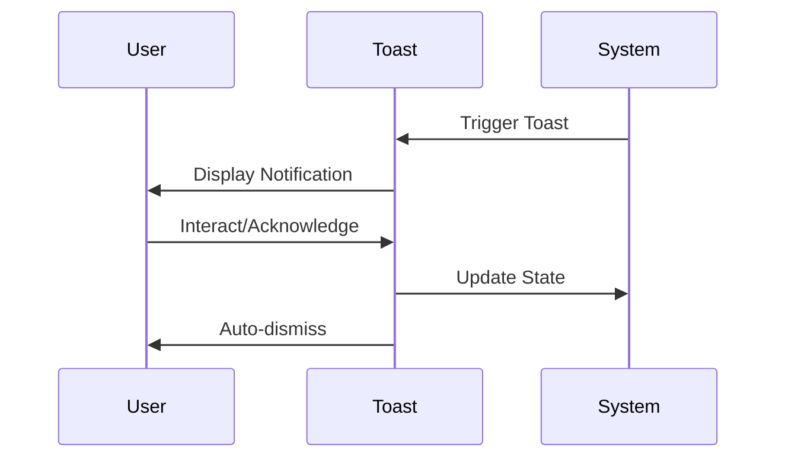
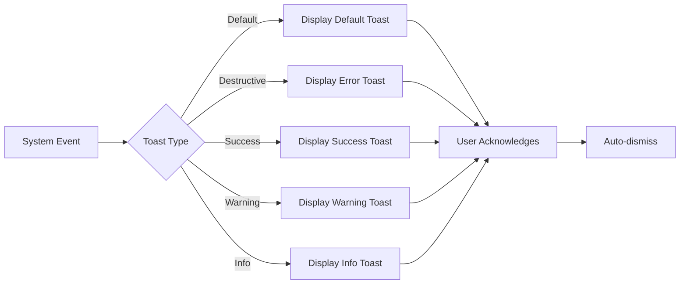

# Toast Component

## Overview
The Toast component in ThriveSend provides a non-intrusive way to display notifications to users. Built on top of Radix UI's toast primitive, it offers a customizable and accessible notification system with various variants and animations.

## Screenshots

*Different toast variants: default, destructive, success, warning, and info*

## Component Architecture


## Data Flow


## Features
- Multiple variants (default, destructive, success, warning, info)
- Customizable duration
- Auto-dismiss functionality
- Action buttons support
- Keyboard navigation
- Screen reader support
- Animation effects
- Responsive design
- TypeScript support
- Theme integration

## Props

### Toast Props
```typescript
interface ToastProps {
  variant?: "default" | "destructive" | "success" | "warning" | "info";
  title?: React.ReactNode;
  description?: React.ReactNode;
  action?: ToastActionElement;
  open?: boolean;
  onOpenChange?: (open: boolean) => void;
  className?: string;
}
```

### Toast Hook Props
```typescript
interface Toast {
  title?: React.ReactNode;
  description?: React.ReactNode;
  action?: ToastActionElement;
  variant?: ToastProps["variant"];
  className?: string;
}
```

## Usage

### Basic Usage
```typescript
import { useToast } from "@/components/ui/use-toast"

function MyComponent() {
  const { toast } = useToast();

  return (
    <button onClick={() => {
      toast({
        title: "Success",
        description: "Operation completed successfully",
        variant: "success"
      });
    }}>
      Show Toast
    </button>
  );
}
```

### With Action
```typescript
import { useToast } from "@/components/ui/use-toast"
import { ToastAction } from "@/components/ui/toast"

function ToastWithAction() {
  const { toast } = useToast();

  return (
    <button onClick={() => {
      toast({
        title: "Update Available",
        description: "A new version is available",
        action: (
          <ToastAction altText="Update now">
            Update
          </ToastAction>
        )
      });
    }}>
      Show Toast with Action
    </button>
  );
}
```

### Different Variants
```typescript
function ToastVariants() {
  const { toast } = useToast();

  return (
    <>
      <button onClick={() => toast({ variant: "default", title: "Default" })}>
        Default
      </button>
      <button onClick={() => toast({ variant: "destructive", title: "Error" })}>
        Error
      </button>
      <button onClick={() => toast({ variant: "success", title: "Success" })}>
        Success
      </button>
      <button onClick={() => toast({ variant: "warning", title: "Warning" })}>
        Warning
      </button>
      <button onClick={() => toast({ variant: "info", title: "Info" })}>
        Info
      </button>
    </>
  );
}
```

## User Interaction Workflow


## Components

### 1. ToastProvider
- Context provider for toast system
- Manages toast state
- Handles toast lifecycle

### 2. ToastViewport
- Container for toast notifications
- Manages positioning
- Handles animations

### 3. Toast
- Main toast component
- Handles variants
- Manages layout

### 4. ToastTitle
- Toast header
- Bold text
- Optional component

### 5. ToastDescription
- Toast content
- Regular text
- Optional component

### 6. ToastAction
- Action button
- Customizable
- Optional component

### 7. ToastClose
- Close button
- Auto-included
- Customizable

## Data Models
```typescript
type ToasterToast = ToastProps & {
  id: string;
  title?: React.ReactNode;
  description?: React.ReactNode;
  action?: ToastActionElement;
};

interface State {
  toasts: ToasterToast[];
}

const toastVariants = {
  default: "bg-background border",
  destructive: "bg-blue-50 border-blue-200 text-blue-900",
  success: "bg-green-50 border-green-200 text-green-900",
  warning: "bg-yellow-50 border-yellow-200 text-yellow-900",
  info: "bg-blue-50 border-blue-200 text-blue-900"
};
```

## Styling
- Tailwind CSS
- CSS variables
- Responsive design
- Animation classes
- Theme integration
- Custom variants
- Consistent spacing

## Accessibility
- ARIA attributes
- Keyboard navigation
- Focus management
- Screen reader support
- Color contrast
- Semantic HTML
- Touch targets

## Error Handling
- Type checking
- State management
- Queue management
- Timeout handling
- Event handling
- Error boundaries

## Performance Optimizations
- Queue limiting
- Auto-dismiss
- Memory management
- Event delegation
- Animation performance
- State updates

## Dependencies
- React
- TypeScript
- Radix UI
- Tailwind CSS
- class-variance-authority
- Lucide Icons

## Related Components
- [Alert](./Alert.md)
- [Modal](./Modal.md)
- [ErrorBoundary](../error/ErrorBoundary.md)

## Examples

### Form Submission
```typescript
function FormWithToast() {
  const { toast } = useToast();

  const handleSubmit = async (data: FormData) => {
    try {
      await submitForm(data);
      toast({
        title: "Success",
        description: "Form submitted successfully",
        variant: "success"
      });
    } catch (error) {
      toast({
        title: "Error",
        description: "Failed to submit form",
        variant: "destructive"
      });
    }
  };

  return (
    <form onSubmit={handleSubmit}>
      {/* Form fields */}
    </form>
  );
}
```

### Action Confirmation
```typescript
function ActionWithToast() {
  const { toast } = useToast();

  const handleAction = () => {
    toast({
      title: "Confirm Action",
      description: "Are you sure you want to proceed?",
      action: (
        <ToastAction altText="Confirm">
          Confirm
        </ToastAction>
      )
    });
  };

  return (
    <button onClick={handleAction}>
      Perform Action
    </button>
  );
}
```

## Best Practices
1. Use appropriate variants
2. Keep messages concise
3. Include actionable information
4. Set reasonable timeouts
5. Ensure accessibility
6. Test all variants
7. Follow theme guidelines
8. Use semantic meaning

## Troubleshooting

### Common Issues
1. **Toast not showing**
   - Check ToastProvider
   - Verify hook usage
   - Check variant

2. **Styling issues**
   - Verify theme variables
   - Check className
   - Inspect CSS cascade

3. **Accessibility problems**
   - Check ARIA attributes
   - Test keyboard navigation
   - Verify screen reader

### Solutions
1. **Provider Setup**
   ```typescript
   // Proper provider setup
   function App() {
     return (
       <ToastProvider>
         <YourApp />
       </ToastProvider>
     );
   }
   ```

2. **Hook Usage**
   ```typescript
   // Proper hook usage
   function Component() {
     const { toast } = useToast();
     return (
       <button onClick={() => toast({ title: "Hello" })}>
         Show Toast
       </button>
     );
   }
   ```

3. **Accessibility**
   ```typescript
   // Proper accessibility
   toast({
     title: "Update Available",
     description: "A new version is available",
     action: (
       <ToastAction altText="Update now">
         Update
       </ToastAction>
     )
   });
   ```

## Contributing
When contributing to the Toast component:
1. Follow TypeScript best practices
2. Maintain accessibility standards
3. Add appropriate tests
4. Update documentation
5. Follow component guidelines

*Last Updated: 2025-06-04*
*Version: 1.0.0* 