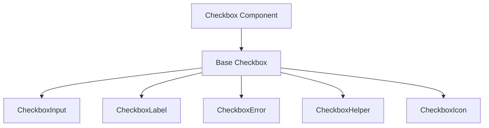
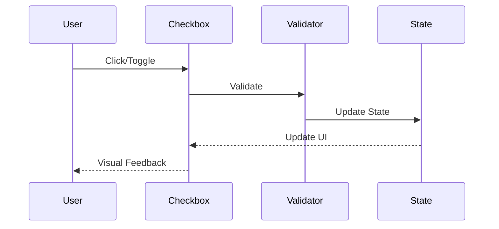
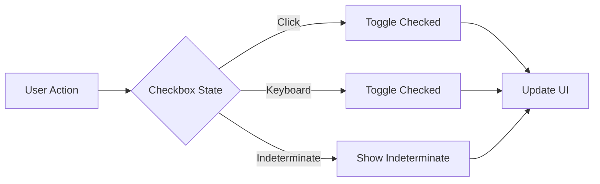

# Checkbox Component

## Overview
The Checkbox component provides a flexible, accessible checkbox input for forms, supporting indeterminate state, custom labels, and integration with form validation libraries. It follows ThriveSend's design system and accessibility standards.

## Screenshots

*Different checkbox variants and states*

## Component Architecture


## Data Flow


## Features
- Supports checked, unchecked, and indeterminate states
- Custom label and helper text
- Error state handling
- Form validation integration
- Keyboard navigation
- Full accessibility support
- TypeScript type safety
- Performance optimized

## Props
| Prop | Type | Default | Description |
|------|------|---------|-------------|
| label | string | undefined | Checkbox label |
| checked | boolean | undefined | Controlled checked state |
| defaultChecked | boolean | false | Uncontrolled checked state |
| indeterminate | boolean | false | Indeterminate state |
| error | string | undefined | Error message |
| helperText | string | undefined | Helper text |
| disabled | boolean | false | Disable checkbox |
| required | boolean | false | Mark as required |
| className | string | undefined | Additional CSS classes |
| value | string | undefined | Value for form integration |
| onChange | (checked: boolean) => void | undefined | Change handler |

## Usage
```typescript
import { Checkbox } from '@/components/forms/Checkbox';

// Basic checkbox
<Checkbox label="Accept Terms" />

// Controlled checkbox
<Checkbox
  label="Subscribe to newsletter"
  checked={isSubscribed}
  onChange={setIsSubscribed}
/>

// Indeterminate checkbox
<Checkbox
  label="Select All"
  indeterminate={isIndeterminate}
  checked={isChecked}
  onChange={setChecked}
/>

// Checkbox with error and helper text
<Checkbox
  label="I agree to the privacy policy"
  error={errors.privacy}
  helperText="You must agree before submitting."
/>
```

## User Interaction Workflow


## Components
1. **Base Checkbox**
   - Manages checked and indeterminate state
   - Handles user interactions
   - Implements accessibility features

2. **CheckboxInput**
   - Native input element
   - Handles focus and blur
   - Manages keyboard events

3. **CheckboxLabel**
   - Displays label
   - Handles required state
   - Supports custom content

4. **CheckboxError**
   - Displays error messages
   - Manages error states
   - Handles animations

5. **CheckboxHelper**
   - Displays helper text
   - Manages visibility
   - Handles styling

6. **CheckboxIcon**
   - Visual indicator for checked/indeterminate state
   - Handles custom icons

## Data Models
```typescript
interface CheckboxProps {
  label?: string;
  checked?: boolean;
  defaultChecked?: boolean;
  indeterminate?: boolean;
  error?: string;
  helperText?: string;
  disabled?: boolean;
  required?: boolean;
  className?: string;
  value?: string;
  onChange?: (checked: boolean) => void;
}

interface CheckboxState {
  checked: boolean;
  indeterminate: boolean;
  isFocused: boolean;
  error: string | null;
}
```

## Styling
- Uses Tailwind CSS for styling
- Follows design system color tokens
- Implements consistent spacing
- Supports dark mode
- Maintains accessibility contrast ratios
- Responsive design patterns
- Smooth transitions

## Accessibility
- ARIA roles and attributes
- Keyboard navigation (Space, Tab)
- Focus management
- Color contrast compliance
- Screen reader support
- Error and state announcements
- Required field indicators

## Error Handling
- Form validation integration
- Error message display
- Visual error states
- Error boundary implementation
- Disabled state management
- Required field validation

## Performance Optimizations
- Optimized re-renders
- CSS-in-JS optimization
- Transition optimizations
- Event handler optimization

## Dependencies
- React
- TypeScript
- Tailwind CSS
- React Icons (optional)
- Form validation library (optional)

## Related Components
- [Input](./Input.md)
- [Select](./Select.md)
- [Button](../ui/Button.md)

## Examples
### Form Integration
```typescript
import { Checkbox } from '@/components/forms/Checkbox';
import { useForm } from 'react-hook-form';

function ConsentForm() {
  const { register, handleSubmit, errors } = useForm();

  return (
    <form onSubmit={handleSubmit(onSubmit)}>
      <Checkbox
        label="I agree to the terms and conditions"
        error={errors.terms?.message}
        {...register('terms', {
          required: 'You must agree to continue'
        })}
      />
    </form>
  );
}
```

### Indeterminate State Example
```typescript
import { Checkbox } from '@/components/forms/Checkbox';

function SelectAllExample() {
  const [checked, setChecked] = useState(false);
  const [indeterminate, setIndeterminate] = useState(true);

  return (
    <Checkbox
      label="Select All"
      checked={checked}
      indeterminate={indeterminate}
      onChange={(val) => {
        setChecked(val);
        setIndeterminate(false);
      }}
    />
  );
}
```

### Checkbox Group Example
```typescript
import { Checkbox } from '@/components/forms/Checkbox';

function CheckboxGroup() {
  const [selected, setSelected] = useState<string[]>([]);
  const options = [
    { label: 'Email', value: 'email' },
    { label: 'SMS', value: 'sms' },
    { label: 'Push', value: 'push' }
  ];

  return (
    <div>
      {options.map((opt) => (
        <Checkbox
          key={opt.value}
          label={opt.label}
          checked={selected.includes(opt.value)}
          onChange={(checked) => {
            setSelected((prev) =>
              checked
                ? [...prev, opt.value]
                : prev.filter((v) => v !== opt.value)
            );
          }}
        />
      ))}
    </div>
  );
}
```

## Best Practices
1. Always provide a label
2. Use indeterminate state for partial selections
3. Include error handling
4. Add helper text when needed
5. Implement proper validation
6. Follow accessibility guidelines
7. Use TypeScript for type safety
8. Optimize performance

## Troubleshooting
### Common Issues
1. **Checkbox not updating**
   - Check checked and onChange props
   - Verify form integration
   - Check for event propagation

2. **Indeterminate state not working**
   - Ensure indeterminate prop is set
   - Update state on user interaction

3. **Styling issues**
   - Check className usage
   - Verify variant and state props
   - Check for style conflicts

### Solutions
1. **Update Issues**
   ```typescript
   // Proper controlled implementation
   const [checked, setChecked] = useState(false);
   
   <Checkbox
     checked={checked}
     onChange={setChecked}
     label="Controlled Checkbox"
   />
   ```

2. **Indeterminate Issues**
   ```typescript
   // Proper indeterminate implementation
   <Checkbox
     indeterminate={isIndeterminate}
     checked={isChecked}
     onChange={setChecked}
     label="Select All"
   />
   ```

3. **Styling Issues**
   ```typescript
   // Proper styling implementation
   <Checkbox
     label="Styled Checkbox"
     className="w-6 h-6 text-primary"
   />
   ```

## Contributing
When contributing to the Checkbox component:
1. Follow TypeScript best practices
2. Maintain accessibility standards
3. Add appropriate tests
4. Update documentation
5. Follow component guidelines

*Last Updated: 2025-06-04*
*Version: 1.0.0* 