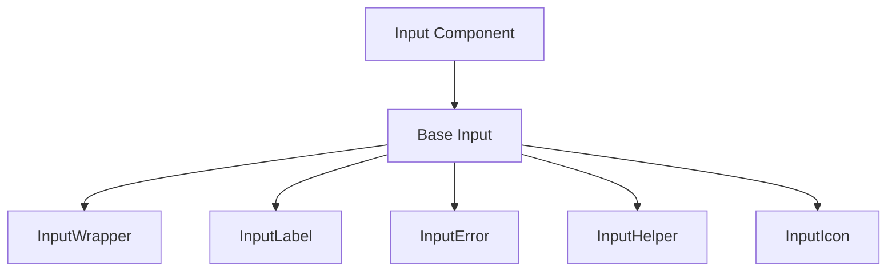
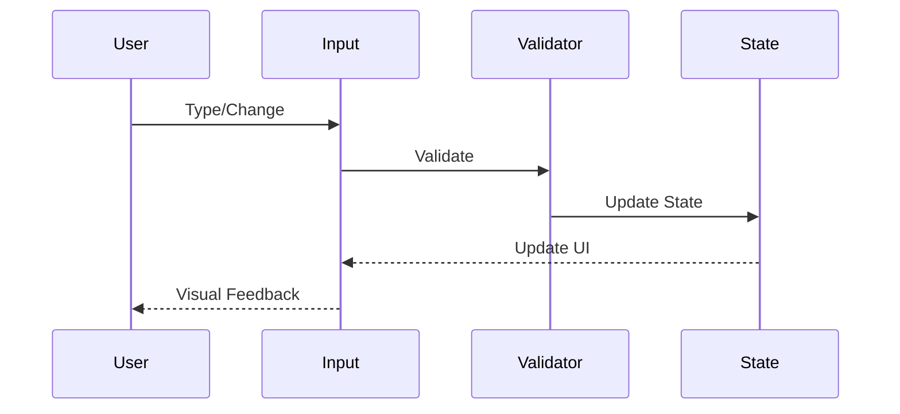
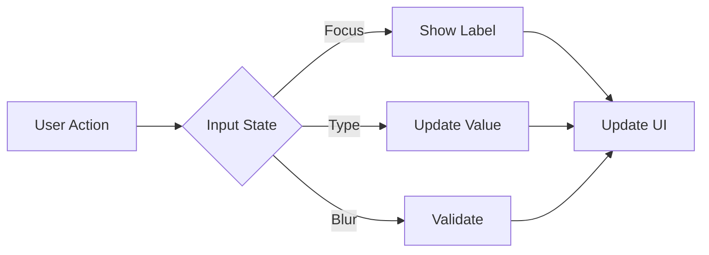

# Input Component

## Overview
The Input component provides a flexible and accessible text input field with support for various types, validation, and styling options. It follows ThriveSend's design system and includes comprehensive accessibility features.

## Screenshots

*Different input variants and states*

## Component Architecture


## Data Flow


## Features
- Multiple variants (default, outlined, filled)
- Support for all HTML input types
- Form validation integration
- Error state handling
- Helper text support
- Icon integration
- Full accessibility support
- TypeScript type safety
- Performance optimized

## Props
| Prop | Type | Default | Description |
|------|------|---------|-------------|
| type | string | 'text' | Input type (text, email, password, etc.) |
| variant | 'default' \| 'outlined' \| 'filled' | 'default' | Input style variant |
| label | string | undefined | Input label |
| error | string | undefined | Error message |
| helperText | string | undefined | Helper text |
| icon | ReactNode | undefined | Input icon |
| iconPosition | 'left' \| 'right' | 'left' | Icon position |
| disabled | boolean | false | Disable input |
| required | boolean | false | Mark as required |
| className | string | undefined | Additional CSS classes |
| value | string | undefined | Controlled value |
| onChange | (value: string) => void | undefined | Change handler |

## Usage
```typescript
import { Input } from '@/components/forms/Input';

// Basic input
<Input
  label="Email"
  type="email"
  placeholder="Enter your email"
/>

// Input with validation
<Input
  label="Password"
  type="password"
  required
  error={errors.password}
  helperText="Must be at least 8 characters"
/>

// Input with icon
<Input
  label="Search"
  icon={<SearchIcon />}
  iconPosition="right"
  placeholder="Search..."
/>

// Controlled input
<Input
  label="Username"
  value={username}
  onChange={setUsername}
  variant="outlined"
/>
```

## User Interaction Workflow


## Components
1. **Base Input**
   - Manages input state
   - Handles user interactions
   - Implements accessibility features

2. **InputWrapper**
   - Manages input layout
   - Handles styling
   - Manages focus states

3. **InputLabel**
   - Displays input label
   - Manages required state
   - Handles animations

4. **InputError**
   - Displays error messages
   - Manages error states
   - Handles animations

5. **InputHelper**
   - Displays helper text
   - Manages visibility
   - Handles styling

6. **InputIcon**
   - Manages icon display
   - Handles positioning
   - Manages interactions

## Data Models
```typescript
interface InputProps {
  type?: string;
  variant?: 'default' | 'outlined' | 'filled';
  label?: string;
  error?: string;
  helperText?: string;
  icon?: ReactNode;
  iconPosition?: 'left' | 'right';
  disabled?: boolean;
  required?: boolean;
  className?: string;
  value?: string;
  onChange?: (value: string) => void;
}

interface InputState {
  value: string;
  isFocused: boolean;
  isDirty: boolean;
  isValid: boolean;
  error: string | null;
}
```

## Styling
- Uses Tailwind CSS for styling
- Follows design system color tokens
- Implements consistent spacing
- Supports dark mode
- Maintains accessibility contrast ratios
- Responsive design patterns
- Smooth transitions

## Accessibility
- ARIA labels and roles
- Keyboard navigation
- Focus management
- Color contrast compliance
- Screen reader support
- Error announcements
- Required field indicators

## Error Handling
- Form validation integration
- Error message display
- Visual error states
- Error boundary implementation
- Disabled state management
- Required field validation

## Performance Optimizations
- Debounced change handlers
- Optimized re-renders
- CSS-in-JS optimization
- Transition optimizations
- Event handler optimization

## Dependencies
- React
- TypeScript
- Tailwind CSS
- React Icons (optional)
- Form validation library (optional)

## Related Components
- [Select](./Select.md)
- [Checkbox](./Checkbox.md)
- [Button](../ui/Button.md)

## Examples
### Form Integration
```typescript
import { Input } from '@/components/forms/Input';
import { useForm } from 'react-hook-form';

function LoginForm() {
  const { register, handleSubmit, errors } = useForm();

  return (
    <form onSubmit={handleSubmit(onSubmit)}>
      <Input
        label="Email"
        type="email"
        error={errors.email?.message}
        {...register('email', {
          required: 'Email is required',
          pattern: {
            value: /^[A-Z0-9._%+-]+@[A-Z0-9.-]+\.[A-Z]{2,}$/i,
            message: 'Invalid email address'
          }
        })}
      />
      <Input
        label="Password"
        type="password"
        error={errors.password?.message}
        {...register('password', {
          required: 'Password is required',
          minLength: {
            value: 8,
            message: 'Password must be at least 8 characters'
          }
        })}
      />
    </form>
  );
}
```

### Search Input
```typescript
import { Input } from '@/components/forms/Input';
import { SearchIcon } from '@/components/icons';

function SearchBar() {
  const [searchTerm, setSearchTerm] = useState('');

  return (
    <Input
      label="Search"
      value={searchTerm}
      onChange={setSearchTerm}
      icon={<SearchIcon />}
      iconPosition="right"
      placeholder="Search..."
      className="w-full max-w-md"
    />
  );
}
```

### Filter Input
```typescript
import { Input } from '@/components/forms/Input';
import { FilterIcon } from '@/components/icons';

function FilterInput() {
  return (
    <Input
      label="Filter"
      icon={<FilterIcon />}
      placeholder="Filter results..."
      variant="outlined"
      className="w-64"
    />
  );
}
```

## Best Practices
1. Always provide a label
2. Use appropriate input types
3. Include error handling
4. Add helper text when needed
5. Implement proper validation
6. Follow accessibility guidelines
7. Use TypeScript for type safety
8. Optimize performance

## Troubleshooting
### Common Issues
1. **Input not updating**
   - Check value and onChange props
   - Verify form integration
   - Check for event propagation

2. **Validation not working**
   - Verify validation rules
   - Check error handling
   - Validate form integration

3. **Styling issues**
   - Check variant prop
   - Verify className usage
   - Check for style conflicts

### Solutions
1. **Update Issues**
   ```typescript
   // Proper controlled implementation
   const [value, setValue] = useState('');
   
   <Input
     value={value}
     onChange={(e) => setValue(e.target.value)}
     label="Controlled Input"
   />
   ```

2. **Validation Issues**
   ```typescript
   // Proper validation implementation
   <Input
     label="Email"
     type="email"
     error={errors.email}
     {...register('email', {
       required: 'Email is required',
       pattern: {
         value: /^[A-Z0-9._%+-]+@[A-Z0-9.-]+\.[A-Z]{2,}$/i,
         message: 'Invalid email address'
       }
     })}
   />
   ```

3. **Styling Issues**
   ```typescript
   // Proper styling implementation
   <Input
     label="Styled Input"
     variant="outlined"
     className="w-full max-w-md"
   />
   ```

## Contributing
When contributing to the Input component:
1. Follow TypeScript best practices
2. Maintain accessibility standards
3. Add appropriate tests
4. Update documentation
5. Follow component guidelines

*Last Updated: 2025-06-04*
*Version: 1.0.0* 