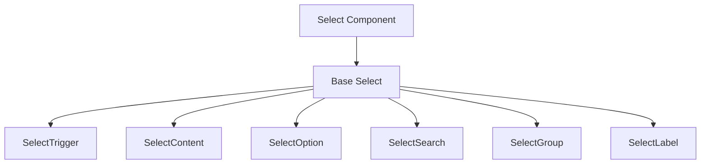
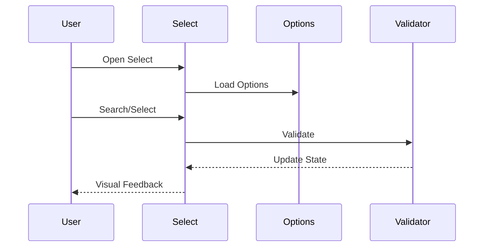
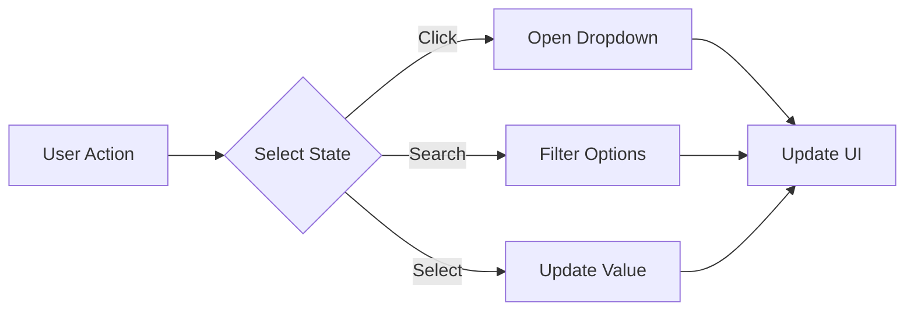

# Select Component

## Overview
The Select component provides a flexible and accessible dropdown selection interface with support for single and multi-select options, search functionality, and custom option rendering. It follows ThriveSend's design system and includes comprehensive accessibility features.

## Screenshots

*Different select variants and states*

## Component Architecture


## Data Flow


## Features
- Single and multi-select support
- Searchable options
- Custom option rendering
- Option grouping
- Keyboard navigation
- Form validation integration
- Error state handling
- Helper text support
- Full accessibility support
- TypeScript type safety
- Performance optimized

## Props
| Prop | Type | Default | Description |
|------|------|---------|-------------|
| variant | 'default' \| 'outlined' \| 'filled' | 'default' | Select style variant |
| label | string | undefined | Select label |
| error | string | undefined | Error message |
| helperText | string | undefined | Helper text |
| placeholder | string | 'Select an option' | Placeholder text |
| isMulti | boolean | false | Enable multi-select |
| isSearchable | boolean | false | Enable option search |
| isClearable | boolean | false | Enable clear button |
| isDisabled | boolean | false | Disable select |
| required | boolean | false | Mark as required |
| className | string | undefined | Additional CSS classes |
| value | string \| string[] | undefined | Selected value(s) |
| onChange | (value: string \| string[]) => void | undefined | Change handler |
| options | Option[] | [] | Select options |

## Usage
```typescript
import { Select } from '@/components/forms/Select';

// Basic select
<Select
  label="Country"
  options={[
    { value: 'us', label: 'United States' },
    { value: 'ca', label: 'Canada' },
    { value: 'uk', label: 'United Kingdom' }
  ]}
/>

// Searchable select
<Select
  label="Search Country"
  isSearchable
  options={countries}
  placeholder="Search countries..."
/>

// Multi-select
<Select
  label="Tags"
  isMulti
  options={tags}
  placeholder="Select tags..."
/>

// Controlled select
<Select
  label="Category"
  value={category}
  onChange={setCategory}
  options={categories}
  variant="outlined"
/>
```

## User Interaction Workflow


## Components
1. **Base Select**
   - Manages select state
   - Handles user interactions
   - Implements accessibility features

2. **SelectTrigger**
   - Manages trigger button
   - Handles click events
   - Manages focus states

3. **SelectContent**
   - Manages dropdown content
   - Handles positioning
   - Manages animations

4. **SelectOption**
   - Manages option items
   - Handles selection
   - Manages hover states

5. **SelectSearch**
   - Manages search input
   - Handles filtering
   - Manages focus

6. **SelectGroup**
   - Manages option groups
   - Handles group labels
   - Manages group state

7. **SelectLabel**
   - Displays select label
   - Manages required state
   - Handles animations

## Data Models
```typescript
interface SelectProps {
  variant?: 'default' | 'outlined' | 'filled';
  label?: string;
  error?: string;
  helperText?: string;
  placeholder?: string;
  isMulti?: boolean;
  isSearchable?: boolean;
  isClearable?: boolean;
  isDisabled?: boolean;
  required?: boolean;
  className?: string;
  value?: string | string[];
  onChange?: (value: string | string[]) => void;
  options: Option[];
}

interface Option {
  value: string;
  label: string;
  group?: string;
  isDisabled?: boolean;
  icon?: ReactNode;
}

interface SelectState {
  isOpen: boolean;
  searchValue: string;
  selectedValue: string | string[];
  focusedOption: string | null;
  filteredOptions: Option[];
}
```

## Styling
- Uses Tailwind CSS for styling
- Follows design system color tokens
- Implements consistent spacing
- Supports dark mode
- Maintains accessibility contrast ratios
- Responsive design patterns
- Smooth transitions

## Accessibility
- ARIA labels and roles
- Keyboard navigation
- Focus management
- Color contrast compliance
- Screen reader support
- Error announcements
- Required field indicators
- Option announcements

## Error Handling
- Form validation integration
- Error message display
- Visual error states
- Error boundary implementation
- Disabled state management
- Required field validation
- Invalid option handling

## Performance Optimizations
- Virtualized option list
- Debounced search
- Optimized re-renders
- CSS-in-JS optimization
- Transition optimizations
- Event handler optimization

## Dependencies
- React
- TypeScript
- Tailwind CSS
- React Icons (optional)
- Form validation library (optional)
- Virtualization library (optional)

## Related Components
- [Input](./Input.md)
- [Checkbox](./Checkbox.md)
- [Button](../ui/Button.md)

## Examples
### Form Integration
```typescript
import { Select } from '@/components/forms/Select';
import { useForm } from 'react-hook-form';

function RegistrationForm() {
  const { register, handleSubmit, errors } = useForm();

  return (
    <form onSubmit={handleSubmit(onSubmit)}>
      <Select
        label="Country"
        error={errors.country?.message}
        {...register('country', {
          required: 'Country is required'
        })}
        options={countries}
      />
      <Select
        label="Interests"
        isMulti
        error={errors.interests?.message}
        {...register('interests', {
          required: 'Select at least one interest'
        })}
        options={interests}
      />
    </form>
  );
}
```

### Searchable Select with Groups
```typescript
import { Select } from '@/components/forms/Select';

function CategorySelect() {
  const categories = [
    {
      group: 'Marketing',
      options: [
        { value: 'seo', label: 'SEO' },
        { value: 'social', label: 'Social Media' }
      ]
    },
    {
      group: 'Development',
      options: [
        { value: 'frontend', label: 'Frontend' },
        { value: 'backend', label: 'Backend' }
      ]
    }
  ];

  return (
    <Select
      label="Category"
      isSearchable
      options={categories}
      placeholder="Search categories..."
      className="w-full max-w-md"
    />
  );
}
```

### Custom Option Rendering
```typescript
import { Select } from '@/components/forms/Select';
import { FlagIcon } from '@/components/icons';

function CountrySelect() {
  const countries = [
    { value: 'us', label: 'United States', icon: <FlagIcon code="us" /> },
    { value: 'ca', label: 'Canada', icon: <FlagIcon code="ca" /> }
  ];

  return (
    <Select
      label="Country"
      options={countries}
      renderOption={(option) => (
        <div className="flex items-center gap-2">
          {option.icon}
          <span>{option.label}</span>
        </div>
      )}
    />
  );
}
```

## Best Practices
1. Always provide a label
2. Use appropriate placeholder text
3. Include error handling
4. Add helper text when needed
5. Implement proper validation
6. Follow accessibility guidelines
7. Use TypeScript for type safety
8. Optimize performance
9. Group related options
10. Use search for long lists

## Troubleshooting
### Common Issues
1. **Select not updating**
   - Check value and onChange props
   - Verify form integration
   - Check for event propagation

2. **Search not working**
   - Verify isSearchable prop
   - Check search implementation
   - Validate option structure

3. **Styling issues**
   - Check variant prop
   - Verify className usage
   - Check for style conflicts

### Solutions
1. **Update Issues**
   ```typescript
   // Proper controlled implementation
   const [value, setValue] = useState('');
   
   <Select
     value={value}
     onChange={setValue}
     options={options}
     label="Controlled Select"
   />
   ```

2. **Search Issues**
   ```typescript
   // Proper searchable implementation
   <Select
     label="Searchable Select"
     isSearchable
     options={options}
     placeholder="Search..."
   />
   ```

3. **Styling Issues**
   ```typescript
   // Proper styling implementation
   <Select
     label="Styled Select"
     variant="outlined"
     className="w-full max-w-md"
     options={options}
   />
   ```

## Contributing
When contributing to the Select component:
1. Follow TypeScript best practices
2. Maintain accessibility standards
3. Add appropriate tests
4. Update documentation
5. Follow component guidelines

*Last Updated: 2025-06-04*
*Version: 1.0.0* 